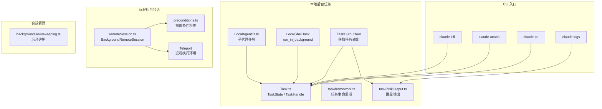
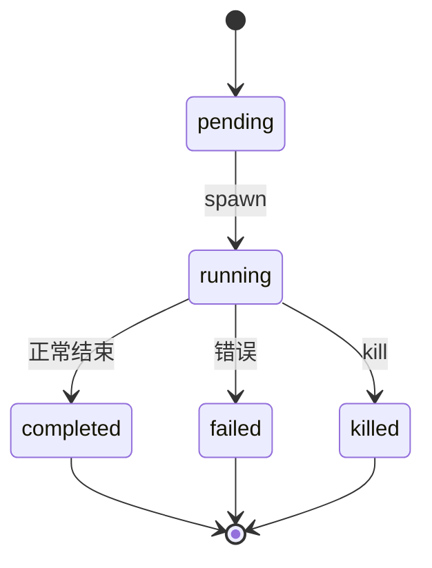
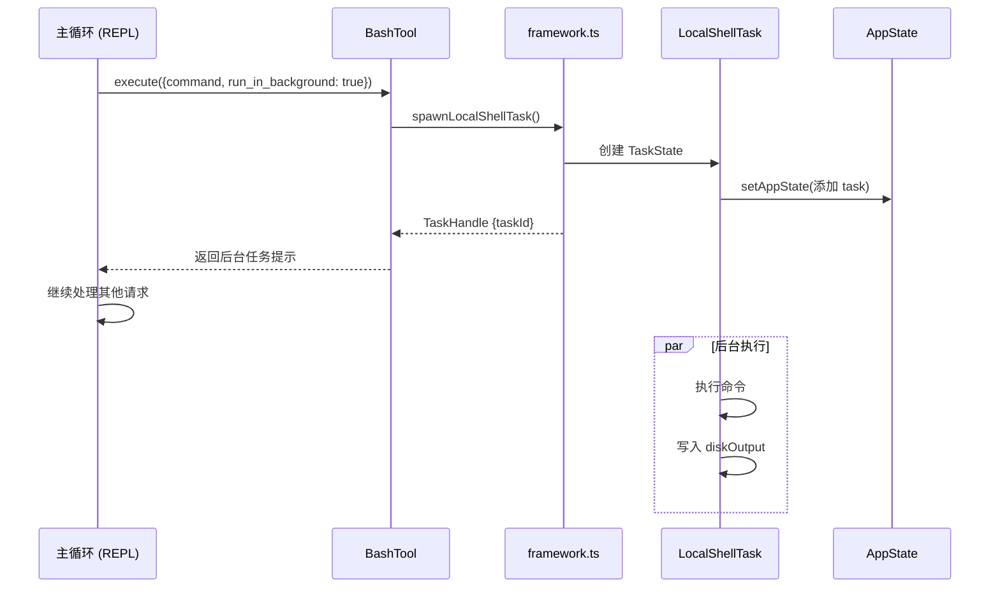
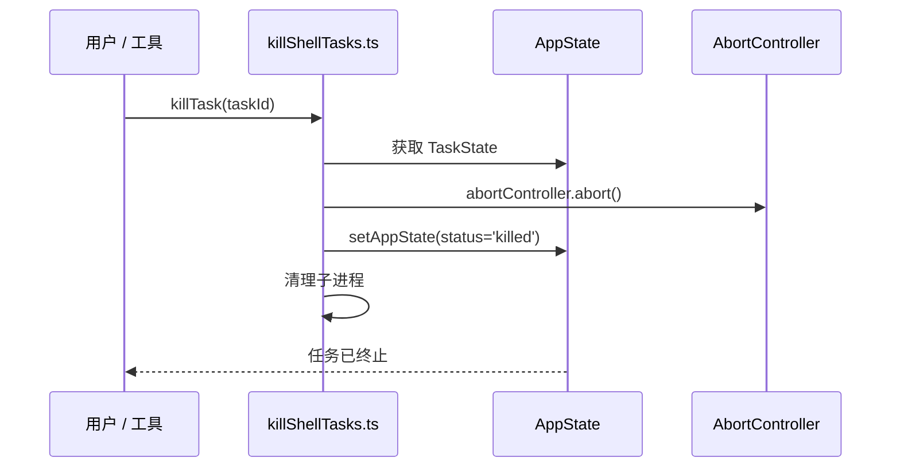
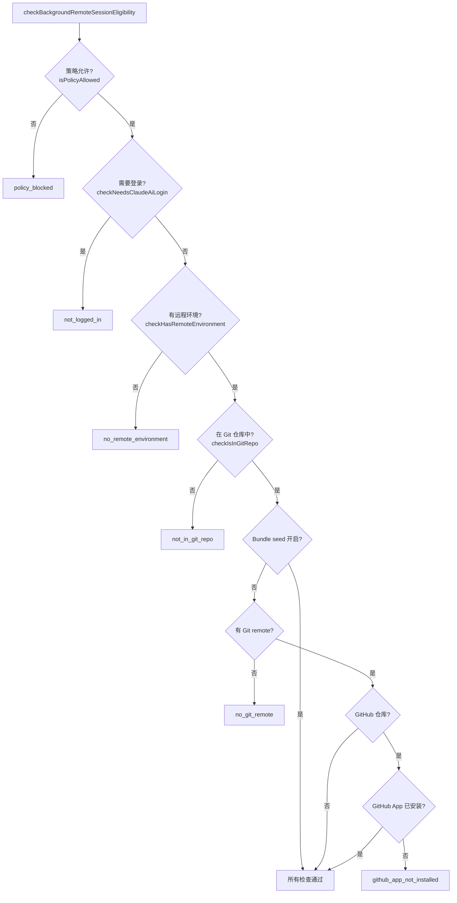
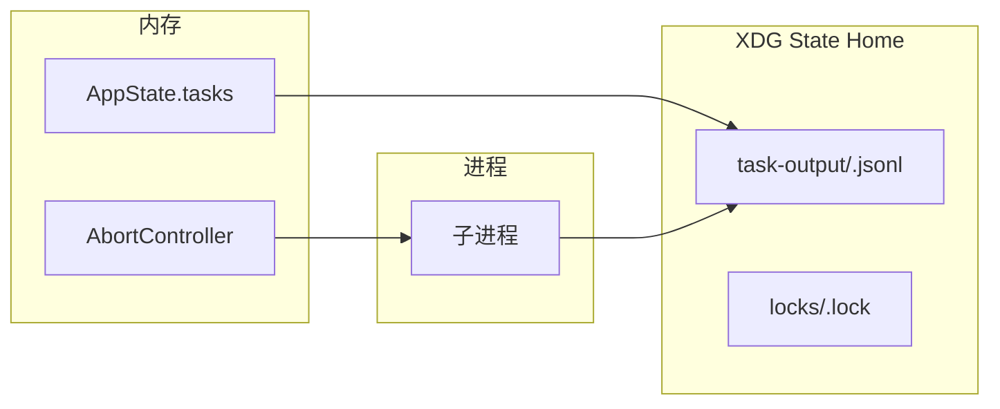

# 后台会话

> 前置知识：[第八章 8.2](/ch08-interfaces/cli-sdk) — 任务与并发

## 源码定位

Claude Code 的"后台会话"涉及两层概念：**本地后台任务**（`Task` 体系）和**远程后台会话**（Teleport 体系）。本地后台任务由 `Task`/`TaskOutput` 工具管理；远程后台会话由 `background/remote/` 模块管理，通过 `claude ps` / `claude attach` / `claude kill` 等 CLI 子命令操作。

## 架构总览



## 任务类型体系

`Task.ts` 定义了 Claude Code 中所有后台任务的类型基础：

```typescript
// Task.ts
export type TaskType =
  | 'local_bash'       // Bash 命令后台执行
  | 'local_agent'      // 子代理任务
  | 'remote_agent'     // 远程代理任务
  | 'in_process_teammate' // 进程内队友
  | 'local_workflow'   // 本地工作流
  | 'monitor_mcp'      // MCP 监控
  | 'dream'            // 自动梦（记忆整合）
```

每种类型有独立的 ID 前缀以方便识别：

| 类型 | 前缀 | 用途 |
|------|------|------|
| `local_bash` | `b` | Bash 命令后台运行 |
| `local_agent` | `a` | 子代理（AgentTool） |
| `remote_agent` | `r` | 远程代理（Teleport） |
| `in_process_teammate` | `t` | 进程内队友 |
| `local_workflow` | `w` | 工作流任务 |
| `monitor_mcp` | `m` | MCP 监控 |
| `dream` | `d` | 记忆整合 |

### 任务状态



`isTerminalTaskStatus()` 判断任务是否处于终态（`completed`/`failed`/`killed`），用于守护消息注入、任务驱逐和孤儿清理。

### 任务状态结构

```typescript
// Task.ts
export type TaskStateBase = {
  id: string              // 唯一 ID (前缀 + 随机)
  type: TaskType
  status: TaskStatus
  description: string     // 人类可读描述
  toolUseId?: string      // 关联的工具调用 ID
  startTime: number       // 启动时间戳
  endTime?: number        // 结束时间戳
  totalPausedMs?: number  // 暂停累计时间
  outputFile: string      // 输出文件路径
  outputOffset: number    // 输出读取偏移
  notified: boolean       // 是否已通知用户
}
```

## 本地后台任务生命周期

### 1. 生成 (Spawn)

BashTool 通过 `run_in_background` 参数创建后台任务：



### 2. 输出捕获与流式读取

任务输出通过 `task/diskOutput.ts` 管理，使用 JSONL 格式增量写入磁盘：

```typescript
// diskOutput.ts (核心逻辑)
export function getTaskOutputPath(taskId: string): string {
  return join(getXDGStateHome(), 'claude', 'task-output', `${taskId}.jsonl`)
}
```

`TaskOutputTool` 支持两种读取模式：

| 参数 | 行为 |
|------|------|
| `block: true` (默认) | 阻塞等待直到任务完成或超时 |
| `block: false` | 立即返回当前已有输出 |
| `timeout` | 最大等待时间（毫秒），默认 30000，上限 600000 |

```typescript
// TaskOutputTool.tsx — 输出获取逻辑
type TaskOutput = {
  task_id: string
  task_type: TaskType
  status: string
  description: string
  output: string
  exitCode?: number | null   // local_bash 专用
  error?: string
  prompt?: string            // local_agent 专用
  result?: string            // local_agent 专用
}
```

### 3. 终止 (Kill)



每种任务类型有独立的 `kill()` 实现，但都通过 `setAppState` 更新状态。`AbortController` 的 `abort` 信号会传播到子进程（`SIGTERM` → 进程组 → `SIGKILL`）。

## 远程后台会话

远程后台会话（Teleport 体系）允许 Claude Code 在云端环境中运行分离进程。

### 会话数据结构

```typescript
// remoteSession.ts
export type BackgroundRemoteSession = {
  id: string
  command: string
  startTime: number
  status: 'starting' | 'running' | 'completed' | 'failed' | 'killed'
  todoList: TodoList
  title: string
  type: 'remote_session'
  log: SDKMessage[]
}
```

### 前置条件检查

`checkBackgroundRemoteSessionEligibility()` 在创建远程会话前执行以下检查：



前置条件类型及含义：

| 类型 | 含义 | 修复方式 |
|------|------|---------|
| `policy_blocked` | 组织策略禁止远程会话 | 联系管理员 |
| `not_logged_in` | 未登录 Claude.ai | `claude login` |
| `no_remote_environment` | 无可用远程环境 | 在 claude.ai 配置环境 |
| `not_in_git_repo` | 不在 Git 仓库中 | `git init` |
| `no_git_remote` | 无远程仓库 | `git remote add origin` |
| `github_app_not_installed` | GitHub App 未安装 | 在仓库中安装 App |

### Bundle Seed 模式

当 `tengu_ccr_bundle_seed_enabled` 功能门开启时，只需本地 Git 仓库即可创建远程会话（CCR 可以从本地 bundle 种子），不需要 GitHub remote 或 App 安装。

## 日志与流式输出

### `claude logs` 输出格式

`claude logs` 命令从 `diskOutput` 读取任务的 JSONL 输出文件。每行是一个 JSON 对象，包含时间戳、输出类型和内容：

```jsonl
{"ts":1717200000000,"type":"stdout","data":"Building project..."}
{"ts":1717200001000,"type":"stderr","data":"warning: unused variable"}
{"ts":1717200005000,"type":"exit","code":0}
```

### `claude ps` 输出格式

`claude ps` 列出当前活跃的后台任务，输出格式包含：

| 字段 | 说明 |
|------|------|
| TASK ID | 带前缀的任务 ID |
| TYPE | 任务类型 |
| STATUS | 当前状态 |
| DESCRIPTION | 任务描述 |
| DURATION | 运行时长 |

## Attach 机制

`claude attach` 允许重新连接到正在运行的后台任务。实现原理：

1. 从 `AppState` 中查找匹配 taskId 的 TaskState
2. 验证任务状态为 `running`
3. 将任务输出流式传输到当前终端
4. 注册 AbortController 以支持 Ctrl+C 分离

attach 不会迁移任务的所有权，只是建立输出流的观察者连接。原始任务的 AbortController 仍然由创建它的会话持有。

## 会话状态持久化

任务的输出和状态通过文件系统持久化：



- 输出文件使用 JSONL 格式，支持增量追加读取
- `outputOffset` 字段跟踪已读取的位置
- 进程异常退出时，输出文件仍然保留，可被 `TaskOutputTool` 读取
- `backgroundHousekeeping.ts` 负责清理旧输出文件和版本锁

## 后台维护

`backgroundHousekeeping.ts` 在启动后 10 分钟开始执行慢速后台操作：

| 操作 | 频率 | 说明 |
|------|------|------|
| 清理旧消息文件 | 每会话一次 | `cleanupOldMessageFilesInBackground()` |
| 清理旧版本 | 每会话一次 | `cleanupOldVersions()` |
| NPM 缓存清理 | 每 24 小时 | 仅 Ant 内部 |
| 版本锁清理 | 启动时 | `cleanupStaleLocks()` |
| 自动更新市场/插件 | 启动时 | `autoUpdateMarketplacesAndPluginsInBackground()` |
| Magic Docs 初始化 | 启动时 | `initMagicDocs()` |
| Skill 改进 | 启动时 | `initSkillImprovement()` |
| Auto Dream 初始化 | 启动时 | `initAutoDream()` |

这些操作使用 `.unref()` 确保不会阻止进程退出，且在用户活跃时（最近 1 分钟有交互）会延迟执行。

## 关键源文件

| 文件 | 职责 |
|------|------|
| `src/Task.ts` | 任务类型定义、ID 生成、状态判断 |
| `src/tasks/LocalShellTask/LocalShellTask.tsx` | 本地 Shell 后台任务实现 |
| `src/tasks/LocalAgentTask/LocalAgentTask.tsx` | 本地子代理任务实现 |
| `src/tasks/RemoteAgentTask/RemoteAgentTask.tsx` | 远程代理任务实现 |
| `src/tools/TaskOutputTool/TaskOutputTool.tsx` | TaskOutput 工具实现 |
| `src/utils/task/diskOutput.ts` | 任务输出磁盘管理 |
| `src/utils/task/framework.ts` | 任务生命周期框架 |
| `src/utils/task/outputFormatting.ts` | 输出格式化 |
| `src/utils/background/remote/remoteSession.ts` | 远程后台会话定义 |
| `src/utils/background/remote/preconditions.ts` | 远程会话前置条件检查 |
| `src/utils/backgroundHousekeeping.ts` | 后台维护任务调度 |

<div class="chapter-nav-hint">
后台任务是并发执行的核心机制 -- 参见 <a href="/ch08-interfaces/cli-sdk">第八章 8.2 任务与并发</a>。远程会话的安全管控依赖于企业策略 -- 参见 <a href="/appendix-topics/enterprise">企业策略与管控</a>。
</div>
