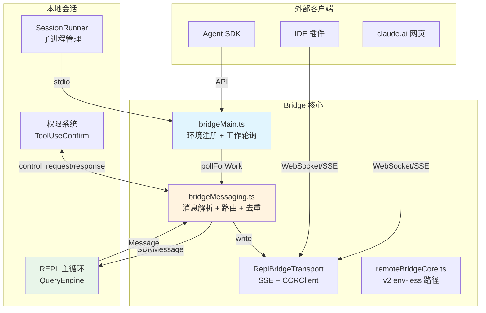
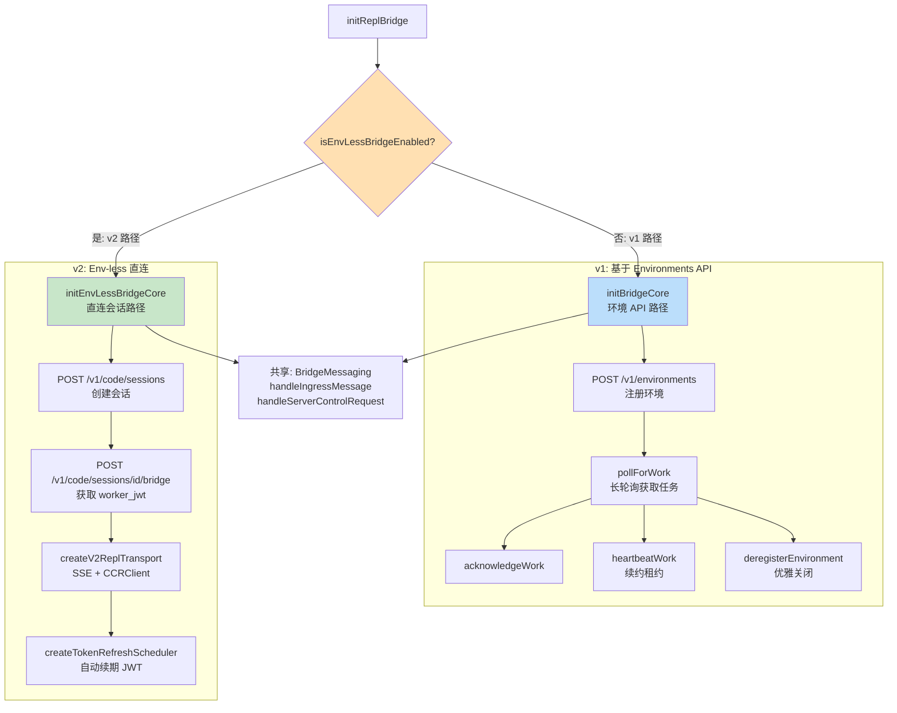
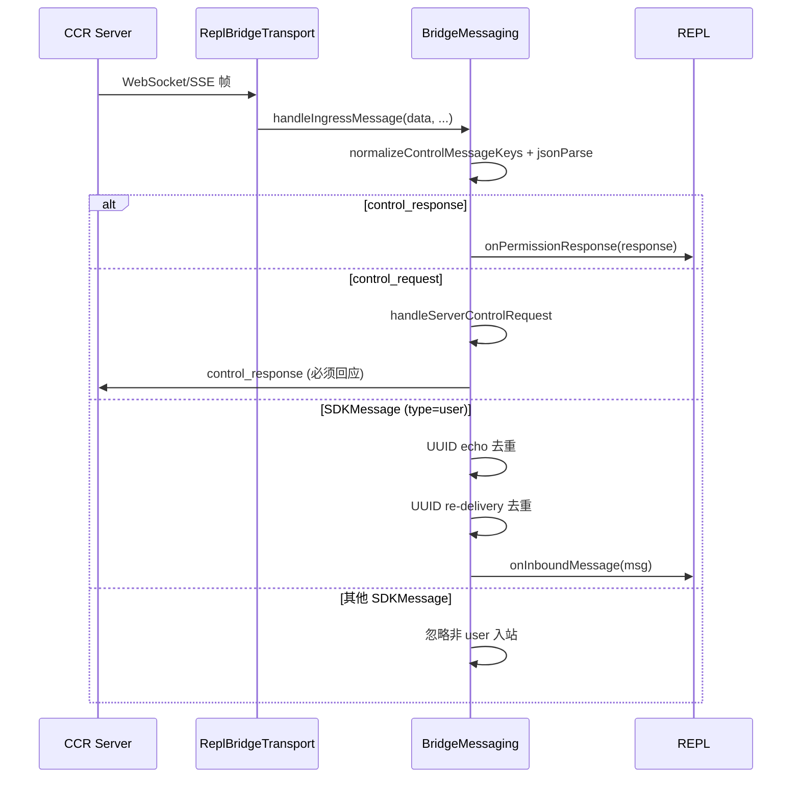
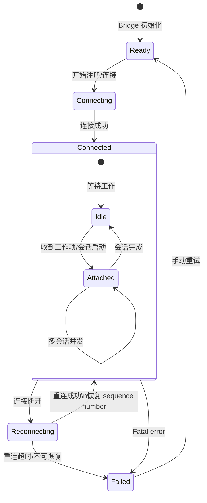
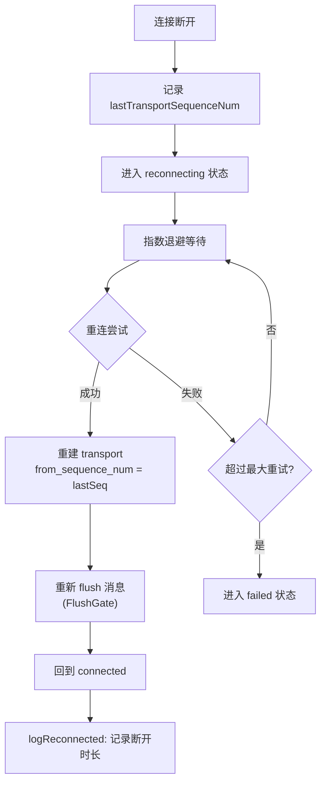
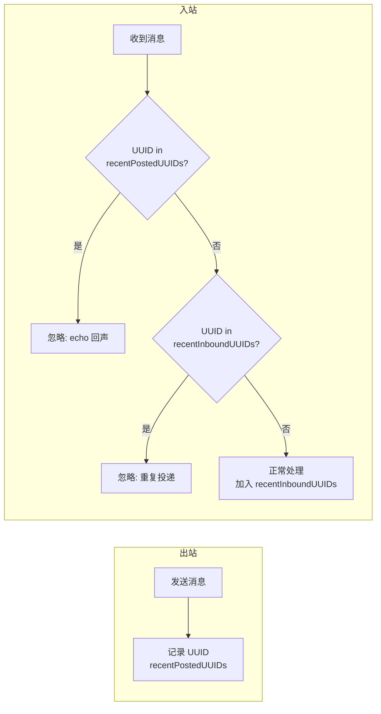
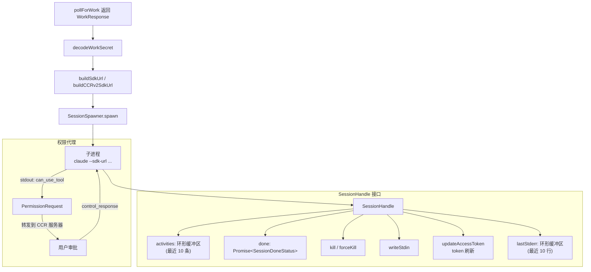
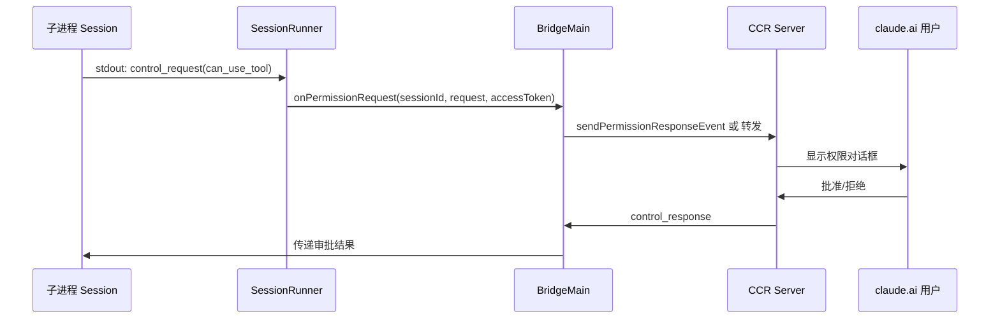
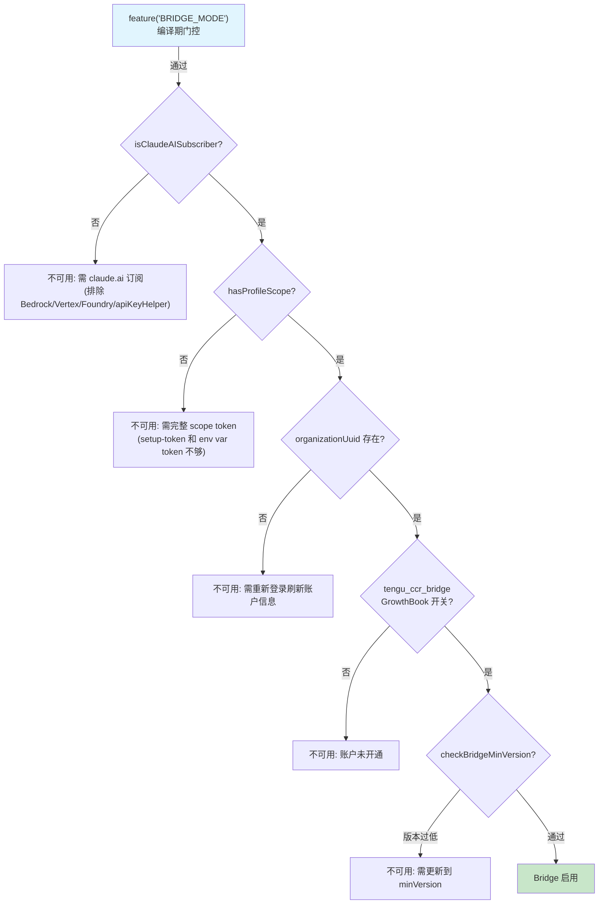
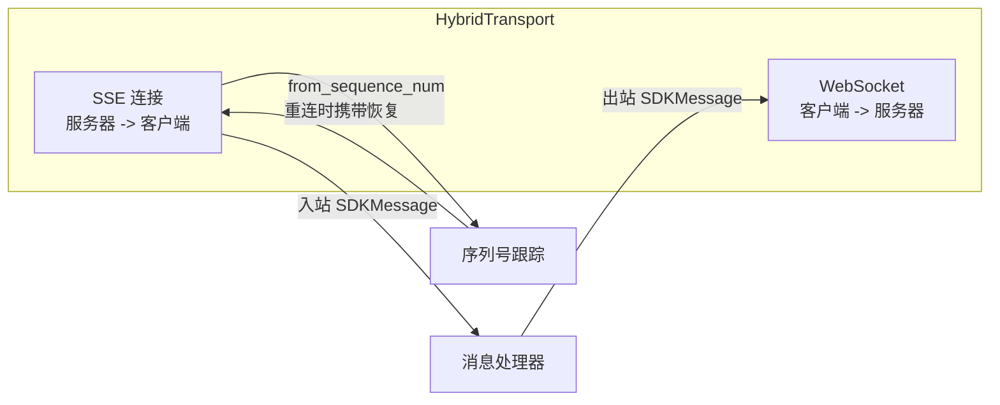

# Bridge 远程控制

> 前置知识：[第八章（远程/CCR）](/ch08-interfaces/remote-ccr) -- Bridge 是 CCR (Claude Code Remote) 的核心通信层，理解 CCR 的环境概念有助于理解 Bridge 的设计动机。

**源码位置：** `src/bridge/`（33 个文件）

## 1. 系统概述

Bridge 允许外部工具（claude.ai 网页端、IDE 插件、Agent SDK 等）远程控制 Claude Code 终端会话。它建立在 SSE + WebSocket 双向通信之上，实现了消息转发、权限代理和会话状态同步。Bridge 有两套实现路径（v1 基于 Environments API，v2 直连 Session Ingress），共享消息解析和路由逻辑。

功能门控链：`feature('BRIDGE_MODE')` -> `isClaudeAISubscriber()` -> `tengu_ccr_bridge` GrowthBook 开关 -> 版本检查。



## 2. 双路径架构

Bridge 存在两套实现路径，由 `tengu_bridge_repl_v2` GrowthBook 开关切换：



### 2.1 v1 vs v2 对比

| 维度 | v1 (Env-based) | v2 (Env-less) |
|------|---------------|---------------|
| 连接流程 | 注册环境 -> 轮询工作 -> 应答 | 创建会话 -> 获取 JWT -> 连接 |
| 生命周期 | register/poll/ack/heartbeat/deregister | 自动管理（JWT 续期） |
| 会话创建 | 依赖 Environments API 派发 | 直接 POST /v1/code/sessions |
| 认证方式 | EnvironmentSecret + SessionToken | OAuth -> worker_jwt |
| 适用场景 | daemon/print 路径 | REPL 路径 |
| 版本门控 | 默认 | `tengu_bridge_repl_v2` |

v2 移除了 Environments API 的中间层。服务器端 PR #292605 新增 `/bridge` 端点，直接完成 OAuth -> worker_jwt 交换，无需环境注册/轮询/心跳/注销的全套生命周期。`/bridge` 每次调用会 bump epoch，等效于注册。

## 3. 消息协议

### 3.1 消息类型判定

BridgeMessaging 中定义了三级消息类型守卫：

```typescript
// bridgeMessaging.ts -- 消息类型判定优先级
// 1. control_response (不是 SDKMessage，优先检查)
isSDKControlResponse(value)  // type === 'control_response' && 'response' in value

// 2. control_request (服务器发起的控制请求)
isSDKControlRequest(value)   // type === 'control_request' && 'request_id' in value

// 3. SDKMessage (常规用户/助手消息)
isSDKMessage(value)          // type 是 string 的对象
```

### 3.2 控制请求子类型

| subtype | 方向 | 用途 | 需要响应 |
|---------|------|------|---------|
| `initialize` | 服务器 -> 客户端 | 会话初始化，交换能力声明 | 必须（否则服务器杀连接 ~10-14s） |
| `set_model` | 服务器 -> 客户端 | 远程切换模型 | 是 |
| `set_max_thinking_tokens` | 服务器 -> 客户端 | 调整思考 token 上限 | 是 |
| `set_permission_mode` | 服务器 -> 客户端 | 切换权限模式（需本地验证） | 是（可能返回 error） |
| `interrupt` | 服务器 -> 客户端 | 中断当前生成 | 是 |
| `can_use_tool` | 客户端 -> 服务器 | 权限审批请求 | 服务器回传 control_response |

### 3.3 出站消息过滤

不是所有内部 Message 都应该转发到 Bridge。`isEligibleBridgeMessage` 实现过滤：

| 消息类型 | 是否转发 | 原因 |
|---------|---------|------|
| `user` (非虚拟) | 是 | 用户输入 |
| `assistant` (非虚拟) | 是 | 模型输出 |
| `system` + `subtype=local_command` | 是 | 斜杠命令事件 |
| `user` / `assistant` (isVirtual) | 否 | REPL 内部调用，bridge 消费者看到工具调用的汇总 |
| `tool_result`、`progress` 等 | 否 | REPL 内部通信 |

### 3.4 入站消息路由流程



## 4. 连接状态机



### 4.1 状态类型

```typescript
// replBridge.ts
export type BridgeState = 'ready' | 'connected' | 'reconnecting' | 'failed'
```

### 4.2 重连与序列号恢复

重连时使用 `from_sequence_num` 参数告诉服务器从哪个序列号开始重放：



`BoundedUUIDSet` 作为二级去重防护，处理序列号协商失败的边缘情况（服务器忽略 `from_sequence_num`、transport 在收到首帧前死亡等）。

## 5. Echo 去重机制

Bridge 使用 `BoundedUUIDSet` 防止消息回声和重复投递：



`BoundedUUIDSet` 实现细节（`bridgeMessaging.ts`）：

| 属性 | 值 | 说明 |
|------|-----|------|
| 数据结构 | 环形缓冲区 + Set | O(1) 查找 + O(1) 淘汰 |
| 容量 | 固定 | 内存使用恒定 O(capacity) |
| 淘汰策略 | FIFO | 按时间顺序淘汰最旧 |
| 线程安全 | 单线程 | Node.js 事件循环保证 |

## 6. 会话管理

### 6.1 Spawn 模式

`SpawnMode` 决定远程会话的工作目录策略：

| 模式 | 说明 | 隔离级别 | 适用场景 |
|------|------|---------|---------|
| `single-session` | 单会话 cwd，会话结束 Bridge 拆除 | 无 | 简单任务 |
| `worktree` | 每会话独立 git worktree | git 级别 | 并行开发 |
| `same-dir` | 所有会话共享 cwd | 无（可能冲突） | 轻量操作 |

### 6.2 SessionRunner

`SessionRunner` 管理子进程级别的 Claude Code 会话：



### 6.3 WorkSecret 解码

WorkSecret 包含连接子进程所需的全部凭据：

```typescript
// types.ts
type WorkSecret = {
  version: number
  session_ingress_token: string     // 入站认证 token
  api_base_url: string              // API 基地址
  sources: Array<{                  // 代码源信息
    type: string
    git_info?: { type, repo, ref?, token? }
  }>
  auth: Array<{ type, token }>      // 认证凭据
  claude_code_args?: Record<string, string>  // CLI 参数
  mcp_config?: unknown             // MCP 服务器配置
  environment_variables?: Record<string, string>  // 环境变量
  use_code_sessions?: boolean       // CCR v2 选择器
}
```

### 6.4 权限代理流程



子进程通过 stdout 输出 `control_request`，Bridge 将其转发到 CCR 服务器。用户在 claude.ai 网页审批，结果通过 `control_response` 回传。

## 7. Outbound-Only 模式

Bridge 支持 outbound-only 模式，仅转发事件到服务器，拒绝所有入站控制请求：

```typescript
// bridgeMessaging.ts
if (outboundOnly && request.request.subtype !== 'initialize') {
  // 回复 error，而非 false-success
  response = {
    type: 'control_response',
    response: { subtype: 'error', request_id, error: OUTBOUND_ONLY_ERROR }
  }
}
```

`initialize` 必须回复 success（否则服务器杀连接），其余可变请求（interrupt、set_model、set_permission_mode、set_max_thinking_tokens）均返回 error。这确保 claude.ai 不会显示"操作成功但本地无反应"的假象。

## 8. 功能门控链

Bridge 的启用需要通过多层门控（`bridgeEnabled.ts`）：



### 8.1 诊断 API

`getBridgeDisabledReason()` 提供逐步诊断，替代简单的 boolean 检查：

| 返回值 | 含义 |
|-------|------|
| `null` | Bridge 可用 |
| "requires a claude.ai subscription" | 非 claude.ai 订阅者 |
| "requires a full-scope login token" | 使用了 setup-token/env-var 令牌 |
| "Unable to determine your organization" | 缺少 organizationUuid |
| "not yet enabled for your account" | GrowthBook 开关关闭 |

### 8.2 CCR 自动连接

`getCcrAutoConnectDefault()` 在满足两个条件时默认连接 CCR：
1. `feature('CCR_AUTO_CONNECT')` 编译期标志（ant-only）
2. `tengu_cobalt_harbor` GrowthBook 开关

用户可通过 `remoteControlAtStartup: false` 显式关闭（显式设置优先于默认值）。

### 8.3 CCR Mirror 模式

`isCcrMirrorEnabled()` 控制镜像模式：每个本地会话额外生成一个 outbound-only 远程会话，将本地事件镜像到 claude.ai。独立于双向 Remote Control。

## 9. Transport 层

### 9.1 Transport 接口

```typescript
// replBridgeTransport.ts
export type ReplBridgeTransport = {
  write(event: object): Promise<void>  // 发送消息到服务器
  onMessage(handler: (data: string) => void): void  // 接收服务器消息
  close(): Promise<void>  // 关闭连接
}
```

### 9.2 V1 vs V2 Transport

| 维度 | V1 Transport | V2 Transport |
|------|-------------|-------------|
| 创建函数 | `createV1ReplTransport` | `createV2ReplTransport` |
| 认证 | environment_id + environment_secret | worker_jwt + worker_epoch |
| 协议 | HybridTransport (SSE + WS) | SSE + CCRClient |
| 序列号 | SSE `from_sequence_num` | SSE `from_sequence_num` |

### 9.3 HybridTransport

`HybridTransport`（`src/cli/transports/HybridTransport.ts`）组合 SSE（入站推送）和 WebSocket（出站发送），实现全双工通信：



## 10. FlushGate 与容量信号

### 10.1 FlushGate

`FlushGate` 控制消息刷入时机，防止在 transport 未就绪时发送消息：

- transport 连接建立前：消息排队等待
- transport 就绪后：一次性刷入排队的消息
- 重连期间：新消息排队，重连后刷入

### 10.2 CapacityWake

`CapacityWake` 在环境容量变化时唤醒等待的工作分配：

```typescript
// capacityWake.ts
export type CapacitySignal = 'available' | 'full'
```

当环境从满载变为可用时，触发新一轮 pollForWork。

## 11. 安全机制

| 机制 | 实现文件 | 说明 |
|------|---------|------|
| JWT 认证 | `jwtUtils.ts` | worker_jwt 限时有效，自动续期 |
| 环境密钥 | `workSecret.ts` | environment_secret 服务端签发 |
| Outbound-only | `bridgeMessaging.ts` | 拒绝入站控制，返回明确 error |
| 版本最低要求 | `bridgeEnabled.ts` | `tengu_bridge_min_version` |
| 可信设备令牌 | `trustedDevice.ts` | 设备级信任验证 |
| Webhook 清理 | `webhookSanitizer.ts` | 清理 webhook 载荷中的 PII |
| Session ID 兼容 | `sessionIdCompat.ts` | `cse_*` -> `session_*` 标签映射 |

## 12. 关键源文件

| 文件 | 职责 |
|------|------|
| `src/bridge/bridgeMain.ts` | 核心：环境注册、工作轮询、会话生成、消息路由、重连逻辑 |
| `src/bridge/bridgeMessaging.ts` | 共享：消息解析、入站路由、控制请求处理、UUID 去重、FlushGate |
| `src/bridge/types.ts` | 类型定义：BridgeConfig、SessionHandle、WorkResponse、SpawnMode 等 |
| `src/bridge/replBridge.ts` | REPL 包装：初始化 Bridge、注入 REPL 依赖、选择 v1/v2 路径 |
| `src/bridge/remoteBridgeCore.ts` | v2 路径：env-less 直连，JWT 续期，401 恢复 |
| `src/bridge/bridgeEnabled.ts` | 功能门控：订阅验证、scope 检查、版本检查、开关判定 |
| `src/bridge/sessionRunner.ts` | 子进程管理：生成、监控、权限代理、活动追踪 |
| `src/bridge/replBridgeTransport.ts` | Transport 抽象：V1/V2 工厂函数 |
| `src/bridge/workSecret.ts` | WorkSecret 解码、SDK URL 构建 |
| `src/bridge/bridgeApi.ts` | API 客户端：环境 CRUD、工作轮询、故障注入 |
| `src/bridge/jwtUtils.ts` | JWT 刷新调度器：proactive refresh、401 recovery |
| `src/bridge/envLessBridgeConfig.ts` | v2 配置：minVersion 检查 |
| `src/bridge/flushGate.ts` | 消息刷入控制 |
| `src/bridge/capacityWake.ts` | 容量信号管理 |
| `src/bridge/inboundMessages.ts` | 入站消息处理与附件解析 |
| `src/bridge/inboundAttachments.ts` | 入站附件解析 |
| `src/bridge/bridgeDebug.ts` | 调试：故障注入、debug handle |
| `src/bridge/debugUtils.ts` | 调试工具：错误描述、HTTP 状态提取 |
| `src/bridge/sessionIdCompat.ts` | Session ID 格式兼容：`cse_*` <-> `session_*` |
| `src/bridge/webhookSanitizer.ts` | Webhook 载荷 PII 清理 |
| `src/bridge/trustedDevice.ts` | 可信设备令牌获取 |
| `src/bridge/pollConfig.ts` | 轮询配置传递 |
| `src/bridge/pollConfigDefaults.ts` | 默认轮询间隔配置 |
| `src/bridge/bridgePermissionCallbacks.ts` | 权限回调注册 |
| `src/bridge/bridgePointer.ts` | Bridge 实例指针 |
| `src/bridge/bridgeConfig.ts` | Bridge 配置构建 |
| `src/bridge/bridgeStatusUtil.ts` | 状态显示工具 |
| `src/bridge/bridgeUI.ts` | Bridge UI 组件 |
| `src/bridge/codeSessionApi.ts` | Code Session API 客户端 |
| `src/bridge/createSession.ts` | 会话创建逻辑 |
| `src/bridge/peerSessions.ts` | 对等会话管理 |

<div class="chapter-nav-hint">

**下一节：[Coordinator 多Agent编排 ->](/appendix-hidden/coordinator)**

</div>
