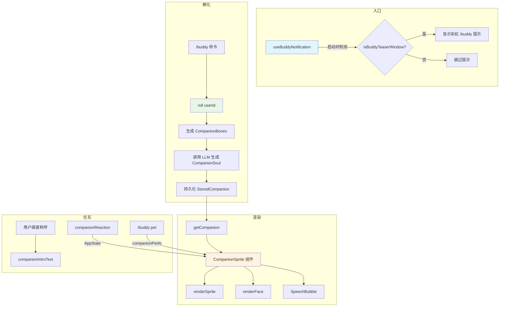
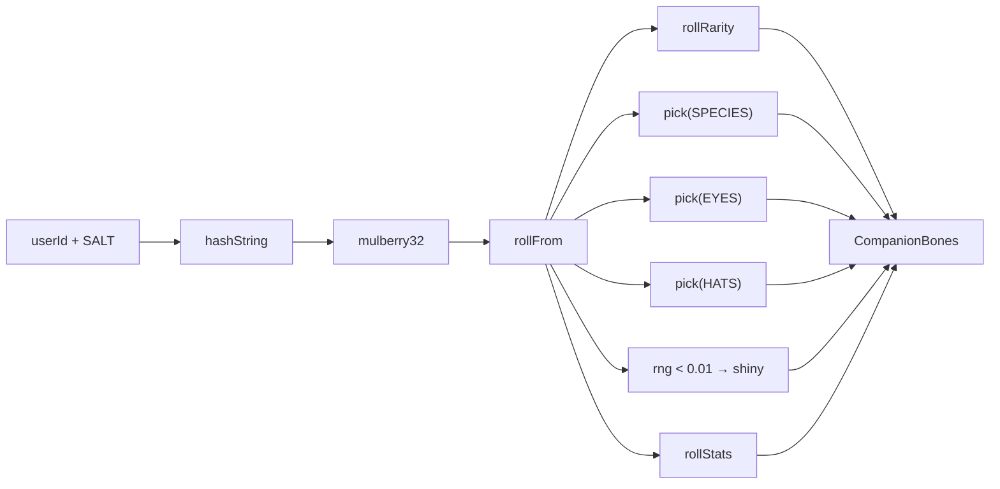
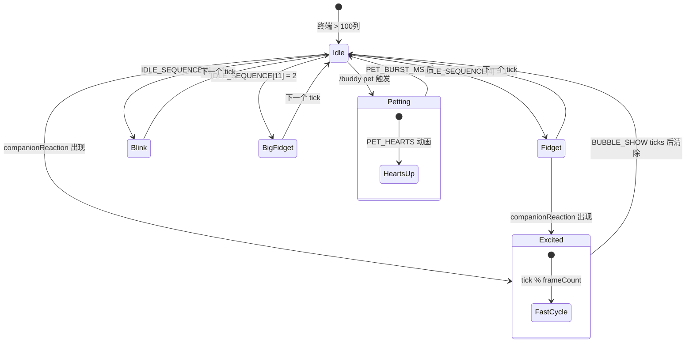
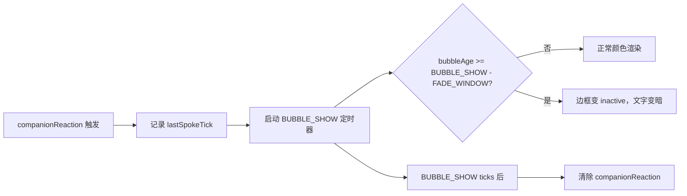

# Buddy 宠物系统

> 前置知识：[第一章 类型系统](/ch01-foundation/tool-type) -- 理解联合类型与字面量类型是阅读 `CompanionBones` 等类型定义的基础。

**源码位置：** `src/buddy/`（6 个文件）

## 1. 系统概述

Buddy 是 Claude Code 内置的 ASCII 宠物系统。它在终端输入框旁渲染一个小型 ASCII 精灵，并能通过气泡对话框对用户行为做出反应。整个系统由确定性随机数驱动：同一个用户永远获得同一只宠物，无法通过编辑配置伪造稀有度。

功能门控：`feature('BUDDY')` -- 编译期移除，外部构建不含任何 buddy 代码。



## 2. 确定性生成：从 userId 到 CompanionBones

Buddy 的核心设计原则是**确定性** -- 同一个 `userId` 永远生成相同的宠物属性。这通过 seeded PRNG 实现：



### 2.1 哈希与 PRNG

源码使用 FNV-1a 变体（`hashString`）将 userId 映射为 32 位种子，再通过 Mulberry32 PRNG 生成可复现的随机序列：

```typescript
// companion.ts -- 简化
function hashString(s: string): number {
  let h = 2166136261
  for (let i = 0; i < s.length; i++) {
    h ^= s.charCodeAt(i)
    h = Math.imul(h, 16777619)
  }
  return h >>> 0
}
```

关键：Bun 运行时走快速路径 `Bun.hash(s)`，Node 走 FNV-1a。两者对同一输入产生不同结果，但 `SALT = 'friend-2026-401'` 保证跨运行时一致性（实际用户只走一条路径）。

### 2.2 稀有度系统

| 稀有度 | 权重 | 星级 | 统计下限 | 帽子 |
|--------|------|------|----------|------|
| common | 60 | ★ | 5 | none（强制） |
| uncommon | 25 | ★★ | 15 | 随机 |
| rare | 10 | ★★★ | 25 | 随机 |
| epic | 4 | ★★★★ | 35 | 随机 |
| legendary | 1 | ★★★★★ | 50 | 随机 |

`rollRarity` 按权重表做加权随机；`common` 强制帽子为 `none`。1% 概率触发 `shiny`（闪光）。

### 2.3 属性系统

5 项统计名称：`DEBUGGING`、`PATIENCE`、`CHAOS`、`WISDOM`、`SNARK`。

生成算法：
- 随机选一项作为 peak（`floor + 50 + rng*30`，上限 100）
- 再选一项作为 dump（`max(1, floor - 10 + rng*15)`）
- 其余项：`floor + rng*40`
- 稀有度越高，`floor` 越高，所有属性整体提升

### 2.4 数据模型

```typescript
// types.ts -- 核心类型关系
type CompanionBones = {
  rarity: Rarity        // 确定性，由 userId 派生
  species: Species      // 确定性
  eye: Eye              // 确定性
  hat: Hat              // 确定性（common 强制 none）
  shiny: boolean        // 确定性（1% 概率）
  stats: Record<StatName, number>  // 确定性
}

type CompanionSoul = {
  name: string          // LLM 生成，持久化到 config
  personality: string   // LLM 生成，持久化到 config
}

type Companion = CompanionBones & CompanionSoul & { hatchedAt: number }
type StoredCompanion = CompanionSoul & { hatchedAt: number }  // 仅存储 Soul
```

**安全设计**：`StoredCompanion` 不存储 `CompanionBones`。每次读取时从 userId 重新生成 bones 再合并，防止用户编辑配置伪造稀有度。

## 3. 精灵动画系统

### 3.1 Sprite Sheet 格式

每个物种拥有 3 帧动画，每帧 5 行 x 12 列字符：

```
帧 0: 静止姿态（idle 主帧）
帧 1: 微动帧（fidget）
帧 2: 大幅动画帧（如喷烟、展翅）
```

帧的第 0 行是帽子插槽。`{E}` 占位符在渲染时替换为实际眼睛字符：

```typescript
// sprites.ts -- 渲染管线
export function renderSprite(bones: CompanionBones, frame = 0): string[] {
  const frames = BODIES[bones.species]
  const body = frames[frame % frames.length]!.map(line =>
    line.replaceAll('{E}', bones.eye),
  )
  const lines = [...body]
  // 仅当帧 0 为空且有帽子时替换帽子行
  if (bones.hat !== 'none' && !lines[0]!.trim()) {
    lines[0] = HAT_LINES[bones.hat]
  }
  // 如果所有帧的第 0 行都为空，则丢弃以节省纵向空间
  if (!lines[0]!.trim() && frames.every(f => !f[0]!.trim())) lines.shift()
  return lines
}
```

### 3.2 物种列表

18 种物种，物种名称使用 `String.fromCharCode` 编码以绕过构建系统的代码名称检测：

| 物种 | 编码方式 | 帧数 |
|------|---------|------|
| duck | charCode | 3 |
| goose | charCode | 3 |
| cat | charCode | 3 |
| dragon | charCode | 3 |
| octopus | charCode | 3 |
| owl | charCode | 3 |
| ghost | charCode | 3 |
| robot | charCode | 3 |
| ... (共 18 种) | charCode | 3 |

### 3.3 帽子系统

8 种帽子，作为精灵的第 0 行渲染：

| 帽子 | 渲染效果 |
|------|---------|
| none | （空行，可能被删除） |
| crown | `\^^^/` |
| tophat | `[___]` |
| propeller | `-+-` |
| halo | `(   )` |
| wizard | `/^\` |
| beanie | `(___)` |
| tinyduck | `,>` |

### 3.4 窄终端回退

终端宽度 < 100 列时，`CompanionSprite` 折叠为单行面部 + 名称：

```typescript
// CompanionSprite.tsx
if (columns < MIN_COLS_FOR_FULL_SPRITE) {
  // 使用 renderFace() 生成单行面部表达式
  // 如 cat 的 face: "=·ω·=" → 替换 {E} 为实际眼睛
  return <Box>...</Box>
}
```

## 4. 动画时序与交互状态机



### 4.1 时间常量

| 常量 | 值 | 含义 |
|------|-----|------|
| `TICK_MS` | 500 | 每个 tick 500ms |
| `BUBBLE_SHOW` | 20 ticks | 气泡显示 ~10s |
| `FADE_WINDOW` | 6 ticks | 最后 ~3s 气泡变暗 |
| `PET_BURST_MS` | 2500 | 爱心动画持续 2.5s |

### 4.2 Idle 序列

```typescript
const IDLE_SEQUENCE = [0, 0, 0, 0, 1, 0, 0, 0, -1, 0, 0, 2, 0, 0, 0]
// 0=静止, 1=微动, -1=眨眼(帧0但眼睛替换为'-'), 2=大幅动画
```

15 步循环，大部分时间静止（帧 0），偶尔微动或眨眼。

### 4.3 宠爱动画

`/buddy pet` 触发 5 帧爱心上升动画：

```
帧 0:   ♥    ♥
帧 1:  ♥  ♥   ♥
帧 2: ♥   ♥  ♥
帧 3:♥  ♥     ♥
帧 4: ·    ·   ·
```

爱心行插在精灵体上方，2.5s 后消失。

## 5. 气泡对话框

`SpeechBubble` 组件在宠物旁渲染圆角边框气泡：



- 宽终端（>= 100 列）：气泡在精灵右侧内联显示
- 全屏模式：气泡通过 `CompanionFloatingBubble` 在底部浮动区域显示（避免 `overflowY:hidden` 裁剪）
- 窄终端：气泡折叠为名称旁的引号文字

## 6. 与 LLM 的集成

`prompt.ts` 定义了伴侣介绍文本，作为 attachment 注入对话：

```typescript
export function companionIntroText(name: string, species: string): string {
  return `# Companion\nA small ${species} named ${name} sits beside the
  user's input box and occasionally comments in a speech bubble...`
}
```

关键规则：
- LLM **不是** 伴侣 -- 伴侣是独立的观察者
- 用户直接称呼宠物名字时，LLM 应让出空间，仅用一行或更少回复
- 介绍文本仅在宠物首次出现时注入，后续对话不再重复

## 7. 启动窗口机制

```typescript
// useBuddyNotification.tsx
export function isBuddyTeaserWindow(): boolean {
  const d = new Date()
  return d.getFullYear() === 2026 && d.getMonth() === 3 && d.getDate() <= 7
}
```

- 2026 年 4 月 1-7 日为预告窗口，启动时显示彩虹 `/buddy` 提示
- 4 月之后 `isBuddyLive()` 返回 true，`/buddy` 命令永久可用
- 使用本地时间（非 UTC），形成 24 小时滚动波

## 8. 关键源文件

| 文件 | 行数 | 职责 |
|------|------|------|
| `src/buddy/types.ts` | ~149 | 物种、稀有度、帽子、眼睛、统计的类型与常量定义 |
| `src/buddy/companion.ts` | ~134 | 确定性生成：hashString、mulberry32、roll、getCompanion |
| `src/buddy/sprites.ts` | ~515 | 18 种精灵帧数据、帽子行、renderSprite、renderFace |
| `src/buddy/CompanionSprite.tsx` | ~370 | React 组件：动画循环、气泡、爱心、窄终端回退 |
| `src/buddy/useBuddyNotification.tsx` | ~98 | 启动提示、预告窗口、/buddy 触发位置检测 |
| `src/buddy/prompt.ts` | ~37 | 伴侣介绍文本、attachment 注入、companionIntroText |

<div class="chapter-nav-hint">

**下一节：[KAIROS 持久助手 ->](/appendix-hidden/kairos)**

</div>
