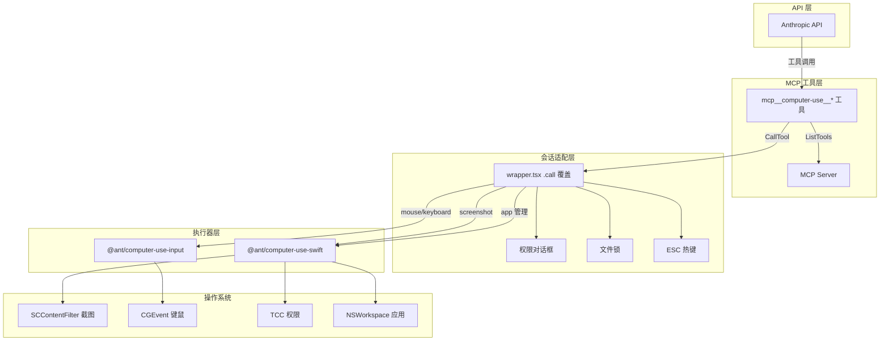
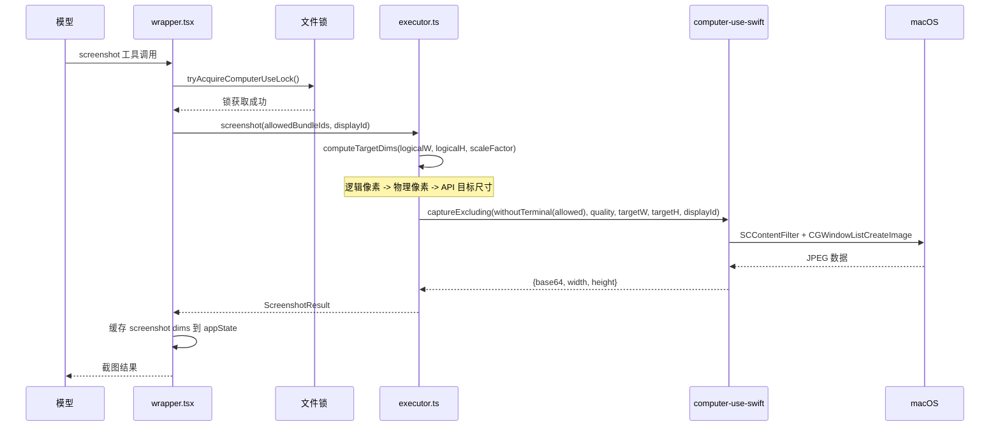
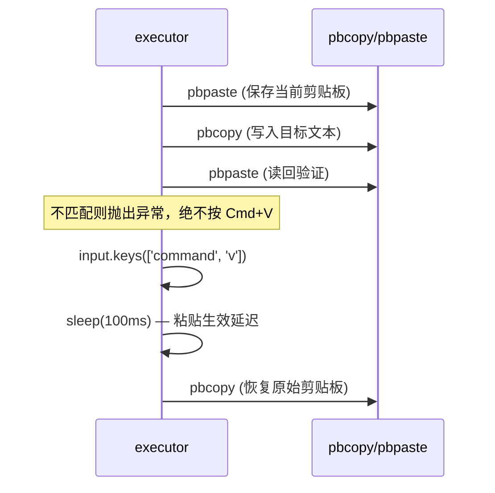
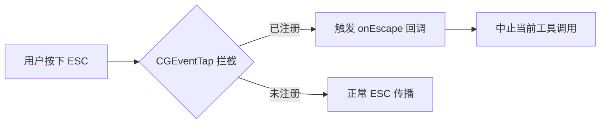

# Computer Use

> 前置知识：[第五章（工具执行）](/ch05-actions/tool-execution) — Computer Use 通过 MCP 工具层向模型暴露桌面交互能力。

**源码位置**：`src/utils/computerUse/`（~2000 行）、MCP 集成包 `@ant/computer-use-mcp`

Computer Use 允许 Claude Code 通过截图感知桌面内容，并通过鼠标、键盘操作与应用程序交互。整个系统基于原生模块 + MCP 协议构建，仅支持 macOS。

## 架构总览



## 功能门控与订阅要求

Computer Use 受多层门控控制，定义在 `src/utils/computerUse/gates.ts`：

| 门控 | 条件 | 说明 |
|------|------|------|
| 编译期 | `feature('CHICAGO_MCP')` | 非 ant 构建消除代码 |
| 订阅等级 | Max 或 Pro（ant 绕过） | `hasRequiredSubscription()` |
| GrowthBook | `tengu_malort_pedway` 配置 | 动态开关及子门控 |
| 平台 | macOS only | `createCliExecutor` 在非 darwin 平台抛出异常 |

### 子门控配置

```typescript
const DEFAULTS: ChicagoConfig = {
  enabled: false,
  pixelValidation: false,       // 像素级点击验证
  clipboardPasteMultiline: true, // 多行文本通过剪贴板粘贴
  mouseAnimation: true,          // 拖拽动画
  hideBeforeAction: true,        // 操作前隐藏其他应用
  autoTargetDisplay: true,       // 自动选择显示器
  clipboardGuard: true,          // 剪贴板保护
  coordinateMode: 'pixels',      // 坐标模式：pixels | normalized
}
```

`coordinateMode` 在首次读取时冻结（`frozenCoordinateMode`），因为 `setup.ts` 构建工具描述和 `executor.ts` 坐标变换依赖相同值，中途变更会导致不一致。

## 截图管线

### 截图捕获流程



### 坐标系统

截图和坐标遵循 `@ant/computer-use-mcp/COORDINATES.md` 规范：

1. **逻辑像素**：macOS AppKit 使用的坐标系，考虑 Retina 缩放前的尺寸
2. **物理像素**：逻辑像素 * `scaleFactor`（2x Retina = 2 倍物理像素）
3. **API 目标尺寸**：`targetImageSize()` 计算，预缩放至 API 期望的分辨率，避免服务端二次缩放

`computeTargetDims()` 执行：`logicalW * scaleFactor -> physW -> targetImageSize(physW, physH, API_RESIZE_PARAMS)`

### 终端排除

截图时排除终端窗口以防止信息泄露：

- `getTerminalBundleId()` 检测当前运行的终端模拟器
- `withoutTerminal()` 从 `allowedBundleIds` 中过滤掉终端
- `surrogateHost`（终端 bundleId 或哨兵值 `com.anthropic.claude-code.cli-no-window`）传递给 `prepareDisplay`，豁免终端的隐藏操作

### zoom 操作

`zoom()` 截取指定逻辑区域的高清截图，使用 `captureRegion` 而非 `captureExcluding`，用于模型需要查看界面细节时。

## 动作执行

### 鼠标操作

| 操作 | 方法 | 关键细节 |
|------|------|----------|
| 点击 | `click(x, y, button, count, modifiers)` | 先 `moveAndSettle`（50ms），修饰键通过 `withModifiers` 括号包裹 |
| 移动 | `moveMouse(x, y)` | 即时移动 + 50ms settle 等待 HID 回路 |
| 拖拽 | `drag(from, to)` | `from` 可省略（从当前位置拖），`animatedMove` 60fps 缓出三次方动画 |
| 滚动 | `scroll(x, y, dx, dy)` | 先移动到目标，垂直轴优先 |
| 按下/释放 | `mouseDown/mouseUp` | 用于合成复合手势 |

`moveAndSettle` 是核心延迟模式：即时移动后等待 50ms，让 AppKit/NSEvent 完成输入->HID->AppKit 的往返传播。拖拽动画以 2000 px/s 速度、0.5s 上限执行 ease-out-cubic 缓动。

### 键盘操作

| 操作 | 方法 | 关键细节 |
|------|------|----------|
| 按键序列 | `key(keySequence, repeat?)` | `xdotool` 风格，`ctrl+shift+a` 拆分为修饰键+主键 |
| 长按 | `holdKey(keyNames, durationMs)` | `orphaned` 标志防止 drainRunLoop 超时后按键卡住 |
| 输入文本 | `type(text, {viaClipboard})` | 多行通过剪贴板粘贴，单字逐 grapheme 输入 |
| 剪贴板粘贴 | `typeViaClipboard()` | 保存/写入/读回验证/粘贴/100ms 等待/恢复 |

`typeViaClipboard` 是安全敏感操作：



### 键盘安全网

`isBareEscape()` 检测单独的 Escape 按键，通过 `notifyExpectedEscape()` 在 CGEventTap 中打孔——模型合成的 Escape 不会触发 abort 回调。Swift 端设置 100ms 衰减窗口防止误判。

## 安全约束

### 文件锁机制

`computerUseLock.ts` 实现跨会话互斥：同一台机器上只有一个 Claude Code 会话可以使用 Computer Use。锁文件位于 `~/.claude/computer-use.lock`，包含会话 ID 和时间戳。

### ESC 全局热键



`escHotkey.ts` 通过 `@ant/computer-use-swift` 的 `hotkey.registerEscape` 注册全局 CGEventTap，系统范围消费 Escape 键。这是 PI（Prompt Injection）防御——被注入的动作无法用 Escape 关闭对话框。

### 权限对话框

`wrapper.tsx` 中的 `onPermissionRequest` 回调渲染 `ComputerUseApproval` 组件，用户需批准应用访问权限。`grantFlags` 跟踪剪贴板读写和系统组合键的授权状态。

### 操作前隐藏

`prepareForAction()` 在执行动作前隐藏非目标应用窗口，防止点击穿透到错误窗口。`resolvePrepareCapture` 组合隐藏+截图为单次操作，减少闪烁。

## MCP 工具集成

### 工具注册

`setup.ts` 中的 `setupComputerUseMCP()` 构建动态 MCP 配置：

```typescript
// 工具名称格式：mcp__computer-use__*
// API 后端检测 mcp__computer-use__* 前缀并注入 COMPUTER_USE_MCP_AVAILABILITY_HINT
const allowedTools = buildComputerUseTools(CLI_CU_CAPABILITIES, coordinateMode)
  .map(t => buildMcpToolName('computer-use', t.name))
```

关键设计：工具名称必须为 `mcp__computer-use__*`，API 后端据此识别 CU 可用性并注入系统提示。这也解释了为什么使用 MCP 层而非内置工具。

### MCP Server 实现

`mcpServer.ts` 中 `createComputerUseMcpServerForCli()` 构建进程内 MCP Server：

1. 调用 `@ant/computer-use-mcp` 的 `createComputerUseMcpServer` 创建 Server + stub CallTool
2. 替换 `ListTools` handler，在工具描述中注入已安装应用名称列表
3. 真实调度通过 `wrapper.tsx` 的 `.call()` 覆盖实现

`--computer-use-mcp` 子进程模式使用 `StdioServerTransport`，stdin 关闭时退出并 flush analytics。

### 已安装应用枚举

`tryGetInstalledAppNames()` 通过 `executor.listInstalledApps()` 枚举应用，1 秒超时。超时时工具描述省略应用列表，但运行时仍可解析。`filterAppsForDescription()` 过滤掉系统/冗余应用。

## 清理流程

`cleanup.ts` 在回合结束时执行清理：

1. **unhide 应用**：恢复 `prepareForAction` 隐藏的应用窗口，5 秒超时
2. **释放 ESC 热键**：`unregisterEscHotkey()`，在锁释放前注销以停止 pump-retain
3. **释放文件锁**：`releaseComputerUseLock()`，发送 OS 通知 "Claude is done using your computer"

清理在三个站点触发：自然回合结束（`stopHooks.ts`）、流式中止（`query.ts`）、工具执行中止。

## drainRunLoop 机制

`@ant/computer-use-swift` 的四个 `@MainActor` 方法（`captureExcluding`、`captureRegion`、`apps.listInstalled`、`resolvePrepareCapture`）通过 `DispatchQueue.main` 调度，在 libuv 事件循环中会挂起。`drainRunLoop.ts` 实现引用计数的 `CFRunLoop` 泵：

- `retainPump()` / `releasePump()` 管理引用计数
- 30 秒超时防止永久挂起
- enigo 键盘操作也需 pump（`dispatch2::run_on_main` -> tokio channel 阻塞）

## 关键源文件

| 文件 | 行数 | 职责 |
|------|------|------|
| `src/utils/computerUse/executor.ts` | ~659 | CLI ComputerExecutor 实现：截图、鼠标、键盘、应用管理 |
| `src/utils/computerUse/wrapper.tsx` | ~27083 tokens | 会话上下文绑定、.call() 覆盖、权限对话框 |
| `src/utils/computerUse/mcpServer.ts` | ~107 | MCP Server 创建、子进程入口、应用枚举 |
| `src/utils/computerUse/setup.ts` | ~54 | 动态 MCP 配置、工具名称注册 |
| `src/utils/computerUse/gates.ts` | ~73 | 功能门控、订阅检查、子门控配置 |
| `src/utils/computerUse/hostAdapter.ts` | ~69 | HostAdapter 单例：日志、权限检查、子门控代理 |
| `src/utils/computerUse/common.ts` | ~62 | 常量：MCP Server 名称、终端 bundleId、能力声明 |
| `src/utils/computerUse/cleanup.ts` | ~87 | 回合结束清理：unhide、ESC 注销、锁释放 |
| `src/utils/computerUse/escHotkey.ts` | ~55 | ESC 全局热键注册/注销 |
| `src/utils/computerUse/inputLoader.ts` | ~46 | @ant/computer-use-input 惰性加载 |
| `src/utils/computerUse/swiftLoader.ts` | ~39 | @ant/computer-use-swift 惰性加载 |
| `src/utils/computerUse/drainRunLoop.ts` | - | CFRunLoop 泵，解决 @MainActor 方法挂起 |

<div class="chapter-nav-hint">
附录 -- 上一篇：<a href="./voice.md">语音模式</a> | 下一篇：<a href="./worktree.md">Worktree 隔离模式</a>
</div>
