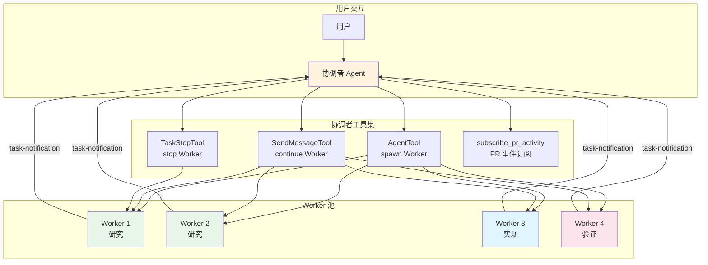
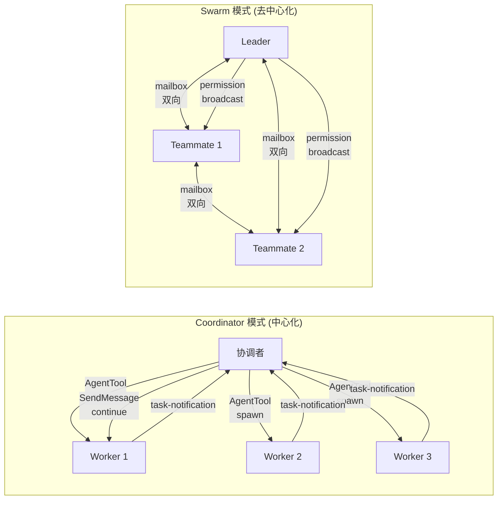
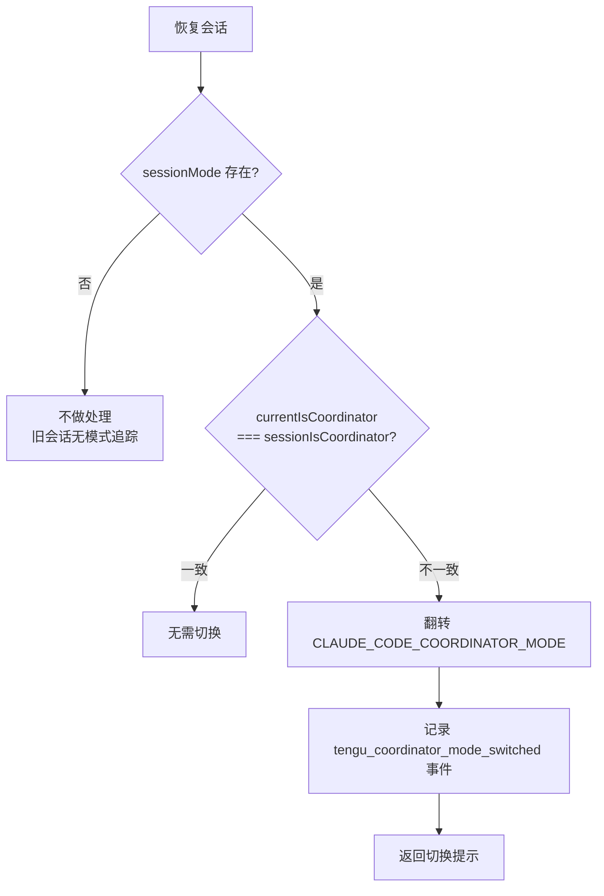
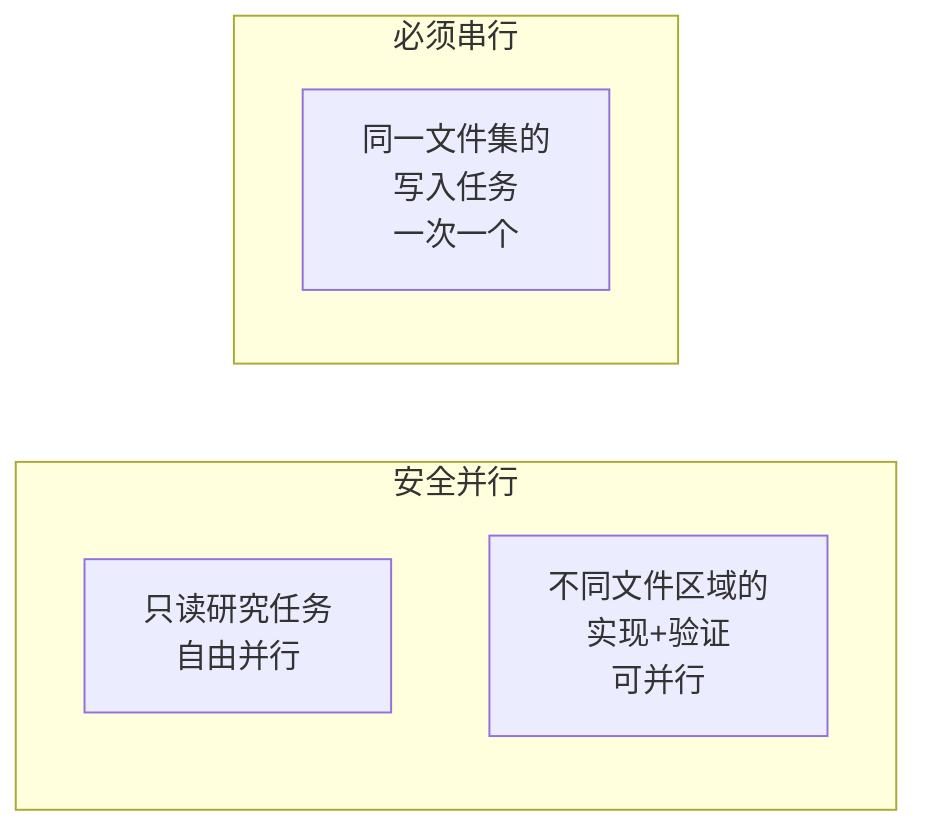
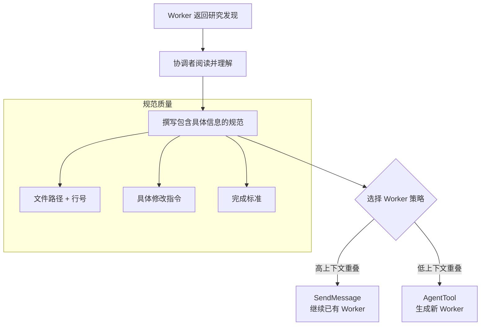
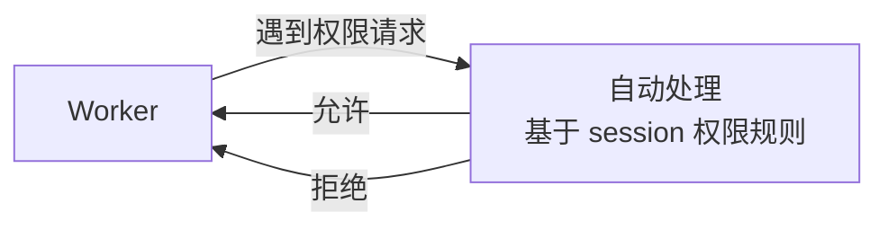
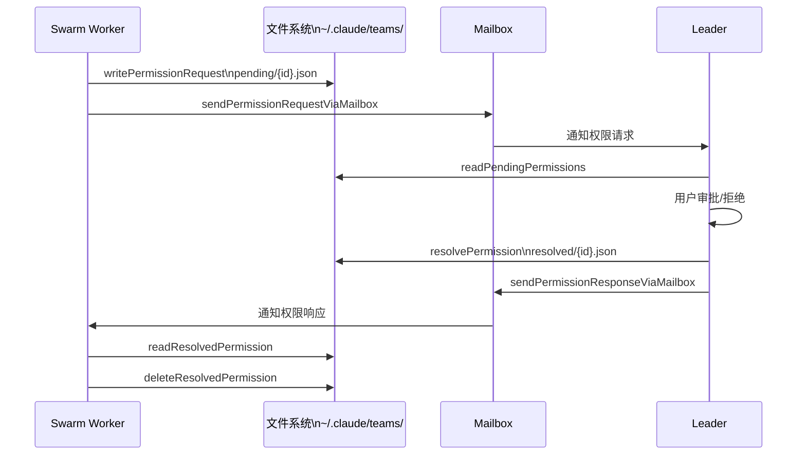
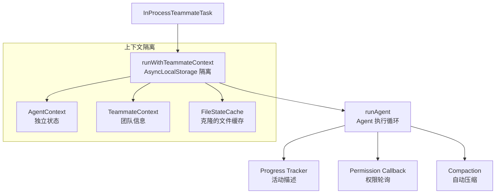

# Coordinator 多Agent编排

> 前置知识：[7.2 Agent/Subagent 系统](/ch07-extensions/agents) | [7.3 多Agent团队](/ch07-extensions/swarm) -- 理解 Agent 工具和 Swarm 团队机制是掌握 Coordinator 的前提。

**源码位置：** `src/coordinator/`（2 个核心文件）+ `src/utils/swarm/`（12 个相关文件）

## 1. 系统概述

Coordinator 是 Claude Code 的中心化多 Agent 编排模式。与 Swarm 的去中心化架构不同，Coordinator 由一个"协调者" Agent 统一规划、分发和聚合工作。协调者不直接执行代码修改，而是将任务委派给 Worker Agent，自身专注于理解问题、综合发现和撰写精确的执行规范。

功能门控：`feature('COORDINATOR_MODE')` + `CLAUDE_CODE_COORDINATOR_MODE` 环境变量。



## 2. Coordinator vs Swarm

两种模式的核心差异在于控制流和通信拓扑：



| 维度 | Coordinator | Swarm |
|------|------------|-------|
| **架构** | 中心化（星形） | 去中心化（网状） |
| **任务分发** | 协调者显式分配 | Leader 指派 + 自由认领 |
| **通信方式** | `task-notification` XML | mailbox 消息传递 |
| **权限同步** | Worker 独立处理 | Leader 集中审批 |
| **进程模型** | AgentTool 子进程 | tmux/in-process 混合 |
| **Worker 续用** | SendMessage 继续已有 Worker | mailbox 持续通信 |
| **适用场景** | 有明确分工的任务 | 持续协作型任务 |

## 3. 模式激活与检测

### 3.1 激活条件

```typescript
// coordinatorMode.ts
export function isCoordinatorMode(): boolean {
  if (feature('COORDINATOR_MODE')) {
    return isEnvTruthy(process.env.CLAUDE_CODE_COORDINATOR_MODE)
  }
  return false
}
```

需要同时满足：
1. 编译期：`feature('COORDINATOR_MODE')` 为 true
2. 运行时：`CLAUDE_CODE_COORDINATOR_MODE` 环境变量为真值

### 3.2 会话恢复时模式匹配

恢复会话时，Coordinator 检查存储的模式与当前环境是否一致：



## 4. 协调者系统提示

Coordinator 模式下，系统提示由 `getCoordinatorSystemPrompt()` 生成，定义了协调者的角色、工具和工作流。

### 4.1 角色定义

```
You are Claude Code, an AI assistant that orchestrates software engineering tasks
across multiple workers.

Your job is to:
- Help the user achieve their goal
- Direct workers to research, implement and verify code changes
- Synthesize results and communicate with the user
- Answer questions directly when possible
```

核心原则：**协调者不直接执行代码修改**，而是将工作委派给 Worker。

### 4.2 工具集

| 工具 | 用途 | 关键注意事项 |
|------|------|-------------|
| `AgentTool` | 生成新 Worker | 不设 model 参数（Worker 需默认模型处理实质性任务） |
| `SendMessageTool` | 继续已有 Worker | 利用 Worker 已加载的上下文 |
| `TaskStopTool` | 停止错误方向的 Worker | 停止后仍可 SendMessage 继续 |
| `subscribe_pr_activity` | 订阅 PR 事件 | 不委派给 Worker，协调者直接管理 |

### 4.3 Worker 通知格式

Worker 结果通过 `<task-notification>` XML 标签传递给协调者：

```xml
<task-notification>
  <task-id>{agentId}</task-id>
  <status>completed|failed|killed</status>
  <summary>{human-readable status summary}</summary>
  <result>{agent's final text response}</result>
  <usage>
    <total_tokens>N</total_tokens>
    <tool_uses>N</tool_uses>
    <duration_ms>N</duration_ms>
  </usage>
</task-notification>
```

- `<result>` 和 `<usage>` 为可选节
- `<task-id>` 用于 SendMessage 继续该 Worker
- 协调者不应感谢或确认通知 -- 直接向用户综合新信息

## 5. Worker 上下文注入

### 5.1 工具上下文

`getCoordinatorUserContext()` 为协调者注入 Worker 可用工具信息：

```typescript
// coordinatorMode.ts
export function getCoordinatorUserContext(
  mcpClients: ReadonlyArray<{ name: string }>,
  scratchpadDir?: string,
): { [k: string]: string } {
  const workerTools = isEnvTruthy(process.env.CLAUDE_CODE_SIMPLE)
    ? [BASH_TOOL_NAME, FILE_READ_TOOL_NAME, FILE_EDIT_TOOL_NAME]
    : Array.from(ASYNC_AGENT_ALLOWED_TOOLS)
        .filter(name => !INTERNAL_WORKER_TOOLS.has(name))

  let content = `Workers spawned via the ${AGENT_TOOL_NAME} tool have access to these tools: ${workerTools}`
  // + MCP 工具 + scratchpad 目录信息
  return { workerToolsContext: content }
}
```

**Simple 模式**（`CLAUDE_CODE_SIMPLE`）：Worker 仅限 Bash + Read + Edit。

**标准模式**：Worker 可用 `ASYNC_AGENT_ALLOWED_TOOLS` 中的所有工具，排除内部工具（TeamCreate、TeamDelete、SendMessage、SyntheticOutput）。

### 5.2 Scratchpad 目录

当 scratchpad 功能门控（`tengu_scratch`）启用时，协调者向 Worker 注入 scratchpad 路径：

```
Scratchpad directory: /path/to/scratchpad
Workers can read and write here without permission prompts.
Use this for durable cross-worker knowledge.
```

这是 Worker 间跨进程知识共享的持久通道。

## 6. 任务工作流

### 6.1 四阶段模型

```mermaid
flowchart TB
    subgraph 阶段1_研究 [阶段 1: 研究 (并行)]
        R1["Worker A\n调查代码库"]
        R2["Worker B\n研究测试覆盖"]
        R3["Worker C\n查找相关 PR"]
    end

    subgraph 阶段2_综合 [阶段 2: 综合 (协调者)]
        SYN["协调者\n理解发现\n撰写执行规范"]
    end

    subgraph 阶段3_实现 [阶段 3: 实现 (Worker)]
        IMP["Worker D\n按规范修改代码"]
    end

    subgraph 阶段4_验证 [阶段 4: 验证 (独立 Worker)]
        VER["Worker E\n独立测试验证"]
    end

    R1 --> SYN
    R2 --> SYN
    R3 --> SYN
    SYN --> IMP
    IMP --> VER
```

| 阶段 | 执行者 | 目的 |
|------|-------|------|
| 研究 | Workers（并行） | 调查代码库、查找文件、理解问题 |
| 综合 | 协调者 | 阅读发现、理解问题、撰写执行规范 |
| 实现 | Workers | 按规范修改代码、提交 |
| 验证 | Workers | 独立测试验证修改是否有效 |

### 6.2 并发策略



核心原则：**并行是超级能力**。独立任务在单条消息中发起多个 AgentTool 调用。

## 7. Worker 提示工程

### 7.1 综合规范（最关键）

协调者最重要的工作是**综合研究发现为精确规范**：



**反模式 vs 良好模式**：

| 类型 | 示例 | 评价 |
|------|------|------|
| 反模式 | "Based on your findings, fix the auth bug" | 懒惰委派，Worker 看不到对话 |
| 反模式 | "The worker found an issue. Please fix it." | 未综合，缺少具体信息 |
| 良好 | "Fix the null pointer in src/auth/validate.ts:42. Add a null check before user.id access." | 精确、自包含 |

### 7.2 Continue vs Spawn 决策

| 场景 | 策略 | 原因 |
|------|------|------|
| 研究了恰好需要编辑的文件 | **Continue** (SendMessage) | Worker 已有文件上下文 + 清晰计划 |
| 研究广泛但实现狭窄 | **Spawn fresh** | 避免探索噪声 |
| 修正失败或延续近期工作 | **Continue** | Worker 有错误上下文 |
| 验证不同 Worker 的代码 | **Spawn fresh** | 验证者应全新视角 |
| 首次实现用了错误方法 | **Spawn fresh** | 错误上下文污染重试 |
| 完全不相关的任务 | **Spawn fresh** | 无可复用上下文 |

### 7.3 提示技巧

- 包含文件路径、行号、错误消息
- 说明"完成"是什么样的
- 实现任务：要求 Worker 自验证后提交
- 研究任务：明确"不要修改文件"
- 验证任务："证明代码有效，而非确认它存在"
- git 操作：指定分支名、commit hash、draft vs ready

## 8. 与 Swarm 的权限同步对比

### 8.1 Coordinator 模式

Worker 独立处理权限请求，无集中审批：



### 8.2 Swarm 模式

Leader 集中审批 Worker 的权限请求，通过文件系统 + mailbox 双通道：



### 8.3 权限同步数据模型

```typescript
// permissionSync.ts
type SwarmPermissionRequest = {
  id: string                          // 唯一 ID
  workerId: string                    // Worker 的 CLAUDE_CODE_AGENT_ID
  workerName: string                  // Worker 名称
  toolName: string                    // 工具名（Bash, Edit 等）
  toolUseId: string                   // 原始 toolUseID
  description: string                 // 人类可读描述
  input: Record<string, unknown>      // 序列化的工具输入
  permissionSuggestions: unknown[]     // 建议的权限规则
  status: 'pending' | 'approved' | 'rejected'
  resolvedBy?: 'worker' | 'leader'
  feedback?: string                   // 拒绝反馈
  permissionUpdates?: PermissionUpdate[]  // "always allow" 规则
}
```

### 8.4 文件锁保护

权限文件写入使用 `lockfile.lock()` 确保原子性：

```
~/.claude/teams/{teamName}/permissions/
  pending/          -- 待审批请求
    {requestId}.json
    .lock           -- 目录级锁文件
  resolved/         -- 已审批请求
    {requestId}.json
```

### 8.5 Sandbox 权限

Swarm 还有独立的 sandbox 网络权限系统，Worker 请求网络访问时需 Leader 审批：

```typescript
sendSandboxPermissionRequestViaMailbox(host, requestId, teamName)
sendSandboxPermissionResponseViaMailbox(workerName, requestId, host, allow, teamName)
```

## 9. In-Process Runner

Coordinator 模式下的 Worker 可以在进程内运行（`inProcessRunner.ts`），提供：



关键特性：
- `AsyncLocalStorage` 实现上下文隔离，无需子进程
- 邮箱轮询获取权限响应和 shutdown 请求
- 自动压缩防止上下文溢出
- 完成后发送 idle 通知给 Leader

## 10. Teammate 生成工具

`spawnUtils.ts` 提供跨后端共享的 Worker 生成工具：

### 10.1 CLI 标志继承

```typescript
buildInheritedCliFlags(options?) {
  // 传播给 Worker 的标志：
  // --dangerously-skip-permissions (除非 planModeRequired)
  // --permission-mode acceptEdits
  // --model {modelOverride}
  // --settings {settingsPath}
  // --plugin-dir {inlinePlugins}
  // --teammate-mode {sessionMode}
  // --chrome / --no-chrome
}
```

### 10.2 环境变量继承

tmux 生成的 Worker 可能启动新的 login shell，需要显式转发：

| 环境变量 | 用途 |
|---------|------|
| `CLAUDE_CODE_USE_BEDROCK/VERTEX/FOUNDRY` | API 提供商选择 |
| `ANTHROPIC_BASE_URL` | 自定义 API 端点 |
| `CLAUDE_CONFIG_DIR` | 配置目录覆盖 |
| `CLAUDE_CODE_REMOTE` | CCR 标记 |
| `CLAUDE_CODE_REMOTE_MEMORY_DIR` | 远程记忆目录 |
| `HTTPS_PROXY` / `HTTP_PROXY` / ... | 代理配置 |
| `SSL_CERT_FILE` / `NODE_EXTRA_CA_CERTS` / ... | CA 证书 |

### 10.3 Worker 默认模型

```typescript
// teammateModel.ts
export function getHardcodedTeammateModelFallback(): string {
  return CLAUDE_OPUS_4_6_CONFIG[getAPIProvider()]
  // 默认使用 Opus 4.6，与提供商感知匹配
}
```

## 11. 关键源文件

| 文件 | 行数 | 职责 |
|------|------|------|
| `src/coordinator/coordinatorMode.ts` | ~370 | 核心：模式检测、系统提示生成、Worker 上下文注入 |
| `src/coordinator/workerAgent.ts` | ~2 | Worker 类型常量 |
| `src/utils/swarm/permissionSync.ts` | ~640 | 权限同步：请求/响应/文件锁/sandbox/mailbox 集成 |
| `src/utils/swarm/leaderPermissionBridge.ts` | ~55 | Leader 权限桥：模块级注册 setToolUseConfirmQueue |
| `src/utils/swarm/inProcessRunner.ts` | ~100+ | 进程内 Worker 运行器：上下文隔离、进度追踪 |
| `src/utils/swarm/spawnUtils.ts` | ~147 | 生成工具：CLI 标志继承、环境变量转发 |
| `src/utils/swarm/constants.ts` | ~34 | 常量：团队名、socket 名、环境变量 |
| `src/utils/swarm/teammateInit.ts` | ~80 | Worker 初始化：Stop hook、团队权限应用 |
| `src/utils/swarm/teammateModel.ts` | ~11 | Worker 默认模型配置 |
| `src/utils/swarm/teamHelpers.ts` | -- | 团队文件读写辅助 |
| `src/utils/swarm/teammateLayoutManager.ts` | -- | tmux 布局管理 |
| `src/utils/swarm/teammatePromptAddendum.ts` | -- | Worker 提示追加 |
| `src/utils/swarm/reconnection.ts` | -- | 重连逻辑 |
| `src/utils/swarm/backends/` | -- | 不同后端（tmux/in-process）实现 |

<div class="chapter-nav-hint">

**下一节：[Ultraplan 云端规划 ->](/appendix-hidden/ultraplan)**

</div>
