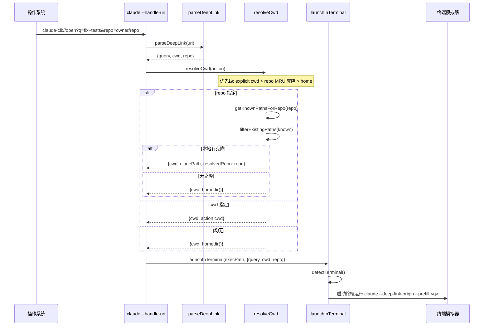
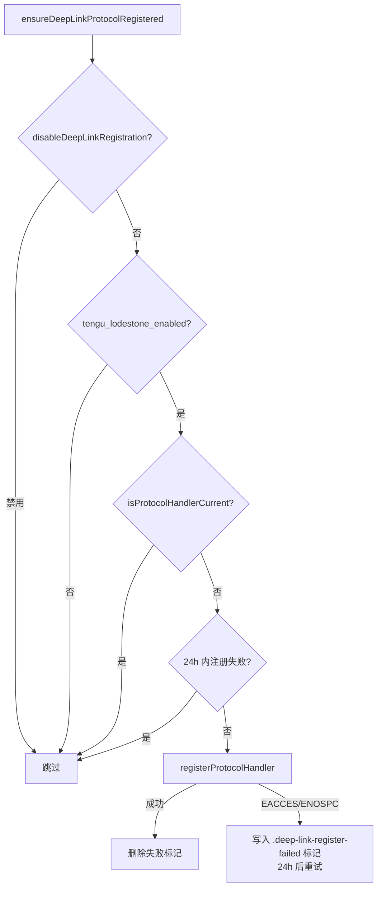
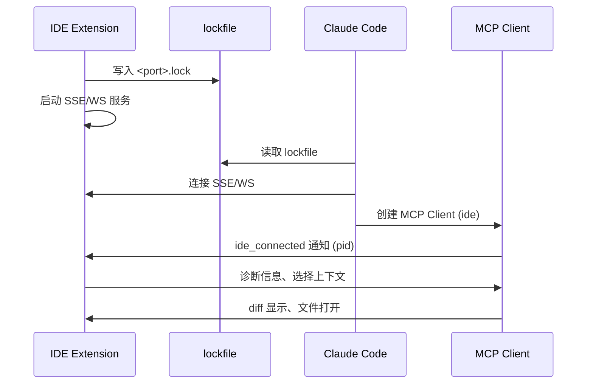

# 深度链接与 IDE 集成

> 前置知识：[第八章（入口流程）](/ch08-interfaces/entry-flow) — 深度链接在 CLI 启动早期通过 `--handle-uri` 参数处理。

**源码位置**：`src/utils/deepLink/`（~600 行）、`src/utils/ide.ts`（~1495 行）、`src/utils/idePathConversion.ts`、`src/commands/ide/`

深度链接允许外部工具（浏览器、IDE）通过 `claude-cli://` URL 方案启动 Claude Code 并传递上下文。IDE 集成则提供了双向通信协议，让 VS Code 和 JetBrains 系列编辑器与 Claude Code 协作。

## `claude-cli://` URL 方案

### URL 格式

```
claude-cli://open?q=<prompt>&cwd=<directory>&repo=<owner/name>
```

| 参数 | 必需 | 说明 | 约束 |
|------|------|------|------|
| `q` | 否 | 预填充到输入框的提示（不自动提交） | 最长 5000 字符，禁止 ASCII 控制字符 |
| `cwd` | 否 | 工作目录（绝对路径） | 最长 4096 字符，必须是绝对路径 |
| `repo` | 否 | GitHub owner/name slug | 匹配 `[\w.-]+\/[\w.-]+`，防止路径穿越 |

所有参数均为可选。解析逻辑位于 `src/utils/deepLink/parseDeepLink.ts`。

### 安全防护

```mermaid
flowchart TD
    A[原始 URI] --> B[URL 方案验证]
    B --> C[URL 解码]
    C --> D[partiallySanitizeUnicode]
    Note over D: 剥离隐藏 Unicode 字符\n防止 ASCII 走私/隐藏提示注入
    D --> E[containsControlChars 检查]
    Note over E: 禁止 0x00-0x1F, 0x7F\n防止命令分隔符注入
    E --> F{cwd 验证}
    F -->|非绝对路径| G[抛出异常]
    F -->|含控制字符| G
    F -->|超过 4096 字符| G
    F -->|通过| H{repo 验证}
    H -->|不匹配 owner/name| G
    H -->|通过| I{q 验证}
    I -->|含控制字符| G
    I -->|超过 5000 字符| G
    I -->|通过| J[返回 DeepLinkAction]
```

深度链接的安全边界不在解析层，而在使用层——`terminalLauncher.ts` 中的 shell 引用是注入边界。解析层拒绝截断（截断改变语义），只做拒绝。

## 深度链接处理流程

### 协议处理器入口

`src/utils/deepLink/protocolHandler.ts` 是 `--handle-uri` 参数的入口：



### macOS URL Scheme 启动

当 macOS 通过 URL handler .app bundle 启动 Claude Code 时，`handleUrlSchemeLaunch()` 检测 `__CFBundleIdentifier === MACOS_BUNDLE_ID`，然后通过 `url-handler-napi` 读取 Apple Event 中的 URL：

```typescript
// src/utils/deepLink/protocolHandler.ts
export async function handleUrlSchemeLaunch(): Promise<number | null> {
  if (process.env.__CFBundleIdentifier !== MACOS_BUNDLE_ID) return null
  const { waitForUrlEvent } = await import('url-handler-napi')
  const url = waitForUrlEvent(5000) // 5 秒超时
  if (!url) return null
  return await handleDeepLinkUri(url)
}
```

### CWD 解析策略

`resolveCwd()` 按以下优先级确定工作目录：

1. **显式 `cwd`**：直接使用
2. **`repo` slug 查找**：`getKnownPathsForRepo()` 在 `githubRepoPaths` 配置中查找本地克隆，取最近使用的路径
3. **Home 目录**：兜底，确保即使仓库未克隆也能打开 Claude

`readLastFetchTime()` 检查 FETCH_HEAD 的 mtime，比较 worktree 本地和 common dir 的新鲜度，用于 banner 显示仓库新鲜度。

## 协议注册

`registerProtocol.ts` 在三个平台注册 `claude-cli://` 协议处理器：

| 平台 | 机制 | 注册物 |
|------|------|--------|
| macOS | ~/Applications/ 下的 .app bundle + Info.plist CFBundleURLTypes | `Claude Code URL Handler.app`，CFBundleExecutable 为指向 claude 二进制的 symlink |
| Linux | $XDG_DATA_HOME/applications 下的 .desktop 文件 + xdg-mime | `claude-code-url-handler.desktop`，MimeType `x-scheme-handler/claude-cli` |
| Windows | HKEY_CURRENT_USER\Software\Classes 注册表项 | `claude-cli\shell\open\command` |

### 自动注册流程

`ensureDeepLinkProtocolRegistered()` 在每个会话的后台家务任务中运行：



`isProtocolHandlerCurrent()` 直接读取注册物（symlink 目标、.desktop Exec 行、注册表值）而非缓存的标志，确保：
- 每台机器独立检查（配置可跨机器同步，OS 状态不可）
- 安装路径变更自动修复
- 删除的注册物自动重建

## 终端启动器

`terminalLauncher.ts` 检测用户偏好的终端模拟器并在其中启动 Claude Code。

### 终端检测优先级

| 平台 | 检测方法 | 优先级 |
|------|----------|--------|
| macOS | 1. 存储的偏好 `deepLinkTerminal`<br>2. `TERM_PROGRAM` 环境变量<br>3. Spotlight `mdfind` 查找 .app<br>4. `/Applications/` 直接检查 | iTerm2 > Ghostty > Kitty > Alacritty > WezTerm > Terminal.app |
| Linux | 1. `$TERMINAL` 环境变量<br>2. `x-terminal-emulator`<br>3. 优先级列表 walk | ghostty > kitty > alacritty > wezterm > gnome-terminal > konsole > ... |
| Windows | `which` 查找 | Windows Terminal > PowerShell 7 > PowerShell 5.1 > cmd.exe |

`updateDeepLinkTerminalPreference()` 在交互式启动时捕获 `TERM_PROGRAM` 并存储到全局配置，因为深度链接处理程序在 headless 上下文中运行（`TERM_PROGRAM` 未设置）。

### Shell 注入安全

终端启动分为两种安全模型：

| 路径 | 终端 | 安全模型 |
|------|------|----------|
| 纯 argv | Ghostty, Alacritty, Kitty, WezTerm (macOS); 全部 Linux 终端; Windows Terminal | 参数作为独立 argv 元素传递，无 shell 解释 |
| Shell 字符串 | iTerm2, Terminal.app (AppleScript); PowerShell, cmd.exe | 用户输入通过 shellQuote()/psQuote()/cmdQuote() 转义 |

`cmdQuote()` 的安全策略：剥离 `"`（无法安全表示）、`%` -> `%%`（防环境变量展开）、尾随 `\` 加倍（防 CommandLineToArgvW 吞引号）。

## 深度链接 Banner

`banner.ts` 在深度链接来源的会话中显示安全警告：

```
This session was opened by an external deep link in ~/projects/my-repo
Resolved owner/repo from local clones · last fetched 3 hours ago
The prompt below was supplied by the link — review carefully before pressing Enter.
```

- 超过 1000 字符的预填充提示切换为 "scroll to review the entire prompt" 警告
- `repo` 模式显示最后 fetch 时间，7 天以上标注 "CLAUDE.md may be stale"

## IDE 集成架构

### 支持的 IDE

`src/utils/ide.ts` 定义了两类 IDE 支持：

| IDE 类别 | 具体产品 | 集成方式 |
|----------|----------|----------|
| VS Code 系 | VS Code, Cursor, Windsurf | VS Code Extension（`anthropic.claude-code`） |
| JetBrains 系 | IntelliJ, PyCharm, WebStorm, PhpStorm, RubyMine, CLion, GoLand, Rider, DataGrip, Android Studio, etc. | JetBrains Plugin |

### IDE 检测流程

```mermaid
flowchart TD
    A[findAvailableIDE] --> B[cleanupStaleIdeLockfiles]
    B --> C[读取 ~/.claude/ide/*.lock 文件]
    C --> D[解析 lockfile JSON]
    Note over D: workspaceFolders, pid, port, ideName, transport, authToken
    D --> E{cwd 在 workspaceFolders 内?}
    E -->|否| F[跳过]
    E -->|是| G{PID 祖先检查}
    Note over G: 仅在受支持终端中运行时\n检查 lockfile PID 是否为进程祖先
    G -->|非祖先| F
    G -->|是祖先| H[构建 IDE 连接信息]
    H --> I{transport 类型?}
    I -->|ws| J[ws://127.0.0.1:port]
    I -->|sse| K[http://127.0.0.1:port/sse]
```

### Lockfile 协议

IDE 扩展启动时在 `~/.claude/ide/<port>.lock` 写入 JSON：

```json
{
  "workspaceFolders": ["/path/to/project"],
  "pid": 12345,
  "ideName": "VS Code",
  "transport": "ws",
  "runningInWindows": false,
  "authToken": "optional-token"
}
```

`cleanupStaleIdeLockfiles()` 清理进程已退出或端口无响应的 lockfile。WSL 环境下额外检查 Windows 侧的 lockfile。

### IDE 通信协议

IDE 与 Claude Code 通过 MCP SSE/WebSocket 连接通信：



### IDE 上下文传递

IDE 扩展向 Claude Code 提供的上下文：

| 上下文类型 | 方向 | 说明 |
|------------|------|------|
| 诊断信息 | IDE -> Claude | `callIdeRpc('getDiagnostics')` 获取当前文件错误/警告 |
| 选区 | IDE -> Claude | 编辑器当前选中内容 |
| Diff 显示 | Claude -> IDE | `callIdeRpc('showDiff')` 在 IDE 内显示编辑差异 |
| 文件打开 | Claude -> IDE | `callIdeRpc('openFile')` 在 IDE 中打开文件 |
| Diff 关闭 | Claude -> IDE | `closeOpenDiffs()` 关闭所有 diff tab |

### WSL 路径转换

`idePathConversion.ts` 处理 Windows IDE + WSL Claude 场景的路径映射：

- `WindowsToWSLConverter.toLocalPath()`：`C:\Users\...` -> `/mnt/c/Users/...`，优先使用 `wslpath -u`
- `WindowsToWSLConverter.toIDEPath()`：`/mnt/c/Users/...` -> `C:\Users\...`，使用 `wslpath -w`
- `checkWSLDistroMatch()`：验证 UNC 路径 `\\wsl$\distro\...` 中的发行版名称匹配

### IDE 自动安装

`initializeIdeIntegration()` 在启动时执行：

1. `findAvailableIDE()` 异步查找可用 IDE（30 秒超时，1 秒轮询）
2. VS Code 系 IDE 自动安装/更新扩展（`code --install-extension anthropic.claude-code`）
3. JetBrains 系 IDE 检查插件安装状态
4. 首次安装后显示 `IdeOnboardingDialog`

## 关键源文件

| 文件 | 行数 | 职责 |
|------|------|------|
| `src/utils/deepLink/parseDeepLink.ts` | ~171 | URL 解析、参数验证、安全防护 |
| `src/utils/deepLink/protocolHandler.ts` | ~137 | 深度链接处理入口、CWD 解析 |
| `src/utils/deepLink/registerProtocol.ts` | ~349 | 三平台协议注册、自动注册、状态检查 |
| `src/utils/deepLink/terminalLauncher.ts` | ~558 | 终端检测、启动逻辑、shell 注入防护 |
| `src/utils/deepLink/banner.ts` | ~124 | 安全警告 banner 构建 |
| `src/utils/deepLink/terminalPreference.ts` | ~55 | 终端偏好捕获存储 |
| `src/utils/ide.ts` | ~1495 | IDE 检测、lockfile 读取、扩展安装、通信协议 |
| `src/utils/idePathConversion.ts` | ~91 | WSL/Windows 路径转换 |
| `src/commands/ide/ide.tsx` | - | /ide 命令实现 |
| `src/commands/ide/index.ts` | ~11 | /ide 命令注册 |

<div class="chapter-nav-hint">
附录 -- 上一篇：<a href="./worktree.md">Worktree 隔离模式</a> | 下一篇：<a href="./simple-mode.md">简单/裸机模式</a>
</div>
