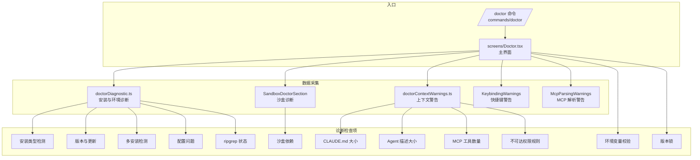
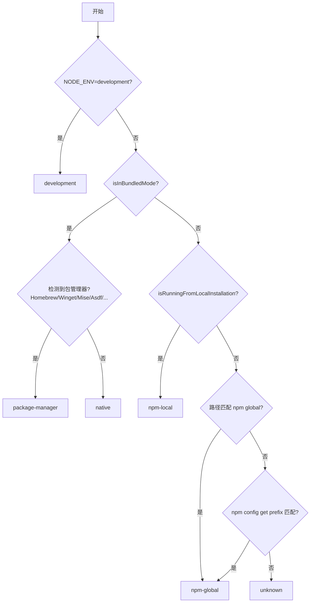

# Doctor 诊断

> 前置知识：[第八章 8.5](/ch08-interfaces/entry-flow) — 诊断与排障

## 源码定位

Doctor 是 Claude Code 的综合诊断工具，通过 `/doctor` 命令或 `claude doctor` 触发。核心代码分为三层：数据采集层（`doctorDiagnostic.ts` + `doctorContextWarnings.ts`）、UI 渲染层（`screens/Doctor.tsx`）、子组件层（`components/sandbox/`、`components/ValidationErrorsList` 等）。

## 架构总览



## 诊断信息结构

`getDoctorDiagnostic()` 返回 `DiagnosticInfo` 类型，涵盖安装、版本、更新、警告等维度：

```typescript
// doctorDiagnostic.ts
export type DiagnosticInfo = {
  installationType: InstallationType
  version: string
  installationPath: string
  invokedBinary: string
  configInstallMethod: InstallMethod | 'not set'
  autoUpdates: string
  hasUpdatePermissions: boolean | null
  multipleInstallations: Array<{ type: string; path: string }>
  warnings: Array<{ issue: string; fix: string }>
  recommendation?: string
  packageManager?: string
  ripgrepStatus: {
    working: boolean
    mode: 'system' | 'builtin' | 'embedded'
    systemPath: string | null
  }
}
```

## 诊断检查详解

### 1. 安装类型检测

`getCurrentInstallationType()` 按以下优先级判断：



安装类型含义：

| 类型 | 说明 | 典型路径 |
|------|------|---------|
| `development` | 开发模式 (`NODE_ENV=development`) | 项目目录 |
| `native` | 原生安装（编译二进制） | `~/.local/bin/claude` |
| `package-manager` | 包管理器安装 | Homebrew/Winget/Mise |
| `npm-local` | npm 本地安装 | `~/.claude/local/` |
| `npm-global` | npm 全局安装 | `/usr/local/lib/node_modules` |
| `unknown` | 无法确定 | -- |

### 2. 多安装检测

`detectMultipleInstallations()` 检查系统中是否存在多个 Claude Code 安装：

- 本地安装 (`~/.claude/local`)
- npm 全局安装 (`npm -g config get prefix`)
- npm 全局孤儿包（有包无 bin 链接）
- 原生安装 (`~/.local/bin/claude`)
- 原生数据目录 (`~/.local/share/claude`)

当检测到 Homebrew cask 安装时，会解析 symlink 确认是否指向 `/Caskroom/` 目录，避免误报。

### 3. 配置问题检测

`detectConfigurationIssues()` 执行以下检查：

| 检查项 | 触发条件 | 修复建议 |
|--------|---------|---------|
| `strictPluginOnlyCustomization` 格式错误 | 非 boolean/数组 | 设置为 true 或数组 |
| `strictPluginOnlyCustomization` 未知 surface | 包含不识别的表面名 | 移除或确认版本 |
| `~/.local/bin` 不在 PATH | native 安装但 PATH 缺失 | 添加到 shell 配置 |
| 配置安装方式不匹配 | 实际类型与 config 记录不符 | 运行 `claude install` |
| 本地安装不可访问 | 未在 PATH 且无有效 alias | 创建 alias |
| 自动更新权限不足 | npm global 安装需要 sudo | 使用 native 安装 |
| 残留 npm 安装 | native 安装后仍有 npm 包 | 卸载旧包 |
| Linux glob 警告 | 沙盒权限规则含 glob | 使用精确路径 |

### 4. ripgrep 状态

`getRipgrepStatus()` 返回搜索引擎的工作状态：

| 模式 | 说明 |
|------|------|
| `embedded` | 内嵌模式（argv0='rg' 分发） |
| `builtin` | 内置 vendor 二进制 |
| `system` | 系统 PATH 中的 rg |

### 5. 环境变量校验

Doctor 界面硬编码检查以下环境变量的有效性：

| 变量 | 默认值 | 上限 |
|------|--------|------|
| `BASH_MAX_OUTPUT_LENGTH` | `BASH_MAX_OUTPUT_DEFAULT` | `BASH_MAX_OUTPUT_UPPER_LIMIT` |
| `TASK_MAX_OUTPUT_LENGTH` | `TASK_MAX_OUTPUT_DEFAULT` | `TASK_MAX_OUTPUT_UPPER_LIMIT` |
| `CLAUDE_CODE_MAX_OUTPUT_TOKENS` | 模型最大值 | 模型硬上限 |

`validateBoundedIntEnvVar()` 执行边界检查，超出范围的环境变量会在 Doctor 中显示错误。

## 上下文警告

`checkContextWarnings()` 并行执行四类上下文健康检查：

```typescript
// doctorContextWarnings.ts
export type ContextWarning = {
  type: 'claudemd_files' | 'agent_descriptions' | 'mcp_tools' | 'unreachable_rules'
  severity: 'warning' | 'error'
  message: string
  details: string[]
  currentValue: number
  threshold: number
}
```

### CLAUDE.md 文件大小检查

`checkClaudeMdFiles()` 检测超过 `MAX_MEMORY_CHARACTER_COUNT` 的 CLAUDE.md 文件。大文件会消耗大量上下文窗口，降低可用 token 数。

### Agent 描述大小检查

`checkAgentDescriptions()` 计算自定义 Agent 描述的总 token 数。阈值为 `AGENT_DESCRIPTIONS_THRESHOLD`（约 15k tokens）。超出时按 token 数降序列出最大的 5 个 Agent。

### MCP 工具数量检查

`checkMcpTools()` 评估 MCP 服务器注册的工具总 token 开销。阈值为 `MCP_TOOLS_THRESHOLD`（25,000，约 15k tokens）。按服务器分组显示 token 消耗排名前 5 的服务器。

### 不可达权限规则检查

`checkUnreachableRules()` 调用 `detectUnreachableRules()` 检测被其他规则遮蔽的权限规则。例如，当 `autoAllowBashIfSandboxed` 启用时，Bash 的具体 allow 规则会被自动允许遮蔽，这些规则实际上不会生效。

## 沙盒诊断段

`SandboxDoctorSection.tsx` 是 Doctor 界面中的沙盒专用检查段，仅在以下条件下显示：

1. 当前平台支持沙盒（macOS/Linux/WSL2）
2. 用户已在设置中启用沙盒（`sandbox.enabled: true`）

```mermaid
flowchart TD
    A[SandboxDoctorSection] --> B{isSupportedPlatform?}
    B -->|否| HIDE[return null]
    B -->|是| C{isSandboxEnabledInSettings?}
    C -->|否| HIDE
    C -->|是| D[checkDependencies]
    D --> E{有错误?}
    E -->|是| F[Status: Missing dependencies\n显示错误列表]
    E -->|否| G{有警告?}
    G -->|是| H[Status: Available (with warnings)\n显示警告列表]
    G -->|否| HIDE
```

`checkDependencies()` 由 `@anthropic-ai/sandbox-runtime` 的 `BaseSandboxManager` 提供，检查 bubblewrap、socat 等平台依赖是否可用。

## 诊断输出格式

Doctor 界面以树状结构展示诊断信息：

```
Diagnostics
└ Currently running: native (1.0.x)
└ Path: /Users/user/.local/bin/claude
└ Invoked: /Users/user/.local/bin/claude
└ Config install method: native
└ Search: OK (bundled)

Updates
└ Auto-updates: enabled
└ Auto-update channel: latest
└ Latest version: 1.0.x
└ Stable version: 1.0.x

Sandbox
└ Status: Missing dependencies
└ bubblewrap not found
└ Run /sandbox for install instructions

Invalid Settings
└ (validation errors if any)

Context Warnings
└ 2 large CLAUDE.md files detected (each > 40,000 chars)
  └ /path/to/CLAUDE.md: 52,300 chars
  └ /other/CLAUDE.md: 45,100 chars

Environment Variables
└ BASH_MAX_OUTPUT_LENGTH: 999999 exceeds limit 100000

Version Locks
└ No active version locks
```

## 退出码与严重级别

Doctor 诊断结果通过不同的视觉颜色传达严重级别：

| 严重级别 | 颜色 | 含义 |
|---------|------|------|
| OK | 默认 | 一切正常 |
| warning | 黄色 | 可操作但不阻碍使用 |
| error | 红色 | 需要修复，可能影响核心功能 |

`ContextWarning.severity` 字段区分 `warning` 和 `error`，但当前所有检查都使用 `warning` 级别。`SandboxDoctorSection` 中依赖检查错误使用 `error` 级别，警告使用 `warning` 级别。

## 如何扩展诊断检查

添加新的诊断检查需要修改以下文件：

1. **数据采集**：在 `doctorDiagnostic.ts` 中扩展 `DiagnosticInfo` 类型和 `getDoctorDiagnostic()` 函数
2. **上下文警告**：在 `doctorContextWarnings.ts` 中添加新的 `check*()` 函数并集成到 `checkContextWarnings()`
3. **UI 渲染**：在 `screens/Doctor.tsx` 中添加新的 React 组件段

扩展步骤示例：


对于独立的诊断段（如沙盒诊断），更好的模式是创建独立的 React 组件，然后在 Doctor 主界面中引入，类似于 `SandboxDoctorSection` 的做法。这种模式允许条件渲染——只在相关功能启用时显示。

## 与 `/doctor` 命令的集成

`/doctor` 命令通过 `commands/doctor/` 目录注册：

```typescript
// commands/doctor/doctor.tsx
export const call: LocalJSXCommandCall = (onDone, _context, _args) => {
  return Promise.resolve(<Doctor onDone={onDone} />)
}
```

命令入口非常简单——渲染 `<Doctor>` React 组件。所有逻辑都在组件内部通过 `useEffect` 异步加载，界面先显示 "Checking installation status..." 占位，数据加载完成后替换为完整诊断信息。

## 关键源文件

| 文件 | 职责 |
|------|------|
| `src/utils/doctorDiagnostic.ts` | 核心诊断数据采集（安装、版本、更新、配置） |
| `src/utils/doctorContextWarnings.ts` | 上下文健康检查（CLAUDE.md、Agent、MCP、权限规则） |
| `src/screens/Doctor.tsx` | Doctor 主界面 React 组件 |
| `src/components/sandbox/SandboxDoctorSection.tsx` | 沙盒诊断子组件 |
| `src/components/KeybindingWarnings.tsx` | 快捷键冲突警告 |
| `src/components/mcp/McpParsingWarnings.tsx` | MCP 解析警告 |
| `src/components/ValidationErrorsList.tsx` | 设置验证错误列表 |
| `src/commands/doctor/doctor.tsx` | `/doctor` 命令入口 |
| `src/commands/doctor/index.ts` | 命令注册 |

<div class="chapter-nav-hint">
Doctor 诊断中的沙盒检查与沙盒深度相关 -- 参见 <a href="/appendix-hidden/sandbox-deep">沙盒深度</a>。权限规则不可达检查的原理 -- 参见 <a href="/ch03-constraints/permission-engine">第三章 3.2 权限系统</a>。
</div>
