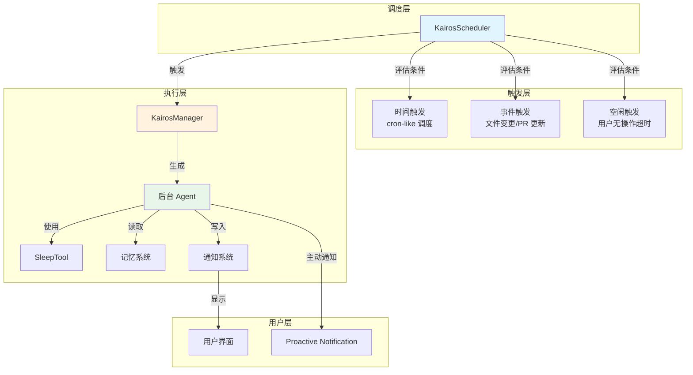
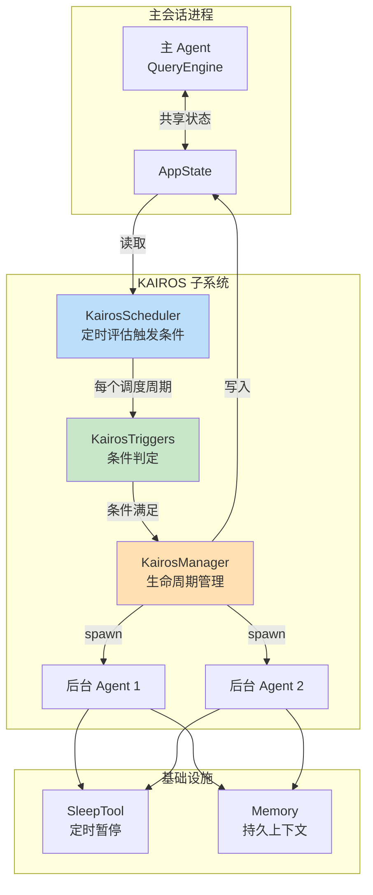
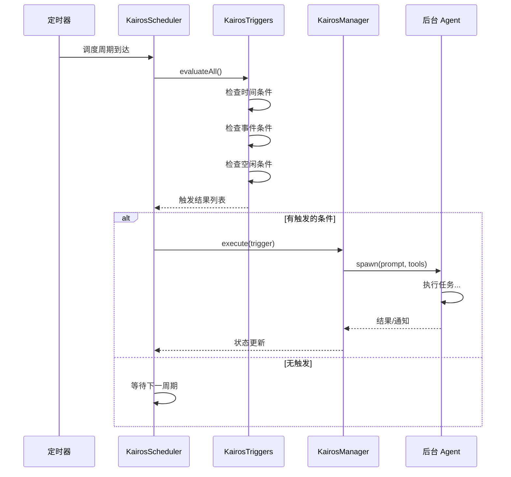
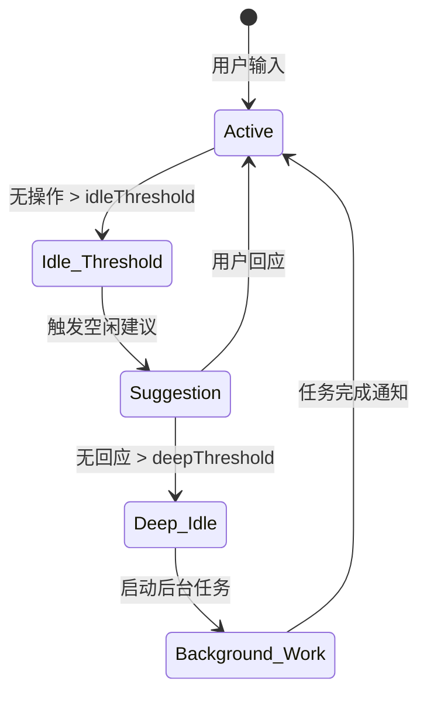
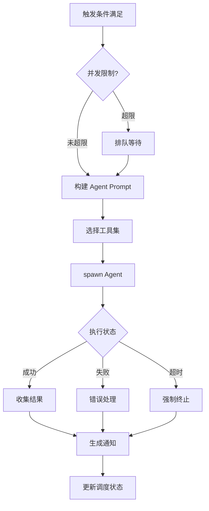
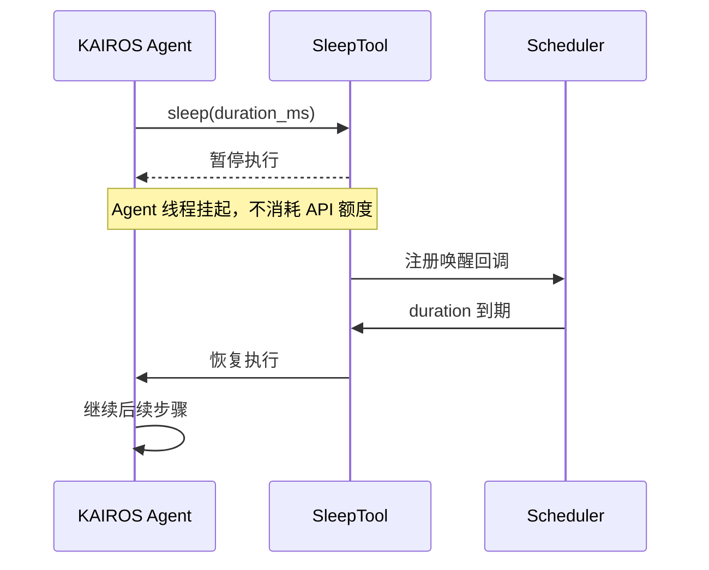
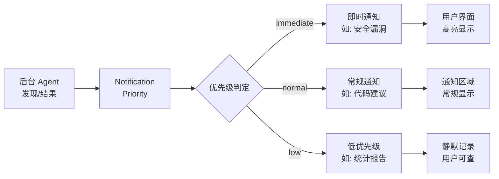
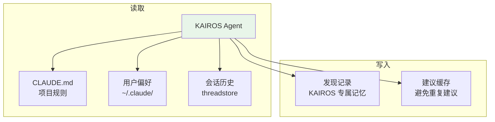

# KAIROS 持久助手

> 前置知识：[第四章 记忆](/ch04-instructions/memory-read) | [第六章 查询循环](/ch06-heartbeat/query-loop) -- KAIROS 依赖记忆系统存储持久上下文，并在查询循环之外作为独立后台 Agent 运行。

**源码位置：** KAIROS 系统分布在多个模块中，由 `feature('KAIROS')` 门控。核心逻辑涉及调度器、触发器和后台 Agent 生命周期管理。

## 1. 系统概述

KAIROS（Knowledgeable Autonomous Intelligent Routine Orchestration System）是 Claude Code 的持久主动助手系统。与被动响应用户输入的主 Agent 不同，KAIROS 在后台持续运行，根据时间、事件或空闲状态主动发起行动。



## 2. 架构设计

KAIROS 的核心架构遵循「触发器-调度器-执行器」三层模型：



### 2.1 与主 Agent 的区别

| 维度 | 主 Agent | KAIROS Agent |
|------|---------|-------------|
| 触发方式 | 用户输入 | 自动触发 |
| 运行上下文 | 前台 REPL | 后台进程 |
| 生命周期 | 会话级 | 持久/定时 |
| 权限模型 | 用户实时审批 | 预授权工具集 |
| 输出方式 | 终端直接显示 | 主动通知 |
| 记忆访问 | 完整 | 子集（只读为主） |

## 3. 调度系统

### 3.1 KairosScheduler

调度器以固定间隔运行，评估所有注册的触发条件：



### 3.2 调度策略

调度器采用渐进退避策略，避免在用户活跃时频繁触发后台任务：

| 状态 | 调度间隔 | 说明 |
|------|---------|------|
| 用户活跃 | 60s | 降低频率避免资源竞争 |
| 用户空闲 | 15s | 更频繁检查以提供主动建议 |
| 任务运行中 | 30s | 中等频率监控进度 |
| 错误恢复 | 指数退避 | 避免错误风暴 |

## 4. 触发器类型

### 4.1 时间触发

类 cron 的时间调度，支持以下模式：

```mermaid
gantt
    title 时间触发示例
    dateFormat HH:mm
    axisFormat %H:%M

    section 定期检查
    代码质量扫描     :0900, 30m
    依赖安全审计     :1000, 45m
    测试覆盖率报告   :1400, 20m

    section 周期任务
    Git 状态摘要     :crit, 0800, 10m
    Git 状态摘要     :crit, 1200, 10m
    Git 状态摘要     :crit, 1800, 10m
```



时间触发配置存储在用户配置中，与主 Agent 的工具权限独立管理。

### 4.2 事件触发

响应代码库变更和外部事件：

| 事件类型 | 触发条件 | 典型动作 |
|---------|---------|---------|
| 文件变更 | `fs.watch` 检测到文件修改 | 运行相关测试 |
| PR 更新 | GitHub webhook / `gh` 轮询 | 代码审查摘要 |
| 构建失败 | CI 状态变化 | 错误分析建议 |
| 依赖更新 | `package.json` 变更 | 兼容性检查 |

### 4.3 空闲触发

当用户一段时间未输入时触发：



空闲触发的设计意图：
- 短暂空闲（5-10 分钟）：提供上下文建议（"你可能想看看这个测试"）
- 深度空闲（30+ 分钟）：执行低优先级后台任务（索引、预计算）

## 5. 后台 Agent 生命周期

### 5.1 Agent 生成与管理

KairosManager 负责后台 Agent 的完整生命周期：



### 5.2 工具集限制

KAIROS Agent 只能使用预授权的安全工具集，避免在无人值守时执行危险操作：

| 工具类别 | 允许 | 说明 |
|---------|------|------|
| Read/Grep/Glob | 是 | 只读操作始终安全 |
| WebFetch/WebSearch | 是 | 信息获取 |
| Bash (只读命令) | 条件 | 仅 `git status`、`ls` 等无副作用的命令 |
| Edit/Write | 否 | 无人值守时禁止文件修改 |
| Bash (有副作用) | 否 | 禁止 `rm`、`npm publish` 等 |

### 5.3 SleepTool 集成

SleepTool 是 KAIROS 的核心基础设施之一，允许后台 Agent 在执行过程中暂停：



SleepTool 的设计要点：
- 暂停期间不消耗 API token
- 支持可中断的 sleep（用户操作可提前唤醒）
- 定时检查点允许 Agent 在长任务中定期汇报进度

## 6. 主动通知系统

KAIROS 通过主动通知将后台发现呈现给用户：



通知类型：
- **即时**：安全风险、构建失败 -- 必须立即引起注意
- **常规**：代码改进建议、测试覆盖 -- 下次交互时展示
- **低优先级**：统计摘要、长期趋势 -- 可忽略

## 7. 与记忆系统的集成

KAIROS 依赖记忆系统存储跨会话的持久上下文：



关键约束：
- KAIROS 的记忆写入与主 Agent 隔离，避免污染主对话上下文
- 建议缓存防止同一问题重复通知用户
- 记忆项带有 TTL，过期的发现自动清理

## 8. 功能门控与配置

```typescript
// KAIROS 功能门控
feature('KAIROS')  // 编译期门控

// 运行时配置
kairosEnabled: boolean          // 总开关
kairosIdleThresholdMs: number   // 空闲触发阈值
kairosMaxConcurrentAgents: number  // 最大并发 Agent 数
kairosAllowedTriggers: string[]    // 允许的触发器类型
```

## 9. 关键源文件

| 文件 | 职责 |
|------|------|
| `src/utils/kairos/kairosManager.ts` | 核心 Manager：Agent 生命周期、并发控制、结果收集 |
| `src/utils/kairos/kairosScheduler.ts` | 调度器：定时评估、渐进退避、优先级排序 |
| `src/utils/kairos/kairosTriggers.ts` | 触发器：时间/事件/空闲条件判定 |
| `src/tools/SleepTool/` | SleepTool 实现：可中断暂停、唤醒回调 |
| `src/utils/notifications.ts` | 通知基础设施：优先级、展示、清理 |
| `src/utils/memory/` | 记忆系统：CLAUDE.md 读写、偏好存储 |

<div class="chapter-nav-hint">

**下一节：[Bridge 远程控制 ->](/appendix-hidden/bridge)**

</div>
