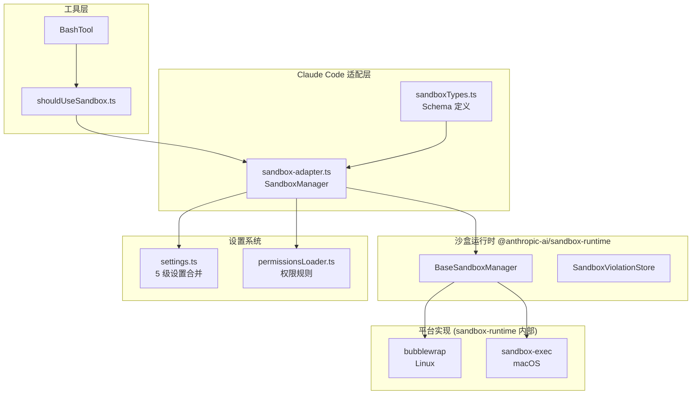
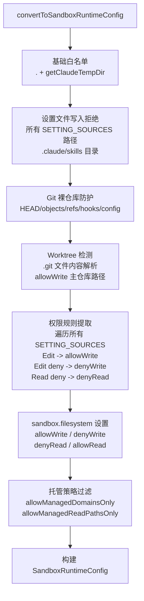
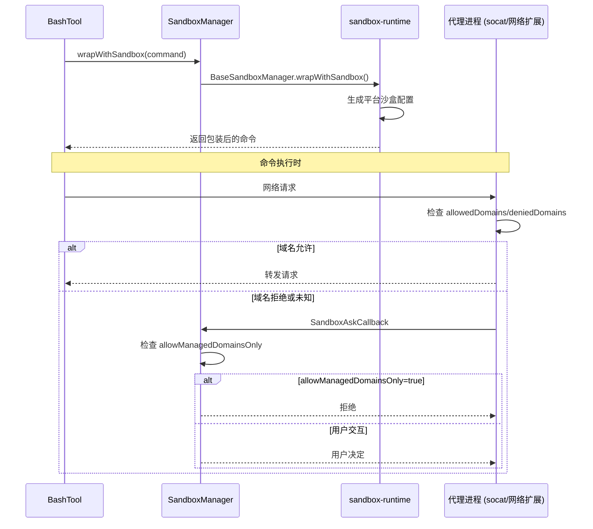
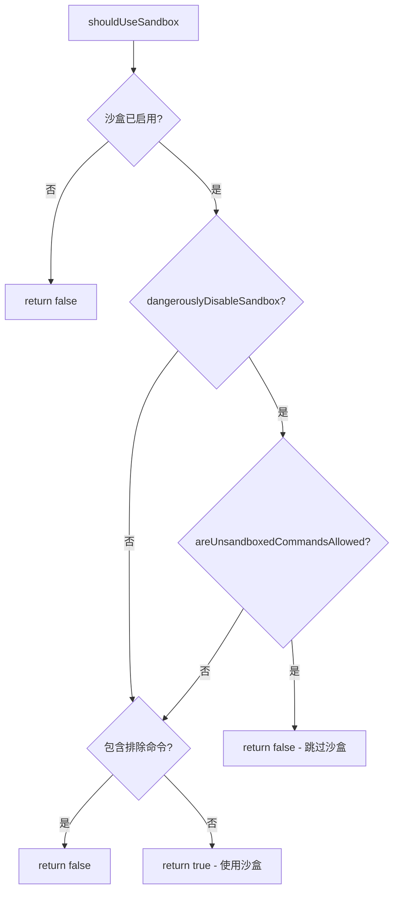
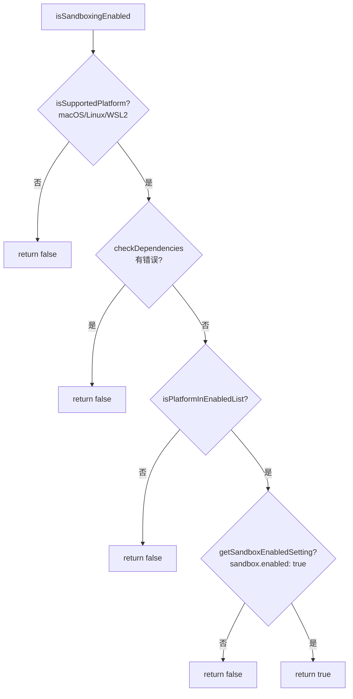

# 沙盒深度

> 前置知识：[第三章 3.3](/ch03-constraints/sandbox) — 沙盒机制基础

## 源码定位

沙盒系统的核心代码分布在两个层面：适配层（`src/utils/sandbox/`）和类型定义（`src/entrypoints/sandboxTypes.ts`）。底层沙盒运行时由外部包 `@anthropic-ai/sandbox-runtime` 提供，Claude Code 通过适配器桥接到自身的设置与权限体系。

## 架构总览



`SandboxManager`（`sandbox-adapter.ts`）是 Claude Code 对沙盒的全部接口，它将 `BaseSandboxManager`（来自 `sandbox-runtime`）包装为带有 Claude 设置感知的适配器。所有工具层代码只与 `SandboxManager` 交互，不直接访问 `BaseSandboxManager`。

## 平台实现对比

Claude Code 的沙盒在两个平台上有本质不同的实现路径，均封装在 `@anthropic-ai/sandbox-runtime` 内部：

| 维度 | Linux (bubblewrap) | macOS (sandbox-exec) |
|------|-------------------|---------------------|
| 底层机制 | Linux 命名空间 + seccomp + 挂载 | Apple Seatbelt 沙盒描述文件 |
| 网络隔离 | socat 代理 + seccomp 过滤 | Apple Network Extension / DNS 拦截 |
| 文件系统 | bind-mount 只读/读写 | allow/deny 规则 |
| Glob 支持 | **不支持** (seccomp 无法按路径过滤) | **支持** (Seatbelt 原生 glob) |
| Unix Socket | 不支持路径过滤 | `allowUnixSockets` 按路径允许 |
| 依赖 | `bubblewrap`, `socat` | 系统内置 |
| 嵌套沙盒 | `enableWeakerNestedSandbox` 降级 | 原生支持 |

### Bubblewrap (Linux)

Linux 上使用 `bwrap`（bubblewrap）创建隔离的文件系统命名空间。核心思路是：

1. 创建新的 mount namespace，将根文件系统以只读方式绑定
2. 对 `allowWrite` 路径以读写方式覆盖绑定
3. 对 `denyWrite` 路径以只读方式绑定（阻止写入）
4. 通过 seccomp 过滤网络相关的系统调用
5. 使用 `socat` 作为网络代理，实现 DNS/域名过滤

由于 seccomp 无法按路径过滤，Linux 上**不支持 glob 模式**。`SandboxManager.getLinuxGlobPatternWarnings()` 会检测并警告不兼容的规则。

### sandbox-exec (macOS)

macOS 使用 Apple 的 `sandbox-exec` 工具和 Seatbelt 描述语言。描述文件格式如下：

```scheme
(version 1)
(deny default)
(allow file-read* (subpath "/"))
(allow file-write* (subpath "/Users/user/project"))
(deny file-write* (subpath "/Users/user/project/.claude/settings.json"))
(allow network* (remote ip "192.168.1.1:443"))
(deny network* (remote ip "10.0.0.0/8"))
```

Seatbelt 天然支持 glob 匹配和路径模式，这使 macOS 的沙盒规则比 Linux 更精确。

## 文件系统写白名单机制

文件系统写入白名单是沙盒最核心的安全机制。`convertToSandboxRuntimeConfig()` 函数负责从设置和权限规则中提取所有路径，生成最终的文件系统配置。



### 关键安全防护

#### 1. 设置文件写入阻断

```typescript
// sandbox-adapter.ts L232-237
const settingsPaths = SETTING_SOURCES.map(source =>
  getSettingsFilePathForSource(source),
).filter((p): p is string => p !== undefined)
denyWrite.push(...settingsPaths)
denyWrite.push(getManagedSettingsDropInDir())
```

所有 `settings.json`、`settings.local.json`、`managed-settings.json` 路径都被无条件加入 `denyWrite`，防止沙盒内的命令篡改配置实现逃逸。`.claude/skills` 同样被阻断，因为 skill 具有与 command/agent 同等的自动加载权限。

#### 2. Git 裸仓库攻击防护 (CVE-29316)

攻击者可以在沙盒内创建 `HEAD` + `objects/` + `refs/` 使 git 将 cwd 误判为 bare 仓库，配合 `core.fsmonitor` 钩子在沙盒外的 git 操作中执行任意代码。防护策略：

- 已存在的 `HEAD/objects/refs/hooks/config` → 加入 `denyWrite`（只读绑定）
- 不存在的 → 加入 `bareGitRepoScrubPaths`，命令结束后通过 `scrubBareGitRepoFiles()` 清除

#### 3. 路径解析约定

`resolvePathPatternForSandbox()` 处理 Claude Code 特有的路径前缀约定：

| 前缀 | 含义 | 转换示例 |
|------|------|---------|
| `//path` | 文件系统根绝对路径 | `//.aws/**` → `/.aws/**` |
| `/path` | 相对于设置文件目录 | `/foo/**` → `$SETTINGS_DIR/foo/**` |
| `~/path` | 用户主目录 | 透传给 runtime |
| `./path` | 当前目录 | 透传给 runtime |

`sandbox.filesystem.*` 设置使用**标准路径语义**（`/path` = 绝对路径），而非权限规则约定，这是 `resolveSandboxFilesystemPath()` 与 `resolvePathPatternForSandbox()` 的关键区别（修复 #30067）。

## 网络限制执行



### 网络配置 Schema

```typescript
// sandboxTypes.ts
SandboxNetworkConfigSchema = z.object({
  allowedDomains: z.array(z.string()).optional(),
  allowManagedDomainsOnly: z.boolean().optional(),
  allowUnixSockets: z.array(z.string()).optional(),    // macOS only
  allowAllUnixSockets: z.boolean().optional(),
  allowLocalBinding: z.boolean().optional(),
  httpProxyPort: z.number().optional(),
  socksProxyPort: z.number().optional(),
})
```

域名提取过程在 `convertToSandboxRuntimeConfig()` 中完成：

1. `sandbox.network.allowedDomains` → 直接加入 `allowedDomains`
2. `permissions.allow` 中的 `WebFetch(domain:xxx)` 规则 → 提取域名加入 `allowedDomains`
3. `permissions.deny` 中的 `WebFetch(domain:xxx)` 规则 → 提取域名加入 `deniedDomains`
4. 当 `allowManagedDomainsOnly` 启用时，仅使用 `policySettings` 中的域名

### DNS 限制

在网络沙盒中，DNS 解析本身也是受控的。沙盒运行时通过代理拦截所有 DNS 请求，只允许解析 `allowedDomains` 中的域名。这意味着即使命令尝试通过 IP 地址绕过域名限制，DNS 预解析阶段就会被拦截。

## 沙盒配置文件生成

`SandboxRuntimeConfig` 是从 Claude Code 设置到沙盒运行时的最终转换产物：

```typescript
// sandbox-adapter.ts L359-381
return {
  network: {
    allowedDomains,
    deniedDomains,
    allowUnixSockets,
    allowAllUnixSockets,
    allowLocalBinding,
    httpProxyPort,
    socksProxyPort,
  },
  filesystem: {
    denyRead,
    allowRead,
    allowWrite,
    denyWrite,
  },
  ignoreViolations,
  enableWeakerNestedSandbox,
  enableWeakerNetworkIsolation,
  ripgrep: ripgrepConfig,
}
```

### 动态配置刷新

沙盒配置不是静态的。`SandboxManager.initialize()` 订阅了 `settingsChangeDetector`，当设置文件变更时自动更新运行时配置：

```typescript
// sandbox-adapter.ts L776-780
settingsSubscriptionCleanup = settingsChangeDetector.subscribe(() => {
  const settings = getSettings_DEPRECATED()
  const newConfig = convertToSandboxRuntimeConfig(settings)
  BaseSandboxManager.updateConfig(newConfig)
})
```

`refreshConfig()` 方法提供同步刷新，用于权限更新后避免竞态条件。

## `--dangerously-skip-permissions` 与沙盒的交互

`shouldUseSandbox()` 是 BashTool 调用沙盒的入口：



关键设计决策：

- `allowUnsandboxedCommands` 默认为 `true`，允许 `dangerouslyDisableSandbox` 参数生效
- 管理员可通过策略设置 `allowUnsandboxedCommands: false`，完全禁止跳过沙盒
- `excludedCommands` 不是安全边界（代码注释明确说明），仅是便利功能；权限提示系统才是真正的安全控制

### 排除命令匹配

`containsExcludedCommand()` 实现了复合命令的安全拆分：`docker ps && curl evil.com` 会被拆分为两个子命令分别匹配，防止通过复合命令逃逸。匹配还处理环境变量前缀（`FOO=bar bazel ...`）和安全包装器（`timeout 30 bazel ...`），通过迭代固定点算法剥除所有前缀。

## 沙盒启用判定链



`enabledPlatforms` 是一个未公开的设置，用于 NVIDIA 等企业客户仅在 macOS 上启用沙盒（Linux/WSL 支持较新）。`getSandboxUnavailableReason()` 在用户明确启用沙盒但无法运行时返回人可读的原因，避免安全设置被静默忽略（修复 #34044）。

## 沙盒设置锁定

`areSandboxSettingsLockedByPolicy()` 检查 `flagSettings` 和 `policySettings` 是否设置了沙盒相关字段：

```typescript
// sandbox-adapter.ts L648-664
const overridingSources = ['flagSettings', 'policySettings'] as const
for (const source of overridingSources) {
  const settings = getSettingsForSource(source)
  if (
    settings?.sandbox?.enabled !== undefined ||
    settings?.sandbox?.autoAllowBashIfSandboxed !== undefined ||
    settings?.sandbox?.allowUnsandboxedCommands !== undefined
  ) {
    return true
  }
}
```

锁定时，UI 禁止用户修改沙盒开关，确保策略不被绕过。

## 关键源文件

| 文件 | 职责 |
|------|------|
| `src/utils/sandbox/sandbox-adapter.ts` | 沙盒适配器，桥接设置与运行时，约 985 行 |
| `src/entrypoints/sandboxTypes.ts` | 沙盒配置 Zod Schema 定义 |
| `src/utils/sandbox/sandbox-ui-utils.ts` | 沙盒违规标签清理工具 |
| `src/tools/BashTool/shouldUseSandbox.ts` | BashTool 沙盒使用判定 |
| `src/components/sandbox/SandboxDoctorSection.tsx` | Doctor 诊断中的沙盒检查段 |
| `src/components/sandbox/SandboxSettings.tsx` | 沙盒设置 UI |
| `src/components/sandbox/SandboxConfigTab.tsx` | 沙盒配置标签页 |
| `src/components/sandbox/SandboxDependenciesTab.tsx` | 依赖检查标签页 |
| `src/components/sandbox/SandboxOverridesTab.tsx` | 覆盖规则标签页 |
| `src/commands/sandbox-toggle/` | `/sandbox` 命令入口 |

<div class="chapter-nav-hint">
沙盒安全离不开权限体系的配合 -- 参见 <a href="/ch03-constraints/permission-engine">第三章 3.2 权限系统</a>。企业策略可以锁定沙盒设置 -- 参见 <a href="/appendix-topics/enterprise">企业策略与管控</a>。
</div>
