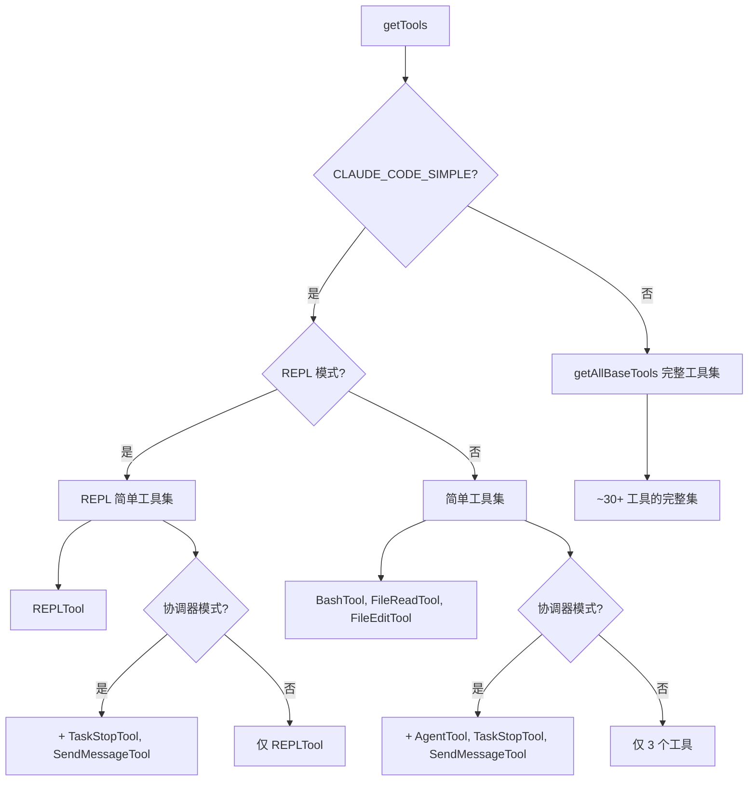
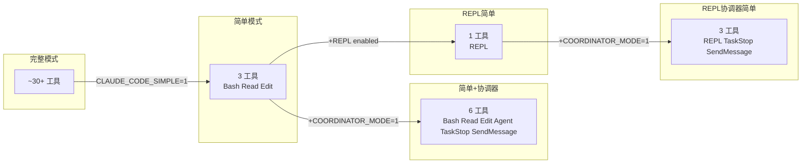

# 简单/裸机模式

> 前置知识：[第三章（权限）](/ch03-constraints/permission-primitives) — 简单模式通过精简工具集来简化权限模型。

**源码位置**：`src/tools.ts`（工具过滤）、`src/utils/envUtils.ts`（`isBareMode()`）、`src/coordinator/coordinatorMode.ts`（协调器简单模式）

简单模式（Simple / Bare Mode）将 Claude Code 剥离至最精简的工具集，仅保留 Bash、Read、Edit 三个核心工具。该模式通过 `CLAUDE_CODE_SIMPLE=1` 环境变量或 `--bare` 命令行参数激活，在 CI/CD 管道、受限环境和资源敏感场景中使用。

## 激活方式

```typescript
// src/utils/envUtils.ts
export function isBareMode(): boolean {
  return (
    isEnvTruthy(process.env.CLAUDE_CODE_SIMPLE) ||
    process.argv.includes('--bare')
  )
}
```

两种激活途径等效，但 `--bare` 在 `main.tsx` 的 action handler 中被转换为 `CLAUDE_CODE_SIMPLE=1`。`isBareMode()` 同时检查 argv 和环境变量，因为多个门控点在 `main.tsx` 设置环境变量之前就已执行（如 `startKeychainPrefetch()` 在顶层调用）。

该门控在代码库中有约 30 处引用，控制以下功能的跳过：

| 被跳过的功能 | 门控位置 | 原因 |
|-------------|----------|------|
| Hooks | `src/utils/hooks.ts` | 无交互环境，hooks 无法执行 |
| LSP | `src/tools/LSPTool` | 需要语言服务器进程 |
| Plugin 同步 | `src/main.tsx` | 无 keychain 访问 |
| Skill 目录遍历 | `src/utils/analyzeContext.ts` | 减少启动时间 |
| 归因 | `src/utils/postCommitAttribution.ts` | CI 环境不需要 |
| 后台预取 | `src/main.tsx` | keychain/凭证读取 |
| MCP 服务器发现 | `src/services/mcp/client.ts` | 精简环境无需 MCP |

## 工具集精简

### 核心工具过滤逻辑

`src/tools.ts` 中的 `getTools()` 函数是工具集的入口：



### 简单模式工具集

| 工具 | 类别 | 说明 |
|------|------|------|
| `BashTool` | 执行 | 运行任意 shell 命令 |
| `FileReadTool` | 读取 | 读取文件内容 |
| `FileEditTool` | 编辑 | 精确字符串替换编辑文件 |

这三种工具覆盖了代码操作的原子操作：读取、修改、执行。不包含搜索（Glob/Grep）、写入新文件（FileWrite）、Web 访问（WebFetch/WebSearch）、笔记本编辑（NotebookEdit）等扩展能力。

### 协调器简单模式

当 `CLAUDE_CODE_SIMPLE=1` 与 `CLAUDE_CODE_COORDINATOR_MODE=1` 同时激活时，工具集扩展为：

| 工具 | 附加说明 |
|------|----------|
| `AgentTool` | 协调器生成 worker 所需 |
| `TaskStopTool` | 停止运行中的 worker |
| `SendMessageTool` | 向已有 worker 发送后续指令 |

Worker 侧保持简单工具集（Bash/Read/Edit），但协调器需要编排能力。`getCoordinatorUserContext()` 中描述的 worker 工具集也相应精简：

```typescript
const workerTools = isEnvTruthy(process.env.CLAUDE_CODE_SIMPLE)
  ? [BASH_TOOL_NAME, FILE_READ_TOOL_NAME, FILE_EDIT_TOOL_NAME].sort().join(', ')
  : Array.from(ASYNC_AGENT_ALLOWED_TOOLS)
      .filter(name => !INTERNAL_WORKER_TOOLS.has(name))
      .sort().join(', ')
```

协调器的系统提示也适配简单模式：

| 模式 | Worker 能力描述 |
|------|----------------|
| 简单模式 | "Workers have access to Bash, Read, and Edit tools, plus MCP tools from configured MCP servers." |
| 完整模式 | "Workers have access to standard tools, MCP tools from configured MCP servers, and project skills via the Skill tool. Delegate skill invocations (e.g. /commit, /verify) to workers." |

## REPL 简单模式

当 REPL 模式与简单模式组合时，工具集进一步收敛为单个 `REPLTool`。REPL 在 VM 上下文中封装了 Bash/Read/Edit 等原语，因此暴露原始工具是冗余的。

```typescript
// src/tools.ts
if (isReplModeEnabled() && REPLTool) {
  const replSimple: Tool[] = [REPLTool]
  if (feature('COORDINATOR_MODE') && coordinatorModeModule?.isCoordinatorMode()) {
    replSimple.push(TaskStopTool, getSendMessageTool())
  }
  return filterToolsByDenyRules(replSimple, permissionContext)
}
```

`REPL_ONLY_TOOLS` 集合定义了在 REPL 启用时应从直接访问中隐藏的原语工具名称。

## 裸机模式特性

### 认证方式

裸机模式跳过所有 keychain/凭证读取，认证严格限定为：

| 认证方式 | 说明 |
|----------|------|
| `ANTHROPIC_API_KEY` 环境变量 | 标准 API 密钥认证 |
| `apiKeyHelper` from `--settings` | 外部配置提供的密钥获取器 |

不支持 OAuth、Bedrock、Vertex 等需要交互式认证或 keychain 访问的方式。

### 显式 CLI 标志豁免

即使 `--bare` 激活了简单模式，以下显式 CLI 标志仍被遵守：

| 标志 | 说明 |
|------|------|
| `--plugin-dir` | 手动指定插件目录 |
| `--add-dir` | 手动添加额外目录 |
| `--mcp-config` | 手动指定 MCP 配置 |

这意味着简单模式可以通过显式配置重新获得部分功能，但不会自动发现和加载。

## 模式对比

### 完整模式对比表

| 特性 | 完整模式 | 简单模式 | 简单+协调器 | 简单+REPL | 简单+协调器+REPL |
|------|----------|----------|-------------|-----------|------------------|
| Bash | Y | Y | Y | (VM内) | (VM内) |
| Read | Y | Y | Y | (VM内) | (VM内) |
| Edit | Y | Y | Y | (VM内) | (VM内) |
| Write | Y | - | - | - | - |
| Glob/Grep | Y | - | - | - | - |
| WebFetch/Search | Y | - | - | - | - |
| NotebookEdit | Y | - | - | - | - |
| TodoWrite | Y | - | - | - | - |
| Skill | Y | - | - | - | - |
| MCP 工具 | 自动发现 | 显式配置 | 显式配置 | 显式配置 | 显式配置 |
| Agent | Y | - | Y | - | Y |
| TaskStop | Y | - | Y | - | Y |
| SendMessage | Y | - | Y | - | Y |
| REPL | - | - | - | Y | Y |
| Hooks | Y | - | - | - | - |
| LSP | Y | - | - | - | - |
| Plugin Sync | Y | - | - | - | - |
| Keychain | Y | - | - | - | - |
| 认证方式 | 全部 | API Key only | API Key only | API Key only | API Key only |

### 工具集大小对比



## 使用场景

### CI/CD 管道

```bash
# GitHub Actions / GitLab CI
export ANTHROPIC_API_KEY=${{ secrets.ANTHROPIC_API_KEY }}
claude --bare --print "Review this PR diff and suggest improvements"
```

简单模式确保：
- 无交互提示（hooks、权限对话框）
- 无 keychain 访问（CI 无 GUI）
- 快速启动（跳过插件发现、LSP 初始化）
- 确定性工具集（不依赖 MCP 服务器状态）

### 容器环境

```dockerfile
ENV CLAUDE_CODE_SIMPLE=1
ENV ANTHROPIC_API_KEY=sk-ant-...
```

Docker 容器中无音频设备、无桌面环境、无 keychain，简单模式是唯一可行选项。

### 安全敏感环境

简单模式提供更小的攻击面：
- 无 MCP 服务器连接（除非显式配置 `--mcp-config`）
- 无 Web 访问工具
- 无文件搜索工具（减少数据泄露风险）
- 无 Skill 工具（减少动态代码执行）

### 协调器 Worker

`CLAUDE_CODE_SIMPLE=1` 常与 `CLAUDE_CODE_COORDINATOR_MODE=1` 组合使用，协调器进程仅做编排，worker 进程仅做执行，各自拥有最小必要工具集。

## 关键源文件

| 文件 | 行数 | 职责 |
|------|------|------|
| `src/tools.ts` | ~390 | `getTools()` 工具过滤、`getAllBaseTools()` 完整工具集、`assembleToolPool()` 合并 |
| `src/utils/envUtils.ts` | ~100 | `isBareMode()` 门控实现、`isEnvTruthy()` 辅助函数 |
| `src/coordinator/coordinatorMode.ts` | ~370 | `isCoordinatorMode()`、`getCoordinatorUserContext()`、`getCoordinatorSystemPrompt()` |
| `src/constants/tools.js` | - | `COORDINATOR_MODE_ALLOWED_TOOLS`、`ASYNC_AGENT_ALLOWED_TOOLS` |
| `src/tools/REPLTool/constants.ts` | - | `REPL_ONLY_TOOLS`、`isReplModeEnabled()` |
| `src/main.tsx` | - | `--bare` -> `CLAUDE_CODE_SIMPLE=1` 转换、门控检查 |
| `src/entrypoints/cli.tsx` | - | CLI 参数解析、简单模式传播 |

<div class="chapter-nav-hint">
附录 -- 上一篇：<a href="./deep-link.md">深度链接与 IDE 集成</a>
</div>
