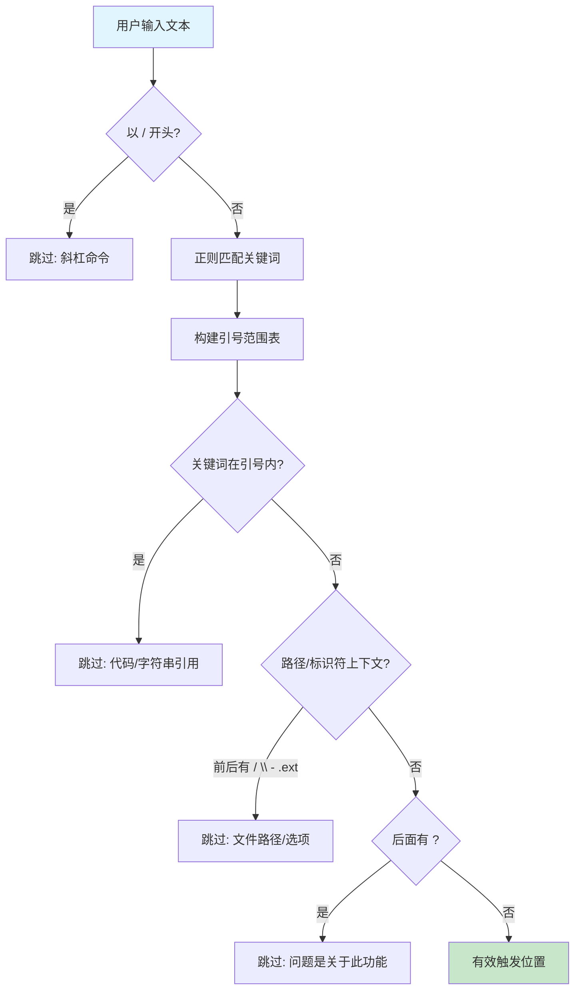
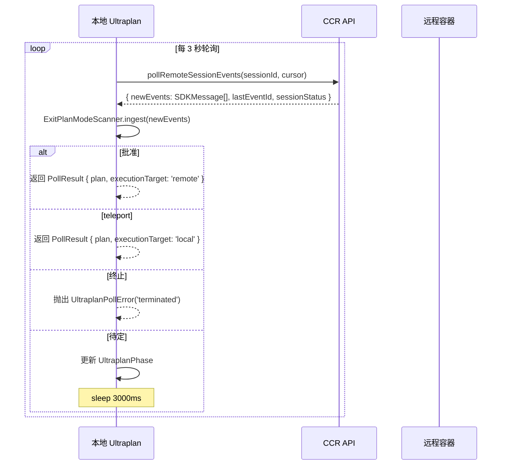
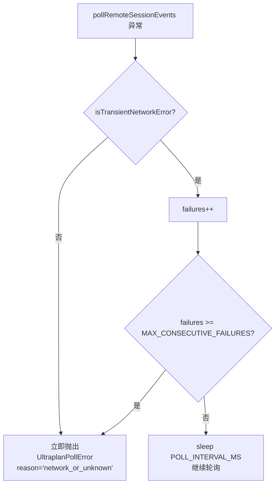
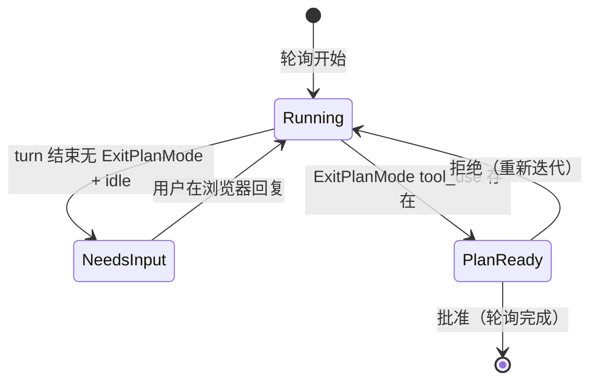

# Ultraplan 云端规划

> 前置知识：[第八章（远程/CCR）](/ch08-interfaces/remote-ccr) -- Ultraplan 利用 CCR 远程容器执行规划，需要理解远程会话的创建和事件流轮询机制。

**源码位置：** `src/utils/ultraplan/`（3 个文件）+ 相关 CCR/teleport 模块

## 1. 系统概述

Ultraplan 将复杂的规划任务卸载到云端远程容器中执行。本地 Claude Code 启动一个 CCR 远程会话，在云端以 Plan 模式运行，用户通过浏览器审批计划后，计划文本返回本地执行。整个流程涉及关键词触发、远程会话管理、事件流轮询和计划提取。

功能门控：`feature('ULTRAPLAN')`。

```mermaid
graph TB
    subgraph 本地
        USER[用户输入\n含 "ultraplan" 关键词] --> KW[keyword.ts\n关键词检测]
        KW --> TRIGGER[触发 Ultraplan]
        TRIGGER --> TELEPORT[teleportToRemote\n创建远程会话]
        TELEPORT --> POLL[ccrSession.ts\n轮询事件流]
        POLL --> SCAN[ExitPlanModeScanner\n扫描审批结果]
        SCAN --> RESULT{结果类型}
        RESULT -->|approved| EXEC_LOCAL[本地执行计划]
        RESULT -->|teleport| EXEC_LOCAL2[本地执行计划\n+ 归档远程]
        RESULT -->|rejected| ITERATE[浏览器中迭代]
    end

    subgraph 远程 CCR
        TELEPORT --> REMOTE[远程容器\nPlan 模式]
        REMOTE --> EPM[ExitPlanModeV2Tool\n生成计划]
        EPM --> BROWSER[浏览器审批界面\nPlanModal]
        BROWSER -->|批准| APPROVED["tool_result\nis_error=false"]
        BROWSER -->|拒绝 + teleport| TELEPORT_MARKER["tool_result\nis_error=true + sentinel"]
        BROWSER -->|拒绝| REJECTED["tool_result\nis_error=true"]
        APPROVED --> SCAN
        TELEPORT_MARKER --> SCAN
        REJECTED --> REMOTE
    end

    style KW fill:#e1f5fe
    style POLL fill:#fff3e0
    style SCAN fill:#e8f5e9
    style REMOTE fill:#fce4ec
```

## 2. 关键词触发系统

### 2.1 触发位置检测

`keyword.ts` 负责在用户输入中检测 "ultraplan" 和 "ultrareview" 关键词，同时排除误触发：



### 2.2 引号范围排除

关键词检测会跳过以下定界符内的内容：

| 定界符 | 示例 | 排除原因 |
|--------|------|---------|
| 反引号 `` ` `` | `` `ultraplan` `` | 代码引用 |
| 双引号 `"` | `"ultraplan"` | 字符串字面量 |
| 尖括号 `<>` | `<ultraplan>` | 标签（仅标签式） |
| 花括号 `{}` | `{ultraplan}` | 对象字面量 |
| 方括号 `[]` | `[Pasted text #N]` | 粘贴文本占位符 |
| 圆括号 `()` | `(ultraplan)` | 表达式 |
| 单引号 `'` | `'ultraplan'` | 字符串（非撇号） |

单引号特殊处理：开引号前必须是非词字符，闭引号后必须是非词字符，因此 `let's ultraplan it's` 仍然触发。

### 2.3 路径上下文排除

| 模式 | 示例 | 排除 |
|------|------|------|
| 前置 `/` | `src/ultraplan/foo.ts` | 路径 |
| 后置 `/` | `ultraplan/` | 路径 |
| 前置 `\` | `\ultraplan` | Windows 路径 |
| 后置 `\` | `ultraplan\` | Windows 路径 |
| 前置 `-` | `--ultraplan-mode` | 命令行选项 |
| 后置 `-` | `ultraplan-s` | 标识符 |
| 后置 `.ext` | `ultraplan.tsx` | 文件名 |
| 后置 `?` | `ultraplan?` | 提问 |

### 2.4 关键词替换

触发后，`replaceUltraplanKeyword` 将首个 "ultraplan" 替换为 "plan"，保持语法通顺：

```
"please ultraplan this" -> "please plan this"
"please Ultraplan this" -> "please Ultraplan this"  // 保留用户大小写
```

## 3. 远程会话与事件流轮询

### 3.1 轮询机制

`ccrSession.ts` 使用 `pollRemoteSessionEvents` 轮询远程 CCR 会话的事件流：



### 3.2 轮询常量

| 常量 | 值 | 说明 |
|------|-----|------|
| `POLL_INTERVAL_MS` | 3000 | 每 3 秒轮询一次 |
| `MAX_CONSECUTIVE_FAILURES` | 5 | 最大连续失败次数 |
| 超时 | 由调用方传入 | 通过 `timeoutMs` 参数控制 |

### 3.3 网络错误处理



5 次连续失败阈值确保 30 分钟轮询（约 600 次调用）不会被偶尔的 5xx 错误杀死。

## 4. ExitPlanModeScanner

`ExitPlanModeScanner` 是一个纯状态分类器，无 I/O、无定时器，可完全通过合成事件进行单元测试。

### 4.1 扫描逻辑

```mermaid
flowchart TB
    A[ingest: 接收新事件批次] --> B[遍历事件]
    B --> C{事件类型}
    C -->|assistant| D["记录 ExitPlanMode tool_use\npush exitPlanCalls"]
    C -->|user| E["记录 tool_result\nresults.set(id, block)"]
    C -->|result (非success)| F["记录 terminated\n(error_during_execution, error_max_turns 等)"]

    B --> G{shouldScan?}
    G -->|新事件或重新扫描| H[从最新 ExitPlanMode 向前扫描]
    G -->|无变化| I[返回 unchanged]

    H --> J{查找最新非拒绝的 ExitPlanMode}
    J -->|无 tool_result| K["kind: pending"]
    J -->|is_error=false| L["kind: approved\n提取计划文本"]
    J -->|"is_error=true + sentinel"| M["kind: teleport\n提取 teleport 计划"]
    J -->|"is_error=true, 无 sentinel"| N["kind: rejected\n记录到 rejectedIds"]

    L --> O[返回 approved -- 最高优先级]
    M --> O
    N --> P{terminated?}
    P -->|是| Q[返回 terminated]
    P -->|否| R[返回 rejected]
    K --> S{terminated?}
    S -->|是| Q
    S -->|否| T[返回 pending]

    style L fill:#c8e6c9
    style M fill:#fff9c4
    style N fill:#ffe0b2
```

### 4.2 优先级规则

```
approved / teleport > terminated > rejected > pending > unchanged
```

关键：一个批次可能同时包含 approved tool_result 和后续的 {type:'result'} 错误。approved 计划是真实的且已存储在 threadstore 中，不应丢弃。

### 4.3 Teleport Sentinel

当用户在浏览器中点击 "teleport back to terminal" 时，PlanModal 在拒绝反馈中嵌入哨兵字符串：

```typescript
export const ULTRAPLAN_TELEPORT_SENTINEL = '__ULTRAPLAN_TELEPORT_LOCAL__'
```

Sentinel 后跟计划文本。Scanner 检测到 sentinel 时返回 `{ kind: 'teleport', plan }`，区别于普通拒绝。

### 4.4 计划文本提取

| 结果类型 | 提取标记 | 说明 |
|---------|---------|------|
| approved | `## Approved Plan:\n` | ExitPlanModeV2Tool 默认分支 |
| approved (edited) | `## Approved Plan (edited by user):\n` | 用户在浏览器中编辑了计划 |
| teleport | `__ULTRAPLAN_TELEPORT_LOCAL__\n` | 用户选择回到终端执行 |

提取失败时抛出错误，`reason='extract_marker_missing'`。

## 5. UltraplanPhase 状态机

Phase 用于 UI 状态指示（如 pill/detail-view）：



| Phase | 触发条件 | UI 表现 |
|-------|---------|---------|
| `running` | 远程会话正在工作 | 活动指示器 |
| `needs_input` | 远程会话空闲 + 无待定计划 | 提示用户在浏览器回复 |
| `plan_ready` | ExitPlanMode tool_use 存在 + 无 tool_result | 等待审批指示器 |

### 5.1 静默空闲判定

CCR 在工具 turn 之间短暂翻转为 idle。为避免误判 `needs_input`：

```typescript
const quietIdle =
  (sessionStatus === 'idle' || sessionStatus === 'requires_action') &&
  newEvents.length === 0
```

只有当无新事件到达且状态为 idle/requires_action 时，才信任 idle 状态。事件流活跃意味着会话仍在工作，忽略状态快照。

## 6. PollResult 与执行目标

```typescript
type PollResult = {
  plan: string                  // 审批通过的计划文本
  rejectCount: number           // 用户拒绝次数
  executionTarget: 'local' | 'remote'  // 执行位置
}
```

| executionTarget | 来源 | 说明 |
|----------------|------|------|
| `remote` | approved (is_error=false) | 用户批准在 CCR 中执行，不归档远程 |
| `local` | teleport (is_error=true + sentinel) | 用户选择回到终端执行，归档远程 |

### 6.1 错误类型

```typescript
type PollFailReason =
  | 'terminated'           // 远程会话异常终止
  | 'timeout_pending'      // 有 ExitPlanMode 但超时未获批准
  | 'timeout_no_plan'      // ExitPlanMode 从未出现（容器启动失败？）
  | 'extract_marker_missing'  // 批准但无法提取计划文本
  | 'network_or_unknown'   // 网络错误或未知异常
  | 'stopped'              // 调用方主动停止
```

`timeout_no_plan` 的诊断提示特别有用：可能是容器启动失败或 session ID 不匹配。

## 7. 与 Plan Agent 的关系

| 维度 | Plan Agent (本地) | Ultraplan (云端) |
|------|------------------|-----------------|
| 执行位置 | 本地进程 | CCR 远程容器 |
| 上下文窗口 | 受本地限制 | 云端可更大 |
| 响应速度 | 快（无网络延迟） | 较慢（3s 轮询间隔） |
| 计划审批 | 终端内交互 | 浏览器 PlanModal |
| 用户编辑 | 不支持 | 支持浏览器内编辑 |
| Teleport | 不适用 | 可将云端计划拉回本地 |
| 门控 | 始终可用 | `feature('ULTRAPLAN')` |

Ultraplan 在浏览器端提供更丰富的审批体验（可视化计划编辑、多轮迭代），而 Plan Agent 仅支持终端内的简单审批。

## 8. 端到端流程

```mermaid
sequenceDiagram
    participant User as 用户
    participant Local as 本地 Claude Code
    keyword as keyword.ts
    participant Remote as CCR 远程容器
    participant Browser as 浏览器 PlanModal
    participant Scanner as ExitPlanModeScanner

    User->>Local: 输入含 "ultraplan" 的消息
    Local->>keyword: findUltraplanTriggerPositions
    keyword-->>Local: 触发位置
    Local->>keyword: replaceUltraplanKeyword
    keyword-->>Local: "please plan this"
    Local->>Remote: teleportToRemote (Plan 模式)

    loop 轮询循环
        Local->>Remote: pollRemoteSessionEvents
        Remote-->>Local: SDKMessage[] + sessionStatus
        Local->>Scanner: ingest(newEvents)

        alt 远程在分析中
            Scanner-->>Local: { kind: 'unchanged' }
            Local->>Local: phase=running
        else 远程需要输入
            Scanner-->>Local: { kind: 'unchanged' } + idle
            Local->>Local: phase=needs_input
            User->>Browser: 在浏览器中回复问题
        else 远程生成计划
            Scanner-->>Local: { kind: 'pending' }
            Local->>Local: phase=plan_ready
            Remote->>Browser: 显示 PlanModal
        else 用户批准
            Browser->>Remote: 批准
            Remote-->>Local: tool_result (is_error=false)
            Scanner-->>Local: { kind: 'approved', plan }
        else 用户选择 teleport
            Browser->>Remote: 拒绝 + sentinel
            Remote-->>Local: tool_result (is_error=true + sentinel)
            Scanner-->>Local: { kind: 'teleport', plan }
        else 用户拒绝
            Browser->>Remote: 拒绝
            Remote-->>Local: tool_result (is_error=true)
            Scanner-->>Local: { kind: 'rejected' }
            Note over Remote: 继续迭代
        end
    end

    Local->>Local: 返回 PollResult
    alt executionTarget=remote
        Local->>Local: 计划已在云端执行
    else executionTarget=local
        Local->>Local: 本地按计划逐步执行
        Local->>Remote: archiveSession
    end
```

## 9. 关键源文件

| 文件 | 行数 | 职责 |
|------|------|------|
| `src/utils/ultraplan/ccrSession.ts` | ~350 | 核心：ExitPlanModeScanner、事件轮询、计划提取、phase 管理 |
| `src/utils/ultraplan/keyword.ts` | ~128 | 关键词触发检测、引号/路径排除、关键词替换 |
| `src/utils/ultraplan/prompt.txt` | ~2 | 构建时占位（开发构建不可用提示） |
| `src/utils/teleport.ts` | -- | teleport 基础设施：远程会话创建、事件轮询 |
| `src/tools/ExitPlanModeTool/` | -- | ExitPlanModeV2Tool：计划生成和审批工具 |
| `src/bridge/` | -- | Bridge/CCR 通信层 |

<div class="chapter-nav-hint">

**下一节：[语音模式 ->](/appendix-hidden/voice)**

</div>
