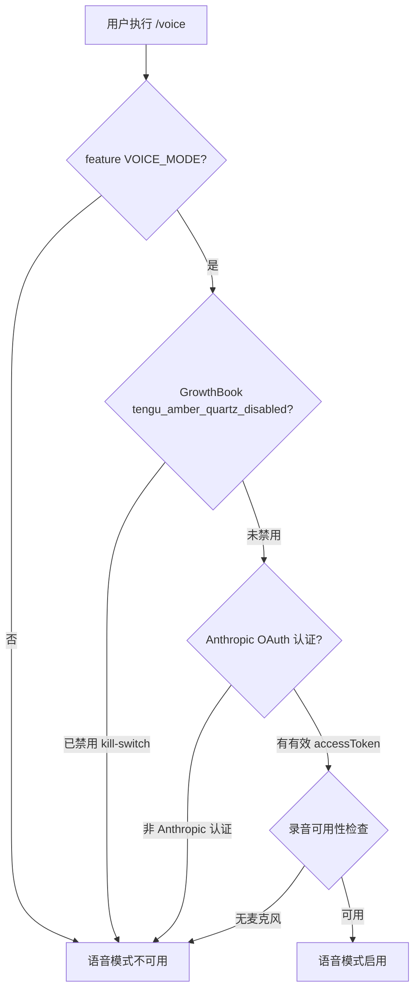
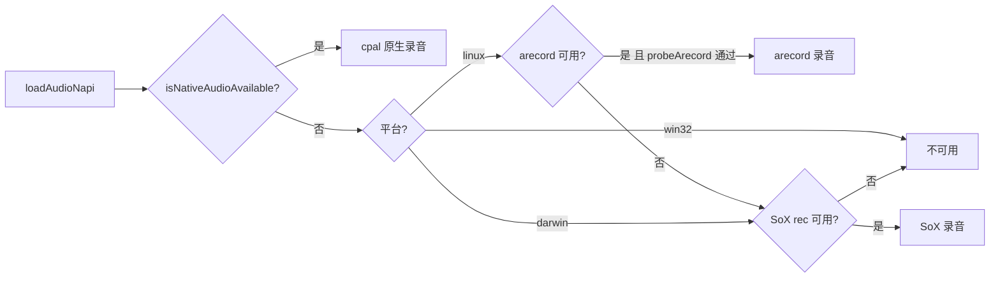
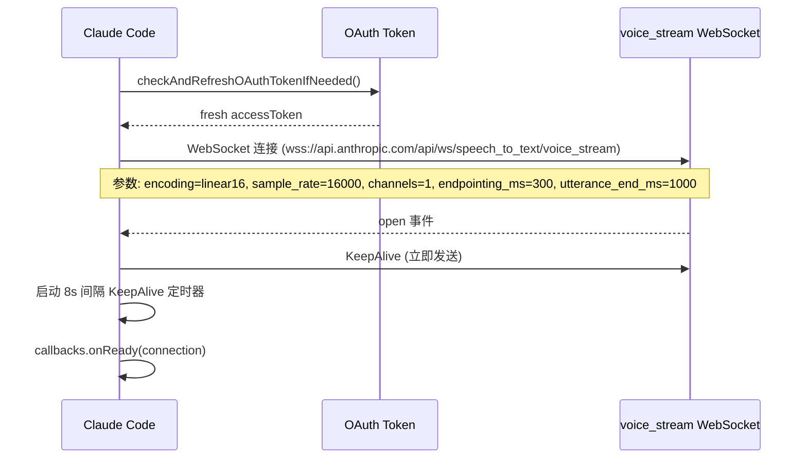
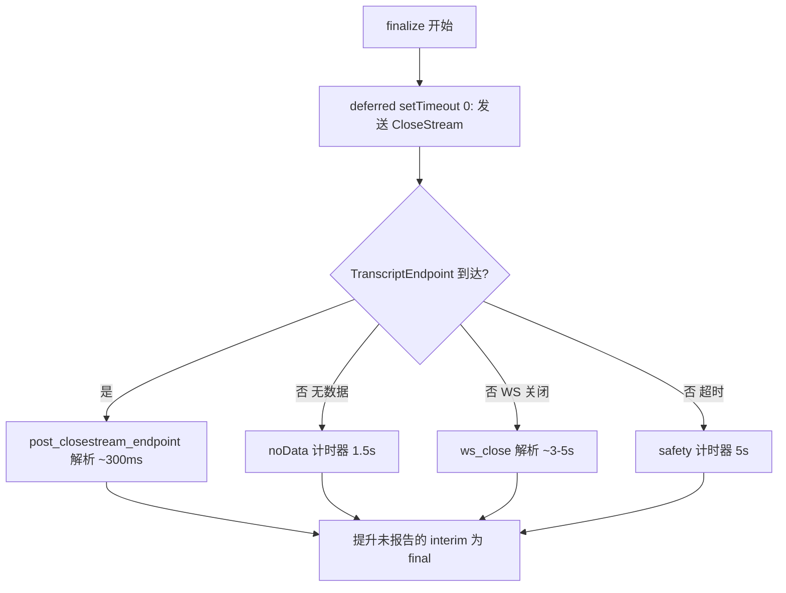

# 语音模式

> 前置知识：[第二章（API 客户端）](/ch02-identity/api-client) — 语音模式依赖 OAuth 认证流连接 Anthropic 的 `voice_stream` WebSocket 端点。

**源码位置**：`src/services/voice.ts`、`src/services/voiceStreamSTT.ts`、`src/services/voiceKeyterms.ts`、`src/context/voice.tsx`、`src/voice/voiceModeEnabled.ts`、`src/commands/voice/`

语音模式允许用户通过按键说话（push-to-talk）向 Claude Code 输入语音。整个管线涵盖音频采集、流式语音转写、关键词增强和 UI 状态管理四个子系统。

## 功能门控

语音模式受三重门控控制：



| 门控层 | 源码位置 | 作用 |
|--------|----------|------|
| 编译期 `feature('VOICE_MODE')` | `src/voice/voiceModeEnabled.ts:20` | 非 ant 构建直接消除代码 |
| GrowthBook `tengu_amber_quartz_disabled` | `src/voice/voiceModeEnabled.ts:21` | 运行期 kill-switch，紧急禁用 |
| Anthropic OAuth | `src/voice/voiceModeEnabled.ts:33-44` | `voice_stream` 端点仅对 Claude.ai 订阅者开放 |

`isVoiceModeEnabled()` 组合了 `hasVoiceAuth() && isVoiceGrowthBookEnabled()`，在 `/voice` 命令和 `VoiceModeNotice` 组件中使用。React 渲染路径使用 `useVoiceEnabled()` hook 进行 memoize 以避免重复读取 keychain。

## 音频采集管线

音频采集位于 `src/services/voice.ts`，采用多后端降级策略：



### 音频格式规格

| 参数 | 值 | 说明 |
|------|-----|------|
| 采样率 | 16000 Hz | 语音识别标准采样率 |
| 通道数 | 1（单声道） | 语音输入无需立体声 |
| 位深度 | 16-bit signed | S16_LE（little-endian） |
| 编码格式 | `linear16` raw PCM | 无 WAV 头，直接二进制帧 |

### 原生音频模块（cpal）

`audio-capture-napi` 是基于 Rust cpal 库的原生 Node 模块，链接 CoreAudio.framework（macOS）和 ALSA（Linux）。首次加载采用惰性初始化模式：

- `dlopen` 同步阻塞事件循环，暖启动约 1s，冷启动（coreaudiod 未就绪）可达 8s
- 仅在用户首次按下语音快捷键时加载，不影响启动性能
- 加载后缓存模块引用，后续调用零开销

### 后端降级链

1. **原生 cpal 模块**：macOS/Linux/Windows 首选。macOS 首次调用会触发 TCC 权限对话框
2. **arecord（ALSA）**：Linux 备选。通过 `probeArecord()` 检测设备可用性（150ms 超时探测），不支持静音检测
3. **SoX rec**：最后备选。支持内置静音检测（2 秒静音 + 3% 阈值自动停止），`--buffer 1024` 防止数据积压

`checkRecordingAvailability()` 按完整降级链探测，远程环境（Homespace/`CLAUDE_CODE_REMOTE`）直接返回不可用。

## 语音转写（Whisper API 集成）

语音转写通过 Anthropic 的 `voice_stream` WebSocket 端点实现，位于 `src/services/voiceStreamSTT.ts`。

### 连接建立



关键设计决策：

- **API 端点选择**：使用 `api.anthropic.com` 而非 `claude.ai`，因为 claude.ai 的 CloudFront 区域使用 TLS 指纹检测，会拒绝非浏览器客户端
- **OAuth 认证**：`Authorization: Bearer <accessToken>` 通过 WebSocket 头传递
- **Nova 3 集成**：当 GrowthBook `tengu_cobalt_frost` 开关启用时，设置 `use_conversation_engine=true` + `stt_provider=deepgram-nova3`，路由至 conversation engine 后端

### 流式转写协议

WebSocket 通信采用混合帧格式：

| 帧类型 | 方向 | 格式 | 说明 |
|--------|------|------|------|
| 音频帧 | 客户端 -> 服务器 | 二进制（Buffer） | PCM 音频数据，需 `Buffer.from()` 拷贝以避免 NAPI Buffer 共享内存问题 |
| KeepAlive | 双向 | `{"type":"KeepAlive"}` | 防止空闲超时，8 秒间隔 |
| CloseStream | 客户端 -> 服务器 | `{"type":"CloseStream"}` | 信号录音结束，延迟到下一个事件循环迭代发送 |
| TranscriptText | 服务器 -> 客户端 | `{"type":"TranscriptText","data":"..."}` | 增量/累积转写文本，`isFinal=false` |
| TranscriptEndpoint | 服务器 -> 客户端 | `{"type":"TranscriptEndpoint"}` | 语句结束标记，触发最终转写提交 |
| TranscriptError | 服务器 -> 客户端 | `{"type":"TranscriptError","error_code":"...","description":"..."}` | 转写错误 |

### Finalize 流程

`finalize()` 方法在用户松开按键后调用，负责等待最终转写结果：



四种 finalize 解析源按速度排序：
1. `post_closestream_endpoint`：CloseStream 后收到 TranscriptEndpoint，约 300ms
2. `no_data_timeout`：1.5 秒内无数据到达，服务器空响应
3. `ws_close`：WebSocket 关闭事件，3-5 秒
4. `safety_timeout`：5 秒安全兜底

Nova 3 模式下禁用自动 finalize（`auto-finalize`），因为 Nova 3 的 interim 是累积且可修正的，前缀检测会导致文本重复。

## 关键词增强

`src/services/voiceKeyterms.ts` 为 STT 引擎提供领域词汇提示，改善编码术语的识别准确率。

### 关键词来源

| 来源 | 示例 | 上限 |
|------|------|------|
| 全局硬编码词汇 | MCP, symlink, grep, regex, TypeScript, OAuth, webhook, gRPC, dotfiles, subagent, worktree | ~15 个 |
| 项目根目录名 | `claude-cli-internal` 作为短语保留 | 1 个 |
| Git 分支名拆分 | `feat/voice-keyterms` -> `feat`, `voice`, `keyterms` | 动态 |
| 最近文件名拆分 | `voiceStreamSTT.ts` -> `voice`, `Stream`, `STT` | 填充至 50 个 |

`splitIdentifier()` 处理 camelCase、PascalCase、kebab-case、snake_case 和路径段的拆分，过滤 2 字符以下和 20 字符以上的片段。

## UI 状态管理

语音 UI 状态通过 React Context + `useSyncExternalStore` 实现，位于 `src/context/voice.tsx`：

| 状态字段 | 类型 | 说明 |
|----------|------|------|
| `voiceState` | `'idle' \| 'recording' \| 'processing'` | 录音/处理状态机 |
| `voiceError` | `string \| null` | 当前错误信息 |
| `voiceInterimTranscript` | `string` | 实时转写预览文本 |
| `voiceAudioLevels` | `number[]` | 音频电平可视化数据 |
| `voiceWarmingUp` | `boolean` | 原生模块预热中 |

`VoiceProvider` 在组件树顶层创建一个 `Store<VoiceState>` 实例，消费者通过 `useVoiceState(selector)` 订阅切片，仅在选中值变化时重渲染。`useSetVoiceState()` 返回同步的 `setState`，`useGetVoiceState()` 返回不触发重渲染的 `getState` 读取器。

## 激活/停用流程

`/voice` 命令（`src/commands/voice/voice.ts`）实现切换逻辑：

```mermaid
flowchart TD
    A[/voice 命令] --> B{isVoiceModeEnabled?}
    B -->|否| C{isAnthropicAuthEnabled?}
    C -->|否| D[提示 /login]
    C -->|是| E[语音模式不可用]
    B -->|是| F{当前已启用?}
    F -->|是| G[设置 voiceEnabled=false]
    F -->|否| H[预检: checkRecordingAvailability]
    H --> I[预检: isVoiceStreamAvailable]
    I --> J[预检: checkVoiceDependencies]
    J --> K[预检: requestMicrophonePermission]
    K --> L[设置 voiceEnabled=true]
    L --> M[显示按键提示和语言提示]
```

激活时执行四项预检：录音可用性、API 可用性、依赖检查和麦克风权限探测（触发 OS 权限对话框）。语言提示通过 `normalizeLanguageForSTT()` 解析，最多显示 2 次后隐藏。

## 关键源文件

| 文件 | 行数 | 职责 |
|------|------|------|
| `src/services/voice.ts` | ~526 | 音频采集：原生 cpal / arecord / SoX 降级链、录音控制、依赖检查 |
| `src/services/voiceStreamSTT.ts` | ~545 | WebSocket 语音转写：连接建立、流式协议、finalize 流程、错误处理 |
| `src/services/voiceKeyterms.ts` | ~107 | 关键词增强：全局词汇、项目上下文词汇、标识符拆分 |
| `src/context/voice.tsx` | ~88 | UI 状态管理：VoiceProvider、useVoiceState、useSetVoiceState |
| `src/voice/voiceModeEnabled.ts` | ~55 | 功能门控：GrowthBook kill-switch、OAuth 认证检查 |
| `src/commands/voice/voice.ts` | ~151 | /voice 命令：切换逻辑、预检、权限探测 |

<div class="chapter-nav-hint">
附录 -- 下一篇：<a href="./computer-use.md">Computer Use</a>
</div>
