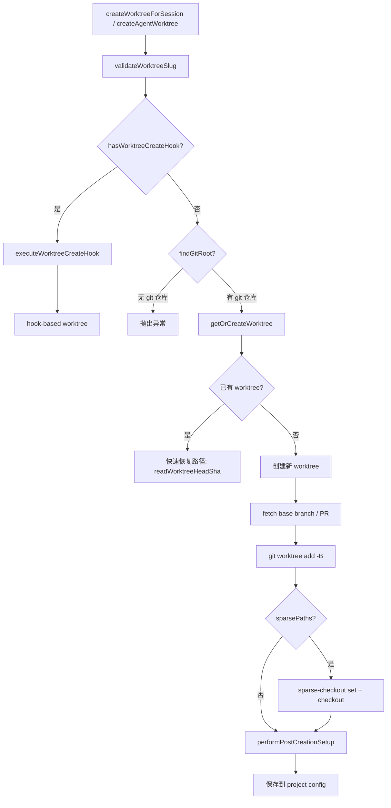
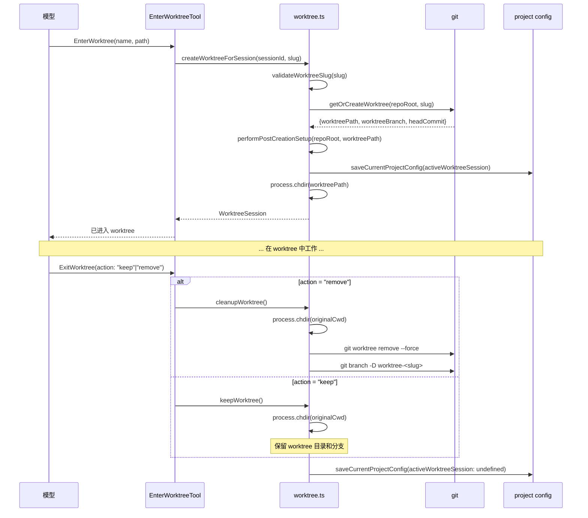
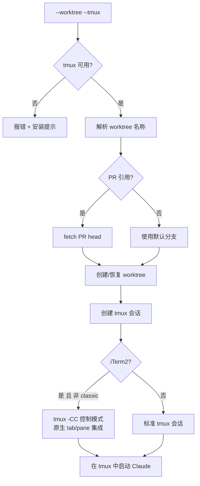

# Worktree 隔离模式

> 前置知识：[第七章 7.3（Swarm）](/ch07-extensions/swarm) — Worktree 与 Swarm 系统协作实现多进程并行工作。

**源码位置**：`src/utils/worktree.ts`（~1520 行）、`src/utils/worktreeModeEnabled.ts`、工具 `EnterWorktreeTool` / `ExitWorktreeTool`

Worktree 模式允许 Claude Code 在独立的 git worktree 中并行工作，避免主工作目录的文件冲突。该系统支持会话隔离、子代理 worktree 和 tmux 集成。

## 功能门控

Worktree 模式当前对所有用户无条件启用：

```typescript
// src/utils/worktreeModeEnabled.ts
export function isWorktreeModeEnabled(): boolean {
  return true
}
```

历史上曾受 GrowthBook `tengu_worktree_mode` 门控，但 `CACHED_MAY_BE_STALE` 模式在缓存填充前返回默认值 `false`，导致 `--worktree` 参数静默失效（[#27044](https://github.com/anthropics/claude-code/issues/27044)），因此移除了门控。

工具注册在 `src/tools.ts` 中：

```typescript
...(isWorktreeModeEnabled() ? [EnterWorktreeTool, ExitWorktreeTool] : []),
```

## Git Worktree 创建与管理

### Worktree 创建流程



### Slug 验证

`validateWorktreeSlug()` 防止路径穿越和目录逃逸：

- 长度上限 64 字符
- 每个 `/` 分隔段必须匹配 `[a-zA-Z0-9._-]`
- 禁止 `.` 和 `..` 段
- `flattenSlug()` 将 `/` 替换为 `+` 避免 D/F 冲突（`worktree-user` 文件 vs `worktree-user/feature` 目录）和目录嵌套

### Worktree 存储布局

```
<repo-root>/
  .claude/
    worktrees/
      my-feature/          # worktree 目录 (flattenSlug)
      pr-123/              # PR worktree
      agent-a1b2c3d/       # 子代理临时 worktree
      wf_abc12345-def-0/   # 工作流 worktree
```

分支命名规则：`worktree-<flattenSlug>`，如 `worktree-my+feature`。

### 快速恢复路径

`getOrCreateWorktree()` 的快速恢复路径直接读取 `.git` 指针文件（`readWorktreeHeadSha`），避免子进程开销（`rev-parse HEAD` 即使只需 2ms 也要 ~15ms 的 spawn 开销）。

## 会话隔离

### WorktreeSession 状态

```typescript
type WorktreeSession = {
  originalCwd: string          // 原始工作目录
  worktreePath: string         // worktree 目录路径
  worktreeName: string         // slug 名称
  worktreeBranch?: string      // worktree 分支名
  originalBranch?: string      // 原始分支名
  originalHeadCommit?: string  // 基准 commit SHA
  sessionId: string            // 会话 ID
  tmuxSessionName?: string     // tmux 会话名
  hookBased?: boolean          // 是否为 hook-based worktree
  creationDurationMs?: number  // 创建耗时
  usedSparsePaths?: boolean    // 是否使用了稀疏检出
}
```

`currentWorktreeSession` 是模块级全局状态，`saveCurrentProjectConfig` 持久化到项目配置以支持 `--resume`。

### EnterWorktree/ExitWorktree 工具流



## 状态同步

### 创建后设置

`performPostCreationSetup()` 在新 worktree 上执行四项同步操作：

| 步骤 | 说明 |
|------|------|
| 复制 `settings.local.json` | 传播本地设置（可能包含密钥）到 worktree 的 `.claude/` 目录 |
| 配置 git hooks 路径 | `core.hooksPath` 指向主仓库的 `.husky/` 或 `.git/hooks/` |
| 符号链接目录 | `worktree.symlinkDirectories` 配置的目录（如 `node_modules`）通过 symlink 避免磁盘膨胀 |
| 复制 `.worktreeinclude` 文件 | gitignore 中的文件按 `.worktreeinclude` 模式选择性复制 |

### `.worktreeinclude` 机制

`.worktreeinclude` 使用 `.gitignore` 语法指定需要从主仓库复制到 worktree 的 gitignore 文件：

```mermaid
flowchart TD
    A[copyWorktreeIncludeFiles] --> B[读取 .worktreeinclude]
    B --> C[git ls-files --others --ignored --directory]
    Note over C: --directory 折叠完全 gitignored 的目录\n如 node_modules/ 作为一个条目
    C --> D[ignore 库匹配 .worktreeinclude 模式]
    D --> E{折叠目录中的模式匹配?}
    E -->|是| F[展开: 第二次 ls-files 限定范围]
    E -->|否| G[跳过]
    F --> H[复制匹配文件到 worktree]
    G --> H
```

性能优化：`--directory` 标志将大型仓库中 ~500k 条目/7s 的全量扫描缩减为 ~100ms。

### Sparse Checkout

`settings.worktree.sparsePaths` 配置启用稀疏检出：

1. `git worktree add --no-checkout` 创建空 worktree
2. `git sparse-checkout set --cone -- <paths>` 配置稀疏路径
3. `git checkout HEAD` 检出指定路径

任何步骤失败都会立即清理 worktree（`tearDown`），防止快速恢复路径将空 worktree 呈现为有效。

## 子代理 Worktree

`createAgentWorktree()` 为子代理创建轻量级 worktree：

```mermaid
flowchart TD
    A[AgentTool / WorkflowTool] --> B[createAgentWorktree]
    B --> C{hasWorktreeCreateHook?}
    C -->|是| D[hook-based worktree]
    C -->|否| E[findCanonicalGitRoot]
    Note over E: 使用 canonical root 而非 findGitRoot\n确保子代理 worktree 在主仓库 .claude/worktrees/ 中
    E --> F[getOrCreateWorktree]
    F --> G[performPostCreationSetup]
```

关键区别：
- 不触碰全局会话状态（`currentWorktreeSession`、`process.chdir`、项目配置）
- 使用 `findCanonicalGitRoot` 而非 `findGitRoot`，确保从会话 worktree 中生成的子代理 worktree 不会嵌套到 `<worktree>/.claude/worktrees/`
- 恢复已有 worktree 时更新 `mtime` 防止被 30 天清理扫描误删

## Hook-based Worktree

WorktreeCreate/WorktreeRemove hooks 允许用户配置非 git VCS 后端：

- `hasWorktreeCreateHook()` 检查 `settings.json` 中的 hook 配置
- `executeWorktreeCreateHook(slug)` 调用用户自定义脚本
- `executeWorktreeRemoveHook(worktreePath)` 清理时调用
- Hook 路径优先于 git 路径，在 `createWorktreeForSession`、`createAgentWorktree` 和 `execIntoTmuxWorktree` 中统一处理

## Tmux 集成

`execIntoTmuxWorktree()` 是 `--worktree --tmux` 快速路径，在 CLI 入口早期执行：



### Tmux 模式

| 模式 | 触发条件 | 行为 |
|------|----------|------|
| 控制模式 | iTerm2 + 非 classic | `tmux -CC`，iTerm2 原生 tab/pane 管理 |
| 经典模式 | 非 iTerm2 或 `--tmux=classic` | 标准 tmux 窗口 |
| 嵌套模式 | 已在 tmux 中 | `switch-client` 切换到兄弟会话 |

### iTerm2 提示

控制模式首次创建会话时显示 iTerm2 偏好设置提示，引导用户配置 "Tabs in attaching window" 以 tab 而非窗口形式打开。

### 开发者面板

ant 用户在 `claude-cli-internal` 仓库中自动创建三面板布局：
1. 主面板：Claude Code
2. 右侧面板：`bun run watch`
3. 右下面板：`bun run start`

## 过期清理

`cleanupStaleAgentWorktrees()` 定期清理 30 天以上的临时 worktree：

| 临时模式 | 正则 | 来源 |
|----------|------|------|
| Agent | `agent-a[0-9a-f]{7}` | `AgentTool` 的 `earlyAgentId.slice(0,8)` |
| Workflow | `wf_[0-9a-f]{8}-[0-9a-f]{3}-\d+` | `WorkflowTool` 的 `runId-idx` |
| Legacy WF | `wf-\d+` | 旧版工作流 |
| Bridge | `bridge-[A-Za-z0-9_]+(-[A-Za-z0-9_]+)*` | `bridgeMain` |
| Job | `job-[a-zA-Z0-9._-]{1,55}-[0-9a-f]{8}` | 模板任务 |

安全检查（fail-closed）：
- 跳过当前会话的 worktree
- `git status --porcelain -uno` 非空则跳过（有未提交更改）
- `git rev-list HEAD --not --remotes` 非空则跳过（有未推送 commit）

## 关键源文件

| 文件 | 行数 | 职责 |
|------|------|------|
| `src/utils/worktree.ts` | ~1520 | Worktree 全部核心逻辑：创建、恢复、清理、tmux 集成 |
| `src/utils/worktreeModeEnabled.ts` | ~11 | 功能门控（当前无条件启用） |
| `src/tools/EnterWorktreeTool/` | - | EnterWorktree 工具实现 |
| `src/tools/ExitWorktreeTool/` | - | ExitWorktree 工具实现 |
| `src/utils/hooks.ts` | - | WorktreeCreate/WorktreeRemove hook 执行 |

<div class="chapter-nav-hint">
附录 -- 上一篇：<a href="./computer-use.md">Computer Use</a> | 下一篇：<a href="./deep-link.md">深度链接与 IDE 集成</a>
</div>
