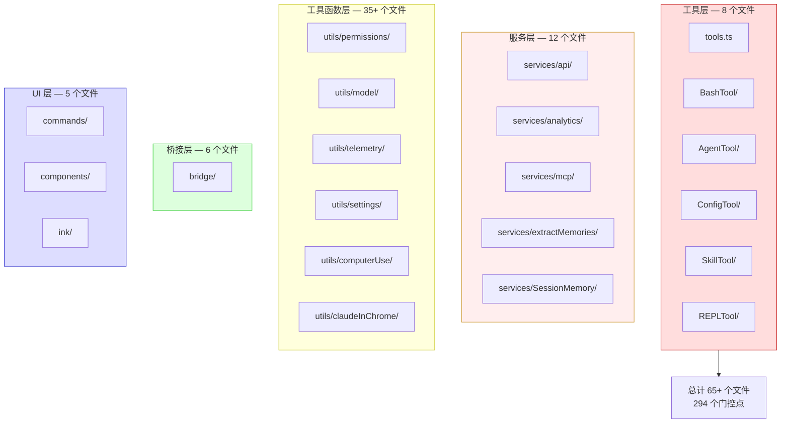

# Ant 内部特性速查

> 本页列出 `USER_TYPE === 'ant'` 门控的 Anthropic 内部特性。外部构建中这些特性均不存在（代码通过 DCE 移除或条件分支永不执行）。

## 内部专用工具

| 特性 | 源文件 | 说明 | 门控条件 |
|------|--------|------|---------|
| `ConfigTool` | `src/tools/ConfigTool/ConfigTool.ts` | 运行时配置修改工具，支持更多内部设置项 | `USER_TYPE === 'ant'` |
| `TungstenTool` | `src/tools/TungstenTool/TungstenTool.ts` | tmux 终端面板管理工具，单例虚拟终端 | `USER_TYPE === 'ant'` |
| `REPLTool` | `src/tools/REPLTool/` | 内部 REPL 脚本执行工具，支持脚本化操控 | `USER_TYPE === 'ant'` + `CLAUDE_REPL_MODE` |
| `SuggestBackgroundPRTool` | `src/tools/SuggestBackgroundPRTool/` | 自动创建后台 PR 建议 | `USER_TYPE === 'ant'` + feature flag |

工具注册位置（`src/tools.ts` 第 214-232 行）：

```typescript
...(process.env.USER_TYPE === 'ant' ? [ConfigTool] : []),
...(process.env.USER_TYPE === 'ant' ? [TungstenTool] : []),
...(process.env.USER_TYPE === 'ant' && REPLTool ? [REPLTool] : []),
```

## 内部 MCP 服务

| 服务 | 包名 | 说明 | 门控条件 |
|------|------|------|---------|
| Computer Use MCP | `@ant/computer-use-mcp` | 桌面交互 MCP 核心库 | `USER_TYPE === 'ant'` + `ALLOW_ANT_COMPUTER_USE_MCP` |
| Computer Use Input | `@ant/computer-use-input` | 鼠标、键盘、前台应用捕获（Rust/enigo） | `USER_TYPE === 'ant'` |
| Computer Use Swift | `@ant/computer-use-swift` | macOS 截图（SCContentFilter）、NSWorkspace、TCC | `USER_TYPE === 'ant'` |
| Chrome MCP | `@ant/claude-for-chrome-mcp` | Chrome 浏览器控制 | `USER_TYPE === 'ant'` |

Computer Use 相关源码位于 `src/utils/computerUse/`，包含 `executor.ts`、`mcpServer.ts`、`setup.ts`、`escHotkey.ts`、`wrapper.tsx`。

## 内部功能特性

### 权限系统增强

| 特性 | 源文件 | 说明 | 门控条件 |
|------|--------|------|---------|
| Auto 权限模式 | `src/utils/permissions/PermissionMode.ts` | `auto` 模式（TRANSCRIPT_CLASSIFIER） | `feature('TRANSCRIPT_CLASSIFIER')` |
| 额外环境变量白名单 | `src/tools/BashTool/bashPermissions.ts` | `ANT_ONLY_SAFE_ENV_VARS` 允许更多内部 env | `USER_TYPE === 'ant'` |
| Undercover 模式 | `src/utils/undercover.ts` | 隐藏 Bash 工具输出的文件路径 | `USER_TYPE === 'ant'` + `isUndercover()` |
| 危险模式扩展 | `src/utils/permissions/dangerousPatterns.ts` | 额外的内部危险命令模式（`coo`、`fa run`、`gh api` 等） | `USER_TYPE === 'ant'` |
| 计划模式 V2 | `src/utils/planModeV2.ts` | 增强版计划模式 | `USER_TYPE === 'ant'` |

### Agent 与子代理

| 特性 | 源文件 | 说明 | 门控条件 |
|------|--------|------|---------|
| 远程隔离模式 | `src/tools/AgentTool/loadAgentsDir.ts` | Agent 支持 `remote` 隔离（外部仅 `worktree`） | `USER_TYPE === 'ant'` |
| 模型继承 | `src/tools/AgentTool/built-in/exploreAgent.ts` | 探索代理使用 `inherit` 模型（外部用 haiku） | `USER_TYPE === 'ant'` |
| Agent 内存快照 | `src/tools/AgentTool/agentMemory.ts` | Agent 记忆快照功能 | `feature('AGENT_MEMORY_SNAPSHOT')` |
| Agent 队列查询 | `src/tools/AgentTool/runAgent.ts` | 内部 Agent 队列查询 | `USER_TYPE === 'ant'` |

### Bridge 与远程执行

| 特性 | 源文件 | 说明 | 门控条件 |
|------|--------|------|---------|
| Bridge 基础 URL | `src/bridge/bridgeConfig.ts` | 自定义 Bridge 连接端点 | `USER_TYPE === 'ant'` + `CLAUDE_BRIDGE_BASE_URL` |
| Bridge 调试 | `src/bridge/bridgeDebug.ts` | Bridge 调试工具（零开销设计） | `USER_TYPE === 'ant'` |
| Bridge 心跳模式 | `src/bridge/initReplBridge.ts` | 心跳模式进入/退出 | `USER_TYPE === 'ant'` + GrowthBook |
| CCR V2 | 多文件 | 使用 CCR V2 路径 | `CLAUDE_CODE_USE_CCR_V2` |

### API 与认证

| 特性 | 源文件 | 说明 | 门控条件 |
|------|--------|------|---------|
| 内部 OAuth 端点 | `src/constants/oauth.ts` | 内部 OAuth 配置（client ID、scope） | `USER_TYPE === 'ant'` |
| Foundry 提供商 | `src/utils/model/providers.ts` | Anthropic Foundry 模型提供商 | `USER_TYPE === 'ant'` |
| 内部 API 限流 | `src/services/api/withRetry.ts` | 内部限流和重试策略 | `USER_TYPE === 'ant'` |
| API Key Helper | `src/services/api/client.ts` | 内部 API Key 辅助逻辑 | `USER_TYPE === 'ant'` |
| Bedrock/Vertex 预取 | `src/utils/auth.ts` | 内部 AWS/GCP 凭证预取 | `USER_TYPE === 'ant'` |

### 遥测与监控

| 特性 | 源文件 | 说明 | 门控条件 |
|------|--------|------|---------|
| 内部遥测端点 | `ANT_CLAUDE_CODE_METRICS_ENDPOINT` | 额外性能监控数据上报 | `USER_TYPE === 'ant'` |
| OTel 内部配置 | `src/utils/telemetry/` | 内部 OpenTelemetry 配置 | `ANT_OTEL_*` 环境变量 |
| 慢操作日志 | `src/utils/slowOperations.ts` | 慢操作检测和日志 | `USER_TYPE === 'ant'` |
| 会话追踪 | `src/utils/telemetry/sessionTracing.ts` | 增强版会话追踪 | `USER_TYPE === 'ant'` |
| BigQuery 导出 | `src/utils/telemetry/bigqueryExporter.ts` | 遥测数据 BigQuery 导出 | `USER_TYPE === 'ant'` |
| Heap Dump | `src/components/MemoryUsageIndicator.tsx` | 运行时内存快照（/heapdump） | `USER_TYPE === 'ant'` |
| 启动性能分析 | `src/utils/startupProfiler.ts` | 详细启动时间线 | `USER_TYPE === 'ant'` |

### 设置与配置

| 特性 | 源文件 | 说明 | 门控条件 |
|------|--------|------|---------|
| 扩展配置项 | `src/tools/ConfigTool/supportedSettings.ts` | 更多内部可配置项 | `USER_TYPE === 'ant'` |
| MDM 托管设置 | `src/utils/settings/mdm/` | 内部 MDM 配置管理 | `USER_TYPE === 'ant'` |
| 托管设置路径 | `src/utils/settings/managedPath.ts` | 内部托管设置文件路径 | `USER_TYPE === 'ant'` |
| 受保护命名空间 | `src/utils/protectedNamespace.ts` | 检测是否在受保护 COO 命名空间中 | `USER_TYPE === 'ant'` |

## 内部 UI 元素

| 元素 | 源文件 | 说明 | 门控条件 |
|------|--------|------|---------|
| 诊断面板 | `src/ink/termio/osc.ts` | 详细系统状态面板 | `USER_TYPE === 'ant'` |
| 内部命令 | `src/commands.ts` | 额外的斜杠命令（bridge-kick 等） | `USER_TYPE === 'ant'` |
| 快捷键自定义 | `src/keybindings/loadUserBindings.ts` | 内部用户快捷键加载 | `USER_TYPE === 'ant'` |
| 审计日志 | `src/utils/permissions/classifierDecision.ts` | 更详细的工具调用审计 | `USER_TYPE === 'ant'` + GrowthBook |
| Cost 命令增强 | `src/commands/cost/` | 内部费用详情 | `USER_TYPE === 'ant'` |
| Insights 增强 | `src/commands/insights.ts` | 内部分析洞察 | `USER_TYPE === 'ant'` |
| 发布说明 | `src/utils/releaseNotes.ts` | 内部版本发布说明 | `USER_TYPE === 'ant'` |
| 上下文信息增强 | `src/utils/context.ts` | 内部上下文信息 | `USER_TYPE === 'ant'` |

## 内部安全特性

| 特性 | 源文件 | 说明 | 门控条件 |
|------|--------|------|---------|
| 沙盒模式切换 | `src/tools/BashTool/shouldUseSandbox.ts` | 内部沙盒策略差异 | `USER_TYPE === 'ant'` |
| 只读验证扩展 | `src/tools/BashTool/readOnlyValidation.ts` | 内部额外只读规则 | `USER_TYPE === 'ant'` |
| 权限模式转换 | `src/utils/permissions/getNextPermissionMode.ts` | 内部权限模式切换逻辑 | `USER_TYPE === 'ant'` |
| 权限设置增强 | `src/utils/permissions/permissionSetup.ts` | 内部权限初始化 | `USER_TYPE === 'ant'` |
| YOLO 分类器增强 | `src/utils/permissions/yoloClassifier.ts` | 内部分类器配置 | `USER_TYPE === 'ant'` |

## 受影响文件分布



## 内部 vs 外部构建差异

| 维度 | 内部 (ant) | 外部 (external) |
|------|-----------|----------------|
| 工具数量 | 53+（含 ConfigTool/TungstenTool/REPLTool） | 50（不含内部工具） |
| 权限模式 | 7 种（含 auto） | 6 种（不含 auto） |
| Agent 隔离 | worktree + remote | worktree only |
| 探索代理模型 | inherit（继承主模型） | haiku（固定轻量模型） |
| Bash 危险模式 | 含 `coo`、`fa run`、`gh api`、`kubectl` 等 | 仅标准危险命令 |
| OAuth 端点 | 内部端点 | 公开端点 |
| Computer Use | 完整支持 | 不支持 |
| Bridge | 完整支持 | 不支持 |
| 遥测 | 内部 + 外部双重上报 | 仅外部上报 |

<div class="chapter-nav-hint">

三层门控详细架构见 [三层门控架构](/appendix-topics/gate-architecture)。编译开关完整列表见 [编译开关速查](/appendix-ref/feature-flags)。环境变量见 [环境变量速查](/appendix-ref/env-vars)。
</div>
