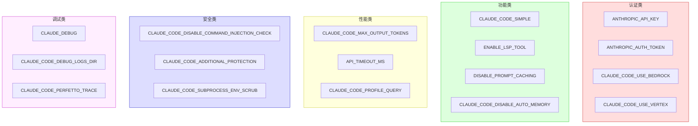

# 环境变量速查

> 本页是 Claude Code 源码中所有环境变量的完整参考。数据来自对 `src/` 目录中 `process.env.XXX` 的全面扫描。

环境变量是 Claude Code 运行时行为的核心控制机制。它们覆盖 API 认证、模型选择、功能开关、安全策略、遥测控制等几乎所有方面。

## 核心环境变量

### API 认证与模型

| 变量名 | 类型 | 默认值 | 说明 | 门控 |
|--------|------|--------|------|------|
| `ANTHROPIC_API_KEY` | string | — | Anthropic API 密钥 | 无 |
| `ANTHROPIC_AUTH_TOKEN` | string | — | 替代认证令牌 | 无 |
| `ANTHROPIC_BASE_URL` | string | `https://api.anthropic.com` | API 基础 URL | 无 |
| `ANTHROPIC_MODEL` | string | — | 覆盖默认模型 | 无 |
| `ANTHROPIC_SMALL_FAST_MODEL` | string | — | 小型快速模型（如 haiku） | 无 |
| `ANTHROPIC_BETAS` | string | — | API beta 功能标志 | 无 |
| `ANTHROPIC_CUSTOM_HEADERS` | string | — | 附加自定义 HTTP 头 | 无 |
| `ANTHROPIC_CUSTOM_MODEL_OPTION` | string | — | 自定义模型选项 | 无 |
| `ANTHROPIC_UNIX_SOCKET` | string | — | Unix 域套接字路径 | 无 |

### 云提供商

| 变量名 | 类型 | 默认值 | 说明 | 门控 |
|--------|------|--------|------|------|
| `CLAUDE_CODE_USE_BEDROCK` | boolean | `false` | 使用 AWS Bedrock | 无 |
| `CLAUDE_CODE_USE_VERTEX` | boolean | `false` | 使用 Google Vertex | 无 |
| `CLAUDE_CODE_USE_FOUNDRY` | boolean | `false` | 使用 Anthropic Foundry | ant |
| `AWS_REGION` | string | `us-east-1` | AWS 区域 | 无 |
| `AWS_DEFAULT_REGION` | string | — | AWS 区域（备用） | 无 |
| `CLOUD_ML_REGION` | string | `us-east5` | Vertex 默认区域 | 无 |
| `GOOGLE_CLOUD_PROJECT` | string | — | GCP 项目 ID | 无 |
| `ANTHROPIC_BEDROCK_BASE_URL` | string | — | Bedrock 自定义端点 | 无 |
| `BEDROCK_BASE_URL` | string | — | Bedrock 基础 URL | 无 |
| `VERTEX_BASE_URL` | string | — | Vertex 自定义端点 | 无 |
| `AWS_BEARER_TOKEN_BEDROCK` | string | — | Bedrock Bearer Token | 无 |
| `ANTHROPIC_FOUNDRY_API_KEY` | string | — | Foundry API 密钥 | ant |
| `ANTHROPIC_FOUNDRY_BASE_URL` | string | — | Foundry 基础 URL | ant |
| `ANTHROPIC_FOUNDRY_RESOURCE` | string | — | Foundry 资源标识 | ant |
| `ANTHROPIC_VERTEX_PROJECT_ID` | string | — | Vertex 项目 ID | 无 |

### 模型配置

| 变量名 | 类型 | 默认值 | 说明 | 门控 |
|--------|------|--------|------|------|
| `ANTHROPIC_DEFAULT_SONNET_MODEL` | string | — | 覆盖 Sonnet 模型 | 无 |
| `ANTHROPIC_DEFAULT_HAIKU_MODEL` | string | — | 覆盖 Haiku 模型 | 无 |
| `ANTHROPIC_DEFAULT_OPUS_MODEL` | string | — | 覆盖 Opus 模型 | 无 |
| `ANTHROPIC_SMALL_FAST_MODEL_AWS_REGION` | string | — | Haiku Bedrock 区域 | 无 |
| `CLAUDE_CODE_MAX_OUTPUT_TOKENS` | number | — | 最大输出 token 数 | 无 |
| `MAX_THINKING_TOKENS` | number | — | 思考 token 上限 | 无 |
| `CLAUDE_CODE_MAX_CONTEXT_TOKENS` | number | — | 上下文窗口大小覆盖 | 无 |
| `API_MAX_INPUT_TOKENS` | number | — | 最大输入 token 数 | 无 |
| `API_TARGET_INPUT_TOKENS` | number | — | 目标输入 token 数 | 无 |
| `CLAUDE_CODE_SUBAGENT_MODEL` | string | — | 子代理模型覆盖 | 无 |

### 功能开关

| 变量名 | 类型 | 默认值 | 说明 | 门控 |
|--------|------|--------|------|------|
| `CLAUDE_CODE_SIMPLE` | boolean | `false` | 简化模式（跳过 Hook/LSP/插件） | 无 |
| `DISABLE_PROMPT_CACHING` | boolean | `false` | 禁用提示缓存 | 无 |
| `DISABLE_PROMPT_CACHING_HAIKU` | boolean | `false` | 禁用 Haiku 缓存 | 无 |
| `DISABLE_PROMPT_CACHING_SONNET` | boolean | `false` | 禁用 Sonnet 缓存 | 无 |
| `DISABLE_PROMPT_CACHING_OPUS` | boolean | `false` | 禁用 Opus 缓存 | 无 |
| `ENABLE_LSP_TOOL` | boolean | `false` | 启用 LSP 工具 | 无 |
| `CLAUDE_CODE_DISABLE_NONESSENTIAL_TRAFFIC` | boolean | `false` | 禁用非必要网络请求 | 无 |
| `CLAUDE_CODE_DISABLE_THINKING` | boolean | `false` | 禁用思考模式 | 无 |
| `CLAUDE_CODE_DISABLE_ADAPTIVE_THINKING` | boolean | `false` | 禁用自适应思考 | 无 |
| `CLAUDE_CODE_DISABLE_AUTO_MEMORY` | boolean | `false` | 禁用自动记忆 | 无 |
| `CLAUDE_CODE_DISABLE_BACKGROUND_TASKS` | boolean | `false` | 禁用后台任务 | 无 |
| `CLAUDE_CODE_DISABLE_FILE_CHECKPOINTING` | boolean | `false` | 禁用文件检查点 | 无 |
| `CLAUDE_CODE_DISABLE_GIT_INSTRUCTIONS` | boolean | `false` | 禁用 Git 指令 | 无 |
| `CLAUDE_CODE_DISABLE_TERMINAL_TITLE` | boolean | `false` | 禁用终端标题设置 | 无 |
| `CLAUDE_CODE_ENABLE_CFC` | boolean | `false` | 启用 CFC | 无 |
| `CLAUDE_CODE_ENABLE_TASKS` | boolean | `false` | 启用任务系统 | 无 |
| `CLAUDE_CODE_ENABLE_TELEMETRY` | boolean | `false` | 启用遥测 | 无 |
| `EMBEDDED_SEARCH_TOOLS` | boolean | `false` | 嵌入式搜索工具 | 无 |
| `ENABLE_TOOL_SEARCH` | boolean | `false` | 启用工具搜索 | 无 |
| `ENABLE_SESSION_PERSISTENCE` | boolean | `false` | 启用会话持久化 | 无 |

### 权限与安全

| 变量名 | 类型 | 默认值 | 说明 | 门控 |
|--------|------|--------|------|------|
| `CLAUDE_CODE_DISABLE_COMMAND_INJECTION_CHECK` | boolean | `false` | 禁用命令注入检测 | 无 |
| `CLAUDE_CODE_ADDITIONAL_PROTECTION` | boolean | `false` | 额外保护模式 | 无 |
| `CLAUDE_CODE_BASH_SANDBOX_SHOW_INDICATOR` | boolean | `false` | 显示沙盒指示器 | 无 |
| `CLAUDE_CODE_SUBPROCESS_ENV_SCRUB` | boolean | `false` | 子进程环境变量清理 | 无 |
| `IS_SANDBOX` | boolean | `false` | 运行在沙盒内 | 无 |
| `ALLOW_ANT_COMPUTER_USE_MCP` | boolean | `false` | 允许计算机使用 MCP | ant |

### 远程与桥接

| 变量名 | 类型 | 默认值 | 说明 | 门控 |
|--------|------|--------|------|------|
| `CLAUDE_CODE_REMOTE` | boolean | `false` | 远程模式 | 无 |
| `CLAUDE_CODE_SSE_PORT` | number | — | SSE 端口 | 无 |
| `CLAUDE_BRIDGE_BASE_URL` | string | — | Bridge 基础 URL | ant |
| `CLAUDE_BRIDGE_OAUTH_TOKEN` | string | — | Bridge OAuth 令牌 | ant |
| `LOCAL_BRIDGE` | boolean | `false` | 本地 Bridge | ant |
| `CCR_ENABLE_BUNDLE` | boolean | `false` | 启用 CCR 打包 | 无 |
| `CCR_FORCE_BUNDLE` | boolean | `false` | 强制 CCR 打包 | 无 |
| `CCR_UPSTREAM_PROXY_ENABLED` | boolean | `false` | CCR 上游代理 | 无 |
| `CLAUDE_CODE_USE_CCR_V2` | boolean | `false` | 使用 CCR V2 | 无 |
| `CLAUDE_CODE_CONTAINER_ID` | string | — | 容器 ID | 无 |

### 会话与对话

| 变量名 | 类型 | 默认值 | 说明 | 门控 |
|--------|------|--------|------|------|
| `CLAUDE_CODE_SESSION_ID` | string | — | 会话 ID 覆盖 | 无 |
| `CLAUDE_CODE_SESSION_NAME` | string | — | 会话名称 | 无 |
| `CLAUDE_CODE_SESSION_KIND` | string | — | 会话类型 | 无 |
| `DISABLE_AUTO_COMPACT` | boolean | `false` | 禁用自动压缩 | 无 |
| `DISABLE_COMPACT` | boolean | `false` | 禁用压缩 | 无 |
| `CLAUDE_AUTOCOMPACT_PCT_OVERRIDE` | number | — | 自动压缩百分比覆盖 | 无 |
| `CLAUDE_CODE_RESUME_INTERRUPTED_TURN` | boolean | `false` | 恢复中断的轮次 | 无 |
| `CLAUDE_CODE_SESSION_LOG` | string | — | 会话日志路径 | 无 |

### 调试与性能

| 变量名 | 类型 | 默认值 | 说明 | 门控 |
|--------|------|--------|------|------|
| `CLAUDE_DEBUG` | boolean | `false` | 调试模式 | 无 |
| `DEBUG` | boolean | `false` | 通用调试 | 无 |
| `CLAUDE_CODE_DEBUG_LOG_LEVEL` | string | — | 调试日志级别 | 无 |
| `CLAUDE_CODE_DEBUG_LOGS_DIR` | string | — | 调试日志目录 | 无 |
| `CLAUDE_CODE_PROFILE_QUERY` | boolean | `false` | 查询性能分析 | 无 |
| `CLAUDE_CODE_PROFILE_STARTUP` | boolean | `false` | 启动性能分析 | 无 |
| `CLAUDE_CODE_PERFETTO_TRACE` | boolean | `false` | Perfetto 追踪 | 无 |
| `API_TIMEOUT_MS` | number | — | API 超时毫秒数 | 无 |
| `CLAUDE_CODE_STALL_TIMEOUT_MS_FOR_TESTING` | number | — | 流式停滞超时（测试用） | 无 |
| `CLAUDE_CODE_SLOW_OPERATION_THRESHOLD_MS` | number | — | 慢操作阈值 | 无 |

### 输出与显示

| 变量名 | 类型 | 默认值 | 说明 | 门控 |
|--------|------|--------|------|------|
| `CLAUDE_CODE_STREAMLINED_OUTPUT` | boolean | `false` | 精简输出 | 无 |
| `CLAUDE_CODE_SYNTAX_HIGHLIGHT` | boolean | — | 语法高亮 | 无 |
| `CLAUDE_CODE_NO_FLICKER` | boolean | `false` | 禁用闪烁 | 无 |
| `CLAUDE_CODE_FORCE_FULL_LOGO` | boolean | `false` | 强制完整 Logo | 无 |
| `CLAUDE_CODE_DISABLE_VIRTUAL_SCROLL` | boolean | `false` | 禁用虚拟滚动 | 无 |
| `CLAUDE_CODE_DISABLE_MOUSE` | boolean | `false` | 禁用鼠标支持 | 无 |
| `CLAUDE_CODE_DISABLE_MOUSE_CLICKS` | boolean | `false` | 禁用鼠标点击 | 无 |
| `CLAUDE_CODE_ACCESSIBILITY` | boolean | `false` | 无障碍模式 | 无 |
| `CLAUDE_CODE_SCROLL_SPEED` | number | — | 滚动速度 | 无 |
| `BASH_MAX_OUTPUT_LENGTH` | number | — | Bash 输出最大长度 | 无 |
| `TASK_MAX_OUTPUT_LENGTH` | number | — | 任务输出最大长度 | 无 |
| `MAX_MCP_OUTPUT_TOKENS` | number | — | MCP 输出最大 token | 无 |

### MCP 配置

| 变量名 | 类型 | 默认值 | 说明 | 门控 |
|--------|------|--------|------|------|
| `MCP_TIMEOUT` | number | — | MCP 服务器连接超时 | 无 |
| `MCP_TOOL_TIMEOUT` | number | — | MCP 工具调用超时 | 无 |
| `MCP_SERVER_CONNECTION_BATCH_SIZE` | number | — | MCP 连接批大小 | 无 |
| `MCP_REMOTE_SERVER_CONNECTION_BATCH_SIZE` | number | — | 远程 MCP 连接批大小 | 无 |
| `ENABLE_CLAUDEAI_MCP_SERVERS` | boolean | `false` | 启用 claude.ai MCP 服务器 | 无 |
| `ENABLE_MCP_LARGE_OUTPUT_FILES` | boolean | `false` | MCP 大输出文件支持 | 无 |
| `MCP_CLIENT_SECRET` | string | — | MCP OAuth 客户端密钥 | 无 |
| `MCP_OAUTH_CALLBACK_PORT` | number | — | MCP OAuth 回调端口 | 无 |

### 遥测与监控

| 变量名 | 类型 | 默认值 | 说明 | 门控 |
|--------|------|--------|------|------|
| `DISABLE_TELEMETRY` | boolean | `false` | 禁用遥测 | 无 |
| `DISABLE_ERROR_REPORTING` | boolean | `false` | 禁用错误上报 | 无 |
| `CLAUDE_CODE_ENHANCED_TELEMETRY_BETA` | boolean | `false` | 增强遥测 beta | 无 |
| `ANT_CLAUDE_CODE_METRICS_ENDPOINT` | string | — | Ant 内部指标端点 | ant |
| `OTEL_EXPORTER_OTLP_ENDPOINT` | string | — | OTel 导出端点 | 无 |
| `OTEL_EXPORTER_OTLP_HEADERS` | string | — | OTel 导出请求头 | 无 |
| `OTEL_EXPORTER_OTLP_PROTOCOL` | string | — | OTel 协议 | 无 |
| `OTEL_TRACES_EXPORTER` | string | — | OTel 追踪导出器 | 无 |
| `OTEL_METRICS_EXPORTER` | string | — | OTel 指标导出器 | 无 |
| `OTEL_LOGS_EXPORTER` | string | — | OTel 日志导出器 | 无 |
| `BETA_TRACING_ENDPOINT` | string | — | Beta 追踪端点 | 无 |

### 构建与身份

| 变量名 | 类型 | 默认值 | 说明 | 门控 |
|--------|------|--------|------|------|
| `USER_TYPE` | string | `external` | 用户类型：`ant`（内部）/ `external` | 编译时 |
| `CLAUDE_CODE_ENVIRONMENT_KIND` | string | — | 环境类型标识 | 无 |
| `CLAUDE_CODE_ENTRYPOINT` | string | — | 入口类型 | 无 |
| `IS_DEMO` | boolean | `false` | 演示模式 | 无 |
| `NODE_ENV` | string | — | Node 环境 | 无 |

### 其他重要变量

| 变量名 | 类型 | 默认值 | 说明 | 门控 |
|--------|------|--------|------|------|
| `CLAUDE_CONFIG_DIR` | string | `~/.claude` | 配置目录 | 无 |
| `CLAUDE_CODE_TMPDIR` | string | — | 临时目录覆盖 | 无 |
| `CLAUDE_CODE_SHELL` | string | — | 覆盖默认 shell | 无 |
| `CLAUDE_CODE_SHELL_PREFIX` | string | — | Shell 前缀 | 无 |
| `CLAUDE_CODE_GIT_BASH_PATH` | string | — | Git Bash 路径（Windows） | 无 |
| `CLAUDE_CODE_USE_NATIVE_FILE_SEARCH` | boolean | `false` | 使用原生文件搜索 | 无 |
| `CLAUDE_CODE_USE_POWERSHELL_TOOL` | boolean | `false` | 使用 PowerShell 工具 | 无 |
| `CLAUDE_CODE_PLAN_MODE_REQUIRED` | boolean | `false` | 强制计划模式 | 无 |
| `CLAUDE_CODE_AUTO_MODE_MODEL` | string | — | Auto 模式模型 | 无 |
| `CLAUDE_CODE_ALWAYS_ENABLE_EFFORT` | boolean | `false` | 始终启用 effort 控制 | 无 |
| `CLAUDE_CODE_EFFORT_LEVEL` | string | — | 默认 effort 级别 | 无 |
| `CLAUDE_CODE_MAX_RETRIES` | number | — | API 最大重试次数 | 无 |
| `CLAUDE_CODE_MAX_TOOL_USE_CONCURRENCY` | number | — | 工具并发上限 | 无 |
| `DISABLE_COST_WARNINGS` | boolean | `false` | 禁用费用警告 | 无 |
| `CLAUDE_CODE_DONT_INHERIT_ENV` | boolean | `false` | 不继承环境变量 | 无 |
| `CLAUDE_CODE_GLOB_TIMEOUT_SECONDS` | number | — | Glob 搜索超时 | 无 |
| `CLAUDE_CODE_GLOB_HIDDEN` | boolean | `false` | 搜索隐藏文件 | 无 |
| `CLAUDE_CODE_GLOB_NO_IGNORE` | boolean | `false` | 忽略 .gitignore | 无 |

## 环境变量读取方式

Claude Code 使用两种方式读取环境变量：

1. **直接读取**：`process.env.VAR_NAME` — 用于简单布尔/字符串检查
2. **`isEnvTruthy()`**：`src/utils/envUtils.ts` 中的辅助函数，识别 `1`/`true`/`yes`/`on` 为真值

```typescript
// isEnvTruthy 实现（简化）
export function isEnvTruthy(envVar: string | boolean | undefined): boolean {
  if (!envVar) return false
  if (typeof envVar === 'boolean') return envVar
  return ['1', 'true', 'yes', 'on'].includes(envVar.toLowerCase().trim())
}
```

## 按影响范围分类



## 注意事项

- `USER_TYPE` 是编译时通过 Bun `--define` 注入的，外部构建始终为 `'external'`
- `CLAUDE_CODE_SIMPLE` 同时检查 `process.argv` 中的 `--bare` 标志
- 环境变量覆盖优先级：环境变量 > 设置文件 > 默认值
- ant-only 变量在外部构建中通过 DCE 完全移除，读取代码不存在

<div class="chapter-nav-hint">

环境变量与特性标志紧密关联，见 [编译开关速查](/appendix-ref/feature-flags)。Ant 内部专属变量见 [Ant 内部特性速查](/appendix-ref/ant-internals)。
</div>
