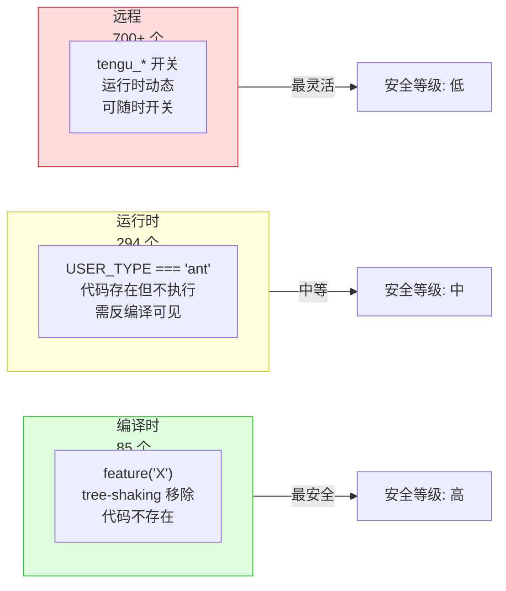

# 编译开关速查

> 本页为 Claude Code 三层门控系统中所有开关的完整速查参考。数据来自对 `src/` 目录的全面扫描。

## 第一层：编译时开关 (85 个)

`feature('FLAG_NAME')` 从 `bun:bundle` 导入，在 Bun 构建时折叠为布尔常量。外部构建中默认 `false`，相关代码通过 tree-shaking 完全从包中移除。

### 核心功能开关

| 标志名 | 类型 | 说明 | 影响范围 |
|--------|------|------|---------|
| `BUDDY` | 功能 | Buddy 宠物系统 | `src/buddy/`、UI 装饰 |
| `KAIROS` | 功能 | KAIROS 持久助手（助手模式） | `src/assistant/`、SleepTool、SendUserFileTool |
| `PROACTIVE` | 功能 | 主动行为系统 | SleepTool、后台任务 |
| `BRIDGE_MODE` | 功能 | Bridge 远程控制 | `src/bridge/`、CCR |
| `COORDINATOR_MODE` | 功能 | Coordinator 多 Agent 编排 | `src/coordinator/`、TeamCreateTool |
| `VOICE_MODE` | 功能 | 语音输入模式 | `src/voice/`、VoiceProvider |
| `WEB_BROWSER_TOOL` | 功能 | Web Browser 工具 | `src/tools/WebBrowserTool/` |
| `COMPUTER_USE` | 功能 | Computer Use 桌面交互 | `@ant/computer-use-*` |
| `AGENT_TRIGGERS` | 功能 | Cron 调度系统 | CronCreateTool/CronDeleteTool/CronListTool |
| `AGENT_TRIGGERS_REMOTE` | 功能 | 远程触发器 | RemoteTriggerTool |
| `MONITOR_TOOL` | 功能 | Monitor 监控工具 | `src/tools/MonitorTool/` |
| `WORKFLOW_SCRIPTS` | 功能 | Workflow 脚本系统 | WorkflowTool |
| `OVERFLOW_TEST_TOOL` | 测试 | 溢出测试工具 | OverflowTestTool |
| `CONTEXT_COLLAPSE` | 调试 | 上下文检查工具 | CtxInspectTool |
| `TERMINAL_PANEL` | 功能 | 终端面板 | TerminalCaptureTool |

### 安全与权限开关

| 标志名 | 类型 | 说明 | 影响范围 |
|--------|------|------|---------|
| `TRANSCRIPT_CLASSIFIER` | 安全 | Auto 模式分类器 | `classifierDecision.ts`、`autoModeState.ts`、`bashClassifier.ts` |
| `ANTI_DISTILLATION_CC` | 安全 | 反蒸馏保护 | 假工具注入 |
| `NATIVE_CLIENT_ATTESTATION` | 安全 | 原生客户端证明 | 启动验证 |
| `HARD_FAIL` | 安全 | 策略违反硬失败 | 权限系统 |

### 架构与性能开关

| 标志名 | 类型 | 说明 | 影响范围 |
|--------|------|------|---------|
| `FORK_SUBAGENT` | 架构 | Fork 子代理模式 | AgentTool 子进程 |
| `TREE_SITTER_BASH` | 性能 | Tree-sitter Bash 解析 | `src/utils/bash/` |
| `TREE_SITTER_BASH_SHADOW` | 性能 | Tree-sitter 影子解析 | 解析一致性检查 |
| `PERFETTO_TRACING` | 性能 | Perfetto 性能追踪 | `src/utils/perfetto/` |
| `CACHED_MICROCOMPACT` | 性能 | 缓存微压缩 | 压缩系统 |
| `REACTIVE_COMPACT` | 性能 | 响应式压缩 | 压缩触发 |
| `BASH_CLASSIFIER` | 性能 | Bash 命令分类器 | `bashClassifier.ts` |
| `STREAMLINED_OUTPUT` | 性能 | 精简输出模式 | 终端渲染 |

### 集成与平台开关

| 标志名 | 类型 | 说明 | 影响范围 |
|--------|------|------|---------|
| `SSH_REMOTE` | 平台 | SSH 远程执行 | `src/ssh/` |
| `DAEMON` | 平台 | 守护进程模式 | 后台常驻 |
| `DIRECT_CONNECT` | 平台 | 直连模式 | 网络层 |
| `IS_LIBC_GLIBC` | 平台 | glibc 检测 | 沙盒选择 |
| `IS_LIBC_MUSL` | 平台 | musl 检测 | 沙盒选择 |
| `CCR_MIRROR` | 平台 | CCR 镜像 | 远程执行 |
| `CCR_AUTO_CONNECT` | 平台 | CCR 自动连接 | Bridge |
| `CCR_REMOTE_SETUP` | 平台 | CCR 远程设置 | 环境配置 |

### 数据与同步开关

| 标志名 | 类型 | 说明 | 影响范围 |
|--------|------|------|---------|
| `UPLOAD_USER_SETTINGS` | 同步 | 上传用户设置 | 设置同步 |
| `DOWNLOAD_USER_SETTINGS` | 同步 | 下载用户设置 | 设置同步 |
| `EXTRACT_MEMORIES` | 数据 | 记忆提取 | `services/extractMemories/` |
| `AGENT_MEMORY_SNAPSHOT` | 数据 | Agent 记忆快照 | `agentMemory.ts` |
| `FILE_PERSISTENCE` | 数据 | 文件持久化 | 工具结果存储 |
| `HOOK_PROMPTS` | 数据 | Hook 提示词 | 钩子系统 |
| `SKILL_IMPROVEMENT` | 数据 | 技能改进 | `skillImprovement.ts` |
| `MEMORY_SHAPE_TELEMETRY` | 数据 | 记忆形态遥测 | 遥测 |

### 其他编译时开关

| 标志名 | 类型 | 说明 | 影响范围 |
|--------|------|------|---------|
| `ABLATION_BASELINE` | 测试 | 消融基线 | A/B 测试 |
| `ALLOW_TEST_VERSIONS` | 测试 | 允许测试版本 | 自动更新 |
| `AUTO_THEME` | UI | 自动主题 | 主题系统 |
| `BREAK_CACHE_COMMAND` | 调试 | 缓存破坏命令 | 开发调试 |
| `BUILDING_CLAUDE_APPS` | 功能 | 构建 Claude 应用 | 模板系统 |
| `BUILTIN_EXPLORE_PLAN_AGENTS` | 功能 | 内置探索规划 Agent | AgentTool |
| `BYOC_ENVIRONMENT_RUNNER` | 平台 | 自带云环境运行器 | 远程执行 |
| `COMMIT_ATTRIBUTION` | 功能 | 提交归因 | Git 操作 |
| `COMPACTION_REMINDERS` | 功能 | 压缩提醒 | 上下文管理 |
| `CONNECTOR_TEXT` | 功能 | 连接器文本 | 工具输出 |
| `CONTEXT_COLLAPSE` | 调试 | 上下文折叠 | 上下文检查 |
| `COWORKER_TYPE_TELEMETRY` | 遥测 | 协作者类型遥测 | 遥测 |
| `DUMP_SYSTEM_PROMPT` | 调试 | 转储系统提示 | 开发调试 |
| `EXPERIMENTAL_SKILL_SEARCH` | 功能 | 实验性技能搜索 | 技能系统 |
| `HISTORY_PICKER` | UI | 历史选择器 | 会话历史 |
| `HISTORY_SNIP` | 功能 | 历史裁剪 | SnipTool |
| `KAIROS_BRIEF` | 功能 | KAIROS 摘要 | BriefTool |
| `KAIROS_CHANNELS` | 功能 | KAIROS 通道 | MCP 通道 |
| `KAIROS_DREAM` | 功能 | KAIROS 梦境 | 自动记忆 |
| `KAIROS_GITHUB_WEBHOOKS` | 功能 | GitHub Webhook | SubscribePRTool |
| `KAIROS_PUSH_NOTIFICATION` | 功能 | 推送通知 | PushNotificationTool |
| `LODESTONE` | 功能 | 深度链接 | IDE 集成 |
| `MCP_RICH_OUTPUT` | 功能 | MCP 富输出 | MCP 工具结果 |
| `MCP_SKILLS` | 功能 | MCP 技能 | MCP 技能集成 |
| `NEW_INIT` | 架构 | 新初始化流程 | 启动 |
| `POWERSHELL_AUTO_MODE` | 平台 | PowerShell Auto 模式 | PowerShellTool |
| `PROMPT_CACHE_BREAK_DETECTION` | 性能 | 缓存破坏检测 | 提示缓存 |
| `QUICK_SEARCH` | UI | 快速搜索 | 文件搜索 |
| `REVIEW_ARTIFACT` | 功能 | 审查产物 | ReviewArtifactTool |
| `RUN_SKILL_GENERATOR` | 功能 | 技能生成器 | 技能系统 |
| `SELF_HOSTED_RUNNER` | 平台 | 自托管运行器 | CI/CD |
| `SHOT_STATS` | 遥测 | 快照统计 | 遥测 |
| `SLOW_OPERATION_LOGGING` | 调试 | 慢操作日志 | 性能监控 |
| `TEMPLATES` | 功能 | 项目模板 | 项目创建 |
| `TOKEN_BUDGET` | 功能 | Token 预算管理 | 上下文管理 |
| `TORCH` | 功能 | Torch 模块 | 内部工具 |
| `UDS_INBOX` | 功能 | UDS 收件箱 | ListPeersTool |
| `ULTRAPLAN` | 功能 | Ultraplan 云端规划 | PlanModeV2 |
| `ULTRATHINK` | 功能 | 超深度思考 | 思考模式 |
| `UNATTENDED_RETRY` | 功能 | 无人值守重试 | 错误恢复 |

## 第二层：运行时开关 (294 个)

`process.env.USER_TYPE === 'ant'` 在构建时通过 `--define` 注入。外部构建中此条件始终为 `false`，但代码仍存在于包中（只是永远不会执行）。

### 按模块分布

| 模块 | 门控数量 | 主要影响 |
|------|---------|---------|
| `src/tools.ts` | 5 | ConfigTool、TungstenTool、REPLTool、SuggestBackgroundPRTool |
| `src/tools/SkillTool/` | 6 | 内部技能描述、工具搜索、技能改进 |
| `src/tools/BashTool/` | 8 | 环境变量白名单、undercover 模式、沙盒配置 |
| `src/tools/AgentTool/` | 4 | Agent 隔离级别、模型继承、远程模式 |
| `src/bridge/` | 5 | Bridge 连接、调试、基础 URL |
| `src/main.tsx` | 30+ | 内部初始化、OAuth 配置、MCP 服务器 |
| `src/services/api/` | 10+ | 内部端点、限流配置 |
| `src/utils/permissions/` | 15+ | 内部权限模式、审计日志、额外环境变量 |
| `src/constants/` | 5 | OAuth 配置、密钥 |
| `src/setup.ts` | 3 | 内部设置步骤 |
| `src/bootstrap/` | 2 | 内部状态字段 |
| `src/utils/` (散布) | 20+ | 慢操作日志、计划模式、发布说明 |

### 典型运行时门控模式

```typescript
// 条件工具注册
...(process.env.USER_TYPE === 'ant' ? [ConfigTool, TungstenTool] : []),

// 条件功能启用
if (process.env.USER_TYPE === 'ant') {
  // 内部遥测端点、额外环境变量等
}

// 条件 import（延迟加载打破循环依赖）
const REPLTool =
  process.env.USER_TYPE === 'ant'
    ? require('./tools/REPLTool/REPLTool.js').REPLTool
    : null
```

## 第三层：远程开关 (GrowthBook tengu_)

`getFeatureValue_CACHED_WITH_REFRESH('tengu_FLAG')` 从 GrowthBook 远程拉取，运行时动态生效。前缀 `tengu_` 是所有远程标志的命名约定。

### 核心远程开关

| 标志名 | 类型 | 说明 | 影响范围 |
|--------|------|------|---------|
| `tengu_auto_mode_config` | 配置 | Auto 模式配置参数 | 权限系统 |
| `tengu_auto_mode_decision` | 事件 | Auto 模式决策记录 | 遥测 |
| `tengu_auto_mode_state` | 状态 | Auto 模式状态追踪 | 权限 |
| `tengu_harbor_permissions` | 开关 | 通道权限中继 | MCP 通道 |
| `tengu_ccr_bridge` | 开关 | Bridge 功能开关 | 远程控制 |
| `tengu_bridge_repl_v2` | 开关 | Bridge v2 路径 | 远程控制 |
| `tengu_lodestone_enabled` | 开关 | 深度链接注册 | IDE 集成 |
| `tengu_fork_subagent` | 开关 | Fork 子代理 | Agent |
| `tengu_structured_output_enabled` | 开关 | 结构化输出 | API |
| `tengu_speculation` | 开关 | 推测执行 | 性能 |

### A/B 实验标志

| 标志名 | 类型 | 说明 | 影响范围 |
|--------|------|------|---------|
| `tengu_amber_flint` | 实验 | Swarm 团队功能变体 | 多 Agent |
| `tengu_amber_stoat` | 实验 | 另一 Swarm 变体 | 多 Agent |
| `tengu_cobalt_raccoon` | 实验 | 主动压缩阈值变体 | 上下文管理 |
| `tengu_cobalt_harbor` | 实验 | Bridge 变体 | 远程控制 |
| `tengu_marble_fox` | 实验 | 模型路由变体 | API |
| `tengu_sage_compass` | 实验 | 导航辅助变体 | UI |
| `tengu_iron_gate_closed` | 实验 | 安全策略变体 | 权限 |

### 遥测事件标志

远程标志还包含大量遥测事件（`tengu_` 前缀），用于追踪用户行为和系统指标。主要分类：

| 分类 | 数量 | 典型标志 |
|------|------|---------|
| API 相关 | ~25 | `tengu_api_success`, `tengu_api_error`, `tengu_api_retry` |
| 权限相关 | ~15 | `tengu_tool_use_granted_by_classifier`, `tengu_auto_mode_denial_limit_exceeded` |
| MCP 相关 | ~30 | `tengu_mcp_server_connection_succeeded`, `tengu_mcp_oauth_flow_success` |
| Bridge 相关 | ~30 | `tengu_bridge_repl_started`, `tengu_bridge_reconnected` |
| 会话相关 | ~20 | `tengu_session_resumed`, `tengu_session_memory_loaded` |
| 插件相关 | ~15 | `tengu_plugin_installed`, `tengu_plugin_load_failed` |
| OAuth 相关 | ~25 | `tengu_oauth_success`, `tengu_oauth_token_refresh_failure` |

### 编解码标志（模糊命名）

部分 GrowthBook 标志使用模糊命名（形容词+名词），用于 A/B 实验的盲测：

| 标志名 | 可能功能 |
|--------|---------|
| `tengu_plum_vx` | 缓存相关实验 |
| `tengu_quartz_lantern` | 压缩相关实验 |
| `tengu_slate_prism` | 模型选择实验 |
| `tengu_timber_lark` | 输出格式实验 |
| `tengu_tide_elm` | 流式处理实验 |
| `tengu_chair_sermon` | 权限提示实验 |
| `tengu_herring_clock` | 超时配置实验 |

## 三层门控对比



| 维度 | 编译时 `feature()` | 运行时 `USER_TYPE` | 远程 `tengu_` |
|------|-------------------|-------------------|---------------|
| 生效时机 | 构建时 | 进程启动时 | 运行时动态 |
| 代码存在性 | 不存在 | 存在但不执行 | 存在且执行 |
| 绕过难度 | 需重新构建 | 修改二进制 | 修改网络请求 |
| 响应速度 | 需发版 | 需发版 | 实时 |
| 适合场景 | 安全敏感功能 | 内外部区分 | A/B 测试 |

<div class="chapter-nav-hint">

三层门控的详细架构分析见 [三层门控架构](/appendix-topics/gate-architecture)。环境变量见 [环境变量速查](/appendix-ref/env-vars)。Ant 内部特性见 [Ant 内部特性速查](/appendix-ref/ant-internals)。
</div>
