# 设计模式分析

> 前置：全八章。本章从设计模式视角重新审视 Claude Code 源码，揭示 10 种经典模式在 50 万行 TypeScript 中的实际应用。

## 1. 工厂模式（Factory Pattern）

**位置**：`src/Tool.ts` 第 783 行 `buildTool()`

**问题**：Claude Code 有 50+ 种工具，每种都需要实现 `Tool` 接口的 20+ 个方法。如果每个工具都手写完整实现，会有大量重复代码。

**方案**：`buildTool()` 接受一个 `ToolDef`（只定义工具特有部分），自动填充默认实现：

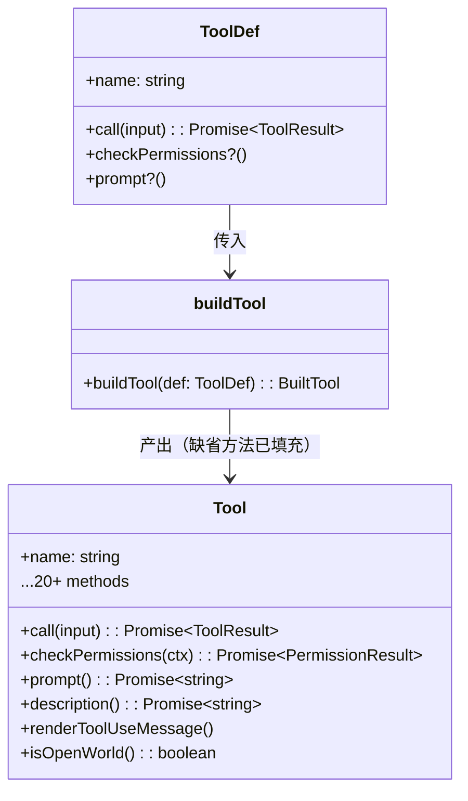

**权衡**：

| 优点 | 缺点 |
|------|------|
| 工具定义极简（只写差异） | `BuiltTool` 的类型推导复杂，依赖重载 |
| 新增工具只需关注核心逻辑 | 运行时覆盖默认行为不够直观 |
| `satisfies ToolDef` 编译期类型安全 | `MCPTool` 用原型覆盖的方式绕过了工厂 |

**实例**：`MCPTool` 的 `name`、`call`、`prompt` 都在 `mcpClient.ts` 运行时覆盖，这说明工厂模式对动态场景支持不足。

## 2. 观察者模式（Observer Pattern）

**位置**：`src/utils/hooks/` 目录

**问题**：工具执行前/后需要触发可扩展的副作用（日志、权限、遥测），但核心流程不应硬编码这些逻辑。

**方案**：Hook 系统实现事件-监听模型：

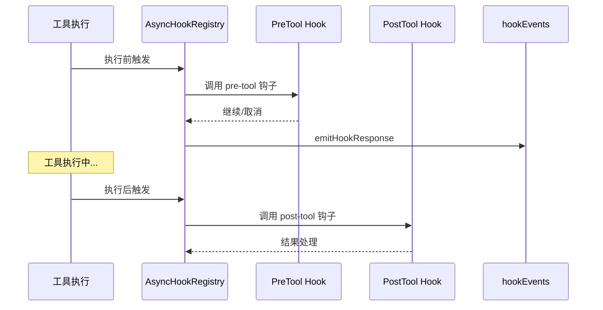

关键文件：

| 文件 | 角色 |
|------|------|
| `AsyncHookRegistry.ts` | 注册表核心，管理钩子执行 |
| `hookEvents.ts` | 事件分发，`registerHookEventHandler()` |
| `hooksConfigManager.ts` | 从 `.claude/settings.json` 加载钩子配置 |
| `execAgentHook.ts` | Agent 钩子执行器 |
| `execHttpHook.ts` | HTTP 钩子执行器（含 SSRF Guard） |
| `execPromptHook.ts` | Prompt 钩子执行器 |

**权衡**：

| 优点 | 缺点 |
|------|------|
| 解耦工具逻辑与副作用 | 异步钩子错误处理复杂 |
| 用户可通过配置文件扩展 | `postToolHooks` 取消操作是破坏性的 |
| 支持 HTTP/Prompt/Agent 多种钩子类型 | HTTP Hook 引入 SSRF 风险，需额外防护 |

## 3. 策略模式（Strategy Pattern）

**位置**：`src/utils/permissions/PermissionMode.ts`、`src/types/permissions.ts`

**问题**：不同场景需要不同的工具访问策略，但权限求值逻辑应统一。

**方案**：7 种权限模式作为策略，由统一入口 `canUseTool()` 分派：

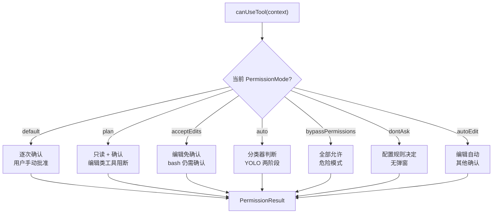

`PermissionModeConfig` 为每种模式定义 UI 展示属性：

```typescript
const PERMISSION_MODE_CONFIG = {
  default:    { title: 'Default',         color: 'text',        symbol: '' },
  plan:       { title: 'Plan Mode',       color: 'planMode',    symbol: '⏸' },
  acceptEdits:{ title: 'Accept edits',    color: 'autoAccept',  symbol: '⏵⏵' },
  bypassPermissions: { title: 'Bypass Permissions', color: 'error', symbol: '⏵⏵' },
  auto:       { title: 'Auto mode',       color: 'warning',     symbol: '⏵⏵' },
  // auto 仅 ant 内部可用
}
```

**权衡**：

| 优点 | 缺点 |
|------|------|
| 新增模式不影响求值逻辑 | `auto` 模式的分类器逻辑是独立的 200+ 行代码 |
| 模式切换无需重载 | `bypassPermissions` 和 `auto` 的边界模糊 |
| 配置化 UI 属性 | `ExternalPermissionMode` 排除 `auto`，类型系统需额外维护 |

## 4. 状态机（State Machine）

### 4.1 Bridge 连接状态

**位置**：`src/bridge/replBridge.ts` 第 83 行

```typescript
export type BridgeState = 'ready' | 'connected' | 'reconnecting' | 'failed'
```

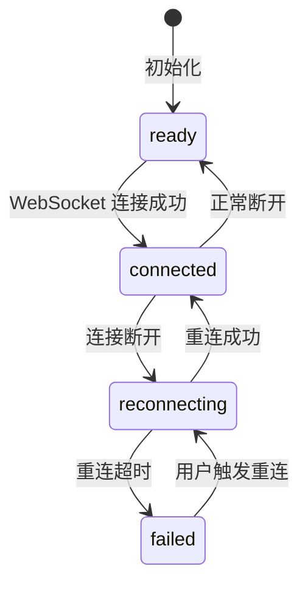

### 4.2 Buddy 生命状态

**位置**：`src/buddy/types.ts`

Buddy（宠物）系统使用确定性 PRNG (Mulberry32) + FNV-1a 哈希生成属性，稀有度状态机控制成长路径：

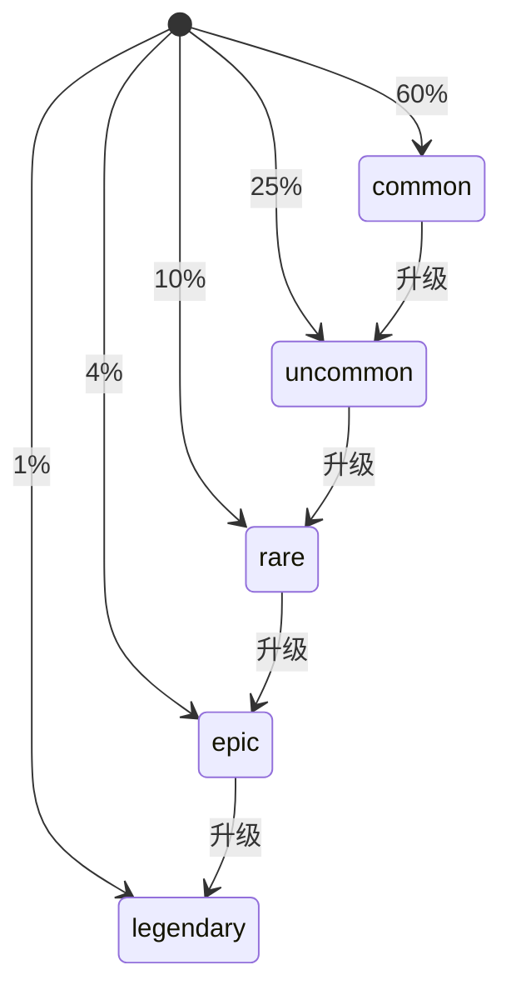

**权衡**：

| 优点 | 缺点 |
|------|------|
| 状态转换显式可追踪 | Bridge 状态只有 4 个，但转换逻辑分散在 3 个文件中 |
| 便于 UI 响应式更新 | 缺少状态机库，纯类型约束容易遗漏转换 |

## 5. 不可变状态（Immutable State）

**位置**：`src/state/AppStateStore.ts`、`src/state/AppState.tsx`

**问题**：全局状态被数百个组件和 Hook 共享，可变状态会导致竞态条件和不可预测行为。

**方案**：`AppState` 作为不可变 Record，每次更新产生新对象：

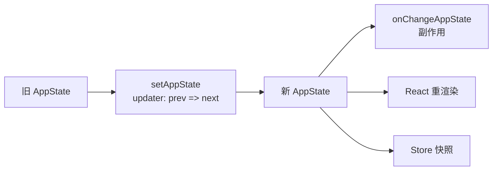

`AppStateProvider` 使用 React Context 传播状态：

```typescript
const [store] = useState(() => createStore(initialState, onChangeAppState))
```

`createStore` 返回的 store 通过 `useSyncExternalStore` 连接 React，确保组件只在相关状态切片变化时重渲染。

**权衡**：

| 优点 | 缺点 |
|------|------|
| 状态变更可追踪（prev vs next） | 每次 `setAppState` 产生新对象，GC 压力 |
| 消除竞态条件 | 深层更新需要展开语法，代码冗长 |
| 便于时间旅行调试 | `DeepImmutable` 类型使类型推导困难 |

## 6. 异步生成器（Async Generator）

**位置**：`src/query.ts` 第 221、244 行

**问题**：LLM API 调用是流式的——token 逐步返回，中间可能触发工具调用。传统 `Promise` 无法表达"持续产生中间结果"的语义。

**方案**：`query()` 返回 `AsyncGenerator`，逐步 yield 消息：

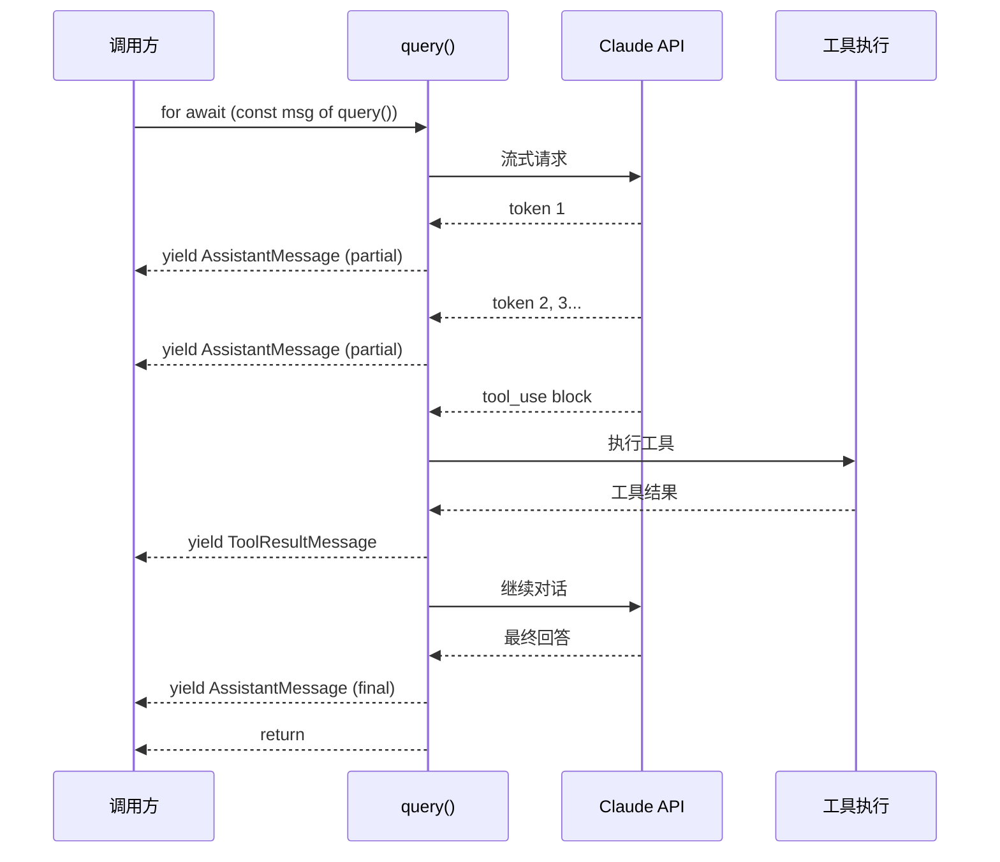

两个核心生成器签名：

```typescript
// 第 221 行：主查询生成器
export async function* query(...): AsyncGenerator<Message>

// 第 244 行：流式处理生成器
export async function* streamQuery(...): AsyncGenerator<Message>
```

**权衡**：

| 优点 | 缺点 |
|------|------|
| 完美匹配 SSE 流式语义 | 错误处理需 try/catch 包裹每次 `yield` |
| 调用方可随时 `break` 取消 | 生成器嵌套调试困难 |
| 工具调用天然嵌入流程 | `next()` 调用时序对初学者不直观 |

## 7. 注册表模式（Registry Pattern）

**位置**：`src/tools.ts` (`getTools`)、`src/commands.ts`、`src/skills/`

**问题**：工具、命令、技能的数量可扩展，需要统一注册和查找机制。

**方案**：三个独立注册表，各自管理生命周期：

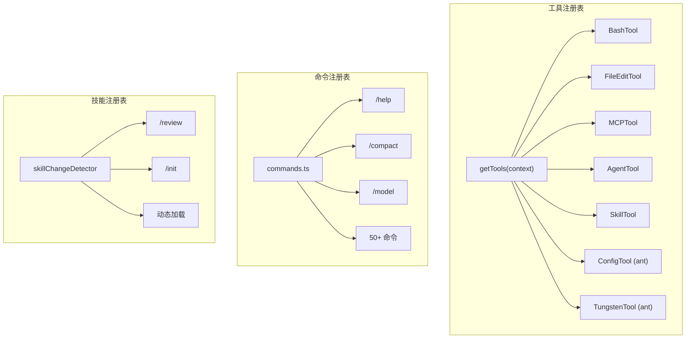

`getTools()` 根据编译开关和运行时条件动态组装工具列表：

```typescript
// 条件注册示例
...(process.env.USER_TYPE === 'ant' ? [ConfigTool, TungstenTool] : []),
...(feature('PROACTIVE') || feature('KAIROS') ? [SleepTool] : []),
...(feature('AGENT_TRIGGERS') ? cronTools : []),
```

**权衡**：

| 优点 | 缺点 |
|------|------|
| 运行时动态组装 | 条件注册散布在 `getTools()` 中，难以全局视图 |
| DCE 消除未注册工具 | `require()` 形式的条件导入绕过模块分析 |
| 支持 ant-only 工具 | 三套注册表 API 不统一 |

## 8. Provider-Context 模式（Provider-Context）

**位置**：`src/state/AppState.tsx`、`src/context/` 目录

**问题**：React 组件树需要共享全局状态，但 prop drilling 导致深层组件签名膨胀。

**方案**：React Context + Provider 组合：

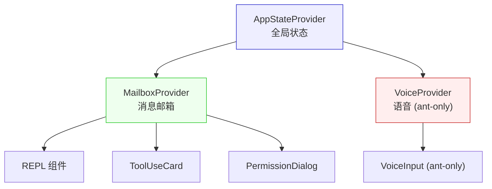

`AppStateProvider` 内部使用 `createStore` 创建不可变 store，通过 `React.createContext` 传播：

```typescript
export const AppStoreContext = React.createContext<AppStateStore | null>(null)
const HasAppStateContext = React.createContext<boolean>(false)
```

**权衡**：

| 优点 | 缺点 |
|------|------|
| 深层组件直接访问状态 | Context 变化导致整棵子树重渲染 |
| 类型安全的消费 Hook | `useContext(AppStoreContext)` 返回 `null` 需处理 |
| Provider 可嵌套隔离 | 测试需要包裹 Provider 体系 |

## 9. 适配器模式（Adapter Pattern）

**位置**：`src/tools/MCPTool/MCPTool.ts`、`src/services/mcp/client.ts`

**问题**：MCP 服务器定义的工具接口与 Claude Code 的 `Tool` 接口不同，但需要在运行时无缝适配。

**方案**：`MCPTool` 作为原型模板，在 `mcpClient.ts` 中被逐属性覆盖：

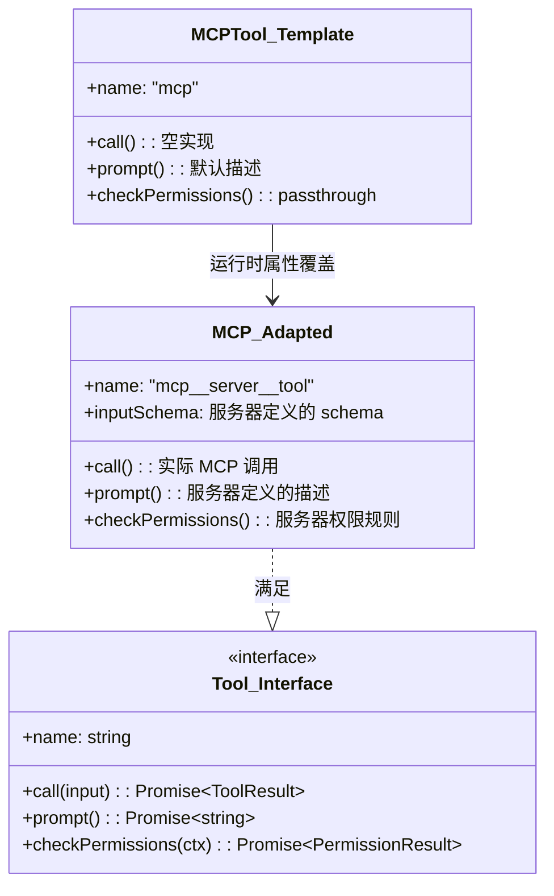

`MCPTool.ts` 中的注释说明了这种设计：

```typescript
export const MCPTool = buildTool({
  isMcp: true,
  // Overridden in mcpClient.ts with the real MCP tool name + args
  name: 'mcp',
  // Overridden in mcpClient.ts
  async call() { return { data: '' } },
  // Overridden in mcpClient.ts
  async prompt() { return PROMPT },
  ...
})
```

**权衡**：

| 优点 | 缺点 |
|------|------|
| MCP 工具无需重写即可接入 | 属性覆盖绕过了 TypeScript 类型检查 |
| 运行时动态适配 | `buildTool()` 的默认值全部被覆盖，模板本身无意义 |
| 保持 Tool 接口统一 | 调试时需要知道覆盖发生在哪个文件 |

## 10. 责任链模式（Chain of Responsibility）

**位置**：`src/utils/permissions/permissions.ts` 中的 `canUseTool()`、`PermissionRule` 求值

**问题**：权限决定需要依次检查多个来源（deny 规则 → allow 规则 → 分类器 → 用户确认），每个来源有权短路。

**方案**：权限规则按优先级链式求值：

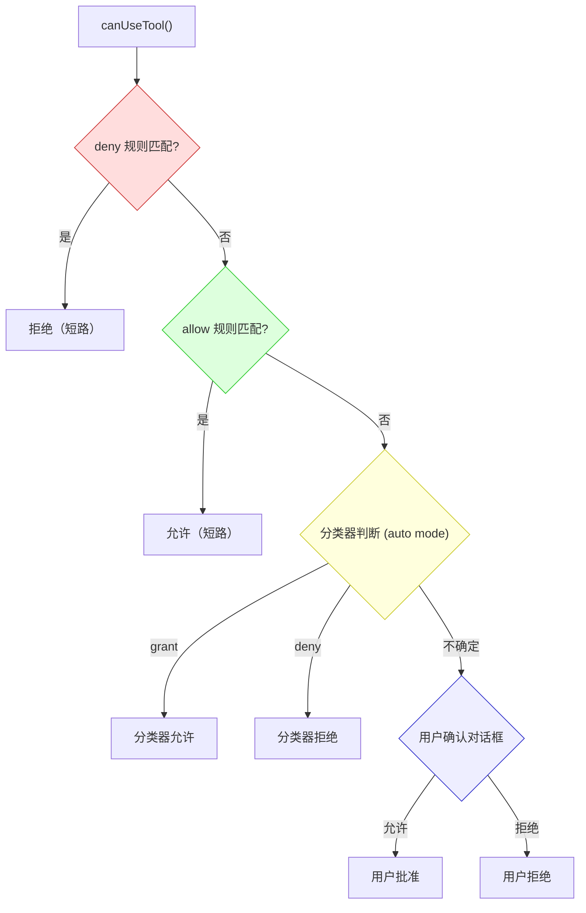

规则来源的优先级链（从高到低）：

| 优先级 | 来源 | 说明 |
|--------|------|------|
| 1 | Managed Settings | 管理员策略，不可覆盖 |
| 2 | Project `.claude/settings.json` | 项目级规则 |
| 3 | User `~/.claude/settings.json` | 用户级规则 |
| 4 | Auto-mode classifier | 分类器实时判断 |
| 5 | User confirmation dialog | 运行时确认 |

`PermissionRule` 类型定义了链节点的统一结构：

```typescript
type PermissionRule = {
  toolName: string
  ruleContent?: string        // 如 "Bash(npm run:*)"
  behavior: PermissionBehavior // 'allow' | 'deny'
  source: PermissionRuleSource // 来源标识
}
```

**权衡**：

| 优点 | 缺点 |
|------|------|
| 规则优先级显式可追溯 | `deny` 总是优先于 `allow`，无法配置例外 |
| 短路求值高效 | 分类器延迟（~200ms）影响 auto 模式响应速度 |
| 多来源规则可共存 | `shadowedRuleDetection.ts` 说明规则遮蔽是常见问题 |

## 模式总结

| 模式 | 解决的核心问题 | 使用频率 | 代码质量 |
|------|--------------|---------|---------|
| Factory | 工具定义去重 | 50+ 处 | 高 |
| Observer | 工具执行副作用解耦 | 6 种 Hook 类型 | 高 |
| Strategy | 权限模式可扩展 | 7 种模式 | 中 |
| State Machine | 连接/生命状态追踪 | 2 处 | 中 |
| Immutable State | 全局状态安全共享 | 1 处（核心） | 高 |
| Async Generator | 流式 LLM 响应 | 2 处 | 高 |
| Registry | 可扩展注册机制 | 3 套 | 中 |
| Provider-Context | React 状态传播 | 3 个 Provider | 中 |
| Adapter | MCP 工具动态适配 | 1 处 | 低 |
| Chain of Responsibility | 权限规则优先级 | 5 级 | 高 |

<div class="chapter-nav-hint">

设计模式贯穿全书各章。工具工厂见第五章，权限策略见第三章，异步生成器见第四章。下一专题：[God File 现象](/appendix-topics/god-file)
</div>
