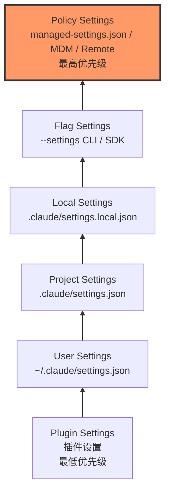
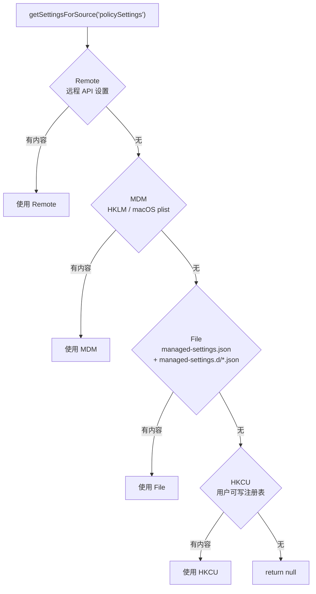
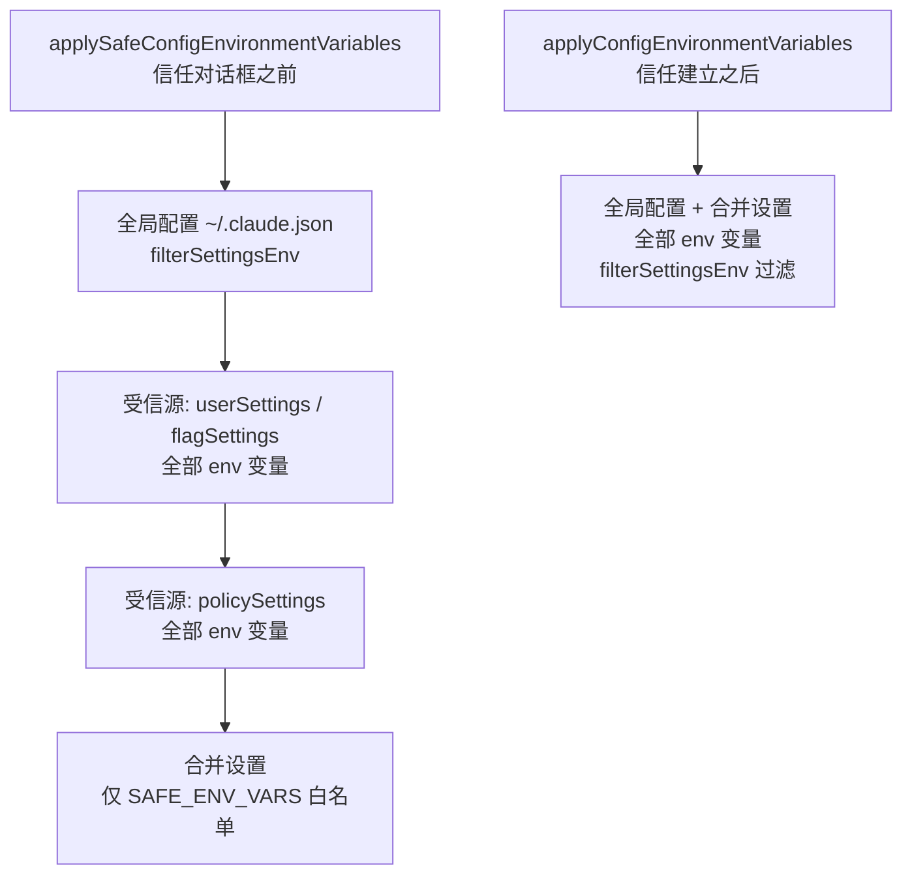
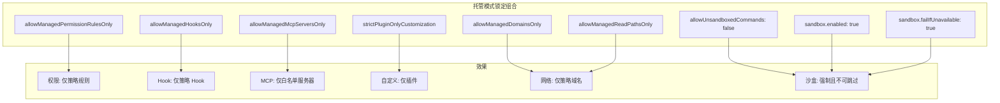
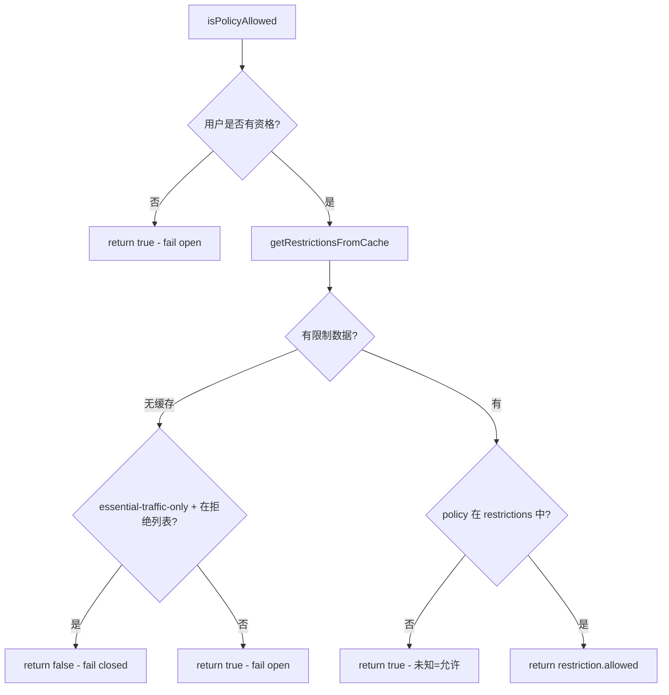
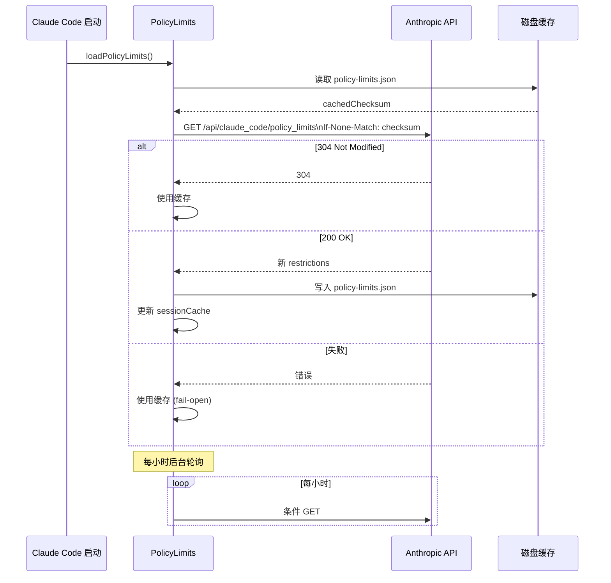
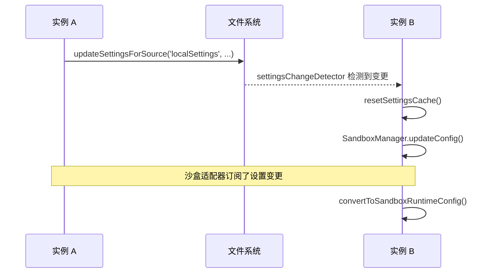

# 企业策略与管控

> 前置知识：[第二章 2.1](/ch02-identity/auth-settings)（配置）、[第三章](/ch03-constraints/permission-engine)（权限）

## 源码定位

Claude Code 的企业策略体系横跨设置加载、权限控制、策略限制、Hook 管控四个层面。核心代码集中在 `src/utils/settings/`、`src/utils/permissions/`、`src/services/policyLimits/` 和 `src/utils/hooks/` 目录。

## 五级设置层级

Claude Code 的设置系统遵循严格的优先级层级，高优先级源覆盖低优先级源的值：



| 层级 | 源 | 路径 | 可编辑 | 范围 |
|------|-----|------|--------|------|
| Plugin | 插件系统 | 插件 manifest | 否 | 全局 |
| User | `userSettings` | `~/.claude/settings.json` | 是 | 全局 |
| Project | `projectSettings` | `$PROJ/.claude/settings.json` | 是 | 项目级 |
| Local | `localSettings` | `$PROJ/.claude/settings.local.json` | 是 | 项目级(gitignored) |
| Flag | `flagSettings` | `--settings` 参数 / SDK inline | 否 | 会话级 |
| Policy | `policySettings` | 多源(见下文) | **否** | 组织级 |

### 合并规则

设置使用 `lodash.mergeWith` 深度合并，自定义合并策略：

- **数组**：合并后去重（`mergeArrays`：`uniq([...target, ...source])`）
- **对象**：深度合并（递归应用相同规则）
- **`undefined` 值**：视为删除操作（从结果中移除该键）

```typescript
// settings.ts L538-547
export function settingsMergeCustomizer(objValue, srcValue): unknown {
  if (Array.isArray(objValue) && Array.isArray(srcValue)) {
    return mergeArrays(objValue, srcValue)
  }
  return undefined // lodash 默认行为
}
```

### `--setting-sources` 限制

SDK 模式下可通过 `--setting-sources` 参数限制加载的设置源。`policySettings` 和 `flagSettings` 始终包含，不可排除：

```typescript
// constants.ts L159-167
export function getEnabledSettingSources(): SettingSource[] {
  const allowed = getAllowedSettingSources()
  const result = new Set<SettingSource>(allowed)
  result.add('policySettings')  // 始终包含
  result.add('flagSettings')    // 始终包含
  return Array.from(result)
}
```

## Policy Settings 的四级来源

`policySettings` 遵循"首个有效源胜出"规则（而非合并），优先级从高到低：



### 1. Remote（远程 API 设置）

通过 Anthropic API 获取的组织级策略，带有 ETag 缓存和后台轮询：

- 首次加载时阻塞等待
- 之后每小时后台轮询（`POLLING_INTERVAL_MS = 3600000`）
- 使用 ETag/If-None-Match 实现条件请求
- 失败时回退到磁盘缓存（fail-open）

### 2. MDM（移动设备管理）

- macOS：通过 plist 文件分发（`/Library/Application Support/ClaudeCode/`）
- Windows：通过 HKLM 注册表项分发（`C:\Program Files\ClaudeCode\`）
- Linux：通过 `/etc/claude-code/` 目录

### 3. File（文件策略）

```typescript
// managedPath.ts
export const getManagedFilePath = memoize(function (): string {
  switch (getPlatform()) {
    case 'macos':   return '/Library/Application Support/ClaudeCode'
    case 'windows': return 'C:\\Program Files\\ClaudeCode'
    default:        return '/etc/claude-code'
  }
})
```

支持 drop-in 目录：`managed-settings.d/*.json`，按字母序排序后逐层合并，后文件覆盖前文件。这遵循 systemd/sudoers 的 drop-in 惯例，允许不同团队维护独立的策略片段（如 `10-otel.json`、`20-security.json`）。

### 4. HKCU（用户可写注册表）

最低优先级的策略源，仅 Windows 上有效。因为是用户可写的，安全保证弱于 HKLM/plist。

## 策略覆盖用户偏好的机制

### 环境变量分层应用

环境变量的应用分两个阶段，信任级别决定哪些变量可以应用：



**安全过滤链**（`filterSettingsEnv`）：

| 过滤器 | 条件 | 作用 |
|--------|------|------|
| `withoutSSHTunnelVars` | `ANTHROPIC_UNIX_SOCKET` 存在 | 剥离 SSH 隧道占位变量 |
| `withoutHostManagedProviderVars` | `CLAUDE_CODE_PROVIDER_MANAGED_BY_HOST` | 剥离提供商路由变量 |
| `withoutCcdSpawnEnvKeys` | `CLAUDE_CODE_ENTRYPOINT=claude-desktop` | 剥离桌面宿主进程变量 |

项目作用域的设置（`projectSettings`/`localSettings`）在信任建立前**只能**应用 `SAFE_ENV_VARS` 白名单中的变量，防止恶意项目通过 `ANTHROPIC_BASE_URL` 重定向流量。

## 基于策略的工具限制

### `allowManagedPermissionRulesOnly`

当此策略启用时，权限系统发生根本变化：

```typescript
// permissionsLoader.ts L31-36
export function shouldAllowManagedPermissionRulesOnly(): boolean {
  return (
    getSettingsForSource('policySettings')?.allowManagedPermissionRulesOnly === true
  )
}
```

影响：

- `loadAllPermissionRulesFromDisk()` 仅加载 `policySettings` 的权限规则
- `addPermissionRulesToSettings()` 返回 `false`，阻止新增规则
- `shouldShowAlwaysAllowOptions()` 返回 `false`，隐藏权限提示中的"始终允许"选项

### `allowManagedMcpServersOnly`

MCP 服务器白名单策略：

- `allowedMcpServers` 仅从 `policySettings` 读取
- `deniedMcpServers` 仍从所有源合并（用户可以拒绝，但不能允许被拒绝的）
- 用户仍可添加自己的 MCP 服务器，但只有管理员定义的白名单生效

### `strictPluginOnlyCustomization`

控制哪些自定义表面只能通过插件提供：

```typescript
// types.ts
export const CUSTOMIZATION_SURFACES = ['skills', 'agents', 'hooks', 'mcp'] as const
```

当设置此策略时，用户无法通过 `~/.claude/{surface}/` 或 `.claude/{surface}/` 添加自定义内容，只能使用插件提供的。策略源（`policySettings`）和插件不受限制。

**前向兼容处理**：未知的 surface 名会被静默丢弃（而非导致整个策略文件无效），确保旧客户端不会因为新 surface 名而崩溃：

```typescript
// types.ts -- preprocess 过滤
z.preprocess(
  v => Array.isArray(v)
    ? v.filter(x => (CUSTOMIZATION_SURFACES as readonly string[]).includes(x))
    : v,
  z.union([z.boolean(), z.array(z.enum(CUSTOMIZATION_SURFACES))]),
)
```

### `allowManagedHooksOnly`

仅允许运行来自 `policySettings` 的 Hook，用户/项目/本地的 Hook 全部被忽略。

## 托管模式（Managed Mode）

当多个策略锁定同时启用时，Claude Code 进入类似"托管模式"的状态：



在完全托管模式下，用户几乎无法修改任何安全相关的行为，所有决策都由组织策略控制。

## Policy Limits 服务

`policyLimits` 服务从 Anthropic API 获取组织级功能限制，与 managed settings 互补：

```typescript
// policyLimits/types.ts
export const PolicyLimitsResponseSchema = z.object({
  restrictions: z.record(z.string(), z.object({ allowed: z.boolean() })),
})
```

### 限制检查

`isPolicyAllowed(policy)` 检查特定功能是否被允许：



**关键设计**：默认 fail-open（未知策略允许执行），但在 `essential-traffic-only` 模式下，特定策略（如 `allow_product_feedback`）fail-closed，确保 HIPAA 组织在缓存不可用时不会意外启用功能。

### 资格判断

```typescript
// policyLimits/index.ts -- isPolicyLimitsEligible()
// 1. 必须是 first-party 提供商（非 3p）
// 2. 必须使用 Anthropic 官方 base URL
// 3. Console 用户（API key）：有资格
// 4. OAuth 用户：仅 Team 和 Enterprise 订阅有资格
```

### 缓存与轮询



## 审计与合规

### 设置源追踪

`getSettingsWithSources()` 返回有效设置及各源的原始值，用于审计追踪：

```typescript
// settings.ts
export type SettingsWithSources = {
  effective: SettingsJson
  sources: Array<{ source: SettingSource; settings: SettingsJson }>
}
```

### 策略源识别

`getPolicySettingsOrigin()` 返回当前生效的策略来源：

| 返回值 | 含义 |
|--------|------|
| `'remote'` | 远程 API 策略（最高优先级） |
| `'plist'` | macOS MDM plist |
| `'hklm'` | Windows HKLM 注册表 |
| `'file'` | managed-settings.json 文件 |
| `'hkcu'` | Windows HKCU 注册表（最低） |
| `null` | 无策略设置 |

### 沙盒设置锁定

`areSandboxSettingsLockedByPolicy()` 检查 `flagSettings` 或 `policySettings` 是否设置了任何沙盒相关字段，锁定时 UI 禁止用户修改。

### 管理设置键日志

`getManagedSettingsKeysForLogging()` 提取策略设置的键路径用于审计日志，对嵌套设置（`permissions`、`sandbox`、`hooks`）展开一层：

```
permissions.allow, permissions.deny, sandbox.enabled, sandbox.network,
hooks.PreToolUse, hooks.PostToolUse, ...
```

## 设置变更传播

在多实例场景（如 `--worktree` 模式）中，设置变更需要传播到所有活跃实例。`settingsChangeDetector` 负责监听文件变更并触发回调：



设置缓存是会话级的（`setSessionSettingsCache`），`resetSettingsCache()` 会使所有缓存失效，强制从磁盘重新加载。`updateSettingsForSource()` 在写入文件后自动调用 `resetSettingsCache()`。

## MCP 服务器企业管控

### 白名单与黑名单

```typescript
// types.ts
allowedMcpServers: z.array(AllowedMcpServerEntrySchema).optional()
deniedMcpServers: z.array(DeniedMcpServerEntrySchema).optional()
```

每个条目支持三种匹配方式（互斥）：

| 字段 | 匹配方式 | 示例 |
|------|---------|------|
| `serverName` | 精确名称匹配 | `{serverName: "internal-api"}` |
| `serverCommand` | 命令数组精确匹配 | `{serverCommand: ["npx", "mcp-server"]}` |
| `serverUrl` | URL 通配符模式 | `{serverUrl: "https://*.example.com/*"}` |

黑名单优先于白名单：如果服务器同时出现在两个列表中，它会被拒绝。

### 市场管控

| 设置 | 作用 |
|------|------|
| `strictKnownMarketplaces` | 仅允许列出的市场源，检查在下载前 |
| `blockedMarketplaces` | 阻止列出的市场源 |
| `extraKnownMarketplaces` | 预注册允许的市场 |

三者组合实现端到端管控：插件必须来自允许的市场，市场只能使用管理员定义的源，自定义表面只能通过插件提供。

## 关键源文件

| 文件 | 职责 |
|------|------|
| `src/utils/settings/settings.ts` | 设置加载、合并、持久化（约 1016 行） |
| `src/utils/settings/types.ts` | SettingsSchema 完整定义（约 1149 行） |
| `src/utils/settings/constants.ts` | SETTING_SOURCES 优先级定义 |
| `src/utils/settings/managedPath.ts` | 托管设置路径解析 |
| `src/utils/permissions/permissionsLoader.ts` | 权限规则加载与策略过滤 |
| `src/services/policyLimits/index.ts` | Policy Limits API 服务 |
| `src/services/policyLimits/types.ts` | Policy Limits Schema |
| `src/utils/managedEnv.ts` | 环境变量分层应用 |
| `src/utils/hooks/hooksConfigManager.ts` | Hook 事件元数据与匹配 |
| `src/utils/hooks/hookEvents.ts` | Hook 执行事件系统 |
| `src/utils/settings/pluginOnlyPolicy.ts` | strictPluginOnlyCustomization 运行时 |
| `src/utils/permissions/shadowedRuleDetection.ts` | 不可达规则检测 |

<div class="chapter-nav-hint">
企业策略通过沙盒设置锁定强化安全 -- 参见 <a href="/appendix-hidden/sandbox-deep">沙盒深度</a>。策略诊断问题会被 Doctor 检测 -- 参见 <a href="/appendix-hidden/doctor">Doctor 诊断</a>。
</div>
