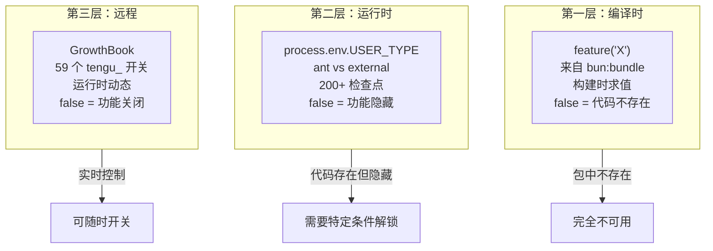
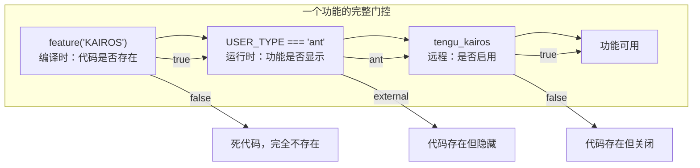

# 三层门控架构

> 前置：[2.4 特性标志与遥测](/ch02-identity/feature-flags)

Claude Code 的产品行为由三层门控控制。每层有不同的生效时机、覆盖范围和绕过难度。

## 架构总览

## 第一层：编译时 `feature()`

85 个开关，通过 `bun:bundle` 的 `feature()` 函数在构建时求值。值为 `false` 时，相关代码通过 tree-shaking 完全从包中移除。

**外部发布版** vs **内部版** 的区别就在这里：内部版 (`ant` build) 开启大部分开关，外部版关闭许多。

### 关键编译时开关

| 开关 | 功能 | 外部可用 |
|------|------|---------|
| `BUDDY` | 宠物系统 | 否 |
| `KAIROS` | 持久助手 | 否 |
| `BRIDGE_MODE` | 远程控制 | 否 |
| `COORDINATOR_MODE` | 多Agent编排 | 否 |
| `ULTRAPLAN` | 云端规划 | 否 |
| `VOICE_MODE` | 语音模式 | 否 |
| `FORK_SUBAGENT` | Fork 子代理 | 是 |
| `BG_SESSIONS` | 后台会话 | 是 |
| `AGENT_TRIGGERS` | Agent 触发器/Cron | 否 |
| `WEB_BROWSER_TOOL` | Web 浏览器工具 | 否 |
| `MONITOR_TOOL` | Monitor 工具 | 否 |
| `COMMIT_ATTRIBUTION` | 提交属性标记 | 是 |
| `EXTRACT_MEMORIES` | 记忆提取 | 是 |
| `TOKEN_BUDGET` | Token 预算追踪 | 是 |
| `SSH_REMOTE` | SSH 远程模式 | 否 |
| `DIRECT_CONNECT` | 直连模式 | 否 |
| `LODESTONE` | 深度链接协议 | 否 |
| `CONTEXT_COLLAPSE` | 上下文折叠 | 否 |
| `CACHED_MICROCOMPACT` | 缓存微压缩 | 否 |
| `WORKFLOW_SCRIPTS` | 工作流脚本 | 否 |

## 第二层：运行时 `USER_TYPE`

200+ 检查点使用 `process.env.USER_TYPE === 'ant'` 判断。代码存在于包中，但对 `external` 用户隐藏功能。

**典型的 ant-only 功能：**

| 功能 | 说明 |
|------|------|
| TungstenTool | 基于 tmux 的终端面板工具 |
| REPLTool | 运行中会话内执行任意 JS |
| ConfigTool | 运行时配置工具（外部用户用 /config 命令） |
| 堆转储 | `/heapdump` 捕获堆快照 |
| 自托管运行器 | `claude self-hosted-runner` |
| 增强遥测 | `ENHANCED_TELEMETRY_BETA` |
| Perfetto 追踪 | `PERFETTO_TRACING` 性能分析 |

**绕过方式**：设置 `USER_TYPE=ant` 环境变量，但某些功能还需要 GrowthBook 远程开关配合。

## 第三层：远程 GrowthBook

59 个 `tengu_` 前缀的远程开关，运行时动态评估。

### 关键远程开关

| 开关 | 功能 | 影响范围 |
|------|------|---------|
| `tengu_amber_flint` | Swarm/多Agent团队 | 外部版的杀手开关 |
| `tengu_kairos` | KAIROS 持久助手 | 功能总开关 |
| `tengu_ccr_bridge` | Bridge 远程控制 | 连接门控 |
| `tengu_auto_mode_config` | Auto 模式配置 | 启用/选择加入/禁用 |
| `tengu_cobalt_raccoon` | 主动压缩阈值 | 上下文管理 |
| `tengu_onyx_plover` | Dream 整合阈值 | 记忆系统 |
| `tengu_lodestone_enabled` | 深度链接注册 | IDE 集成 |
| `tengu_turtle_carbon` | 超思考努力提升 | 推理能力 |
| `tengu_destructive_command_warning` | 破坏性命令警告 | 安全 |
| `tengu_chrome_auto_enable` | Chrome 自动启用 | 平台集成 |
| `tengu_cicada_nap_ms` | 后台刷新节流 | 性能 |
| `tengu_harbor_permissions` | 渠道权限 | 多用户 MCP |
| `tengu_sessions_elevated_auth_enforcement` | 可信设备强制 | 安全 |

## 三层交互

**安全含义**：
- 编译时开关是硬墙——外部版完全无法绕过
- 运行时检查可被环境变量绕过，但可能缺少配合的远程开关
- 远程开关可随时变更，是产品运营的主要杠杆

---

## 关键源文件

| 文件 | 职责 |
|------|------|
| `src/services/analytics/growthbook.ts` | GrowthBook SDK 集成 |
| 各工具的 `isEnabled()` | 编译时/运行时门控 |
| 各命令的 `isHidden` | 命令可见性控制 |

---

**返回：[2.4 特性标志与遥测](/ch02-identity/feature-flags)** | **更多专题：[三层门控架构 →](/appendix-topics/gate-architecture)**

