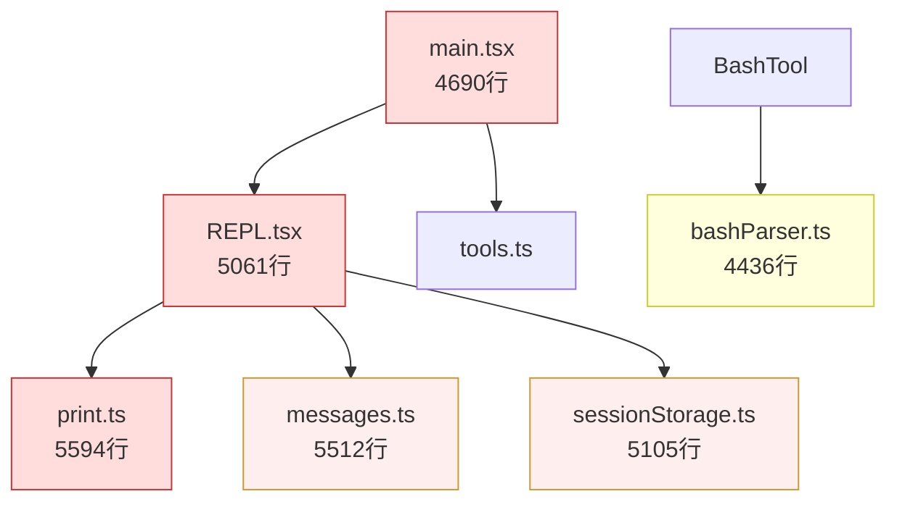
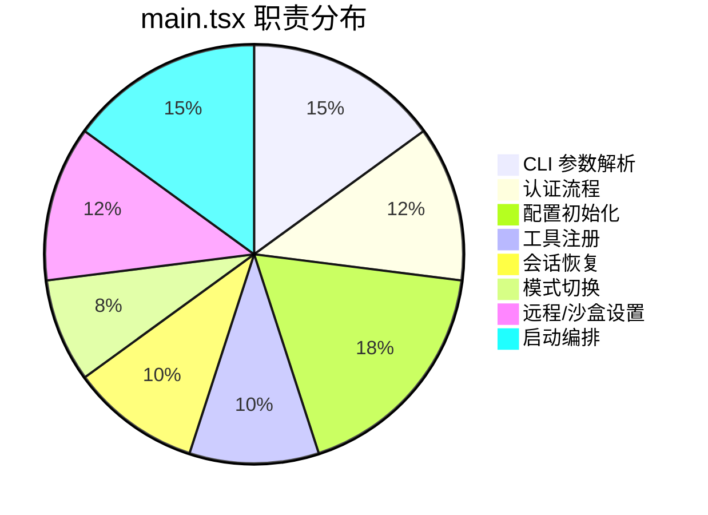
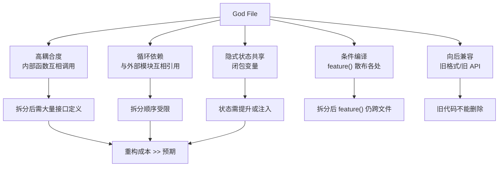
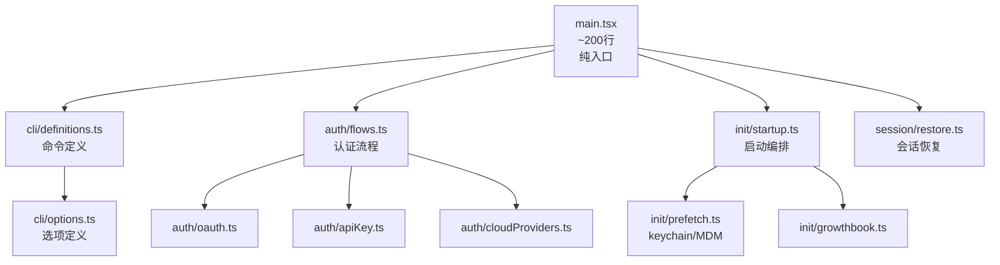
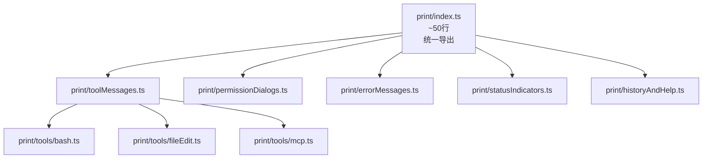

# "God File" 现象

> 前置：全八章。本章分析 Claude Code 中几个超大型"上帝文件"的成因、结构、影响与重构路径。

## 什么是 God File

God File（上帝文件）指承担过多职责、代码行数远超合理阈值的单一文件。在 Claude Code 中，至少有 6 个文件超过 2500 行，最大的达到 5594 行。

## 六大 God File 概览

| 文件 | 行数 | 主要职责 | 依赖方向 |
|------|------|---------|---------|
| `src/cli/print.ts` | 5594 | 输出渲染、消息格式化 | 被 REPL/REPLTool 调用 |
| `src/utils/messages.ts` | 5512 | 消息构建、对话管理 | 核心，被大量模块依赖 |
| `src/utils/sessionStorage.ts` | 5105 | 会话持久化/恢复 | 被主循环调用 |
| `src/screens/REPL.tsx` | 5061 | 主 UI 编排 | 顶层 UI 组件 |
| `src/main.tsx` | 4690 | 初始化、CLI 解析、启动 | 入口文件 |
| `src/utils/bash/bashParser.ts` | 4436 | Bash AST 解析 | 被 BashTool 调用 |

红色 = 超过 4000 行，橙色 = 超过 5000 行。文件越大，重构风险越高。

## 逐文件剖析

### 1. `src/main.tsx` (4690 行) — "The God File"

这是 Claude Code 的入口文件，也是名字最贴切的 God File。它承担了至少 8 类职责：

**结构剖析**：

| 代码区域 | 行范围 | 职责 | 依赖数量 |
|----------|--------|------|---------|
| 1-80 | 导入区 | 67 个顶层 import + 条件 require | 67+ |
| 80-400 | 辅助函数 | 配置获取、环境检测 | ~15 |
| 400-1200 | CLI 定义 | Commander 命令、选项、子命令 | ~20 |
| 1200-2000 | action 处理器 | 主启动流程、认证编排 | ~30 |
| 2000-2800 | 认证逻辑 | OAuth、API Key、Bedrock/Vertex | ~10 |
| 2800-3500 | 会话管理 | 恢复、文件下载、MCP 连接 | ~15 |
| 3500-4200 | 模式/设置 | plan mode、fast mode、effort | ~10 |
| 4200-4690 | 启动编排 | launchRepl、错误处理 | ~5 |

**为什么它这么大**：

1. **CLI 定义与启动流程耦合**：Commander 的命令定义、选项解析、action 处理器全在一个文件中
2. **认证流程复杂度**：OAuth + API Key + Bedrock + Vertex + Foundry 五条认证路径
3. **条件编译集中**：`feature()` 和 `USER_TYPE` 检查在入口处集中决定功能启用
4. **启动时序依赖**：keychain 预取、MDM 读取、GrowthBook 初始化等有严格时序

### 2. `src/screens/REPL.tsx` (5061 行) — "UI 编排器"

REPL.tsx 是主交互界面，几乎所有 UI 状态和事件处理都汇聚于此。

| 职责 | 占比 | 说明 |
|------|------|------|
| 渲染逻辑 | 30% | 终端 UI 组件组合、条件渲染 |
| 事件处理 | 25% | 键盘事件、工具结果、权限对话框 |
| 状态管理 | 20% | 本地 state、AppState 消费 |
| 工具调用编排 | 15% | query() 调用、消息追加 |
| 生命周期 | 10% | useEffect、初始化、清理 |

**膨胀原因**：Ink（React 终端渲染器）的编程模型鼓励在组件内处理副作用，导致 REPL 同时是视图层和业务逻辑层。

### 3. `src/cli/print.ts` (5594 行) — "输出渲染器"

这是整个代码库中最大的文件，负责将内部数据结构渲染为终端可显示的文本。

| 渲染目标 | 函数数量 | 说明 |
|----------|---------|------|
| 工具调用消息 | ~15 | `renderBashToolUseMessage` 等 |
| 工具结果 | ~10 | 不同工具的结果格式化 |
| 权限对话框 | ~5 | 确认/拒绝 UI |
| 错误消息 | ~8 | 错误分类和格式化 |
| 状态指示 | ~5 | 加载、进度、等待 |
| 历史/帮助 | ~4 | 命令列表、历史记录 |

**膨胀原因**：终端 UI 缺乏组件化框架（不像 Web 有 CSS），每种输出形态需要独立的格式化函数。50+ 种工具各有自己的渲染逻辑。

### 4. `src/utils/messages.ts` (5512 行) — "消息工厂"

负责构建所有类型的 `Message` 对象：用户消息、助手消息、系统消息、工具结果消息等。

**膨胀原因**：消息类型超过 10 种，每种需要不同的构建逻辑、验证规则和序列化方式。对话历史的压缩/恢复逻辑也在此文件中。

### 5. `src/utils/sessionStorage.ts` (5105 行) — "会话持久化"

会话的保存、恢复、压缩、迁移。

**膨胀原因**：会话格式经历了多次迭代（v1→v2→v3），向后兼容代码累积。JSONL 逐行存储和整文件存储两套逻辑并存。

### 6. `src/utils/bash/bashParser.ts` (4436 行) — "Bash 解析器"

将 Bash 命令解析为 AST，提取子命令、管道、重定向、环境变量赋值。

**膨胀原因**：Bash 语法极其复杂（heredoc、子 shell、算术展开、进程替换），Tree-sitter 解析结果需要大量后处理。

## 为什么 God File 难以重构

具体困难：

| 困难 | 例子 | 影响 |
|------|------|------|
| 循环依赖 | `main.tsx` → `AppState` → `teammate.ts` → `main.tsx` | 只能用 `require()` 延迟加载 |
| 闭包共享 | REPL.tsx 中 `queryRef` 被 10+ 个 `useEffect` 读写 | 拆分组件需重构为 Context 或 Ref 传递 |
| 条件编译 | `main.tsx` 中 15+ 个 `feature()` / `USER_TYPE` 检查 | 拆分后每个新文件仍需条件导入 |
| 向后兼容 | `sessionStorage.ts` 中 v1/v2 读取代码 | 旧格式不能删除，只能增量添加 |

## 理想分解方案

### main.tsx 理想结构

理想行数分布：main.tsx ~200 行（纯编排），每个子模块 < 500 行。

### print.ts 理想结构

## 行业对比

| 项目 | 最大文件 | 行数 | 策略 |
|------|---------|------|------|
| VS Code | `vscode/code/src/vs/workbench/browser/part.ts` | ~3000 | 主动拆分 + 层次架构 |
| TypeScript Compiler | `checker.ts` | ~50000 | 接受 God File（编译器特例） |
| Next.js | `next/src/server/next-server.ts` | ~2000 | 中间件模式拆分 |
| Claude Code | `src/cli/print.ts` | 5594 | 尚未重构 |

TypeScript Compiler 的 `checker.ts` (5 万行) 是 God File 的极端案例，但编译器类型检查天然是单一职责。Claude Code 的 God File 不同——它们混合了多种不相关的职责。

## 对贡献者的影响

| 影响 | 说明 | 缓解策略 |
|------|------|---------|
| 定位困难 | 不确定某个功能在哪个 God File 的哪个区域 | 全局搜索函数名，而非文件名 |
| 改动风险 | 修改一个区域可能意外影响其他区域 | 每次只改一个职责 |
| 审查困难 | PR 动辄涉及 500+ 行 God File | 在 PR 描述中标注修改的行范围 |
| 测试困难 | 单元测试需模拟大量依赖 | 优先测试提取出的纯函数 |
| 合并冲突 | 多人同时修改同一 God File | 频繁 rebase，避免大范围修改 |

## 重构实践建议

1. **函数提取优先**：先从 God File 中提取纯函数到独立模块，不改变调用方式
2. **逐步替换导入**：新模块导出后，原文件 re-export，逐步迁移调用方
3. **保持测试覆盖**：每次提取前确保有集成测试覆盖该区域
4. **避免大爆炸重写**：不要试图一次性拆分 5000 行文件，每次拆分一个职责
5. **利用循环依赖检测**：`require()` 延迟加载的地方就是最需要拆分的边界

God File 现象与架构设计密切相关。入口文件见第一章，REPL 编排见第二章，消息系统见第四章。下一专题：[源码地图](/appendix-topics/source-map)

