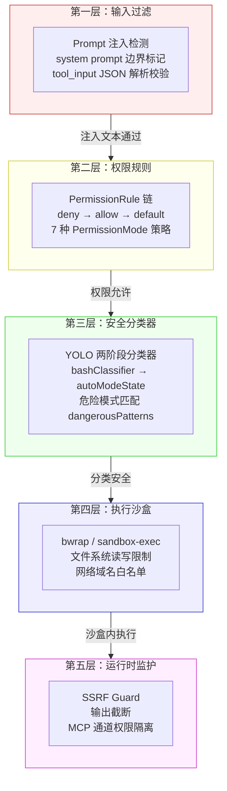
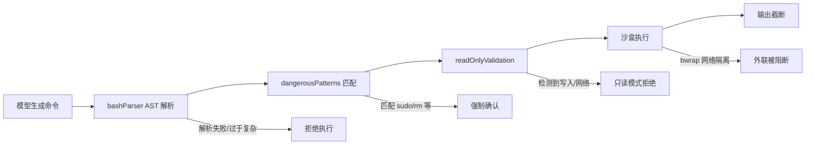
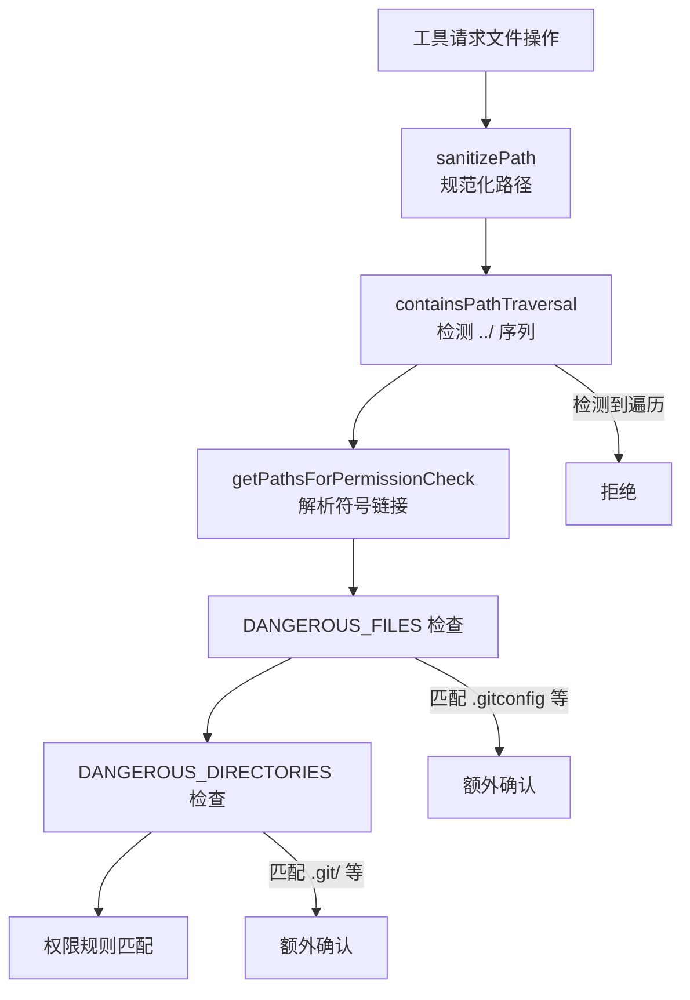
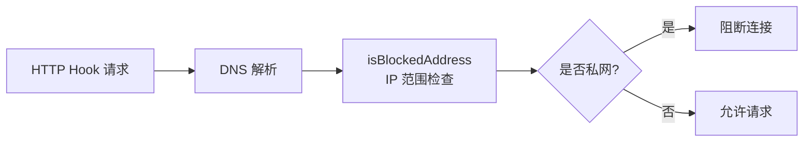
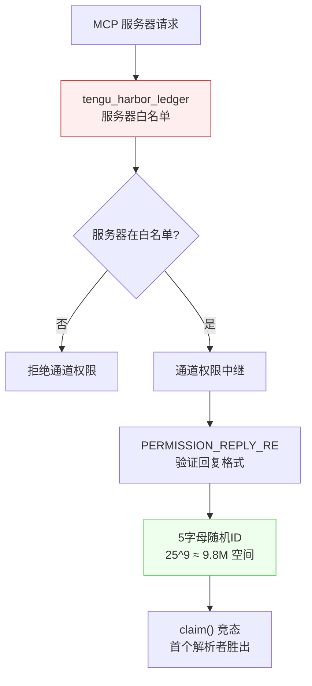
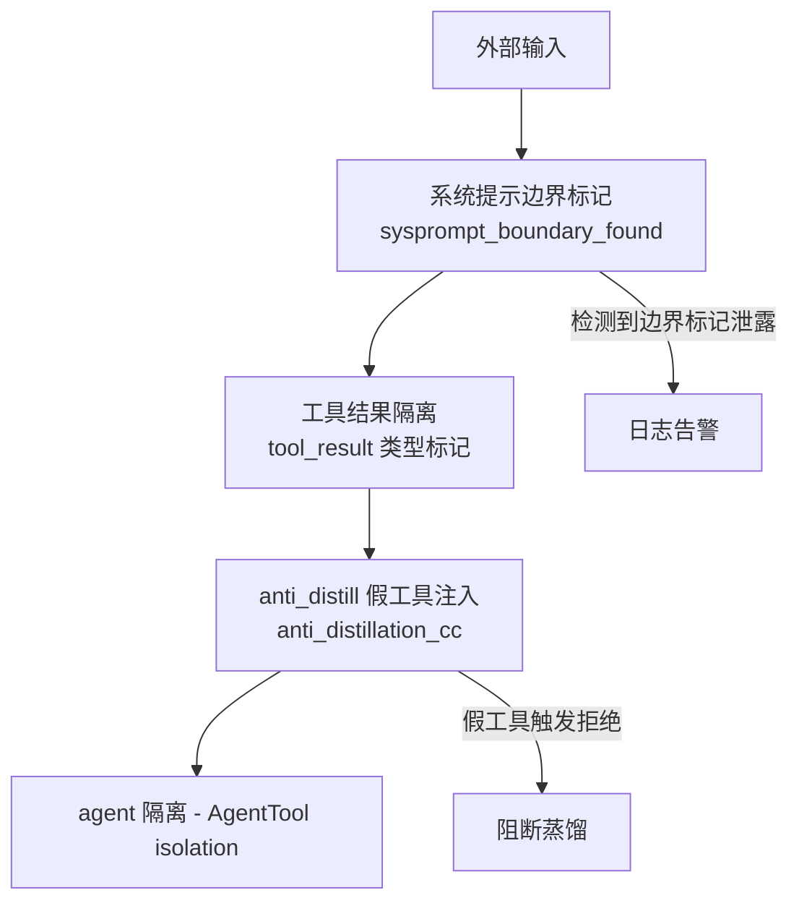
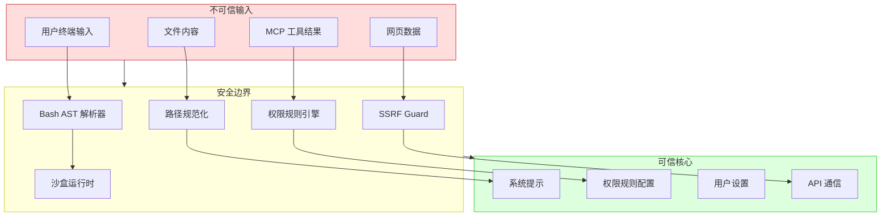

# 安全设计深度分析

> 前置：[第三章 权限与安全](/ch03-constraints/permission-primitives)（全章）

Claude Code 在终端中执行任意命令、读写文件、连接外部服务——每个操作都是潜在攻击面。本章从源码角度剖析其纵深防御（defense-in-depth）架构，展示每一层如何阻断特定攻击。

## 源码位置

| 模块 | 路径 | 职责 |
|------|------|------|
| 权限系统 | `src/utils/permissions/` | 工具访问控制、规则求值、分类器 |
| 沙盒 | `src/utils/sandbox/` | 文件系统/网络隔离 |
| SSRF 防护 | `src/utils/hooks/ssrfGuard.ts` | HTTP Hook 私网地址阻断 |
| Bash 安全 | `src/utils/bash/`、`src/tools/BashTool/` | 命令解析、注入检测、只读验证 |
| MCP 隔离 | `src/services/mcp/channelPermissions.ts` | 通道权限、服务器信任边界 |
| 路径安全 | `src/utils/permissions/filesystem.ts` | 路径遍历、危险文件保护 |

## 纵深防御架构

Claude Code 的安全不是单一检查点，而是五层串联的纵深防线。每一层独立可工作，但组合起来覆盖了从输入到执行的完整链路。



## 攻击面分析

### 1. 命令注入

**攻击向量**：模型生成包含恶意命令的 Bash 调用，或用户输入通过 `$()` / 反引号 / 管道被 shell 展开。

**防御层**：



源码中的关键防线：

| 文件 | 机制 | 阻断的攻击 |
|------|------|-----------|
| `src/utils/bash/bashParser.ts` (4436行) | AST 解析 + Tree-sitter | 命令替换逃逸、heredoc 注入 |
| `src/utils/permissions/dangerousPatterns.ts` | 危险前缀列表 | `sudo`、`eval`、`exec`、`curl POST` |
| `src/tools/BashTool/readOnlyValidation.ts` (1990行) | 只读命令白名单 | 写入操作、网络外联 |
| `src/tools/BashTool/bashPermissions.ts` (2621行) | 环境变量白名单 | 敏感 env 泄露 |

`bashParser.ts` 使用 Tree-sitter 将 Bash 命令解析为 AST，然后提取所有子命令、管道、重定向。如果 AST 过于复杂无法分析，直接拒绝执行：

```
bash_ast_too_complex → 拒绝
```

### 2. 路径遍历

**攻击向量**：模型尝试读写 `../../etc/passwd` 或符号链接跳转。

**防御层**：

`src/utils/permissions/filesystem.ts` 定义了多层路径防护：



危险文件保护列表（`filesystem.ts` 第 57-68 行）：

```typescript
export const DANGEROUS_FILES = [
  '.gitconfig', '.gitmodules', '.bashrc',
  '.bash_profile', '.zshrc', '.zprofile',
  '.profile', '.ripgreprc', '.mcp.json', '.claude.json',
]

export const DANGEROUS_DIRECTORIES = [
  '.git', '.vscode', '.idea', '.claude',
]
```

这些文件/目录在 Auto 模式下自动拒绝编辑，在默认模式下需要额外确认。`containsPathTraversal()` 函数检测 `../`、URL 编码变体和 Unicode 规范化攻击。

### 3. SSRF（服务器端请求伪造）

**攻击向量**：HTTP Hook 连接到云元数据端点（`169.254.169.254`）获取 AWS/GCP 凭证。

**防御层**：

`src/utils/hooks/ssrfGuard.ts` 实现了严格的 IP 地址过滤：



阻断的 IP 范围（源码第 22-35 行注释明确列出）：

| IPv4 范围 | 用途 | 风险 |
|-----------|------|------|
| `0.0.0.0/8` | "this" 网络 | 非预期路由 |
| `10.0.0.0/8` | 私有网络 | 内部服务探测 |
| `100.64.0.0/10` | CGNAT/共享地址 | 阿里云元数据 (100.100.100.200) |
| `169.254.0.0/16` | 链路本地 | AWS/GCP 元数据 |
| `172.16.0.0/12` | 私有网络 | 内部服务探测 |
| `192.168.0.0/16` | 私有网络 | 内部服务探测 |

**有意放行**：`127.0.0.0/8`（本地回环）——本地开发策略服务器是 HTTP Hook 的主要用例。

### 4. MCP 工具权限提升

**攻击向量**：恶意 MCP 服务器通过通道自批准权限请求，或利用对话注入触发工具调用。

**防御层**：

`src/services/mcp/channelPermissions.ts` 的设计体现了精巧的信任模型：



源码中的关键安全注释（第 15-23 行）揭示了设计权衡：

> "A compromised channel server CAN fabricate 'yes \<id\>' without the human seeing the prompt. Accepted risk: a compromised channel already has unlimited conversation-injection turns (social-engineer over time, wait for acceptEdits, etc.); inject-then-self-approve is faster, not more capable."

核心防护：
- **白名单门控**：`tengu_harbor_permissions` GrowthBook 开关默认关闭
- **结构化事件**：CC 不再通过正则匹配文本，而是由服务器解析并发出 `{request_id, behavior}` 结构化事件
- **ID 空间**：5 字母随机 ID（排除 `l` 以防混淆），25^5 约 980 万种组合
- **竞态解析**：`claim()` 机制确保只有第一个回复生效，防止重复批准

### 5. Prompt 注入

**攻击向量**：外部输入（文件内容、MCP 工具结果、网页内容）包含指令试图覆盖系统行为。

**防御层**：



- **系统提示边界**：`tengu_sysprompt_boundary_found` 检测系统提示是否泄露到模型输出
- **反蒸馏**：`ANTI_DISTILLATION_CC` 编译开关注入假工具，检测模型是否在非预期上下文中执行
- **Agent 隔离**：`AgentTool` 的 `isolation` 字段控制子代理的权限边界，Ant 内部支持 `worktree` + `remote` 双重隔离

## 安全边界总图



## 可信 vs 不可信输入处理

| 输入来源 | 信任等级 | 处理方式 | 源码位置 |
|----------|---------|---------|---------|
| 系统提示 | 可信 | 直接注入 API 请求 | `src/utils/systemPromptType.ts` |
| 用户终端输入 | 半可信 | 经权限规则过滤 | `src/utils/permissions/permissions.ts` |
| 文件内容 | 不可信 | 路径安全检查 + 输出截断 | `src/utils/permissions/filesystem.ts` |
| MCP 工具结果 | 不可信 | 通道权限隔离 + 结果大小限制 | `src/services/mcp/channelPermissions.ts` |
| Web 内容 | 不可信 | SSRF Guard + 域名限制 | `src/utils/hooks/ssrfGuard.ts` |
| Bash 输出 | 不可信 | 输出截断 + 敏感信息过滤 | `src/tools/BashTool/` |

## 权限模式与攻击防御映射

| 攻击类型 | default | plan | acceptEdits | auto | bypassPermissions |
|----------|---------|------|-------------|------|-------------------|
| 命令注入 | 逐次确认 | 阻断 | 编辑免确认 | 分类器判断 | 全部允许 |
| 路径遍历 | 逐次确认 | 阻断 | 逐次确认 | 自动拒绝 | 全部允许 |
| SSRF | Hook 级阻断 | 阻断 | Hook 级阻断 | Hook 级阻断 | Hook 级阻断 |
| MCP 提升 | 通道白名单 | 阻断 | 通道白名单 | 通道白名单 | 全部允许 |
| Prompt 注入 | 边界检测 | 边界检测 | 边界检测 | 反蒸馏+边界 | 反蒸馏+边界 |

注意：SSRF Guard 在所有模式下都生效——它是独立于权限系统的安全层。bypassPermissions 只绕过权限规则，不绕过基础设施安全。

## 关键源文件

| 文件 | 行数 | 安全职责 |
|------|------|---------|
| `src/utils/permissions/permissions.ts` | ~800 | 权限求值主逻辑，7 种模式策略 |
| `src/utils/permissions/filesystem.ts` | ~600 | 路径安全、危险文件/目录保护 |
| `src/utils/permissions/dangerousPatterns.ts` | ~80 | 危险 Bash 前缀黑名单 |
| `src/utils/permissions/bashClassifier.ts` | ~200 | YOLO 分类器，两阶段安全判断 |
| `src/utils/hooks/ssrfGuard.ts` | ~120 | SSRF 防护，私网 IP 阻断 |
| `src/utils/bash/bashParser.ts` | 4436 | Bash AST 解析，命令结构分析 |
| `src/tools/BashTool/bashPermissions.ts` | 2621 | Bash 权限规则、环境变量白名单 |
| `src/tools/BashTool/readOnlyValidation.ts` | 1990 | 只读命令验证 |
| `src/services/mcp/channelPermissions.ts` | ~150 | MCP 通道权限中继 |
| `src/utils/sandbox/sandbox-adapter.ts` | ~500 | 沙盒配置桥接 |

<div class="chapter-nav-hint">

安全机制贯穿全书，核心权限流程见第三章，Bash 安全见 3.2 节，沙盒架构见 3.3 节。下一专题：[设计模式分析](/appendix-topics/design-patterns)
</div>
