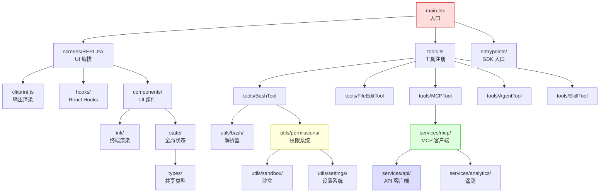

# 源码地图

> 前置：[第一章 架构总览](/prologue/architecture)。本章提供 Claude Code 整体源码树的导航地图，帮助你在 50 万行代码中快速定位目标模块。

## 源码规模

| 目录 | 文件数 | 代码行数 | 职责 |
|------|--------|---------|------|
| `src/utils/` | 570 | 180,521 | 工具函数、权限、沙盒、Bash 解析 |
| `src/components/` | 406 | 81,637 | React 终端 UI 组件 |
| `src/services/` | 147 | 53,807 | API 通信、MCP、遥测、策略 |
| `src/tools/` | 199 | 50,886 | 50+ 种工具实现 |
| `src/commands/` | 195 | 26,450 | 斜杠命令实现 |
| `src/ink/` | 100 | 19,880 | Ink 终端渲染器集成 |
| `src/hooks/` | 105 | 19,205 | React Hook 封装 |
| `src/cli/` | 20 | 12,360 | CLI 输出和渲染 |
| `src/bridge/` | 33 | 12,619 | 远程桥接（CCR） |
| `src/skills/` | 24 | 4,072 | 技能框架 |
| `src/entrypoints/` | 14 | 4,153 | SDK/Agent 入口 |
| `src/types/` | 19 | 3,617 | 类型定义（打破循环依赖） |
| `src/buddy/` | 6 | 1,298 | 宠物系统 |
| `src/state/` | 6 | 1,190 | 全局状态管理 |
| `src/coordinator/` | 2 | 370 | 多 Agent 协调器 |
| 其他 | ~50 | ~3,000 | 常量、迁移、SSH 等 |
| **总计** | **~1,900** | **~513,727** | |

## 交互式架构地图

<ArchitectureMap />

## 模块依赖图

**依赖方向**：箭头从依赖方指向被依赖方。`types/` 是最底层的叶子节点，几乎所有模块都依赖它（用于打破循环依赖）。

## 目录详解

### `src/utils/` (180,521 行) — 工具函数层

最大的目录，包含权限系统、Bash 解析、沙盒、设置等核心基础设施。

| 子目录 | 行数 | 关键文件 | 说明 |
|--------|------|---------|------|
| `utils/permissions/` | ~8,000 | `permissions.ts`, `filesystem.ts`, `bashClassifier.ts` | 权限规则引擎、路径安全 |
| `utils/bash/` | ~7,500 | `bashParser.ts`, `ast.ts`, `commands.ts` | Bash 语法解析 |
| `utils/settings/` | ~3,000 | `settings.ts`, `changeDetector.ts` | 多层设置系统 |
| `utils/hooks/` | ~2,000 | `ssrfGuard.ts`, `AsyncHookRegistry.ts` | 钩子系统 |
| `utils/sandbox/` | ~600 | `sandbox-adapter.ts` | 沙盒桥接 |
| `utils/plugins/` | ~4,000 | `pluginLoader.ts` | 插件加载 |
| `utils/` (根文件) | ~50,000 | `messages.ts`, `sessionStorage.ts`, `hooks.ts` | 消息、会话、钩子等核心逻辑 |

### `src/tools/` (50,886 行) — 工具层

53 个工具目录，每个工具实现 `Tool` 接口。

| 工具 | 行数 | 类型 | 门控 |
|------|------|------|------|
| `BashTool/` | ~7,000 | 核心 | 无 |
| `AgentTool/` | ~5,000 | 核心 | 无 |
| `SkillTool/` | ~4,000 | 核心 | 无 |
| `FileEditTool/` | ~2,000 | 核心 | 无 |
| `MCPTool/` | ~800 | 核心 | 无 |
| `ConfigTool/` | ~500 | ant-only | `USER_TYPE === 'ant'` |
| `TungstenTool/` | ~300 | ant-only | `USER_TYPE === 'ant'` |
| `REPLTool/` | ~400 | ant-only | `USER_TYPE === 'ant'` |
| `SleepTool/` | ~100 | 条件 | `feature('PROACTIVE')` |
| `WebBrowserTool/` | ~600 | 条件 | `feature('WEB_BROWSER_TOOL')` |

### `src/services/` (53,807 行) — 服务层

| 子目录 | 行数 | 说明 |
|--------|------|------|
| `services/mcp/` | ~12,000 | MCP 协议实现、连接管理、通道权限 |
| `services/api/` | ~8,000 | Claude API 客户端、Bootstrap、文件 API |
| `services/analytics/` | ~5,000 | GrowthBook、遥测事件、Datadog |
| `services/extractMemories/` | ~3,000 | 记忆提取服务 |
| `services/policyLimits/` | ~2,000 | 组织策略限制 |
| `services/remoteManagedSettings/` | ~2,000 | 远程托管设置 |

### `src/components/` (81,637 行) — UI 组件层

| 子目录 | 行数 | 说明 |
|--------|------|------|
| `components/` (根) | ~15,000 | 通用组件：Spinner、PermissionDialog、ToolUseCard |
| `components/agents/` | ~8,000 | Agent 相关 UI |
| `components/mcp/` | ~5,000 | MCP 工具展示组件 |
| `components/session/` | ~4,000 | 会话列表、搜索 |

## 关键入口点

| 入口 | 文件 | 启动路径 |
|------|------|---------|
| CLI 入口 | `src/main.tsx` | `main.tsx` → `launchRepl()` → `REPL.tsx` |
| SDK 入口 | `src/entrypoints/agentSdk.ts` | SDK 模式，非交互 |
| 开发入口 | `src/dev-entry.ts` | 本地开发热加载 |
| Bridge 入口 | `src/bridge/bridgeMain.ts` | 远程执行模式 |

## 导航策略

### 按功能查找

| 我想了解... | 去哪里看 |
|------------|---------|
| 工具如何执行 | `src/tools/<ToolName>/` → `call()` 方法 |
| 权限如何判断 | `src/utils/permissions/permissions.ts` → `canUseTool()` |
| MCP 如何连接 | `src/services/mcp/MCPConnectionManager.tsx` |
| 消息如何渲染 | `src/cli/print.ts` |
| 系统提示如何构建 | `src/utils/systemPrompt.ts`（或搜索 `getSystemPrompt`） |
| 会话如何保存 | `src/utils/sessionStorage.ts` |
| 命令如何注册 | `src/commands.ts` → `getCommands()` |
| 遥测如何上报 | `src/services/analytics/index.ts` → `logEvent()` |
| 设置如何加载 | `src/utils/settings/settings.ts` |

### 按调用链查找

### 按依赖深度查找

最底层（被依赖最多，改动影响最大）：

1. `src/types/` — 共享类型，0 个内部依赖
2. `src/utils/envUtils.ts` — 环境变量工具，被 150+ 处引用
3. `src/utils/settings/settings.ts` — 设置读取，被 100+ 处引用
4. `src/Tool.ts` — 工具接口定义，被所有工具引用
5. `src/types/permissions.ts` — 权限类型，被权限系统引用

最顶层（依赖最多，改动影响最小）：

1. `src/main.tsx` — 入口，不被他模块导入
2. `src/screens/REPL.tsx` — UI 编排，仅被 main.tsx 引用
3. `src/cli/print.ts` — 输出渲染，仅被 REPL/ToolUseCard 引用

## 文件命名约定

| 模式 | 含义 | 例子 |
|------|------|------|
| `*Tool.ts` | 工具实现 | `BashTool.ts`, `FileEditTool.ts` |
| `*Constants.ts` | 常量定义 | `REPLTool/constants.ts` |
| `*prompt.ts` | 工具提示词 | `BashTool/prompt.ts` |
| `*UI.tsx` | 工具 UI 组件 | `MCPTool/UI.tsx` |
| `*Utils.ts` | 辅助函数 | `mcpStringUtils.ts` |
| `*Schema.ts` | Zod Schema | `PermissionUpdateSchema.ts` |
| `use*.ts` | React Hook | `useCanUseTool.ts` |

## 按章节索引

| 章节 | 源码目录 | 核心文件数 |
|------|---------|----------|
| 序章 | 全局 | 5 |
| 第一章：类型 | `types/`, `bootstrap/`, `Tool.ts` | 20 |
| 第二章：通信 | `utils/auth.ts`, `services/api/`, `utils/model/` | 40 |
| 第三章：约束 | `utils/permissions/`, `utils/bash/`, `utils/sandbox/` | 50 |
| 第四章：指令 | `constants/prompts.ts`, `memdir/`, `services/systemPromptSections.ts` | 30 |
| 第五章：行动 | `tools/`, `services/tools/`, `utils/hooks/` | 70 |
| 第六章：心跳 | `query.ts`, `QueryEngine.ts` | 5 |
| 第七章：扩展 | `state/`, `utils/swarm/`, `services/compact/`, `services/mcp/`, `utils/plugins/`, `skills/` | 120 |
| 第八章：外延 | `REPL.tsx`, `cli/`, `remote/`, `services/lsp/`, `main.tsx` | 60 |

源码地图帮助你定位代码，具体模块的深度分析请参考对应章节。下一专题：[安全设计深度分析](/appendix-topics/security)

