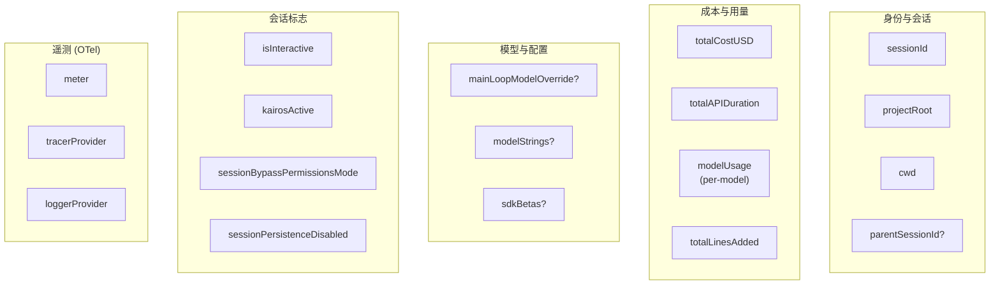

# 1.2 全局引导状态

> 前置：[1.1 消息与工具类型](/ch01-foundation/message-types)
>
> 源码位置：`src/bootstrap/state.ts`

`bootstrap/state.ts` 是 Claude Code 的全局可变单例——几乎所有子系统都从它读取运行时状态。

## 为什么用全局状态？

Claude Code 选择全局可变状态而非纯依赖注入，原因是：

1. **启动时序复杂** — init 阶段有大量并行初始化（认证、遥测、MCP、LSP...），DI 容器在早期无法完整构建
2. **跨组件通信** — React+Ink 组件树中深层嵌套的组件需要快速访问全局状态，Context 透传过深
3. **SDK 模式** — 非交互模式下没有 React 组件树，需要独立于 UI 的状态管理

## State 结构概览



### 关键字段分类

| 类别 | 字段 | 用途 |
|------|------|------|
| **路径/身份** | `sessionId`, `projectRoot`, `cwd`, `parentSessionId?` | 唯一标识会话和工作目录 |
| **成本追踪** | `totalCostUSD`, `totalAPIDuration`, `modelUsage` | 按 model 统计 token 消耗和费用 |
| **Turn 指标** | `turnHookDurationMs`, `turnToolDurationMs`, `turnClassifierDurationMs` | 每轮各阶段耗时 |
| **模型配置** | `mainLoopModelOverride?`, `modelStrings?`, `sdkBetas?` | 运行时模型切换和 beta 功能 |
| **会话标志** | `isInteractive`, `kairosActive`, `sessionBypassPermissionsMode` | 控制会话行为 |
| **OTel 遥测** | `meter`, `tracerProvider`, `loggerProvider`, `eventLogger` | OpenTelemetry 全套 |
| **API 调试** | `lastAPIRequest`, `lastAPIRequestMessages`, `inMemoryErrorLog` | 开发诊断 |

## 访问模式

每个字段都有 getter/setter，而不是直接暴露 STATE 对象：

```typescript
// 典型使用方式
const sid = getSessionId()              // 读取
setMainLoopModelOverride('claude-sonnet-4-6')  // 写入
```

会话切换使用 `switchSession()` 原子性地同时更新 `sessionId` + `sessionProjectDir`，避免不一致。

## 与 AppState 的关系

两个状态系统的分工：

| | bootstrap/state | AppState |
|---|---|---|
| **性质** | 全局可变单例 | React 不可变记录 |
| **生命周期** | 进程级 | 会话级 |
| **消费者** | 任何模块（无 React 依赖） | React 组件 + Hook |
| **主要内容** | 基础设施状态（ID、成本、遥测） | UI 状态（消息、权限上下文、MCP 连接） |

---

## 关键源文件

| 文件 | 行为 |
|------|------|
| `src/bootstrap/state.ts` | 全局状态定义、getter/setter |
| `src/bootstrap/index.ts` | 导出聚合 |

---

<div class="chapter-nav-hint">

**下一节：[1.3 工具类型系统 →](/ch01-foundation/tool-type)**

你需要掌握的内容：`Tool<Input, Output, Progress>` 接口——全代码库最重要的类型，每个工具都必须实现它。

</div>
