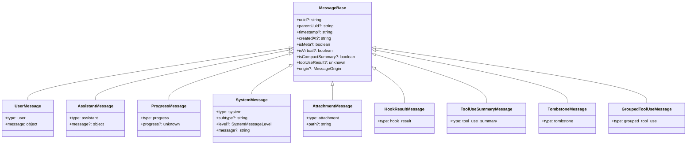

# 1.1 消息与工具类型

> 前置：[架构总览](/prologue/architecture)
>
> 源码位置：`src/types/message.ts`（135 行）

Claude Code 中的一切交互都通过**消息**流转。理解消息类型，就是理解系统的"通用语言"。

`src/types/message.ts` 只有 135 行，但它定义了整个系统的数据骨架。本节将逐行拆解，不留死角。

---

## 总览：文件定义了什么

这个文件定义了以下内容（按出现顺序）：

1. **MessageOrigin** — 消息来源标记
2. **MessageBase** — 所有消息共享的基础字段
3. **9 种消息类型** — 组成 `Message` 联合类型
4. **16 种 SystemMessage 子类型** — 细化系统消息
5. **6 个辅助类型** — StreamEvent、StopHookInfo 等
6. **3 组类型别名** — NormalizedMessage、RenderableMessage、CollapsibleMessage

它们的关系：



> `Message` 联合类型 = 上面 9 种类型的或（`|`）。它是整个系统最核心的类型——几乎每个子系统都接收或产出 `Message`。

---

## MessageOrigin：消息从哪来

```typescript
// message.ts:1-4
export type MessageOrigin = {
  kind?: string
  [key: string]: unknown
}
```

`MessageOrigin` 只有两个字段：
- **`kind`** — 可选字符串，标记消息来源的类型
- **索引签名 `[key: string]: unknown`** — 允许携带任意附加数据

### kind 的四种取值

| kind 值 | 含义 | 设置位置 |
|---------|------|---------|
| `undefined`（省略） | 人类键盘输入 | `createUserMessage` 默认值 |
| `'task-notification'` | 后台 Agent 完成了任务 | `messages.ts:3745`、`handlePromptSubmit.ts:506` |
| `'coordinator'` | Swarm 协调器发来的消息 | `attachments.ts:1098` |
| `'channel'` | MCP 通道消息（携带 `server` 键） | `print.ts:4754,4830`、`useManageMCPConnections.ts:528` |

### origin 在控制流中的作用

- **`wrapCommandText`**（messages.ts:5500）：根据 `origin.kind` 给消息文本加不同的包装
- **`shouldShowUserMessage`**（messages.ts:4670）：`channel` 来源的消息即使 `isMeta=true` 也会显示
- **`extractTitleText`**（bridgeMessaging.ts:106）：非 `human` 来源的消息排除在标题提取之外
- **`VirtualMessageList`**（VirtualMessageList.tsx:152）：`origin === undefined` 用于识别人类输入

### 设计要点

`kind` 是 `string | undefined`，不是枚举。索引签名允许不同来源携带不同数据（比如 `channel` 带 `server` 键，`coordinator` 带其他元数据）。这是**开放-封闭原则**的体现——新的来源不需要修改类型定义。

---

## MessageBase：所有消息的地基

```typescript
// message.ts:6-17
export type MessageBase = {
  uuid?: string
  parentUuid?: string
  timestamp?: string
  createdAt?: string
  isMeta?: boolean
  isVirtual?: boolean
  isCompactSummary?: boolean
  toolUseResult?: unknown
  origin?: MessageOrigin
  [key: string]: unknown
}
```

注意：**所有字段都是可选的**（`?`），且有索引签名 `[key: string]: unknown`。这意味着每条消息都可以携带任意额外字段——这是类型层面的"逃生舱口"，允许子系统附加私有数据而不修改基础类型。

### uuid — 消息的唯一标识

```typescript
uuid?: string
```

**生成方式**：使用 Node.js `crypto.randomUUID()`，产生标准 UUID v4 格式。

**在工厂函数中**：
- `createUserMessage`：`uuid: (uuid as UUID | undefined) || randomUUID()` — 接受可选覆盖，否则生成新的
- `baseCreateAssistantMessage`：`uuid: randomUUID()` — 始终生成新的
- 所有 `create*Message` 工厂：同样 `uuid: randomUUID()`

**派生 UUID**：`deriveUUID(parentUUID, index)` 根据父 UUID + 内容块索引，确定性地派生出一个 UUID 形式的字符串。用于 `normalizeMessages` 拆分多块消息时，保证同一输入总是产生相同的 UUID。

**消费方式**：
- `insertMessageChain`（sessionStorage.ts:993）用 `uuid` 构建父子链
- `deriveShortMessageId(uuid)` 产生 6 字符 base36 短 ID，供 snip 工具引用
- 各种去重逻辑使用 UUID 识别消息

### parentUuid — 构成链表的指针

```typescript
parentUuid?: string
```

**不是在消息创建时设置的**，而是由 `insertMessageChain`（sessionStorage.ts:993-1068）在写入存储时赋值。

**链构建逻辑**：
1. 维护一个 `parentUuid` 游标（初始值 `startingParentUuid ?? null`）
2. 对每条消息：`parentUuid = isCompactBoundary ? null : effectiveParentUuid`
3. 压缩边界的 `parentUuid` 被设为 `null`，逻辑父保存在 `logicalParentUuid`
4. 写入后，如果 `isChainParticipant(message)`（除 `progress` 外都返回 true），游标前进到 `message.uuid`

**tool_result 的特殊处理**：`effectiveParentUuid` 对工具结果使用 `sourceToolAssistantUUID`，使工具结果链接到对应的助手消息，而非前一条消息。

**消费方式**：
- `buildConversationChain`（sessionStorage.ts）从最新叶子节点沿 `parentUuid` 回溯构建对话链
- 删除消息后，`parentUuid` 的重链接逻辑修补断裂的引用

**核心设计**：`uuid + parentUuid` 构成了一个**链表**。每条消息都知道自己的父消息是谁，从而形成完整的对话拓扑。压缩操作通过将边界消息的 `parentUuid` 设为 `null` 来切断链，标记"之前的历史已被摘要替代"。

### timestamp — 消息创建时间

```typescript
timestamp?: string
```

**格式**：ISO 8601 字符串，由 `new Date().toISOString()` 生成（如 `"2025-06-01T12:34:56.789Z"`）。

**设置方式**：
- `createUserMessage`：`timestamp: timestamp ?? new Date().toISOString()` — 可覆盖
- `baseCreateAssistantMessage`：始终 `new Date().toISOString()`
- 所有其他工厂函数同样使用 `new Date().toISOString()`

### createdAt — 遗留字段

```typescript
createdAt?: string
```

**定义了但从未在消息对象上使用**。`createdAt` 字段出现在其他领域对象上（cron 任务、服务端类型、团队条目），但在消息类型中是**残留字段**——类型定义允许它，但没有任何代码在消息上设置它。

### isMeta — "对模型可见，对用户隐藏"

```typescript
isMeta?: boolean
```

这是消息系统中**最重要的控制标志之一**。它的含义是：这条消息发送给模型（API），但在 UI 中对用户隐藏。

**设为 true 的场景**（大量）：

| 场景 | 位置 | 作用 |
|------|------|------|
| system-reminder 注入 | messages.ts 多处 | 注入系统提醒上下文 |
| 工具引用消息 | messages.ts:3295 | 引用工具执行结果 |
| 记忆纠正提示 | messages.ts | 记忆系统的修正提示 |
| 记忆上下文 | messages.ts | 注入记忆文件内容 |
| 诊断信息 | messages.ts | LSP 诊断附件 |
| output_style | messages.ts | 输出样式提示 |
| ide_opened_file | messages.ts | IDE 打开文件信息 |
| 恢复/中断消息 | query.ts:1228,1327 | 流中断后的恢复消息 |
| Skill 上下文 | SkillTool.ts:1104 | 技能的上下文注入 |
| 文件读取元数据 | FileReadTool.ts:887,942,1013 | 文件读取的附加信息 |
| 计划上下文 | plans.ts:386 | 计划文件快照 |
| 定时任务触发 | useScheduledTasks.ts:76 | 定时任务的提示消息 |

**设为 false/undefined**：`createUserMessage` 的参数类型是 `isMeta?: true`（只接受 `true`），省略则为 `undefined`。所有系统消息工厂显式设置 `isMeta: false`。

**UI 中的过滤效果**：

- `VirtualMessageList.tsx:148`：meta 消息返回 `null`（从粘性提示文本中隐藏）
- `Messages.tsx:144`：`!msg.isMeta` 过滤简洁工具模式
- `MessageSelector.tsx:777`：meta 消息排除在选择器外
- `shouldShowUserMessage`：对 `isMeta` 用户消息返回 `false`（channel 消息例外）

**API 传输**：`normalizeMessagesForAPI` **不会**过滤 meta 消息——它们会被发送给模型。只有 `isVirtual` 消息才被过滤。

**关键区分**：
- `isMeta=true` → 对用户隐藏，对模型可见
- `isVirtual=true` → 对用户可见，对模型隐藏

### isVirtual — "对用户可见，对模型隐藏"

```typescript
isVirtual?: boolean
```

与 `isMeta` 恰好相反：虚拟消息在 UI 中显示，但**永远不会发送到 API**。

**设置位置**：`createUserMessage` 和 `baseCreateAssistantMessage` 都有参数 `isVirtual?: true`。

**具体含义**：REPL 内部的工具调用对使用虚拟消息。这些工具调用需要在终端 UI 中显示（用户能看到进度），但不应该作为 API 对话历史的一部分发送。

**API 过滤**：`normalizeMessagesForAPI`（messages.ts:1999-2000）显式过滤：
```typescript
m => !((m.type === 'user' || m.type === 'assistant') && m.isVirtual)
```

**Bridge/SDK 过滤**：`isEligibleBridgeMessage`（bridgeMessaging.ts:80）同样过滤虚拟消息。

**持久化转换**：`transformMessagesForExternalTranscript`（sessionStorage.ts:4412-4444）在外部转录中将虚拟消息**提升**为真实消息（移除 `isVirtual` 字段）。这样恢复会话时，REPL 工具调用对被解包，内部调用显示为原生工具调用。

### isCompactSummary — 压缩摘要标记

```typescript
isCompactSummary?: boolean
```

**仅在三个地方设为 true**：
1. `compact.ts:621` — 完整压缩
2. `compact.ts:1034` — 部分压缩
3. `sessionMemoryCompact.ts:479` — 会话记忆压缩

**总是与 `isVisibleInTranscriptOnly: true` 一起设置**。

**消费方式**：
- `QueryEngine.ts:566`：跳过压缩摘要消息的 SDK 回放计数
- `bridgeMessaging.ts:104`：排除在标题文本提取之外
- `sessionStoragePortable.ts:150-151`：跳过便携式转录导出
- `conversationRecovery.ts:307`：跳过作为"最后消息"候选
- `useAwaySummary.ts:19`：计算非 meta、非压缩摘要的用户消息数

### toolUseResult — 工具执行的结构化输出

```typescript
toolUseResult?: unknown
```

**类型是 `unknown`**——实际形状取决于工具的 `Output` 泛型。

**设置位置**：
- `query.ts:144`：`toolUseResult: errorMessage`（来自 `yieldMissingToolResultBlocks`）
- `forkSubagent.ts:158`：子代理的工具结果消息

**用途**：
- 区分"真实用户消息"和"工具结果"：`messagePredicates.ts:7` 用 `m.toolUseResult === undefined` 判断
- SDK 输出：`mappers.ts:143` 将其映射为 `{ tool_use_result: message.toolUseResult }`
- 崩溃搜索：`collapseReadSearch.ts:560` 将其转型使用

### origin — 消息来源

```typescript
origin?: MessageOrigin
```

已在上方 [MessageOrigin](#messageorigin-消息从哪来) 详述。

### 索引签名 — 逃生舱口

```typescript
[key: string]: unknown
```

允许任何消息携带任意额外字段。这是类型层面的灵活性设计，但也意味着 TypeScript 不会对额外字段做类型检查。子系统可以自由添加字段，如 `isVisibleInTranscriptOnly`、`sourceToolAssistantUUID`、`summarizeMetadata`、`permissionMode` 等——这些字段不在 `MessageBase` 定义中，但通过索引签名合法存在。

---

## 9 种消息类型详解

### UserMessage — 用户输入或工具结果

```typescript
// message.ts:24-30
export type UserMessage = MessageBase & {
  type: 'user'
  message: {
    content: string | Array<{ type: string; text?: string; [key: string]: unknown }>
    [key: string]: unknown
  }
}
```

**工厂函数**：`createUserMessage`（messages.ts:460）

参数列表（完整）：
- `content` — 消息内容
- `isMeta?` — 是否对用户隐藏
- `isVisibleInTranscriptOnly?` — 是否仅在转录中可见
- `isVirtual?` — 是否对 API 隐藏
- `isCompactSummary?` — 是否为压缩摘要
- `summarizeMetadata?` — 压缩元数据
- `toolUseResult?` — 工具执行结果
- `mcpMeta?` — MCP 元数据
- `uuid?` — 可选 UUID 覆盖
- `timestamp?` — 可选时间戳覆盖
- `imagePasteIds?` — 粘贴的图片 ID
- `sourceToolAssistantUUID?` — 工具结果对应的助手消息 UUID
- `permissionMode?` — 权限模式
- `origin?` — 消息来源

**message.content 的两种形态**：

1. **`string`** — 简单文本输入（如用户输入的 prompt）
2. **`ContentBlockParam[]`** — 内容块数组，包含：
   - `{ type: 'text', text: string }` — 文本块
   - `{ type: 'image', source: {...} }` — 图片块
   - `{ type: 'tool_result', tool_use_id: string, content: string | ContentBlockParam[], is_error?: boolean }` — 工具结果
   - `{ type: 'document', ... }` — PDF/文档块

**关键理解**：UserMessage 的 `message` 是一个**信封**（envelope），其 `content` 字段既可以是纯文本，也可以是结构化内容块数组。当 `content` 包含 `tool_result` 类型的块时，这条 UserMessage 实际上是工具执行的结果回传，而非人类输入——尽管它的 `type` 仍然是 `'user'`（因为 Anthropic API 中工具结果属于 user 角色）。

### AssistantMessage — 模型的响应

```typescript
// message.ts:32-38
export type AssistantMessage = MessageBase & {
  type: 'assistant'
  message?: {
    content?: unknown
    [key: string]: unknown
  }
}
```

**工厂函数**：

1. **`createAssistantMessage`**（messages.ts:411）— 接受 `content: string | BetaContentBlock[]`、`usage?`、`isVirtual?`
2. **`baseCreateAssistantMessage`**（messages.ts:355）— 构建完整的消息信封
3. **`createAssistantAPIErrorMessage`**（messages.ts:435）— 带 API 错误信息的变体

**合成消息的默认信封**（由 `baseCreateAssistantMessage` 生成）：

```typescript
{
  type: 'assistant',
  uuid: randomUUID(),
  timestamp: new Date().toISOString(),
  message: {
    id: randomUUID(),
    container: null,
    model: '<synthetic>',        // SYNTHETIC_MODEL 常量
    role: 'assistant',
    stop_reason: 'stop_sequence',
    stop_sequence: '',
    type: 'message',
    usage: Usage,                 // token 使用量对象
    content: BetaContentBlock[],
    context_management: null,
  },
  requestId: undefined,
  apiError,
  error,
  errorDetails,
  isApiErrorMessage,
  isVirtual,
}
```

**API 响应填充时的信封**：当从 Anthropic API 流式接收 `BetaMessage` 对象时，`message` 字段使用 API 的实际响应：
- `id` — API 消息 ID
- `model` — 实际模型名（如 `claude-sonnet-4-20250514`）
- `stop_reason` — `'end_turn'`、`'tool_use'`、`'max_tokens'` 等
- `usage` — 包含 `input_tokens`、`output_tokens`、`cache_creation_input_tokens`、`cache_read_input_tokens` 等
- `content` — `BetaContentBlock[]`（text、tool_use、thinking、redacted_thinking）

**`<synthetic>` 标记**：当 `model` 为 `'<synthetic>'` 时，说明这条助手消息不是来自 API 调用，而是系统内部合成的（如虚拟工具调用、错误恢复等）。

### ProgressMessage — 进度通知

```typescript
// message.ts:40-43
export type ProgressMessage = MessageBase & {
  type: 'progress'
  progress?: unknown
}
```

**工厂函数**：`createProgressMessage`（messages.ts:617）

**用途**：在流式 API 调用期间，向 UI 发送进度更新（如 token 生成进度）。`progress` 字段类型为 `unknown`，实际形状取决于进度来源。

**链参与**：`isChainParticipant` 对 `progress` 类型返回 `false`——进度消息不参与 `parentUuid` 链的构建。

### SystemMessage — 系统级通知

```typescript
// message.ts:45-52
export type SystemMessageLevel = 'info' | 'warning' | 'error' | string

export type SystemMessage = MessageBase & {
  type: 'system'
  subtype?: string
  level?: SystemMessageLevel
  message?: string
}
```

**三个标识字段**：
- **`subtype`** — 区分系统消息的具体类型（见下方详表）
- **`level`** — 严重程度：`'info'`、`'warning'`、`'error'`，或自定义字符串
- **`message`** — 人类可读的文本内容

SystemMessage 是**子类型最丰富**的消息类型，有 16 个命名子类型 + 若干未命名的 `subtype` 字符串。详见下节。

### AttachmentMessage — 文件附件

```typescript
// message.ts:19-22
export type AttachmentMessage = MessageBase & {
  type: 'attachment'
  path?: string
}
```

**用途**：标记用户附加的文件。`path` 是文件路径。附件消息在 UI 中展示为文件预览，其内容在发送给 API 前会被读取并转换为内容块。

### HookResultMessage — Hook 执行结果

```typescript
// message.ts:74-76
export type HookResultMessage = MessageBase & {
  type: 'hook_result'
}
```

**没有专用工厂函数**。Hook 执行时，结果填充到 `HookResult.message` 字段（类型为 `HookResultMessage?`）。

**创建位置**：
- `sessionStart.ts:43,180` — `processSessionStartHooks` 和 `processSetupHooks` 返回 `Promise<HookResultMessage[]>`
- Hook 执行引擎内部构造

**消费位置**：
- `useDeferredHookMessages.ts` — React hook 管理待处理的 Hook 消息
- `compact.ts:303` — 接收 `hookResults: HookResultMessage[]`
- `sessionMemoryCompact.ts:441` — 同上

### ToolUseSummaryMessage — 工具使用摘要

```typescript
// message.ts:78-80
export type ToolUseSummaryMessage = MessageBase & {
  type: 'tool_use_summary'
}
```

**工厂函数**：`createToolUseSummaryMessage`（messages.ts:5105）

运行时形状：
```typescript
{
  type: 'tool_use_summary',
  summary: string,                    // 人类可读的摘要文本
  precedingToolUseIds: string[],      // 此摘要覆盖的 tool_use ID 列表
  uuid: randomUUID(),
  timestamp: new Date().toISOString(),
}
```

**创建位置**：`query.ts:1477` — 一批工具调用完成后创建。

**消费方式**：
- `handleMessageFromStream`（messages.ts:2960）— 在流处理中忽略（仅用于 SDK）
- `QueryEngine.ts:959` — 向 SDK 输出：`{ type: 'tool_use_summary', summary, preceding_tool_use_ids, session_id, uuid }`

### TombstoneMessage — 墓碑消息

```typescript
// message.ts:82-84
export type TombstoneMessage = MessageBase & {
  type: 'tombstone'
}
```

**创建位置**：`query.ts:717`

**为什么需要墓碑**：当流式 API 调用中途失败（`streamingFallbackOccured`），系统会发起一次非流式重试。但失败的流已经产生了部分助手消息，这些消息包含不完整的 thinking 块——如果保留它们，后续 API 调用会因为"thinking blocks cannot be modified"错误而崩溃。

**工作方式**：
1. 检测到流式失败
2. 对每个需要移除的部分消息，产出 `{ type: 'tombstone', message: msg }`
3. `handleMessageFromStream`（messages.ts:2955）收到 tombstone 后调用 `onTombstone?.(message.message)` 移除目标消息
4. `QueryEngine.ts:758` 的 `case 'tombstone'` 处理墓碑消息

**名字由来**：墓碑（tombstone）是分布式系统中的经典模式——在已删除数据的位置放置一个标记，让其他系统能感知到删除，而不是"看不见就当没发生过"。

### GroupedToolUseMessage — 分组工具调用

```typescript
// message.ts:107-109
export type GroupedToolUseMessage = MessageBase & {
  type: 'grouped_tool_use'
}
```

**工厂**：`applyGrouping`（groupToolUses.ts）

**分组逻辑**（6 步）：

1. **第一遍扫描**：按 `messageId:toolName` 键对工具调用分组（同一 API 响应 + 同一工具名）
2. **资格检查**：只有定义了 `renderGroupedToolUse` 属性的工具才参与分组
3. **数量门槛**：只有 2 个及以上同组工具才形成有效分组
4. **收集结果**：收集分组中工具调用对应的 `tool_result` 消息
5. **第二遍输出**：每组产出一条 `GroupedToolUseMessage`，跳过原始的单条消息
6. **verbose 模式跳过**：在 verbose 模式下，分组逻辑完全不执行

**运行时形状**：
```typescript
{
  type: 'grouped_tool_use',
  toolName: string,                       // 工具名
  messages: NormalizedAssistantMessage[],  // 组内所有 tool_use 助手消息
  results: NormalizedUserMessage[],        // 组内所有 tool_result 用户消息
  displayMessage: NormalizedAssistantMessage, // 组内第一条消息（用于展示）
  uuid: `grouped-${firstMsg.uuid}`,       // 派生 UUID
  timestamp: firstMsg.timestamp,           // 第一条消息的时间戳
  messageId: string,                       // API 消息 ID
}
```

**消费位置**：
- `collapseReadSearch.ts` — 处理分组消息的折叠逻辑
- `Message.tsx:319` — `case "grouped_tool_use"` 渲染分组展示
- `messageActions.tsx` — 可导航类型、文本提取
- `Messages.tsx:818` — 渲染逻辑

---

## SystemMessage 子类型完整参考

SystemMessage 有 16 个命名子类型（在 message.ts 中有显式类型定义），加上运行时使用的额外 `subtype` 字符串。

### 类型定义中的 16 个子类型

```typescript
// message.ts:54-72 — 16 个子类型定义
export type SystemLocalCommandMessage = SystemMessage & { subtype: 'local_command' }
export type SystemBridgeStatusMessage = SystemMessage          // bridge_status
export type SystemTurnDurationMessage = SystemMessage          // turn_duration
export type SystemThinkingMessage = SystemMessage              // thinking
export type SystemMemorySavedMessage = SystemMessage           // memory_saved
export type SystemStopHookSummaryMessage = SystemMessage       // stop_hook_summary
export type SystemInformationalMessage = SystemMessage         // informational
export type SystemCompactBoundaryMessage = SystemMessage       // compact_boundary
export type SystemMicrocompactBoundaryMessage = SystemMessage  // microcompact_boundary
export type SystemPermissionRetryMessage = SystemMessage       // permission_retry
export type SystemScheduledTaskFireMessage = SystemMessage     // scheduled_task_fire
export type SystemAwaySummaryMessage = SystemMessage           // away_summary
export type SystemAgentsKilledMessage = SystemMessage          // agents_killed
export type SystemApiMetricsMessage = SystemMessage            // api_metrics
export type SystemAPIErrorMessage = SystemMessage & { error?: string }  // api_error
export type SystemFileSnapshotMessage = SystemMessage          // file_snapshot
```

注意：除了 `SystemLocalCommandMessage`（强制 `subtype: 'local_command'`）和 `SystemAPIErrorMessage`（额外 `error` 字段），其余子类型只是 `SystemMessage` 的别名——它们通过**工厂函数**在运行时赋予正确的 `subtype` 值，但类型系统不区分它们。

### 完整子类型参考表

| subtype | 工厂函数 | messages.ts 行号 | 创建时机 | UI 展示 |
|---------|---------|-----------------|---------|---------|
| `informational` | `createInformationalMessage` | 4343 | 一般信息（工具元数据等） | 按 level 着色：info=暗色，warning=警告色，error=加粗 |
| `permission_retry` | `createPermissionRetryMessage` | 4359 | 权限被授予后 | "Allowed" + 加粗命令名 |
| `bridge_status` | `createBridgeStatusMessage` | 4375 | 远程控制激活时 | `\<BridgeStatusMessage\>` 组件 |
| `scheduled_task_fire` | `createScheduledTaskFireMessage` | 4390 | 定时任务触发时 | 泪滴星号 + 暗色内容 |
| `stop_hook_summary` | `createStopHookSummaryMessage` | 4412 | 停止 Hook 结果摘要 | `\<StopHookSummaryMessage\>` 组件 |
| `turn_duration` | `createTurnDurationMessage` | 4435 | 轮次计时信息 | `\<TurnDurationMessage\>` 组件 |
| `away_summary` | `createAwaySummaryMessage` | 4452 | 离开期间的摘要 | 暗色文本 + 参考标记图标 |
| `memory_saved` | `createMemorySavedMessage` | 4465 | 记忆文件被写入时 | `\<MemorySavedMessage\>` 组件 |
| `agents_killed` | `createAgentsKilledMessage` | 4476 | 后台 Agent 被停止时 | "All background agents stopped" + 黑色圆圈 |
| `api_metrics` | `createApiMetricsMessage` | 4498 | API 性能指标 | **在 Messages.tsx 中被过滤**（不展示） |
| `local_command` | `createCommandInputMessage` | 4521 | 斜杠命令输入/输出 | 渲染为 `\<UserTextMessage\>` |
| `compact_boundary` | `createCompactBoundaryMessage` | 4539 | 完整压缩的边界标记 | `\<CompactBoundaryMessage\>`（全屏时隐藏） |
| `microcompact_boundary` | `createMicrocompactBoundaryMessage` | 4569 | 微压缩的边界标记 | **返回 null**（不展示） |
| `api_error` | `createSystemAPIErrorMessage` | 4593 | API 错误（含重试信息） | `\<SystemAPIErrorMessage\>` 组件 |
| `file_snapshot` | 无专用工厂 | — | 计划文件快照（plans.ts:381） | 默认系统消息样式 |
| `thinking` | 无工厂 | — | 思考块展示 | **返回 null**（隐藏） |

### 运行时额外子类型

除了上面的 16 个，代码库中还存在以下 `subtype` 值（通过直接赋值，无类型定义）：

| subtype | 来源 | 用途 |
|---------|------|------|
| `init` | 初始化流程 | 会话启动信息 |
| `task_started` | 后台任务 | 任务启动通知 |
| `task_progress` | 后台任务 | 任务进度更新 |
| `task_notification` | 后台任务 | 任务完成通知 |
| `session_state_changed` | 会话管理 | 会话状态变更 |
| `api_retry` | API 客户端 | API 重试通知 |
| `error_max_turns` | 查询循环 | 达到最大轮次 |
| `snip_boundary` | snip 压缩 | 历史裁剪边界（feature-gated） |
| `snip_marker` | snip 压缩 | 历史裁剪标记（feature-gated） |

---

## 辅助类型

### StreamEvent — 流式事件包装

```typescript
// message.ts:86-89
export type StreamEvent = {
  type?: string
  [key: string]: unknown
}
```

**运行时形状**（QueryEngine.ts:820）：
```typescript
{
  type: 'stream_event' as const,
  event: message.event,           // Anthropic API 流事件
  session_id,                     // 会话 ID
  parent_tool_use_id: null,       // 父工具调用 ID
  uuid: randomUUID(),
}
```

**用途**：包装 Anthropic API 的流事件（`content_block_start`、`content_block_delta`、`message_start`、`message_stop` 等），附加会话元数据后传递给 SDK。

### RequestStartEvent — 请求开始信号

```typescript
// message.ts:91
export type RequestStartEvent = StreamEvent
```

只是 `StreamEvent` 的别名。

**运行时形状**（query.ts:337）：
```typescript
{ type: 'stream_request_start' }
```

**消费方式**：`handleMessageFromStream`（messages.ts:2984）收到后，将 spinner 模式设置为 `'requesting'`——UI 显示"正在请求"状态。

### StopHookInfo — 停止 Hook 信息

```typescript
// message.ts:93-95
export type StopHookInfo = {
  [key: string]: unknown
}
```

**运行时形状**（stopHooks.ts:198-213）：
```typescript
{
  command: string,         // hook 命令
  promptText?: string,     // hook 提示文本
  durationMs?: number,     // 单个 hook 耗时
}
```

**创建位置**：`stopHooks.ts:210`、`toolExecution.ts:798,1481`

**消费位置**：`createStopHookSummaryMessage`（line 4414）和 `collapseReadSearch.ts:618`

### CompactMetadata — 压缩元数据

```typescript
// message.ts:97-99
export type CompactMetadata = {
  [key: string]: unknown
}
```

**运行时形状**（来自 createCompactBoundaryMessage 和 mappers.ts:78-112）：
```typescript
{
  trigger: 'manual' | 'auto',           // 触发方式
  preTokens: number,                     // 压缩前 token 数
  userContext?: string,                  // 用户上下文
  messagesSummarized?: number,           // 被摘要的消息数
  preCompactDiscoveredTools?: string[],  // 压缩前发现的工具
  preservedSegment?: {                   // 保留的消息段
    headUuid: string,                    // 段头 UUID
    anchorUuid: string,                  // 锚点 UUID
    tailUuid: string,                    // 段尾 UUID
  },
}
```

`preservedSegment` 标记了压缩中幸存的消息范围，防止重复压缩。`mappers.ts` 中的 `toSDKCompactMetadata`/`fromSDKCompactMetadata` 在内部 camelCase 和 SDK snake_case 之间转换。

### PartialCompactDirection — 部分压缩方向

```typescript
// message.ts:101
export type PartialCompactDirection = 'older' | 'newer' | 'both' | string
```

**类型声明与运行时不匹配**：声明的值是 `'older' | 'newer' | 'both'`，但实际使用的是：
- `'from'` — 摘要 pivot 之后的消息（压缩旧消息）
- `'up_to'` — 摘要 pivot 之前的消息（压缩新消息）

`compact.ts:778` 的默认值是 `direction: PartialCompactDirection = 'from'`。`string` 联合成员允许这种不一致——这是一个类型与实现不同步的例子。

### CollapsedReadSearchGroup — 折叠的读/搜组

```typescript
// message.ts:103-105
export type CollapsedReadSearchGroup = {
  [key: string]: unknown
}
```

**运行时形状**（collapseReadSearch.ts:663，`createCollapsedGroup` 函数）：
```typescript
{
  type: 'collapsed_read_search',
  searchCount: number,             // 非 memory 的 grep/glob 计数
  readCount: number,               // 非 memory 的 read 计数
  listCount: number,               // 列表操作计数
  replCount: 0,                    // 始终为 0
  memorySearchCount: number,       // memory 搜索计数
  memoryReadCount: number,         // memory 读取计数
  memoryWriteCount: number,        // memory 写入计数
  readFilePaths: string[],         // 非 memory 的文件路径
  searchArgs: SearchArgInfo[],     // 非 memory 的搜索参数
  latestDisplayHint?: string,      // 最新展示提示
  messages: Message[],              // 组内所有消息
  displayMessage: Message,          // 第一条消息（用于展示）
  uuid: `collapsed-${firstMsg.uuid}`,
  timestamp: string,
  // 可选字段（feature-gated 或条件性）：
  teamMemorySearchCount?: number,
  teamMemoryReadCount?: number,
  teamMemoryWriteCount?: number,
  mcpCallCount?: number,
  mcpServerNames?: string[],
  bashCount?: number,
  gitOpBashCount?: number,
  commits?: CommitInfo[],
  pushes?: PushInfo[],
  branches?: BranchInfo[],
  prs?: PRInfo[],
  hookTotalMs?: number,
  hookCount?: number,
  hookInfos?: StopHookInfo[],
  relevantMemories?: MemoryInfo[],
}
```

**用途**：将连续的 Read/Grep/Glob 操作折叠为一组，减少 UI 噪音。这是 GroupedToolUseMessage 之外的另一种折叠机制，专门针对文件搜索操作。

---

## 类型别名

### NormalizedMessage — 标准化后的消息

```typescript
// message.ts:113-121
export type NormalizedAssistantMessage = AssistantMessage
export type NormalizedUserMessage = UserMessage
export type NormalizedMessage =
  | NormalizedAssistantMessage
  | NormalizedUserMessage
  | ProgressMessage
  | SystemMessage
  | AttachmentMessage
```

`NormalizedMessage` 是 `Message` 的子集——排除了 `HookResultMessage`、`ToolUseSummaryMessage`、`TombstoneMessage`、`GroupedToolUseMessage`。

**为什么排除这 4 种**：它们是"元消息"——不参与核心对话流。HookResult 和 ToolUseSummary 是 SDK/内部通信消息，Tombstone 是删除标记，GroupedToolUse 是 UI 折叠产物。

**`normalizeMessages` 函数**（messages.ts:731）做了什么：

1. **拆分多块消息**：如果助手消息有多个内容块（如 text + tool_use + text），拆分为多个 `NormalizedAssistantMessage`，每个只含一个内容块
2. **转换字符串内容为数组**：用户消息的 `string` 内容转为 `[{ type: 'text', text: content }]`
3. **派生新 UUID**：拆分时用 `deriveUUID(parentUUID, index)` 生成确定性 UUID
4. **保留所有字段**：isMeta、isVirtual、timestamp、origin 等完整传递

**`isNewChain` 标志**（line 748）：一旦遇到含多个内容块的消息，后续所有消息都使用派生 UUID，防止 UUID 冲突。

### RenderableMessage — 可渲染消息

```typescript
// message.ts:122
export type RenderableMessage = Message
```

就是 `Message` 的别名。语义上强调"可以被 UI 渲染的消息"。

### CollapsibleMessage — 可折叠消息

```typescript
// message.ts:111
export type CollapsibleMessage = MessageBase
```

就是 `MessageBase` 的别名。语义上表示"可以被折叠操作处理的消息"。

---

## 消息标志位速查

三个标志位控制消息在不同层的可见性：

| 标志 | 对用户 | 对 API | 对模型 | 设置场景 |
|------|--------|--------|--------|---------|
| 默认（全部 false） | 可见 | 可见 | 可见 | 正常用户输入 |
| `isMeta=true` | **隐藏** | 可见 | 可见 | 系统注入的上下文 |
| `isVirtual=true` | 可见 | **过滤掉** | **不可见** | REPL 内部工具调用 |
| `isCompactSummary=true` | 条件可见 | 可见 | 可见 | 压缩摘要 |
| `isMeta=true` + `isVirtual=true` | 隐藏 | 过滤掉 | 不可见 | 理论可能但未使用 |

---

## 关键源文件

| 文件 | 核心导出 |
|------|---------|
| `src/types/message.ts` | 本节所有类型（135 行） |
| `src/utils/messages.ts` | 所有工厂函数（createUserMessage、createAssistantMessage、16 个 create*Message、normalizeMessages 等） |
| `src/utils/sessionStorage.ts` | insertMessageChain（构建 parentUuid 链）、buildConversationChain |
| `src/utils/groupToolUses.ts` | applyGrouping（分组工具调用） |
| `src/utils/collapseReadSearch.ts` | createCollapsedGroup（折叠读/搜组） |
| `src/query.ts` | TombstoneMessage 创建、ToolUseSummaryMessage 创建 |
| `src/components/messages/SystemTextMessage.tsx` | SystemMessage 子类型渲染 |
| `src/components/Message.tsx` | 消息分发渲染 |

---

<div class="chapter-nav-hint">

**下一节：[1.2 全局引导状态 →](/ch01-foundation/bootstrap-state)**

你需要掌握的内容：全局引导状态（bootstrap state）如何作为整个应用的可变单例被所有系统共享。

</div>
