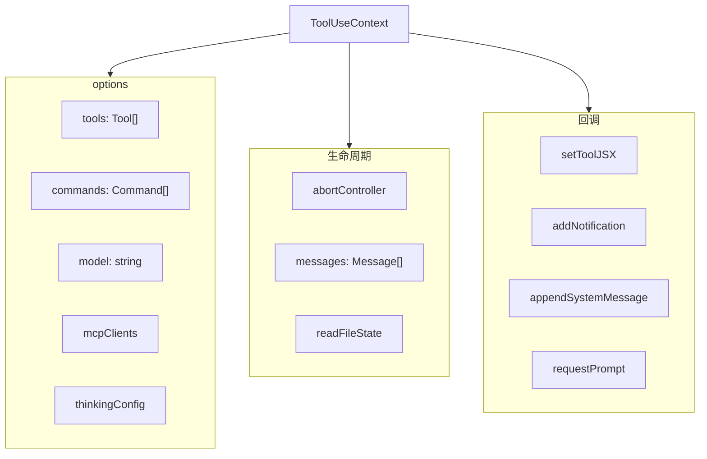

# 1.3 工具类型系统

> 前置：[1.2 全局引导状态](/ch01-foundation/bootstrap-state)
>
> 源码位置：`src/Tool.ts` (792 行)

`Tool<Input, Output, Progress>` 是全代码库最重要的类型。每个工具（Bash、文件读写、Agent、MCP...）都实现这个接口。理解了它，你就理解了工具系统的"契约"。

## Tool 接口

```typescript
interface Tool<Input, Output, Progress> {
  // === 身份 ===
  name: string                          // 唯一标识，如 "Bash"、"FileRead"
  aliases?: string[]                    // 兼容别名

  // === Schema ===
  inputSchema: ZodSchema | lazySchema   // 输入验证 schema

  // === 核心：执行 ===
  call(
    args: Input,
    context: ToolUseContext,
    canUseTool: CanUseToolFn,
    parentMessage: AssistantMessage,
    onProgress: (progress: Progress) => void
  ): Promise<ToolResult<Output>>

  // === 描述 ===
  description(input: Input, options: ToolOptions): Promise<string>
  prompt(options: ToolOptions): Promise<string>   // 系统提示词中的工具说明

  // === 特性 ===
  isEnabled(): boolean                  // 是否启用（feature flag 控制）
  isReadOnly(input: Input): boolean     // 是否只读（影响并发执行策略）
  isConcurrencySafe(input: Input): boolean  // 是否可并行执行
  isDestructive(input: Input): boolean  // 是否破坏性操作

  // === 权限 ===
  checkPermissions(input: Input, context: ToolUseContext): Promise<PermissionDecision>

  // === UI 渲染 ===
  renderToolUseMessage(input: Input, options: ToolOptions): ReactElement
  renderToolResultMessage(content: Output, progress: Progress, options: ToolOptions): ReactElement
  renderToolUseProgressMessage?(input: Input, progress: Progress, options: ToolOptions): ReactElement

  // === API 序列化 ===
  mapToolResultToToolResultBlockParam(content: Output, toolUseID: string): ToolResultBlockParam
}
```

## ToolUseContext — "世界对象"

每个工具调用都收到一个 `ToolUseContext`，它包含工具可能需要的一切：



关键回调：
- `setToolJSX` — 工具执行时渲染进度 UI
- `addNotification` — 发送通知给用户
- `appendSystemMessage` — 向对话注入系统消息
- `requestPrompt` — 请求用户输入

## buildTool() 工厂

`buildTool(def)` 接收一个 `ToolDef`（与 `Tool` 同形但可选字段更多），填充安全默认值：

| 字段 | 默认值 | 说明 |
|------|--------|------|
| `isEnabled` | `true` | 默认启用 |
| `isConcurrencySafe` | `false` | 默认不可并行 |
| `isReadOnly` | `false` | 默认非只读 |
| `isDestructive` | `false` | 默认非破坏性 |
| `checkPermissions` | `{ behavior: 'allow', updatedInput }` | 默认允许（交给通用权限系统） |
| `userFacingName` | `name` | 显示名 = 内部名 |
| `maxResultSizeChars` | — | 大结果自动持久化到磁盘的阈值 |

## 工具名称匹配

`toolMatchesName(tool, query)` 支持**别名匹配**：

```typescript
// FileReadTool 有别名 "Read"
toolMatchesName(fileReadTool, "Read")    // true
toolMatchesName(fileReadTool, "FileRead") // true
toolMatchesName(fileReadTool, "cat")     // false
```

这是权限规则匹配的基础——`Read(*.ts)` 这样的规则需要同时匹配 `FileRead` 和别名 `Read`。

## 工具结果

```typescript
type ToolResult<T> = {
  data: T
  media?: { type: string, data: string }[]  // 图片等二进制
}
```

大型结果（超过 `maxResultSizeChars`）会被自动持久化到磁盘，只在 API 消息中保留引用路径——这是上下文窗口管理的关键机制。

---

## 关键源文件

| 文件 | 职责 |
|------|------|
| `src/Tool.ts` | Tool 接口、ToolUseContext、buildTool、toolMatchesName |
| `src/types/tools.ts` | 工具相关辅助类型 |

---

<div class="chapter-nav-hint">

**下一章：[第二章 身份与通信 →](/ch02-identity/auth-settings)**

你已掌握了系统的"词汇"（类型）和"地基"（全局状态 + 工具契约）。下一步：理解 Claude Code 如何认证自己、如何与 Anthropic API 通信。

</div>
