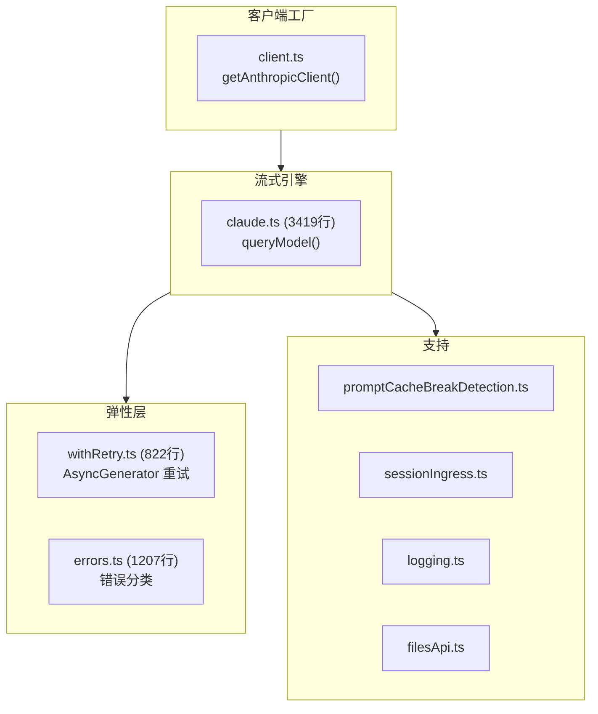
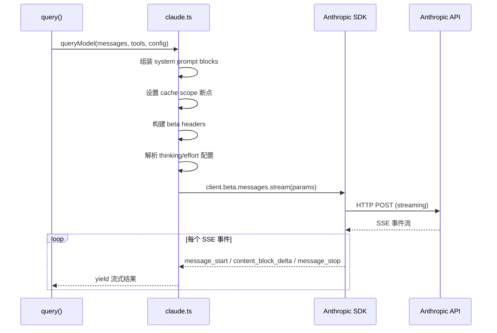
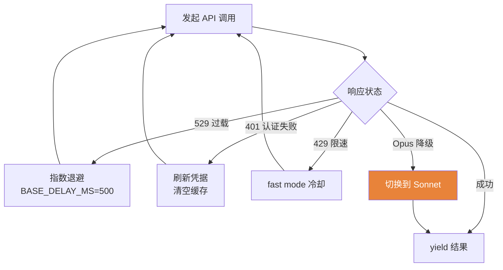

# 2.3 API 客户端

> 前置：[2.2 模型路由](/ch02-identity/model-routing)
>
> 源码位置：`src/services/api/` (~7,500 行)

API 客户端是 Claude Code 与 Anthropic API 之间的完整通信层。它处理流式请求、重试降级、错误分类和 prompt 缓存管理。

## 架构总览

## client.ts — 多供应商客户端工厂

`getAnthropicClient()` 根据供应商创建对应的 SDK 实例：

| 供应商 | SDK 配置 |
|--------|---------|
| Anthropic Direct | `apiKey` + `baseURL` + 代理 |
| AWS Bedrock | `awsAccessKey` / `awsSecretKey` / `awsRegion` |
| GCP Vertex | `projectId` + `region` + Google Auth |
| Azure Foundry | `apiKey` + `baseURL` |

客户端注入全局请求头（`x-request-id`、`anthropic-version`、beta headers）和 OAuth Token 刷新钩子。

## claude.ts — 流式查询引擎

`claude.ts` 是整个 API 层的核心（3,419 行），核心函数 `queryModel()` 的工作流：

### Prompt 缓存管理

`splitSysPromptPrefix()` 在 `SYSTEM_PROMPT_DYNAMIC_BOUNDARY` 处分割系统提示词：
- **前半段**（静态）→ `cacheScope: 'global'` — 跨会话缓存
- **后半段**（动态）→ `cacheScope: 'session'` — 每会话缓存

### Beta Headers 管理

`getMergedBetas()` / `getModelBetas()` 控制启用哪些 beta 功能：
- Prompt caching
- Extended thinking
- Code execution
- AFK mode
- Fast mode

### Max Output Token 管理

`getModelMaxOutputTokens()` 获取模型上限，`CAPPED_DEFAULT_MAX_TOKENS` 设置安全上限。当遇到 `max_tokens` 错误时，自动降低输出上限并重试。

## withRetry.ts — 异步生成器重试

`withRetry()` 是一个 `AsyncGenerator`，在重试期间 yield 进度消息让 UI 显示状态：

**关键设计决策**：

- **前后台区分**：前台查询（用户等待）在 529 时重试最多 3 次；后台查询（摘要/分类器）立即放弃，避免级联放大
- **模型降级**：当 Opus 遇到 529，可降级到 Sonnet 继续执行
- **凭据刷新**：401 时自动清空 API Key / AWS / GCP 缓存并重试

## errors.ts — 错误分类

`classifyAPIError()` 将 API 错误分类为结构化类型：

| 错误 | HTTP 状态 | 处理策略 |
|------|----------|---------|
| Rate limit | 429 | 解析 `retry-after-ms` header，退避重试 |
| Overloaded | 529 | 指数退避，最多 3 次 |
| Auth failed | 401 | 刷新凭据重试 |
| Prompt too long | 400 | 触发自动压缩 |
| Image/PDF too large | 400 | 友好提示 |
| Refusal | — | 终止循环 |
| Tool use mismatch | 400 | 修复 tool_use/tool_result 配对 |

---

## 关键源文件

| 文件 | 行数 | 职责 |
|------|------|------|
| `src/services/api/client.ts` | 389 | 多供应商客户端工厂 |
| `src/services/api/claude.ts` | 3,419 | 流式查询引擎 |
| `src/services/api/withRetry.ts` | 822 | 异步生成器重试 |
| `src/services/api/errors.ts` | 1,207 | 错误分类 |
| `src/services/api/promptCacheBreakDetection.ts` | 727 | 缓存失效检测 |
| `src/services/api/logging.ts` | 788 | 请求/响应日志 |

---

**下一节：[2.4 特性标志与遥测 →](/ch02-identity/feature-flags)**

你需要掌握的内容：GrowthBook 如何远程控制产品行为，遥测系统如何工作。

