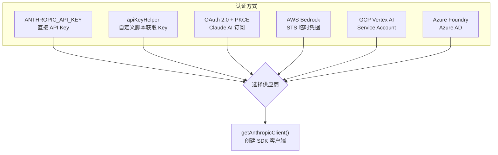
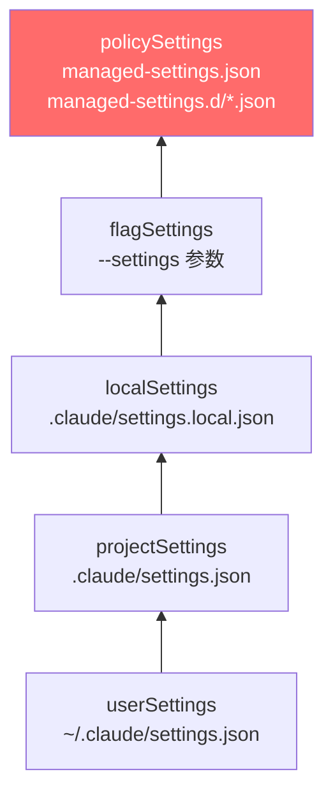

# 2.1 认证与配置

> 前置：[1.3 工具类型系统](/ch01-foundation/tool-type)
>
> 源码位置：`src/utils/auth.ts`、`src/utils/settings/`、`src/services/oauth/`

Claude Code 支持多种认证方式，配置通过 5 级优先源加载。理解认证和配置，才能理解后续的 API 通信和权限系统。

## 认证方式



| 方式 | 环境变量 | 典型场景 |
|------|---------|---------|
| 直接 API Key | `ANTHROPIC_API_KEY` | 开发者个人使用 |
| apiKeyHelper | `settings.apiKeyHelper` | 企业自定义认证脚本 |
| OAuth (Claude AI) | 自动 | Pro/Team/Enterprise 订阅 |
| AWS Bedrock | `AWS_REGION` + 标准 AWS 凭据 | AWS 客户 |
| GCP Vertex | `CLOUD_ML_REGION` + `ANTHROPIC_VERTEX_PROJECT_ID` | GCP 客户 |
| Azure Foundry | `ANTHROPIC_FOUNDRY_RESOURCE` | Azure 客户 |

### OAuth 2.0 + PKCE 流程

`src/services/oauth/` 实现了双流程 OAuth：

1. **自动流程** — 打开浏览器重定向，本地 HTTP 服务监听回调
2. **手动流程** — 用户复制授权码粘贴

```
客户端 → 生成 PKCE code_verifier → 构建授权 URL → 浏览器打开
→ 用户授权 → 回调携带 code → exchangeCodeForTokens() → 存储 token
```

Token 自动刷新：`checkAndRefreshOAuthTokenIfNeeded()` 在每次 API 调用前检查过期。

## 配置系统

### 5 级优先源



**优先级从低到高**：后加载的覆盖先加载的。`policySettings`（企业托管）始终包含，不可被用户覆盖。

### 关键配置字段

| 字段 | 作用 |
|------|------|
| `permissions` | allow/deny/ask 规则、默认模式、额外目录 |
| `hooks` | 26 种事件的自定义命令 |
| `env` | 会话环境变量 |
| `model` | 默认模型覆盖 |
| `mcpServers` | MCP 服务器配置 |
| `apiKeyHelper` | 自定义认证脚本路径 |
| `allowedMcpServers` / `deniedMcpServers` | 企业 MCP 白/黑名单 |

### Hook 系统（配置侧）

settings.json 中定义 Hook，`src/utils/hooks/` 执行 Hook：

```json
{
  "hooks": {
    "PreToolUse": [
      { "type": "command", "command": "check-safety.sh", "if": "Bash" }
    ]
  }
}
```

4 种 Hook 类型：`command`（Shell 命令）、`prompt`（LLM 评估）、`http`（HTTP POST）、`agent`（子代理验证）。

---

## 关键源文件

| 文件 | 行数 | 职责 |
|------|------|------|
| `src/utils/auth.ts` | — | 多供应商认证、Token 刷新、缓存管理 |
| `src/utils/settings/settings.ts` | — | 5 级配置加载与合并 |
| `src/utils/settings/types.ts` | — | 配置 schema 定义 |
| `src/services/oauth/client.ts` | 577 | OAuth 底层操作 |
| `src/services/oauth/index.ts` | 198 | OAuthService 类（PKCE 流程） |
| `src/utils/hooks/` | 2,710 | Hook 执行引擎 |

---

<div class="chapter-nav-hint">

**下一节：[2.2 模型路由 →](/ch02-identity/model-routing)**

你需要掌握的内容：认证之后，Claude Code 如何决定使用哪个模型——默认模型、别名解析、多供应商路由。

</div>
