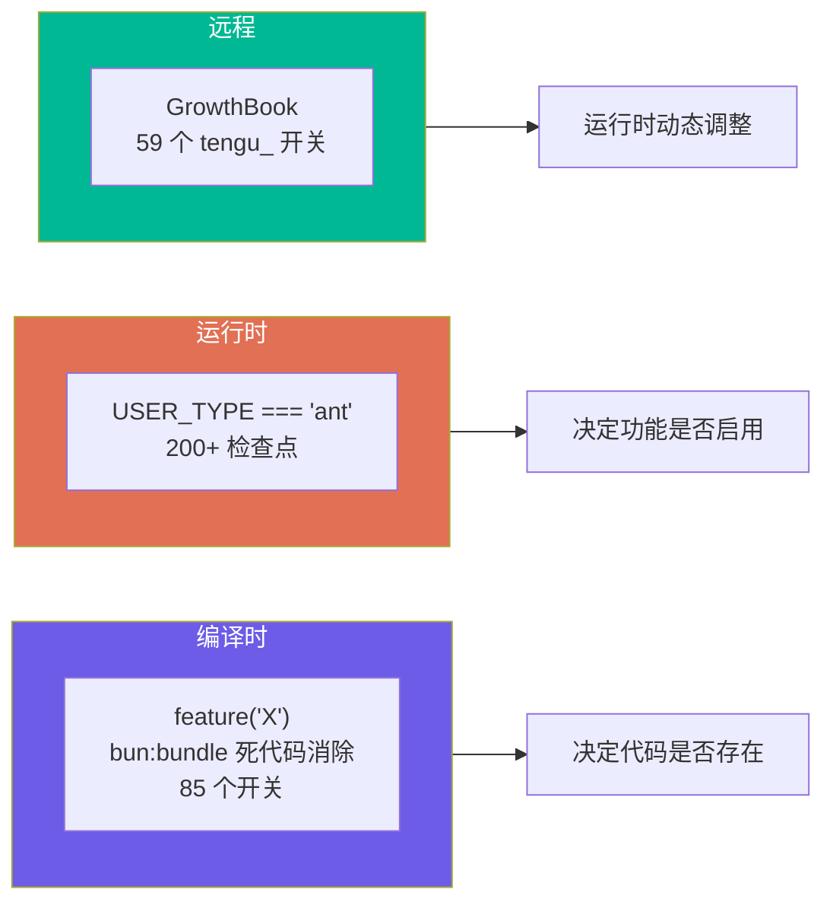
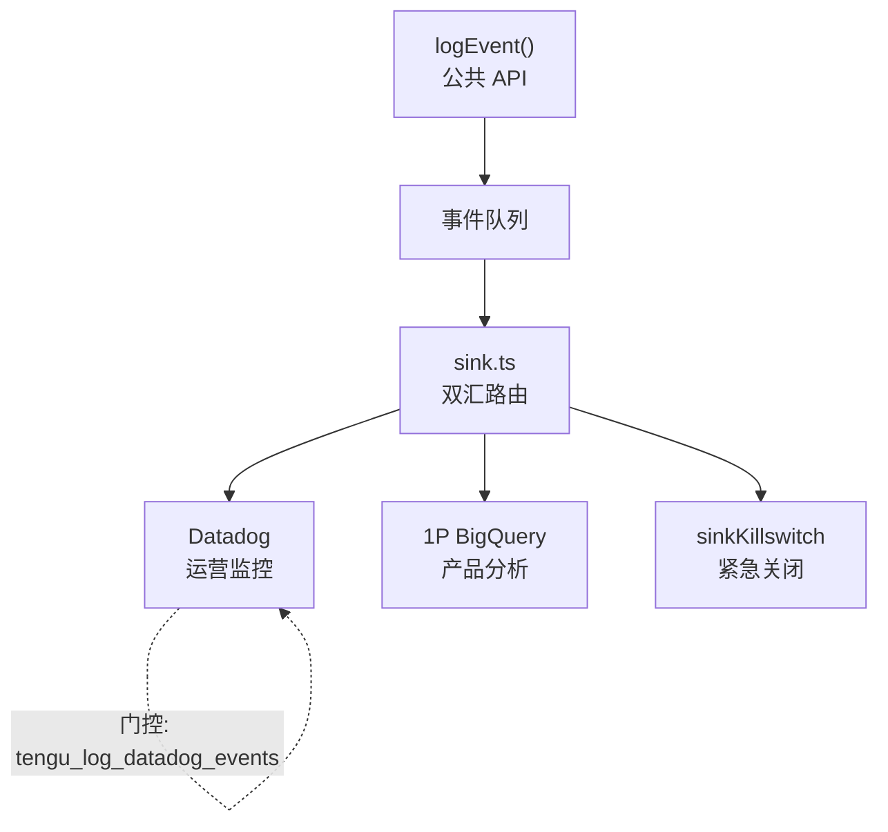

# 2.4 特性标志与遥测

> 前置：[2.3 API 客户端](/ch02-identity/api-client)
>
> 源码位置：`src/services/analytics/` (~4,500 行)

Claude Code 的产品行为由三层门控控制：编译时 `feature()`、运行时 `USER_TYPE`、远程 GrowthBook 开关。理解特性标志，才能理解为什么"同样的代码，不同的行为"。

## 三层门控架构



| 层级 | 机制 | 何时生效 | 例子 |
|------|------|---------|------|
| 编译时 | `feature('BUDDY')` | 构建时决定代码是否存在于包中 | 外部版没有 Buddy 代码 |
| 运行时 | `process.env.USER_TYPE === 'ant'` | 包存在但功能隐藏 | TungstenTool、REPLTool |
| 远程 | `getFeatureValue_CACHED_MAY_BE_STALE('tengu_amber_flint')` | 实时远程控制 | Swarm 开关、压缩阈值 |

## GrowthBook 集成

`src/services/analytics/growthbook.ts` (1,155 行) 集成 GrowthBook SDK：

**用户属性**（用于定向投放）：
- `id` / `sessionId` — 用户和会话标识
- `platform` — win32 / darwin / linux
- `subscriptionType` — Free / Pro / Team / Enterprise
- `organizationUUID` — 组织标识
- `userType` — ant / external

**特性标志访问模式**：
```typescript
// 典型使用
if (getFeatureValue_CACHED_MAY_BE_STALE('tengu_amber_flint')) {
  // 启用 Swarm 团队功能
}
```

函数名 `_CACHED_MAY_BE_STALE` 提醒调用者：值可能不是实时的，有缓存延迟。

### 关键 GrowthBook 开关

| 开关名 | 控制的功能 |
|--------|-----------|
| `tengu_amber_flint` | Swarm/多Agent团队 |
| `tengu_kairos` | KAIROS 持久助手 |
| `tengu_ccr_bridge` | Bridge 远程控制 |
| `tengu_auto_mode_config` | Auto 模式行为（启用/选择加入/禁用） |
| `tengu_cobalt_raccoon` | 主动压缩阈值 |
| `tengu_onyx_plover` | Dream 整合阈值 |
| `tengu_lodestone_enabled` | 深度链接协议注册 |
| `tengu_chrome_auto_enable` | Chrome 集成自动启用 |
| `tengu_turtle_carbon` | 超思考（Ultrathink）努力提升 |
| `tengu_destructive_command_warning` | 破坏性命令警告 |

## 遥测架构



**关键设计**：
- **事件排队**：`logEvent()` 不阻塞，事件入队后异步发送
- **PII 脱敏**：`metadata.ts` (973 行) 负责脱敏，`_PROTO_` 前缀字段在 Datadog 路由前剥离
- **紧急关闭**：`sinkKillswitch.ts` 可一键停止所有遥测输出
- **采样**：`firstPartyEventLogger.ts` 对 1P 日志做采样，控制数据量

## 编译时开关清单（85 个）

部分关键开关：

| 开关 | 功能 | 外部可用 |
|------|------|---------|
| `BUDDY` | 宠物系统 | 否 |
| `KAIROS` | 持久助手 | 否 |
| `BRIDGE_MODE` | 远程控制 | 否 |
| `COORDINATOR_MODE` | 多Agent编排 | 否 |
| `ULTRAPLAN` | 云端规划 | 否 |
| `VOICE_MODE` | 语音模式 | 否 |
| `FORK_SUBAGENT` | Fork 子代理 | 是 |
| `BG_SESSIONS` | 后台会话 | 是 |
| `MONITOR_TOOL` | Monitor 工具 | 否 |
| `WEB_BROWSER_TOOL` | Web 浏览器 | 否 |
| `COMMIT_ATTRIBUTION` | 提交属性 | 是 |
| `EXTRACT_MEMORIES` | 记忆提取 | 是 |
| `TOKEN_BUDGET` | Token 预算 | 是 |

---

## 关键源文件

| 文件 | 行数 | 职责 |
|------|------|------|
| `src/services/analytics/growthbook.ts` | 1,155 | GrowthBook SDK 集成 |
| `src/services/analytics/index.ts` | 173 | logEvent() 公共 API |
| `src/services/analytics/metadata.ts` | 973 | 事件元数据与脱敏 |
| `src/services/analytics/firstPartyEventLoggingExporter.ts` | 806 | 1P OTel 导出 |
| `src/services/analytics/firstPartyEventLogger.ts` | 449 | 1P 事件采样 |
| `src/services/analytics/datadog.ts` | 307 | Datadog 日志 |

---

<div class="chapter-nav-hint">

**下一章：[第三章 约束 — 权限与安全 →](/ch03-constraints/permission-primitives)**

你已理解了通信链路。下一步：理解工具执行前的"关卡"——什么操作被允许、什么被拒绝。

</div>
