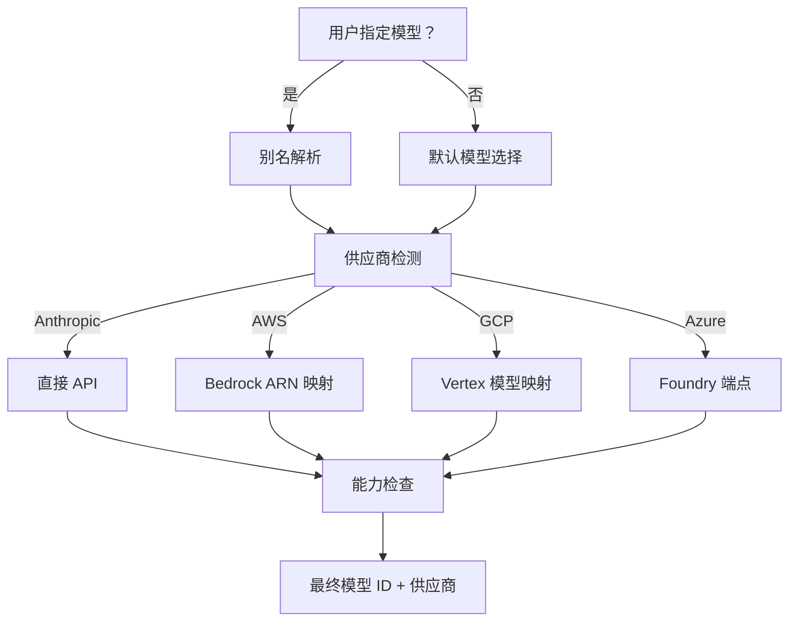

# 2.2 模型路由

> 前置：[2.1 认证与配置](/ch02-identity/auth-settings)
>
> 源码位置：`src/utils/model/` (16 文件, 2,192 行)

模型路由决定"哪个模型处理这次请求"。它要解决三个问题：默认选什么模型、如何解析用户指定的模型名、如何路由到正确的 API 供应商。

## 模型选择流程



## 核心文件

| 文件 | 职责 |
|------|------|
| `model.ts` | 默认模型选择、模型字符串规范化 |
| `providers.ts` | 供应商检测（根据环境变量判断 Anthropic/Bedrock/Vertex/Foundry） |
| `aliases.ts` | 模型别名解析（如 `sonnet` → `claude-sonnet-4-6`） |
| `configs.ts` | 模型配置定义（上下文窗口大小、最大输出 token） |
| `modelCapabilities.ts` | 模型能力标志（是否支持图片、PDF、thinking 等） |
| `deprecation.ts` | 废弃模型警告和迁移 |
| `validateModel.ts` | 模型有效性校验 |
| `check1mAccess.ts` | 1M 上下文窗口访问权限检查 |
| `bedrock.ts` | Bedrock 特有的 ARN 格式处理 |

## 多供应商路由

供应商检测基于环境变量，优先级：

```
ANTHROPIC_API_KEY 存在 → Anthropic Direct
AWS 凭据存在 → Bedrock
ANTHROPIC_FOUNDRY_RESOURCE 存在 → Azure Foundry
CLOUD_ML_REGION 存在 → Vertex AI
```

每种供应商有不同的模型 ID 格式：
- **Direct**：`claude-sonnet-4-6`
- **Bedrock**：`arn:aws:bedrock:region:account:inference-profile/model-id`
- **Vertex**：模型名 + 区域路由

## 模型别名

用户可以通过简短名引用模型：

| 别名 | 解析为 |
|------|--------|
| `sonnet` | `claude-sonnet-4-6` |
| `opus` | `claude-opus-4-7` |
| `haiku` | `claude-haiku-4-5-20251001` |

别名表会随版本更新，废弃的别名会触发迁移提示。

## 模型能力标志

`modelCapabilities.ts` 为每个模型定义能力矩阵：

- 是否支持图片输入
- 是否支持 PDF 输入
- 是否支持 extended thinking
- 是否支持 prompt caching
- 最大上下文窗口大小
- 最大输出 token 数

这些能力标志影响 prompt 组装（是否注入图片/PDF 处理指令）和 API 调用参数。

---

## 关键源文件

| 文件 | 职责 |
|------|------|
| `src/utils/model/model.ts` | 默认模型选择 |
| `src/utils/model/providers.ts` | 供应商检测 |
| `src/utils/model/aliases.ts` | 别名解析 |
| `src/utils/model/configs.ts` | 模型配置 |
| `src/utils/model/modelCapabilities.ts` | 能力标志 |

---

<div class="chapter-nav-hint">

**下一节：[2.3 API 客户端 →](/ch02-identity/api-client)**

你需要掌握的内容：模型选定后，Claude Code 如何与 Anthropic API 通信——流式请求、重试策略、错误处理。

</div>
