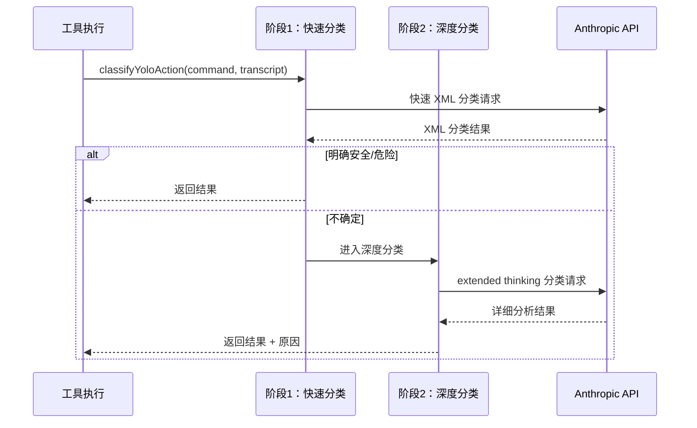
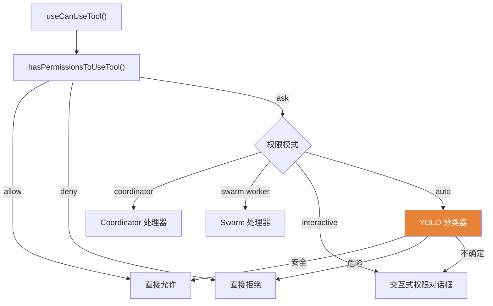

# 3.5 Auto 模式分类器

> 前置：[3.4 权限引擎](/ch03-constraints/permission-engine)
>
> 源码位置：`src/utils/permissions/yoloClassifier.ts` (1,495 行)

Auto 模式（又称 YOLO 模式）使用 LLM 分类器自动判断 bash 命令是否安全，实现无需人工确认的自主执行。

## 两阶段分类架构



### 阶段 1：快速 XML 分类

使用紧凑的 XML 提示词，快速判断命令安全性。输出格式简短，token 消耗少。

### 阶段 2：深度 thinking 分类

当快速分类不确定时，启用 extended thinking 进行更深入的分析。输出包含详细的推理过程和安全评估。

## YoloClassifierResult

```typescript
interface YoloClassifierResult {
  shouldBlock: boolean        // 是否阻止
  reason: string              // 阻止/允许原因
  thinking?: string           // 深度分析推理过程
  unavailable?: boolean       // 分类器不可用
  transcriptTooLong?: boolean // 转录过长无法分析
  model: string               // 使用的模型
  // 两阶段详细指标
  stage1Usage?: TokenUsage
  stage2Usage?: TokenUsage
  stage1DurationMs?: number
  stage2DurationMs?: number
}
```

## useCanUseTool Hook

`src/hooks/useCanUseTool.tsx` 是权限引擎到 UI 的桥接：



**`canUseTool` 函数签名**：传给 `StreamingToolExecutor` 和 `QueryEngine`，每个工具调用前必须经过此函数。

### 交互式权限对话框

当需要用户确认时，显示 `PermissionRequest` 组件：
- 显示工具名、输入内容、风险说明
- 提供选项：允许一次 / 始终允许 / 拒绝
- 支持 `forceDecision` 参数（编程式覆盖）

---

## 关键源文件

| 文件 | 行数 | 职责 |
|------|------|------|
| `src/utils/permissions/yoloClassifier.ts` | 1,495 | 两阶段分类器 |
| `src/utils/permissions/bashClassifier.ts` | — | Bash 命令专用分类 |
| `src/utils/permissions/classifierDecision.ts` | — | 分类决策类型 |
| `src/hooks/useCanUseTool.tsx` | — | 权限 UI 桥接 Hook |
| `src/hooks/toolPermission/` | — | 各模式权限处理器 |

---

<div class="chapter-nav-hint">

**下一章：[第四章 指令 — 提示词系统 →](/ch04-instructions/static-prompt)**

你已理解了权限检查的完整链路。下一步：理解 Claude Code 的"大脑指令"——系统提示词如何组装。

</div>
