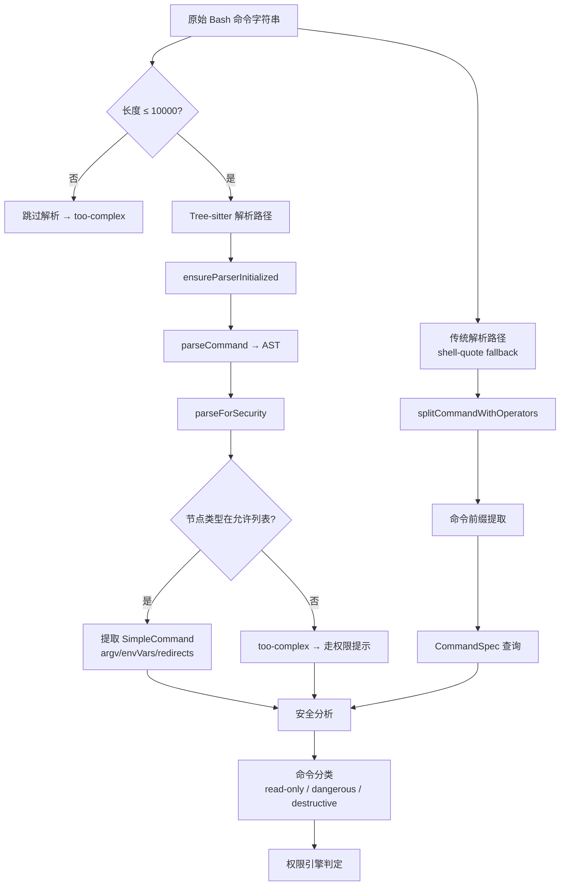

# Bash 智能层：AST 解析、命令分类与 Tree-sitter 分析

> 前置：[权限原语](/ch03-constraints/permission-primitives.html)
>
> 源码位置：`src/utils/bash/`（16 核心文件 + 8 规格文件，约 12,000 行）

Claude Code 的 Bash 智能层是一套多层命令解析与安全分析系统。它将用户输入的 shell 命令字符串转化为结构化数据，识别命令边界、提取参数、检测危险模式，最终为权限引擎提供可靠的判定依据。

## 架构总览



## 第一层：Tree-sitter AST 解析

`ast.ts`（2679 行）是解析系统的核心，采用**显式允许列表**策略——只在白名单中的节点类型才被解析，任何未知节点类型直接导致命令被标记为 `too-complex`。

### parseForSecurity：安全解析的入口

```typescript
type ParseForSecurityResult =
  | { kind: 'simple'; commands: SimpleCommand[] }
  | { kind: 'too-complex'; reason: string; nodeType?: string }
  | { kind: 'parse-unavailable' }
```

解析结果有三种：

| 结果 | 含义 | 后续处理 |
|------|------|----------|
| `simple` | 成功提取所有简单命令 | 下游可安全匹配 argv[0] |
| `too-complex` | 遇到未知节点或无法可靠解析 | 走权限提示流程 |
| `parse-unavailable` | Tree-sitter 不可用 | 回退到传统解析 |

### 节点分类策略

```typescript
// 结构节点：递归进入，不直接提取命令
const STRUCTURAL_TYPES = new Set([
  'program', 'list', 'pipeline', 'redirected_statement',
])

// 分隔节点：忽略，仅用于切分命令
const SEPARATOR_TYPES = new Set([
  '&&', '||', '|', ';', '&', '|&', '\n',
])
```

Tree-sitter 按照以下步骤处理 AST：

1. **遍历结构节点**（program → list → pipeline → redirected_statement）
2. **跳过分隔节点**（&&, ||, |, ; 等）
3. **提取叶节点 command**，解析为 `SimpleCommand`
4. **遇到未知类型** → 立即返回 `too-complex`（fail-closed）

### SimpleCommand 结构

```typescript
type SimpleCommand = {
  argv: string[]              // argv[0] 是命令名，其余是参数（引号已解析）
  envVars: { name: string; value: string }[]  // VAR=val 赋值
  redirects: Redirect[]       // 重定向
  text: string                // 原始文本（UI 显示用）
}
```

命令替换 `$(...)` 用 `__CMDSUB_OUTPUT__` 占位符替换，内部命令单独检查。

## 第二层：传统解析路径（shell-quote fallback）

当 Tree-sitter 不可用（外部构建或加载失败）时，系统回退到基于 `shell-quote` 的传统解析。

### splitCommandWithOperators

`commands.ts`（1339 行）实现了命令拆分，处理以下复杂情况：

- **引号处理**：生成随机盐占位符防止注入攻击
- **Heredoc 处理**：提取并恢复 heredoc 块
- **输出重定向检测**：`extractOutputRedirections()` 识别 `>`, `>>` 等
- **静态重定向目标**：仅当目标是纯文件路径时才安全剥离

```typescript
// 安全性：随机盐防止占位符注入
function generatePlaceholders() {
  const salt = randomBytes(8).toString('hex')
  return {
    SINGLE_QUOTE: `__SINGLE_QUOTE_${salt}__`,
    DOUBLE_QUOTE: `__DOUBLE_QUOTE_${salt}__`,
    // ...
  }
}
```

### 命令前缀提取

`prefix.ts`（204 行）和 `shell/prefix.ts` 提供 `createCommandPrefixExtractor`，从复杂命令中提取实际命令名和子命令：

```
git commit -m "msg"  →  { command: "git", subcommand: "commit" }
sudo rm -rf /        →  { command: "sudo", subcommand: "rm" }
```

## 第三层：Tree-sitter 深度安全分析

`treeSitterAnalysis.ts`（506 行）在 AST 基础上进行深度安全分析，提取五类结构信息：

### QuoteContext：引文上下文

```typescript
type QuoteContext = {
  withDoubleQuotes: string     // 双引号保留，单引号内容移除
  fullyUnquoted: string       // 所有引号内容移除
  unquotedKeepQuoteChars: string  // 移除内容但保留引号字符
}
```

引文上下文用于判断变量替换、命令替换是否在引号保护范围内。

### CompoundStructure：复合结构

| 字段 | 检测内容 |
|------|----------|
| `hasCompoundOperators` | 是否包含 `&&`, `||`, `;` |
| `hasPipeline` | 是否包含管道 `|` |
| `hasSubshell` | 是否包含子 shell `(...)` |
| `hasCommandGroup` | 是否包含命令组 `{...}` |
| `operators` | 具体的操作符列表 |
| `segments` | 按操作符切分的命令段 |

### DangerousPatterns：危险模式

| 模式 | 说明 |
|------|------|
| `hasCommandSubstitution` | `$(...)` 或反引号 |
| `hasProcessSubstitution` | `<(...)` 或 `>(...)` |
| `hasParameterExpansion` | `${...}` |
| `hasHeredoc` | heredoc 块 |
| `hasComment` | 注释 |

## 第四层：命令规格库

`registry.ts` + `specs/` 目录维护了命令规格数据库，用于精确解析命令参数和子命令。

### 内置规格（8 个）

| 规格 | 说明 |
|------|------|
| `alias` | shell alias 定义 |
| `nohup` | nohup 包装命令 |
| `pyright` | Python 类型检查器 |
| `sleep` | sleep 命令 |
| `srun` | Slurm 作业调度 |
| `time` | time 计时命令 |
| `timeout` | timeout 包装命令 |

### 动态规格加载

```typescript
// 从 @withfig/autocomplete 动态加载命令规格
export async function loadFigSpec(command: string): Promise<CommandSpec | null> {
  const module = await import(`@withfig/autocomplete/build/${command}.js`)
  return module.default || module
}
```

当内置规格不覆盖时，系统尝试从 Fig 的 autocomplete 规格库动态加载，获取命令的完整参数定义。

## 命令分类

经过多层解析后，命令被分为三类：

| 分类 | 示例 | 权限行为 |
|------|------|----------|
| **read-only** | `ls`, `cat`, `git log`, `echo` | 通常自动放行 |
| **dangerous** | `rm`, `sudo`, `git push --force` | 需用户确认 |
| **destructive** | `rm -rf /`, `drop table` | 需严格确认或拒绝 |

分类逻辑在 `bashSecurity.ts`（2592 行）中实现，结合解析结果和 `dangerousPatterns.ts` 的模式列表进行判定。

## 关键源文件

| 文件 | 行数 | 职责 |
|------|------|------|
| `src/utils/bash/ast.ts` | 2679 | Tree-sitter AST 解析核心，parseForSecurity |
| `src/utils/bash/bashParser.ts` | 4436 | Tree-sitter WASM/NAPI 初始化与底层解析 |
| `src/utils/bash/commands.ts` | 1339 | 传统解析：splitCommandWithOperators |
| `src/utils/bash/treeSitterAnalysis.ts` | 506 | 深度安全分析（引文/结构/危险模式） |
| `src/utils/bash/heredoc.ts` | 733 | Heredoc 提取与恢复 |
| `src/utils/bash/shellQuote.ts` | 304 | shell-quote 封装 |
| `src/utils/bash/registry.ts` | 53 | 命令规格注册与动态加载 |
| `src/utils/bash/ParsedCommand.ts` | 318 | 解析结果数据结构 |
| `src/utils/bash/ShellSnapshot.ts` | 582 | Shell 状态快照 |
| `src/utils/bash/prefix.ts` | 204 | 命令前缀/子命令提取 |
| `src/tools/BashTool/bashSecurity.ts` | 2592 | 命令安全验证主逻辑 |
| `src/utils/permissions/dangerousPatterns.ts` | ~80 | 危险命令模式列表 |

---

<div class="chapter-nav-hint">

**下一节：[沙箱模式 →](/ch03-constraints/sandbox.html)**

</div>
