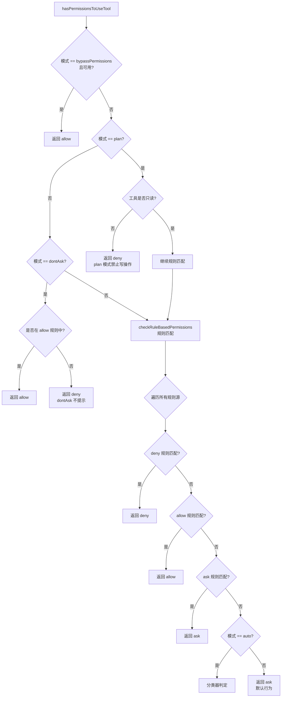

# 权限引擎：hasPermissionsToUseTool 核心守门函数

> 前置：[权限原语](/ch03-constraints/permission-primitives.html) + [沙箱模式](/ch03-constraints/sandbox.html)
>
> 源码位置：`src/utils/permissions/permissions.ts`（1486 行）+ `src/tools/BashTool/bashSecurity.ts`（2592 行）+ `src/tools/BashTool/bashPermissions.ts`（2621 行）+ `src/utils/permissions/filesystem.ts`（1777 行）

权限引擎是 Claude Code 安全架构的核心枢纽。每个工具调用都必须经过 `hasPermissionsToUseTool()` 的检查，这是一道不可绕过的守门——它结合模式判定、规则匹配、路径验证和 Bash 安全分析，给出最终的权限决策。

## 权限检查决策树



## 核心函数：hasPermissionsToUseTool

`permissions.ts` 中的 `hasPermissionsToUseTool()` 是所有工具调用的入口检查点：

```typescript
export async function hasPermissionsToUseTool(
  tool: Tool,
  input: Record<string, unknown>,
  context: ToolPermissionContext,
  // ...
): Promise<PermissionResult>
```

它的执行流程如下：

1. **模式前置检查**：bypass/plan/dontAsk 模式直接返回
2. **调用工具的 checkPermissions()**：每个工具实现自己的权限逻辑
3. **Bash 工具走 bashSecurity + bashPermissions 专项路径**
4. **文件工具走 filesystem.ts 路径验证**
5. **规则匹配 checkRuleBasedPermissions()**

## 规则匹配引擎

### checkRuleBasedPermissions

规则匹配遵循 **deny 优先** 原则：

```typescript
// 遍历顺序：deny → allow → ask
// deny 规则一旦命中，立即返回 deny
// allow 规则命中后记录，但继续检查是否有 deny 覆盖
```

规则按来源优先级匹配：

```
policySettings > flagSettings > userSettings > projectSettings > localSettings > cliArg > command > session
```

### getAllowRules / getDenyRules

```typescript
export function getAllowRules(context: ToolPermissionContext): PermissionRule[] {
  return PERMISSION_RULE_SOURCES.flatMap(source =>
    (context.alwaysAllowRules[source] || []).map(ruleString => ({
      source,
      ruleBehavior: 'allow',
      ruleValue: permissionRuleValueFromString(ruleString),
    })),
  )
}
```

规则字符串通过 `permissionRuleValueFromString` 解析为结构化对象：

```
"Bash(git log*)" → { toolName: "Bash", ruleContent: "git log*" }
"Edit"            → { toolName: "Edit" }
```

## Bash 安全验证

Bash 工具的权限检查最为复杂，涉及三层验证：

### 第一层：bashSecurity.ts（2592 行）

命令安全验证的主逻辑，负责：

| 检查项 | 说明 |
|--------|------|
| 命令解析 | 调用 AST/传统解析器获取 argv |
| 管道/复合命令 | 逐段检查每个子命令 |
| 危险模式检测 | 识别 `rm -rf`、`sudo`、重定向等 |
| 网络命令分类 | `curl`、`wget` 等标记为需确认 |

### 第二层：bashPermissions.ts（2621 行）

Bash 工具的权限判定逻辑：

| 功能 | 说明 |
|------|------|
| 命令分类 | read-only / dangerous / destructive |
| 规则匹配 | `Bash(git log*)` 前缀匹配 |
| 沙箱集成 | 判断命令是否应在沙箱内执行 |
| Auto 模式支持 | 对接 YOLO 分类器的判定 |

### 第三层：命令只读判定

```typescript
// readOnlyCommandValidation.ts
// 判断命令是否为纯读取操作（ls, cat, git log 等）
// 只读命令在多数模式下可自动放行
```

## 文件系统权限

`filesystem.ts`（1777 行）处理所有文件操作工具的权限验证：

### 路径遍历防护

```typescript
// 检测 .. 路径穿越
containsPathTraversal(inputPath)

// 路径规范化
sanitizePath(inputPath)

// 大小写不敏感比较（防止 .cLauDe 绕过）
normalizeCaseForComparison(path)
```

### 工作目录约束

文件操作被限制在允许的工作目录内：

```typescript
// 检查路径是否在允许的工作目录中
pathInAllowedWorkingPath(filePath, additionalWorkingDirectories)
```

### 危险文件/目录保护

```typescript
const DANGEROUS_FILES = [
  '.gitconfig', '.bashrc', '.zshrc', '.profile',
  '.mcp.json', '.claude.json',  // ...
]

const DANGEROUS_DIRECTORIES = [
  '.git', '.vscode', '.idea', '.claude',
]
```

对危险文件/目录的操作需要额外确认，即使在 allow 模式下也可能弹出提示。

### 技能文件特殊处理

```typescript
// 如果路径在 .claude/skills/{name}/ 内，提供更精确的权限建议
// 允许用户只授权编辑特定技能，而非整个 .claude/ 目录
```

## 拒绝追踪与退避

`denialTracking.ts` 实现了拒绝频率追踪：

```typescript
const DENIAL_LIMITS = {
  maxConsecutiveDenials: 3,   // 连续拒绝上限
  cooldownMs: 30_000,         // 冷却时间
}
```

当用户连续拒绝同一类型的权限请求达到上限时，系统进入冷却期，自动拒绝同类请求，避免反复打扰用户。

## 关键源文件

| 文件 | 行数 | 职责 |
|------|------|------|
| `src/utils/permissions/permissions.ts` | 1486 | 权限引擎核心：hasPermissionsToUseTool、规则匹配 |
| `src/tools/BashTool/bashSecurity.ts` | 2592 | Bash 命令安全验证主逻辑 |
| `src/tools/BashTool/bashPermissions.ts` | 2621 | Bash 工具权限判定、规则匹配 |
| `src/utils/permissions/filesystem.ts` | 1777 | 文件系统权限：路径验证、危险文件保护 |
| `src/utils/permissions/denialTracking.ts` | — | 拒绝频率追踪与退避 |
| `src/utils/permissions/shadowedRuleDetection.ts` | — | 被遮盖规则检测 |
| `src/utils/permissions/permissionExplainer.ts` | — | 权限决策解释器 |
| `src/utils/permissions/pathValidation.ts` | — | 路径验证工具函数 |

---

<div class="chapter-nav-hint">

**下一节：[Auto 模式分类器 →](/ch03-constraints/auto-classifier.html)**

</div>
