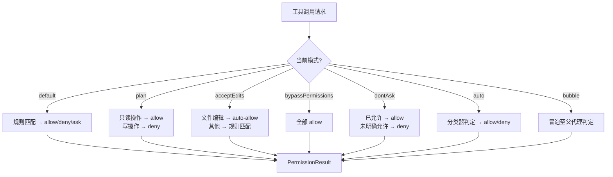

# 权限原语：PermissionResult、PermissionRule 与七种模式

> 前置：[2.4 特性标志与遥测](/ch02-identity/feature-flags)
>
> 源码位置：`src/utils/permissions/` + `src/types/permissions.ts`

Claude Code 的权限系统建立在三个核心原语之上：**PermissionMode** 决定整体策略、**PermissionRule** 定义具体规则、**PermissionResult** 表达检查结果。三者构成了一个从「模式 → 规则 → 判定」的完整链路。

## PermissionMode：七种权限模式

| 模式 | 内部名 | 符号 | 颜色标签 | 外部可见 | 说明 |
|------|--------|------|----------|----------|------|
| Default | `default` | 无 | text | 是 | 默认模式，所有写操作需用户确认 |
| Plan | `plan` | ⏸ | planMode | 是 | 只读模式，禁止执行任何写操作 |
| Accept Edits | `acceptEdits` | ⏵⏵ | autoAccept | 是 | 自动接受文件编辑，其余操作仍需确认 |
| Bypass Permissions | `bypassPermissions` | ⏵⏵ | error | 是 | 跳过所有权限检查（需 `--dangerously-skip-permissions`） |
| Don't Ask | `dontAsk` | ⏵⏵ | error | 是 | 不主动询问，对未明确允许的操作直接拒绝 |
| Auto | `auto` | ⏵⏵ | warning | 否（ant-only） | 自动模式，由分类器决定是否放行 |
| Bubble | `bubble` | — | — | 否（ant-only） | 子代理向上冒泡权限请求 |

模式定义于 `src/types/permissions.ts`，通过 feature flag 实现条件编译：

```typescript
// 外部用户可见的 5 种模式
export const EXTERNAL_PERMISSION_MODES = [
  'acceptEdits', 'bypassPermissions', 'default', 'dontAsk', 'plan',
] as const

// 内部完整集合（含 auto/bubble）
export type InternalPermissionMode = ExternalPermissionMode | 'auto' | 'bubble'
```

### 模式行为差异



### Bypass Permissions 的安全门槛

`bypassPermissions` 并非随意可用，需要满足以下条件之一：

1. Docker 容器内运行 + 无网络访问
2. 沙箱模式启用（bwrap / sandbox-exec）
3. 显式传入 `--dangerously-skip-permissions` 且系统检测到安全隔离

## PermissionRule：规则的三元组

每条规则由三部分组成：

```typescript
type PermissionRule = {
  source: PermissionRuleSource    // 规则来源
  ruleBehavior: PermissionBehavior  // 行为：allow / deny / ask
  ruleValue: PermissionRuleValue    // 目标：工具名 + 可选内容
}
```

### 规则来源（PermissionRuleSource）

| 来源 | 优先级 | 说明 |
|------|--------|------|
| `policySettings` | 最高 | 管理员策略，不可被用户覆盖 |
| `flagSettings` | 高 | CLI 标志传入 |
| `userSettings` | 中 | `~/.claude/settings.json` |
| `projectSettings` | 中 | `.claude/settings.json`（项目级） |
| `localSettings` | 中 | `.claude/settings.local.json`（本地覆盖） |
| `cliArg` | 低 | 单次 CLI 参数 |
| `command` | 低 | 运行时命令设置 |
| `session` | 最低 | 当前会话临时规则 |

### 规则行为（PermissionBehavior）

- **allow**：直接放行，不再询问
- **deny**：直接拒绝，不可覆盖
- **ask**：强制弹出确认提示（即使模式为 auto）

规则字符串格式为 `ToolName` 或 `ToolName(content)`：

```
Bash(git log*)          # 允许 git log 开头的命令
Edit                    # 允许所有编辑操作
WebFetch(domain:*.com)  # 允许访问 .com 域名
```

## PermissionResult：检查结果

权限检查的结果是一个联合类型，包含四种行为：

```typescript
type PermissionResult<Input> =
  | { behavior: 'allow'; updatedInput?: Input; decisionReason?: ... }
  | { behavior: 'ask';   message: string; suggestions?: PermissionUpdate[] }
  | { behavior: 'deny';  message: string; decisionReason: ... }
  | { behavior: 'passthrough'; message: string }
```

| 行为 | 含义 | 典型场景 |
|------|------|----------|
| `allow` | 放行，可直接执行 | 命中 allow 规则 |
| `ask` | 需用户确认 | default 模式下的写操作 |
| `deny` | 拒绝，不可执行 | 命中 deny 规则或 plan 模式写操作 |
| `passthrough` | 委托上层判定 | bubble 模式冒泡 |

### PermissionDecisionReason：决策溯源

每个结果都携带 `decisionReason`，记录决策来源：

| 类型 | 说明 |
|------|------|
| `rule` | 命中某条规则（附规则详情） |
| `mode` | 由当前模式决定 |
| `hook` | 由 Hook 拦截决定 |
| `classifier` | 由 Auto 分类器决定 |
| `safetyCheck` | 安全检查（路径穿越等） |
| `sandboxOverride` | 沙箱覆盖 |
| `workingDir` | 工作目录约束 |

## 模式切换与外部接口

外部用户通过 `ExternalPermissionMode` 交互，内部通过 `isExternalPermissionMode()` 守卫：

```typescript
// auto/bubble 对外部用户不可见
export function isExternalPermissionMode(mode: PermissionMode): boolean {
  if (process.env.USER_TYPE !== 'ant') return true
  return mode !== 'auto' && mode !== 'bubble'
}
```

模式配置以 `PermissionModeConfig` 结构存储，包含标题、短标题、符号和颜色，供 UI 渲染使用。

## 关键源文件

| 文件 | 行数 | 职责 |
|------|------|------|
| `src/types/permissions.ts` | ~440 | 权限类型定义（PermissionMode/Rule/Result/Decision） |
| `src/utils/permissions/PermissionMode.ts` | 142 | 模式配置、转换、守卫函数 |
| `src/utils/permissions/PermissionResult.ts` | 36 | 结果行为描述辅助函数 |
| `src/utils/permissions/PermissionRule.ts` | 41 | 规则 Schema 与类型重导出 |
| `src/utils/permissions/autoModeState.ts` | 40 | Auto 模式状态管理（激活/熔断） |

---

<div class="chapter-nav-hint">

**下一节：[Bash 智能层 →](/ch03-constraints/bash-intelligence.html)**

</div>
