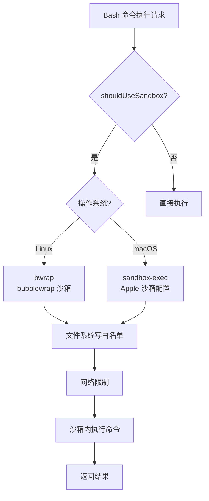

# 沙箱模式：操作系统级隔离

> 前置：[Bash 智能层](/ch03-constraints/bash-intelligence.html)
>
> 源码位置：`src/utils/sandbox/` + `src/tools/BashTool/shouldUseSandbox.ts`

权限系统在应用层检查命令安全性，沙箱则在操作系统层提供硬隔离——即使应用层检查被绕过，沙箱也能阻止对文件系统和网络的未授权访问。

## 沙箱架构



## SandboxManager 适配器

`sandbox-adapter.ts`（985 行）是 Claude Code 与 `@anthropic-ai/sandbox-runtime` 之间的桥接层，负责：

1. 将 Claude Code 的权限规则转换为沙箱运行时配置
2. 管理文件系统读写白名单
3. 配置网络访问策略
4. 处理平台差异

### 配置转换流程

```typescript
// Claude Code 权限规则 → SandboxRuntimeConfig
export function convertToSandboxRuntimeConfig(
  settings: SettingsJson,
): SandboxRuntimeConfig
```

转换过程将 `permissions.allow/deny` 规则、`sandbox.filesystem/network` 设置映射为沙箱运行时的配置格式。

## 文件系统隔离

### 写白名单

沙箱内的文件写入严格限制在白名单路径内：

| 允许写入的路径 | 说明 |
|----------------|------|
| `.` (当前目录) | 用户工作目录 |
| `getClaudeTempDir()` | Claude 临时文件目录 |
| `--add-dir` 指定的目录 | 额外工作目录 |
| worktree 主仓库路径 | Git worktree 的 .git 目录 |
| Edit/Write 规则中声明的路径 | 权限规则允许的编辑路径 |

### 写黑名单

某些路径始终被禁止写入：

| 禁止写入的路径 | 原因 |
|----------------|------|
| `settings.json` / `settings.local.json` | 防止沙箱逃逸 |
| `.claude/skills/` | 技能文件具有完整权限，不可被篡改 |
| `.claude/managed/` | 管理员策略文件 |
| bare git repo 文件（HEAD/objects/refs） | 防止 git 配置注入攻击 |

### 路径解析约定

Claude Code 使用特殊的路径前缀约定：

| 前缀 | 含义 | 沙箱解析 |
|------|------|----------|
| `//path` | 绝对路径（从文件系统根） | `//.aws/**` → `/.aws/**` |
| `/path` | 相对于 settings 文件目录 | 解析为 `$SETTINGS_DIR/path` |
| `~/path` | 用户主目录 | 透传给 sandbox-runtime 处理 |
| `./path` 或 `path` | 相对路径 | 透传给 sandbox-runtime 处理 |

## 网络限制

沙箱通过域名白名单/黑名单控制网络访问：

```typescript
// 从 WebFetch 规则中提取允许/拒绝的域名
for (const ruleString of permissions.allow || []) {
  const rule = permissionRuleValueFromString(ruleString)
  if (rule.toolName === 'WebFetch' && rule.ruleContent?.startsWith('domain:')) {
    allowedDomains.push(rule.ruleContent.substring('domain:'.length))
  }
}
```

### 托管域策略

当 `sandbox.network.allowManagedDomainsOnly: true` 时，仅使用策略设置中的域名，忽略用户级配置——防止用户级配置放宽策略限制。

## 平台实现

### Linux: bwrap (bubblewrap)

bwrap 是 Linux 上的轻量级沙箱，通过 Linux namespace 实现隔离：

- **Mount namespace**：控制文件系统可见性
- **Network namespace**：限制网络访问
- **PID namespace**：进程隔离

### macOS: sandbox-exec

macOS 使用 Apple 的 `sandbox-exec` 工具，通过 Seatbelt 规则配置：

- 文件读写规则
- 网络出站规则
- 进程执行规则

## --dangerously-skip-permissions 的安全门槛

`bypassPermissions` 模式跳过所有应用层权限检查，但需要满足以下安全前提之一：

| 条件 | 说明 |
|------|------|
| Docker 容器 + 无网络 | 容器提供文件系统隔离，无网络防止数据外泄 |
| 沙箱模式 + 无网络 | OS 级沙箱提供隔离，网络限制防止外泄 |
| CI/CD 环境 | 受控的自动化环境 |

```typescript
// shouldUseSandbox() 判定逻辑
// 当命令在沙箱内执行时，即使 bypass permissions 也不会逃出沙箱边界
```

沙箱与应用层权限的关系是**纵深防御**：应用层提供细粒度的用户交互，沙箱提供操作系统级的硬保证。

## 关键源文件

| 文件 | 行数 | 职责 |
|------|------|------|
| `src/utils/sandbox/sandbox-adapter.ts` | 985 | 沙箱适配器：配置转换、路径解析、平台桥接 |
| `src/utils/sandbox/sandbox-ui-utils.ts` | 12 | 沙箱 UI 辅助 |
| `src/tools/BashTool/shouldUseSandbox.ts` | — | 沙箱启用条件判定 |
| `@anthropic-ai/sandbox-runtime` | 外部包 | 底层沙箱运行时（bwrap/sandbox-exec） |

---

<div class="chapter-nav-hint">

**下一节：[权限引擎 →](/ch03-constraints/permission-engine.html)**

</div>
