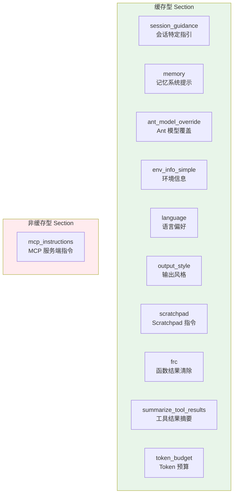
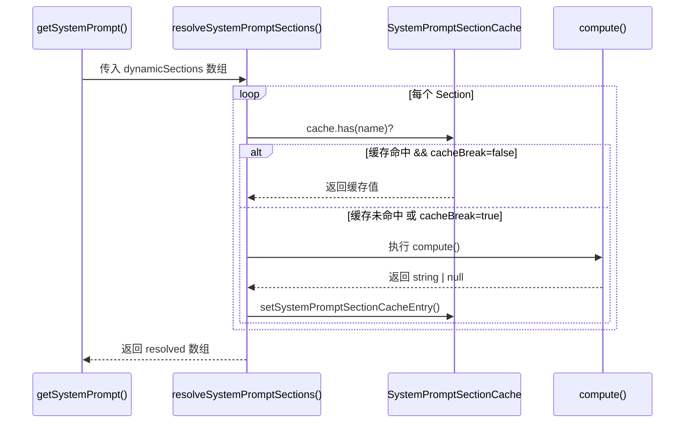

# 4.2 动态段

> 前置：[4.1 静态段](/ch04-instructions/static-prompt)
>
> 源码位置：`src/constants/systemPromptSections.ts` + `src/constants/prompts.ts`

静态段解决"跨会话缓存"问题，动态段解决"会话个性化"问题。语言偏好、MCP 指令、记忆内容等随用户/会话变化的信息不能放入全局缓存，但它们仍然需要高效的缓存策略。`systemPromptSection` API 就是为这个平衡而设计的。

## Section 注册 API

动态段通过两个工厂函数注册：

```typescript
// 缓存型 Section：计算一次，缓存直到 /clear 或 /compact
function systemPromptSection(name: string, compute: () => string | null): SystemPromptSection

// 非缓存型 Section：每轮重新计算，值变化时会破坏 Prompt Cache
function DANGEROUS_uncachedSystemPromptSection(
  name: string,
  compute: () => string | null,
  _reason: string  // 必须解释为何需要破坏缓存
): SystemPromptSection
```

两者的核心区别：

| 属性 | `systemPromptSection` | `DANGEROUS_uncachedSystemPromptSection` |
|------|----------------------|---------------------------------------|
| `cacheBreak` | `false` | `true` |
| 计算频率 | 首次计算后缓存 | 每轮重新计算 |
| 缓存破坏 | 不破坏 | 值变化时破坏 |
| 生命周期 | `/clear` 或 `/compact` 时失效 | 每轮重新求值 |

## 动态段全景



### 各 Section 详解

| Section 名称 | 工厂函数 | 说明 |
|-------------|---------|------|
| `session_guidance` | 缓存型 | Agent 子代理指引、Skill 发现、验证代理、Explore 代理等会话特定行为 |
| `memory` | 缓存型 | 调用 `loadMemoryPrompt()` 加载记忆系统提示（详见 4.3） |
| `ant_model_override` | 缓存型 | Ant 内部构建的模型覆盖配置 |
| `env_info_simple` | 缓存型 | 工作目录、平台、Shell、OS 版本等环境信息 |
| `language` | 缓存型 | 语言偏好设置（如"Always respond in Chinese"） |
| `output_style` | 缓存型 | 输出风格配置（自定义 persona） |
| `mcp_instructions` | **非缓存型** | MCP 服务端连接/断开发生在轮次之间，必须每轮刷新 |
| `scratchpad` | 缓存型 | Scratchpad 目录的读写指令 |
| `frc` | 缓存型 | Function Result Clearing（函数结果清除） |
| `summarize_tool_results` | 缓存型 | 工具结果摘要策略 |
| `token_budget` | 缓存型 | Token 预算目标（`feature('TOKEN_BUDGET')` 门控） |

## resolveSystemPromptSections() 缓存机制

```typescript
async function resolveSystemPromptSections(
  sections: SystemPromptSection[],
): Promise<(string | null)[]> {
  const cache = getSystemPromptSectionCache()

  return Promise.all(
    sections.map(async s => {
      // 缓存型 Section：命中缓存直接返回
      if (!s.cacheBreak && cache.has(s.name)) {
        return cache.get(s.name) ?? null
      }
      // 缓存未命中或非缓存型：执行计算
      const value = await s.compute()
      setSystemPromptSectionCacheEntry(s.name, value)
      return value
    }),
  )
}
```



## 缓存失效策略

`clearSystemPromptSections()` 在以下时机被调用，清空所有缓存：

- `/clear` 命令：用户显式清除对话
- `/compact` 命令：压缩上下文时重置

```typescript
export function clearSystemPromptSections(): void {
  clearSystemPromptSectionState()
  clearBetaHeaderLatches()
}
```

同时清除 Beta Header Latches，确保新对话获取最新的特性开关评估。

## MCP 指令的 Delta 优化

MCP 指令是最特殊的动态段。服务端随时连接/断开，传统做法是每轮重新计算（`DANGEROUS_uncachedSystemPromptSection`），但这会破坏 Prompt Cache。`mcpInstructionsDelta` 优化将 MCP 指令改为持久化的 Attachment 传递，避免每轮重新注入系统提示词：

```typescript
DANGEROUS_uncachedSystemPromptSection(
  'mcp_instructions',
  () =>
    isMcpInstructionsDeltaEnabled()
      ? null  // Delta 模式下不在系统提示词中注入
      : getMcpInstructionsSection(mcpClients),
  'MCP servers connect/disconnect between turns',
)
```

当 Delta 模式启用时，MCP 指令通过 `attachments.ts` 的持久化附件传递，不再破坏缓存前缀。

## session_guidance 的特殊地位

`session_guidance` 包含多个运行时条件判断（`hasAskUserQuestionTool`、`hasAgentTool`、`isForkSubagentEnabled` 等），这些条件如果放在静态段，会导致 2^N 种前缀变体，完全破坏缓存。PR #24490 和 #24171 记录了同一类 bug：运行时条件乘积导致缓存碎片化。

```typescript
systemPromptSection('session_guidance', () =>
  getSessionSpecificGuidanceSection(enabledTools, skillToolCommands),
)
```

`isForkSubagentEnabled()` 内部读取 `getIsNonInteractiveSession()`，这是一个运行时状态——将它放在边界之后是架构上的强制要求。

---

## 关键源文件

| 文件 | 行为 |
|------|------|
| `src/constants/systemPromptSections.ts` | Section 注册 API + resolveSystemPromptSections() |
| `src/constants/prompts.ts` | 动态段注册 + getSystemPrompt() 组装 |
| `src/bootstrap/state.ts` | SystemPromptSectionCache 存储 |
| `src/utils/mcpInstructionsDelta.ts` | MCP 指令 Delta 模式判断 |

---

<div class="chapter-nav-hint">

**下一节：[4.3 记忆系统（读取侧） →](/ch04-instructions/memory-read)**

MEMORY.md 如何加载、扫描和匹配，记忆如何注入系统提示词。

</div>
