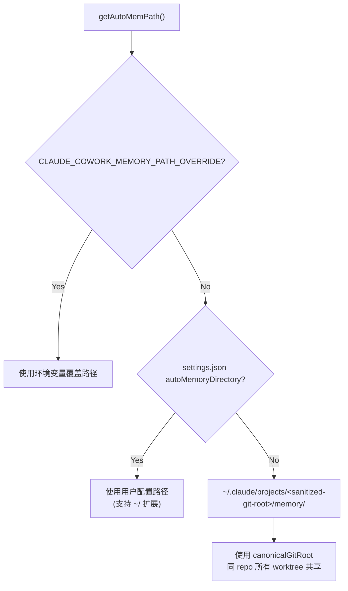
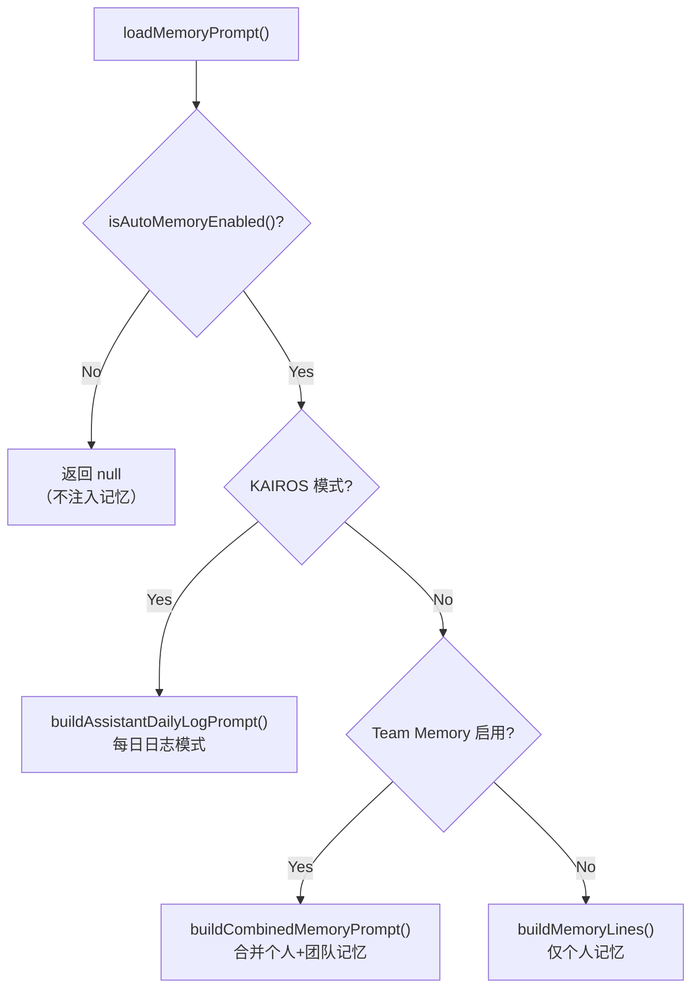

# 4.3 记忆系统（读取侧）

> 前置：[4.2 动态段](/ch04-instructions/dynamic-prompt)
>
> 源码位置：`src/memdir/`

Claude Code 的记忆系统是文件驱动的持久化机制——模型可以直接读写 Markdown 文件来记住跨会话的信息。读取侧负责将记忆内容加载并注入系统提示词，让模型在每轮对话开始时就能"回忆"过去的经验。

## 记忆路径解析

记忆文件的存储位置由 `paths.ts` 中的解析链决定：



路径解析的优先级链：

1. `CLAUDE_COWORK_MEMORY_PATH_OVERRIDE` 环境变量（SDK/Cowork 使用）
2. `autoMemoryDirectory` 设置（仅信任 `policySettings`/`flagSettings`/`localSettings`/`userSettings`，**不信任 `projectSettings`**——防止恶意仓库重定向到敏感目录）
3. 默认路径：`~/.claude/projects/<sanitized-git-root>/memory/`

## 自动记忆启用判断

```typescript
function isAutoMemoryEnabled(): boolean {
  // 优先级链（首个定义值生效）：
  // 1. CLAUDE_CODE_DISABLE_AUTO_MEMORY 环境变量
  // 2. CLAUDE_CODE_SIMPLE (--bare) → OFF
  // 3. CCR 无持久存储 → OFF
  // 4. autoMemoryEnabled 设置
  // 5. 默认: enabled
}
```

## loadMemoryPrompt() 分发逻辑

`loadMemoryPrompt()` 是记忆系统注入系统提示词的入口，根据启用的记忆系统选择不同的构建路径：



### 三种提示词模式

| 模式 | 触发条件 | 记忆写入方式 |
|------|---------|------------|
| 每日日志 | `KAIROS` + `autoEnabled` + `kairosActive` | 追加到 `logs/YYYY/MM/YYYY-MM-DD.md` |
| 合并记忆 | `TEAMMEM` + `isTeamMemoryEnabled()` | 写入 auto + team 两个目录 |
| 个人记忆 | `autoEnabled`（默认） | 写入 auto 目录 |

## MEMORY.md 入口文件

`MEMORY.md` 是记忆系统的索引文件，限制为 200 行 / 25KB：

```typescript
export const MAX_ENTRYPOINT_LINES = 200
export const MAX_ENTRYPOINT_BYTES = 25_000
```

`truncateEntrypointContent()` 双重截断保护：先按行数截断（自然边界），再按字节数截断（防止超长行）。超出限制时追加 WARNING 提示。

```typescript
export function truncateEntrypointContent(raw: string): EntrypointTruncation {
  // 先按行截断
  let truncated = wasLineTruncated
    ? contentLines.slice(0, MAX_ENTRYPOINT_LINES).join('\n')
    : trimmed

  // 再按字节截断
  if (truncated.length > MAX_ENTRYPOINT_BYTES) {
    const cutAt = truncated.lastIndexOf('\n', MAX_ENTRYPOINT_BYTES)
    truncated = truncated.slice(0, cutAt > 0 ? cutAt : MAX_ENTRYPOINT_BYTES)
  }
}
```

## 记忆类型系统

记忆内容分为四种类型（`memoryTypes.ts`），采用封闭分类法——可从当前项目状态推导出的内容（代码模式、架构、Git 历史）**被明确排除**：

| 类型 | 用途 | 示例 |
|------|------|------|
| `user` | 用户偏好和身份 | "使用 bun 而非 npm"、"用户是后端工程师" |
| `feedback` | 行为纠正 | "不要总结 diff"、"简短回复" |
| `project` | 项目上下文（不可推导） | "截止日期是 6/15"、"事故 #1234 的根因" |
| `reference` | 外部系统指针 | "监控面板 URL"、"Linear 项目 ID" |

## 记忆文件格式

每个记忆文件使用 YAML frontmatter：

```markdown
---
name: user_role
description: User's role and expertise
type: user
---

User is a senior backend engineer who prefers...
```

`MEMORY.md` 作为索引，每行一个指针：

```markdown
- [User Role](user_role.md) — senior backend, prefers Go
- [Feedback: Testing](feedback_testing.md) — always run tests after edits
```

## 目录存在性保障

`ensureMemoryDirExists()` 在 `loadMemoryPrompt()` 中被调用（通过 `systemPromptSection` 缓存每会话仅执行一次），确保模型写入时无需先检查目录是否存在。提示词文本也反映了这一点：

> "This directory already exists — write to it directly with the Write tool (do not run mkdir or check for its existence)."

## 团队记忆路径

团队记忆目录位于个人记忆的子目录：`<autoMemPath>/team/`。因此 `ensureMemoryDirExists(teamDir)` 会同时创建父目录。合并提示词包含两套独立的保存指引，分别指向 auto 和 team 目录。

---

## 关键源文件

| 文件 | 行为 |
|------|------|
| `src/memdir/memdir.ts` | loadMemoryPrompt() 入口 + 提示词构建 |
| `src/memdir/paths.ts` | 路径解析 + 启用判断 |
| `src/memdir/memoryTypes.ts` | 记忆类型定义 + frontmatter 示例 |
| `src/memdir/memoryScan.ts` | 记忆文件扫描 |
| `src/memdir/findRelevantMemories.ts` | 相关性匹配 |
| `src/memdir/teamMemPaths.ts` | 团队记忆路径 |
| `src/memdir/teamMemPrompts.ts` | 合并记忆提示词 |

---

<div class="chapter-nav-hint">

**下一节：[4.3b 记忆系统（写入侧） →](/ch04-instructions/memory-write)**

extractMemories、autoDream、SessionMemory、teamMemorySync 如何在后台将对话经验持久化为记忆文件。

</div>
