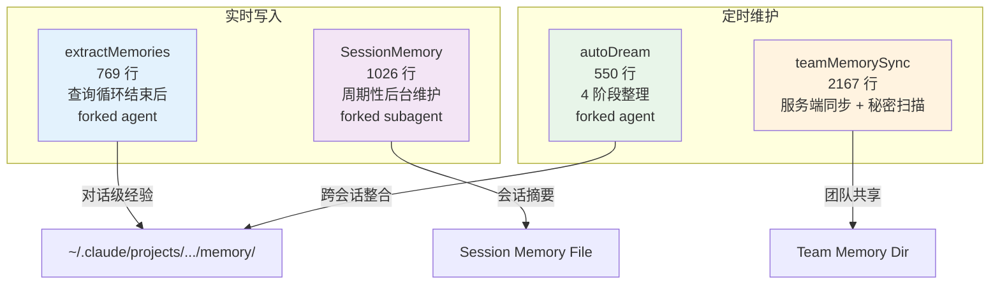
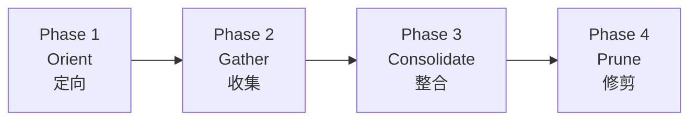
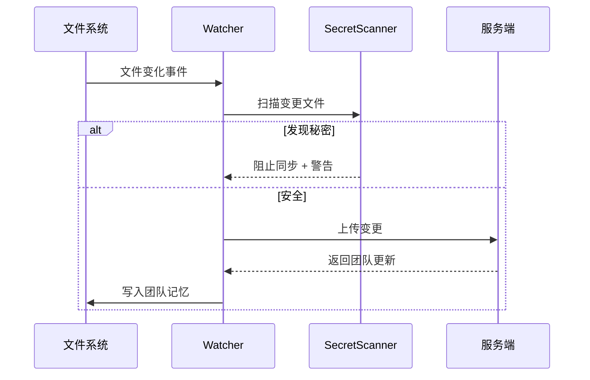
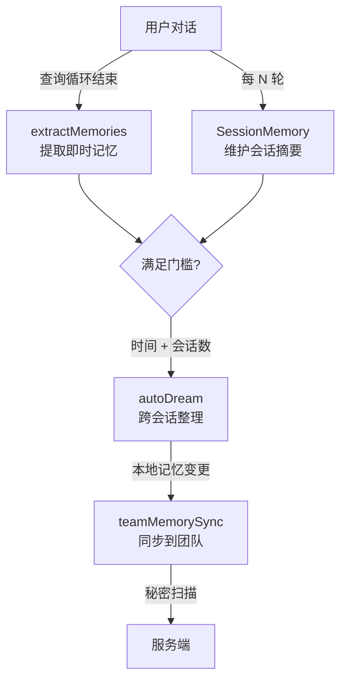

# 4.3b 记忆系统（写入侧）

> 前置：[4.3 记忆系统（读取侧）](/ch04-instructions/memory-read)
>
> 源码位置：`src/services/extractMemories/` + `src/services/autoDream/` + `src/services/SessionMemory/` + `src/services/teamMemorySync/`

读取侧负责"每轮对话能回忆什么"，写入侧负责"哪些经验值得持久化"。Claude Code 的记忆写入由四个子系统协同完成，它们各自在不同的时机和粒度上工作。

## 写入子系统全景



## extractMemories（对话级提取）

`extractMemories` 在每个完整查询循环结束时（模型产生最终响应且无工具调用），通过 `handleStopHooks` 触发。它使用 **forked agent 模式**——主对话的完美分叉，共享父级的 Prompt Cache。

```typescript
// 运行条件
1. feature('EXTRACT_MEMORIES') 门控
2. isExtractModeActive() = true（需要 GrowthBook 特性开关）
3. 非交互模式默认关闭，除非 tengu_slate_thimble 开关启用
```

核心流程：

1. 检查当前对话是否有"主代理已保存的记忆"（`hasMemoryWritesSince`）
2. 如果主代理已主动保存记忆，跳过该范围避免重复
3. 如果主代理没有保存任何记忆，forked agent 扫描整段对话
4. Forked agent 只拥有写入类工具（Read/Write/Edit/Glob/Grep），无 Bash

两种提示词变体：
- `buildExtractAutoOnlyPrompt`：仅个人记忆提取
- `buildExtractCombinedPrompt`：个人 + 团队记忆联合提取

## autoDream（跨会话整理）

autoDream 是后台记忆整理机制，在满足时间和会话数量门槛后触发。它将分散的记忆文件整合、去重、索引更新。

### 四阶段执行流程



**Phase 1 — Orient（定向）**

- `ls` 记忆目录查看现有文件
- 读取 `MEMORY.md` 了解当前索引
- 浏览现有主题文件，避免重复创建

**Phase 2 — Gather（收集）**

按优先级收集新信息：

1. 每日日志（`logs/YYYY/MM/YYYY-MM-DD.md`）——追加流
2. 已漂移的记忆——与代码库当前状态矛盾的事实
3. 转录搜索——grep JSONL 文件获取特定上下文

**Phase 3 — Consolidate（整合）**

- 将新信号合并到已有主题文件而非创建近似副本
- 将相对日期（"昨天"、"上周"）转换为绝对日期
- 删除被推翻的事实——修正而非累积

**Phase 4 — Prune（修剪）**

更新 `MEMORY.md` 索引，保持在 200 行 / 25KB 以内：

- 移除过期/错误/被取代的指针
- 精简过长条目（>200 字符的索引行应将细节移入主题文件）
- 添加新重要的记忆指针
- 解决矛盾——两文件冲突时修正错误方

### 触发门槛

```typescript
const DEFAULTS: AutoDreamConfig = {
  minHours: 24,      // 距上次整理至少 24 小时
  minSessions: 5,     // 至少 5 个新会话积累
}

// 三重门控（从最便宜到最昂贵）
1. Time gate: hoursSinceLastConsolidation >= minHours
2. Session gate: transcriptCount >= minSessions
3. Lock gate: no other process mid-consolidation
```

## SessionMemory（会话摘要）

SessionMemory 自动维护一个 Markdown 文件，包含当前对话的关键信息摘要。它周期性地在后台使用 forked subagent 提取信息，不中断主对话。

```typescript
// 核心配置
const DEFAULT_SESSION_MEMORY_CONFIG = {
  initializationThreshold: 5,  // 5 轮工具调用后初始化
  updateThreshold: 10,         // 每 10 轮工具调用后更新
  toolCallsBetweenUpdates: 10, // 更新间隔
}
```

运行条件：
- `isAutoCompactEnabled()` 为真（会话摘要与自动压缩配合使用）
- 非远程模式
- 使用 `sequential()` 串行化确保不会并发更新

SessionMemory 的 subagent 使用 `createSubagentContext()` 构建独立上下文，拥有 Read/Edit 工具但不拥有 Bash，通过 `buildSessionMemoryUpdatePrompt()` 生成增量更新指令。

## teamMemorySync（团队同步）

teamMemorySync 是最复杂的写入子系统（2167 行），负责：
1. 将个人记忆同步到服务端
2. 从服务端拉取团队共享记忆
3. **秘密扫描**——防止敏感信息泄露到共享存储

### 秘密扫描

`secretScanner.ts` 在同步前扫描记忆文件，检测 API 密钥、token、密码等敏感信息：

```typescript
// teamMemSecretGuard.ts 提供额外的保护层
// 在写入团队目录前执行秘密检测
```

### 文件监控

`watcher.ts` 监控记忆目录变化，在文件写入/修改时触发同步：



## MagicDocs

MagicDocs 是记忆写入的辅助机制，通过解析文档结构（frontmatter、标题层级）自动维护记忆文件的元数据一致性。它确保 `name`、`description`、`type` 字段与文件内容保持同步。

## 四子系统协作时序



---

## 关键源文件

| 文件 | 行为 |
|------|------|
| `src/services/extractMemories/extractMemories.ts` | 对话级记忆提取（forked agent） |
| `src/services/extractMemories/prompts.ts` | 提取提示词模板 |
| `src/services/autoDream/autoDream.ts` | 跨会话整理调度 |
| `src/services/autoDream/consolidationPrompt.ts` | 四阶段整理提示词 |
| `src/services/autoDream/consolidationLock.ts` | 整理锁（防并发） |
| `src/services/SessionMemory/sessionMemory.ts` | 会话摘要维护 |
| `src/services/SessionMemory/prompts.ts` | 摘要更新提示词 |
| `src/services/teamMemorySync/index.ts` | 团队同步入口 |
| `src/services/teamMemorySync/secretScanner.ts` | 秘密扫描 |
| `src/services/teamMemorySync/watcher.ts` | 文件监控 |

---

<div class="chapter-nav-hint">

**下一节：[5.1 工具注册表 →](/ch05-actions/tool-registry)**

从记忆系统转向行动系统——50+ 工具如何通过条件导入、特性门控和权限过滤组装成最终的工具池。

</div>
