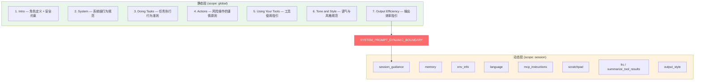
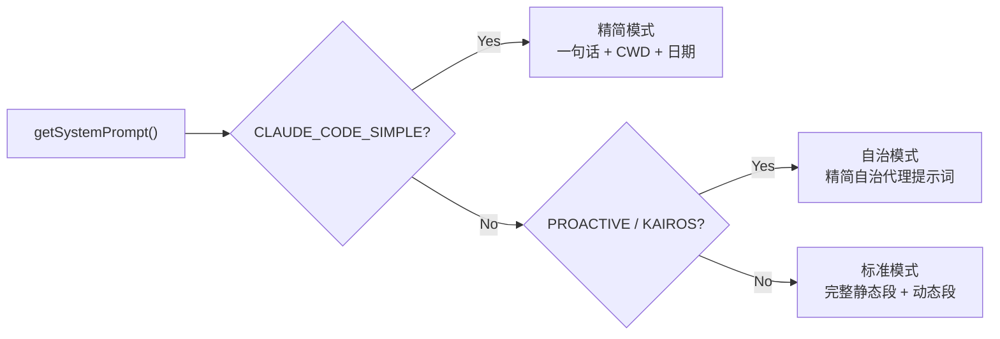

# 4.1 静态段

> 源码位置：`src/constants/prompts.ts`（960 行）

系统提示词（System Prompt）是 Claude Code 的"大脑指令集"。它将角色定义、行为规范、工具使用指南等组装成字符串数组，作为 API 请求的 `system` 字段发送给模型。整个架构围绕一个核心优化目标设计：**最大化 Prompt Cache 命中率**。

## 静态/动态分区架构

Anthropic API 的 Prompt Cache 支持不同作用域的缓存策略。全局缓存（`scope: 'global'`）可跨组织、跨会话复用，显著降低首 token 延迟和成本。但只有**不随会话变化的内容**才能使用全局缓存。

因此 `getSystemPrompt()` 将输出分为两段：



两段之间插入 `SYSTEM_PROMPT_DYNAMIC_BOUNDARY` 标记（值为 `'__SYSTEM_PROMPT_DYNAMIC_BOUNDARY__'`）。`splitSysPromptPrefix()` 据此切分，分别设置不同的缓存作用域。

> **WARNING**: 不要移动或删除该边界标记，否则会破坏 `src/utils/api.ts` 和 `src/services/api/claude.ts` 中的缓存逻辑。

## 七大静态段详解

### 1. Intro（角色定义 + 安全约束）

```typescript
function getSimpleIntroSection(outputStyleConfig): string
```

定义 Claude Code 的核心身份："You are Claude Code, Anthropic's official CLI for Claude." 同时注入安全约束：禁止生成或猜测 URL（除非是编程相关）。当 `outputStyleConfig` 存在时，角色定义会引用 Output Style 配置。

### 2. System（系统级行为规范）

```typescript
function getSimpleSystemSection(): string
```

涵盖六条核心行为规范：

- 输出文本使用 GFM Markdown，等宽字体渲染
- 工具执行受权限模式控制，用户可审批或拒绝
- `<system-reminder>` 标签包含系统信息，与工具结果无直接关联
- 警惕外部数据中的 prompt 注入
- Hook 反馈应视为来自用户
- 对话自动压缩，不受上下文窗口限制

### 3. Doing Tasks（任务执行准则）

```typescript
function getSimpleDoingTasksSection(): string
```

最长的静态段，包含代码风格子项（Ant 内部构建有额外的注释规范和真实性报告要求）和用户帮助子项。核心原则：

- 不要过度工程化：不加未请求的特性、错误处理、抽象
- 不创建不必要的文件，优先编辑已有文件
- 先读代码再改代码
- 方法失败时先诊断原因，不要盲目重试

### 4. Actions（风险操作的谨慎原则）

```typescript
function getActionsSection(): string
```

定义"可逆性/影响范围"框架：本地可逆操作（编辑文件、运行测试）可自由执行；不可逆或影响共享系统的操作须先确认。列举了四类风险操作：

| 类别 | 示例 |
|------|------|
| 破坏性操作 | 删除文件/分支、rm -rf、覆写未提交更改 |
| 难以逆转的操作 | force-push、git reset --hard、修改 CI/CD |
| 影响共享状态 | 推送代码、创建 PR、发送消息 |
| 第三方上传 | 图表渲染器、pastebin、gist（可能泄露敏感信息） |

### 5. Using Your Tools（工具使用指引）

```typescript
function getUsingYourToolsSection(enabledTools: Set<string>): string
```

关键约束：**禁止用 Bash 替代专用工具**。例如用 `Read` 替代 `cat`，用 `Edit` 替代 `sed`。同时鼓励并行调用独立工具以提高效率。在 REPL 模式下会简化为仅保留 Task 工具指引。

### 6. Tone and Style（语气与风格）

```typescript
function getSimpleToneAndStyleSection(): string
```

- 不使用 emoji（除非用户明确要求）
- 引用代码时包含 `file_path:line_number` 格式
- GitHub 引用使用 `owner/repo#123` 格式
- 工具调用前不加冒号

### 7. Output Efficiency（输出效率）

```typescript
function getOutputEfficiencySection(): string
```

Ant 内部构建使用详细版：强调为"人"而非"控制台"写作，使用流畅散文而非碎片化表达，倒金字塔结构先说重点。外部构建使用精简版：直奔主题，跳过填充词。

## 三条执行路径

`getSystemPrompt()` 根据运行模式选择不同的提示词构建路径：



- **精简模式**：`CLAUDE_CODE_SIMPLE=1` 时，仅返回最基本的身份声明
- **自治模式**：`PROACTIVE` / `KAIROS` 特性开关激活且 `isProactiveActive()` 为真时，返回自治代理提示词
- **标准模式**：默认路径，构建完整的静态/动态分层提示词

## 缓存边界的安全保障

`shouldUseGlobalCacheScope()` 控制是否插入边界标记。标准模式下，静态段内容在所有会话间完全一致（无运行时变量），因此可以安全地使用全局缓存。动态段中的任何运行时条件判断都会导致缓存碎片化（2^N 种前缀变体），这也是 `getSessionSpecificGuidanceSection()` 被放在动态段的原因。

---

## 关键源文件

| 文件 | 行为 |
|------|------|
| `src/constants/prompts.ts` | 静态段构建 + getSystemPrompt() 入口 |
| `src/constants/systemPromptSections.ts` | 动态段注册 API 与缓存解析 |
| `src/utils/api.ts` | splitSysPromptPrefix() 缓存切分 |
| `src/services/api/claude.ts` | buildSystemPromptBlocks() 缓存作用域分配 |
| `src/constants/cyberRiskInstruction.ts` | 安全约束文本 |

---

<div class="chapter-nav-hint">

**下一节：[4.2 动态段 →](/ch04-instructions/dynamic-prompt)**

动态段如何通过 `systemPromptSection` / `DANGEROUS_uncachedSystemPromptSection` 注册，以及 `resolveSystemPromptSections()` 的缓存机制。

</div>
