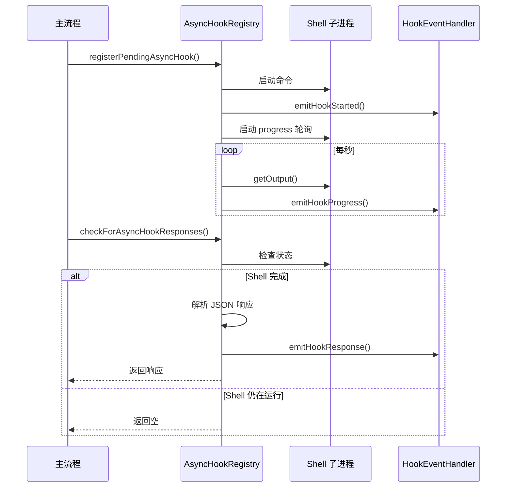
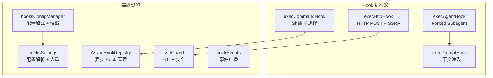

# 5.3 Hook 系统

> 前置：[5.2 工具执行引擎](/ch05-actions/tool-execution)
>
> 源码位置：`src/utils/hooks/`（17 文件，3721 行）

Hook 系统是 Claude Code 的扩展机制——用户可以在不修改源码的情况下，在关键生命周期节点注入自定义逻辑。从工具调用拦截到会话启动通知，从输入改写到输出修改，Hook 提供了一个安全且强大的插件接口。

## 26 种 Hook 事件

```typescript
export const HOOK_EVENTS = [
  'PreToolUse',           // 工具调用前
  'PostToolUse',          // 工具调用后（成功）
  'PostToolUseFailure',   // 工具调用后（失败）
  'Notification',         // 通知事件
  'UserPromptSubmit',     // 用户提交提示词前
  'SessionStart',         // 会话启动
  'SessionEnd',           // 会话结束
  'Stop',                 // 模型停止输出
  'StopFailure',          // 模型停止（失败）
  'SubagentStart',        // 子代理启动
  'SubagentStop',         // 子代理停止
  'PreCompact',           // 压缩前
  'PostCompact',          // 压缩后
  'PermissionRequest',    // 权限请求
  'PermissionDenied',     // 权限拒绝
  'Setup',                // 初始化设置
  'TeammateIdle',         // 队友空闲
  'TaskCreated',          // 任务创建
  'TaskCompleted',        // 任务完成
  'Elicitation',          // 交互式询问
  'ElicitationResult',    // 询问结果
  'ConfigChange',         // 配置变更
  'WorktreeCreate',       // Worktree 创建
  'WorktreeRemove',       // Worktree 移除
  'InstructionsLoaded',   // 指令加载完成
  'CwdChanged',           // 工作目录变更
  'FileChanged',          // 文件变更
] as const
```

## 4 种 Hook 类型

| 类型 | 执行方式 | 用途 | 配置字段 |
|------|---------|------|---------|
| **command** | Shell 子进程 | 运行脚本、linter、格式化 | `command: "shell-command"` |
| **prompt** | 注入为模型上下文 | 修改系统提示词、添加指引 | `prompt: "text..."` |
| **http** | HTTP POST 请求 | 通知外部服务、策略检查 | `url: "https://..."` |
| **agent** | 启动 forked subagent | 复杂逻辑、需要工具的决策 | `prompt: "text..."` |

### command 类型

最常用的 Hook 类型，通过 Shell 执行用户定义的命令。支持自定义 Shell（`shell` 字段）和条件匹配（`if` 字段）：

```json
{
  "hooks": {
    "PreToolUse": [
      {
        "type": "command",
        "command": "eslint --fix $CLAUDE_FILE_PATH",
        "if": "Write|Edit"
      }
    ]
  }
}
```

### prompt 类型

将文本注入为模型可见的上下文，不执行命令：

```json
{
  "hooks": {
    "SessionStart": [
      {
        "type": "prompt",
        "prompt": "Always follow the project's coding standards in CONTRIBUTING.md"
      }
    ]
  }
}
```

### http 类型

向外部 URL 发送 POST 请求，携带 Hook 输入 JSON。**受 SSRF 防护**（见下文）。

### agent 类型

最强大的 Hook 类型——启动一个完整的 forked subagent 来处理复杂逻辑。agent Hook 可以使用工具（如 Read、Grep）来做出决策。

## Hook 响应格式

所有 Hook 类型都可以返回 JSON 响应来影响行为：

```typescript
interface SyncHookJSONOutput {
  // 通用字段
  reason?: string          // 人类可读的原因说明
  stop?: boolean           // 阻止当前操作
  suppressOutput?: boolean // 抑制 Hook 输出显示

  // PreToolUse 专用
  approve?: boolean        // 自动批准工具调用
  block?: boolean          // 阻止工具调用
  injectContext?: string   // 注入额外上下文

  // UserPromptSubmit 专用
  modifiedInput?: string   // 修改用户输入
  continue?: boolean       // 继续执行（不修改）

  // 异步支持
  async?: boolean          // 标记为异步 Hook
  asyncTimeout?: number    // 异步超时（默认 15s）
}
```

### 关键响应行为

| 响应 | 适用事件 | 效果 |
|------|---------|------|
| `approve: true` | PreToolUse | 跳过用户确认，直接执行工具 |
| `block: true` | PreToolUse | 阻止工具调用 |
| `injectContext: "..."` | PreToolUse | 注入额外上下文到工具输入 |
| `modifiedInput: "..."` | UserPromptSubmit | 替换用户原始输入 |
| `stop: true` | 任何 | 停止当前操作 |
| `reason: "..."` | 任何 | 显示原因给用户 |

## AsyncHookRegistry

异步 Hook 允许长时间运行的 Hook 在后台执行，不阻塞主流程：



### 异步 Hook 的生命周期

1. **注册**：`registerPendingAsyncHook()` 将 Hook 加入 `pendingHooks` Map
2. **进度**：`startHookProgressInterval()` 每秒轮询 stdout/stderr 并发射进度事件
3. **检查**：`checkForAsyncHookResponses()` 在每轮对话中调用，检查已完成的 Hook
4. **清理**：`removeDeliveredAsyncHooks()` 移除已投递的响应
5. **终止**：`finalizePendingAsyncHooks()` 在会话结束时清理所有未完成的 Hook

### 防溢出机制

`MAX_PENDING_EVENTS = 100` 限制待处理事件数，超出时丢弃最早的事件。`allHookEventsEnabled` 控制是否发射所有事件类型（默认仅发射 `SessionStart` 和 `Setup`）。

## SSRF 防护

HTTP Hook 的 SSRF 防护（`ssrfGuard.ts`，294 行）阻止对内网地址的请求：

### 阻止的地址范围

| 范围 | 说明 |
|------|------|
| `0.0.0.0/8` | "this" 网络 |
| `10.0.0.0/8` | 私有网络 |
| `100.64.0.0/10` | CGNAT / 云元数据（含阿里云 100.100.100.200） |
| `169.254.0.0/16` | 链路本地（云元数据 169.254.169.254） |
| `172.16.0.0/12` | 私有网络 |
| `192.168.0.0/16` | 私有网络 |
| `fc00::/7` | IPv6 唯一本地 |
| `fe80::/10` | IPv6 链路本地 |

### 允许的地址

| 范围 | 原因 |
|------|------|
| `127.0.0.0/8` | 本地开发策略服务器 |
| `::1` | IPv6 本地回环 |

### 防护实现

`ssrfGuardedLookup()` 作为 axios 的 `lookup` 选项使用，确保 DNS 解析后的 IP 是验证过的——无重新绑定窗口：

```typescript
export function ssrfGuardedLookup(hostname, options, callback): void {
  // IP 字面量直接验证
  // 域名通过 dns.lookup 解析后验证所有结果
  // 阻止的地址返回 ERR_HTTP_HOOK_BLOCKED_ADDRESS
}
```

IPv4-mapped IPv6 地址（如 `::ffff:169.254.169.254`）也通过 `extractMappedIPv4()` 被正确检测和阻止。

## Hook 配置来源

```typescript
type HookSource =
  | 'policySettings'     // 策略设置（管理员）
  | 'flagSettings'       // 功能标志设置
  | 'localSettings'      // 项目 .claude/settings.json
  | 'userSettings'       // 用户 ~/.claude/settings.json
  | 'policySettings'     // 策略
  | 'pluginHook'         // 插件注册
  | 'sessionHook'        // 会话级注册
  | 'builtinHook'        // 内置 Hook
```

settings.json 中的配置格式：

```json
{
  "hooks": {
    "PreToolUse": [
      {
        "type": "command",
        "command": "my-linter",
        "if": "Write|Edit"
      }
    ],
    "PostToolUse": [
      {
        "type": "http",
        "url": "https://policy-server.example.com/check"
      }
    ]
  }
}
```

## Hook 执行器架构



---

## 关键源文件

| 文件 | 行数 | 行为 |
|------|------|------|
| `src/utils/hooks.ts` | — | Hook 执行主入口 |
| `src/utils/hooks/hooksConfigManager.ts` | 400 | 配置加载与快照 |
| `src/utils/hooks/hooksSettings.ts` | 271 | 配置解析与去重 |
| `src/utils/hooks/AsyncHookRegistry.ts` | 309 | 异步 Hook 注册与检查 |
| `src/utils/hooks/ssrfGuard.ts` | 294 | HTTP Hook SSRF 防护 |
| `src/utils/hooks/hookEvents.ts` | 192 | Hook 事件广播系统 |
| `src/utils/hooks/execAgentHook.ts` | 339 | Agent 类型 Hook 执行 |
| `src/utils/hooks/execHttpHook.ts` | 242 | HTTP 类型 Hook 执行 |
| `src/utils/hooks/execPromptHook.ts` | 211 | Prompt 类型 Hook 执行 |
| `src/utils/hooks/sessionHooks.ts` | 447 | 会话级 Hook 管理 |
| `src/utils/hooks/hooksConfigSnapshot.ts` | 133 | 配置快照与门控 |

---

<div class="chapter-nav-hint">

**下一节：[5.4 重点工具分析 →](/ch05-actions/tool-deepdives)**

BashTool（AST 解析 + 沙箱）、AgentTool（递归子代理）、MCPTool（运行时发现）——三个最复杂工具的深度剖析。

</div>
