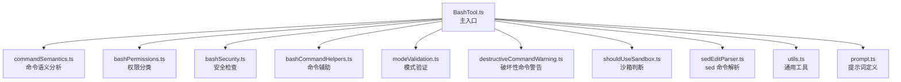
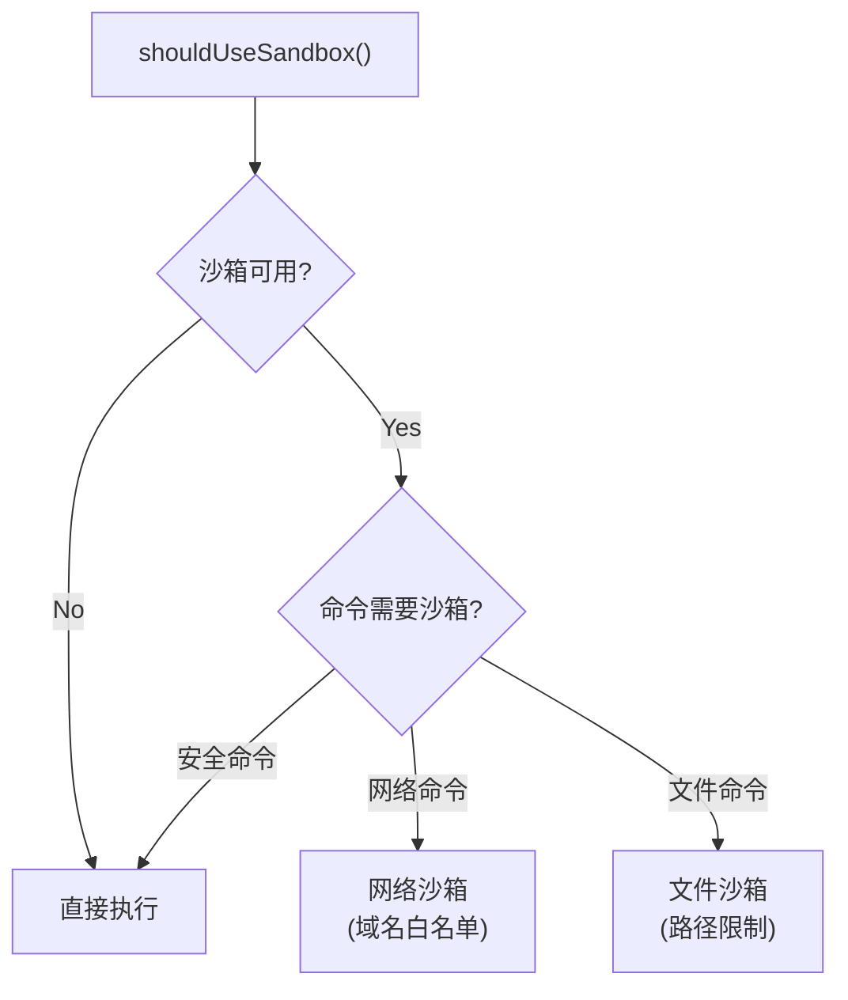
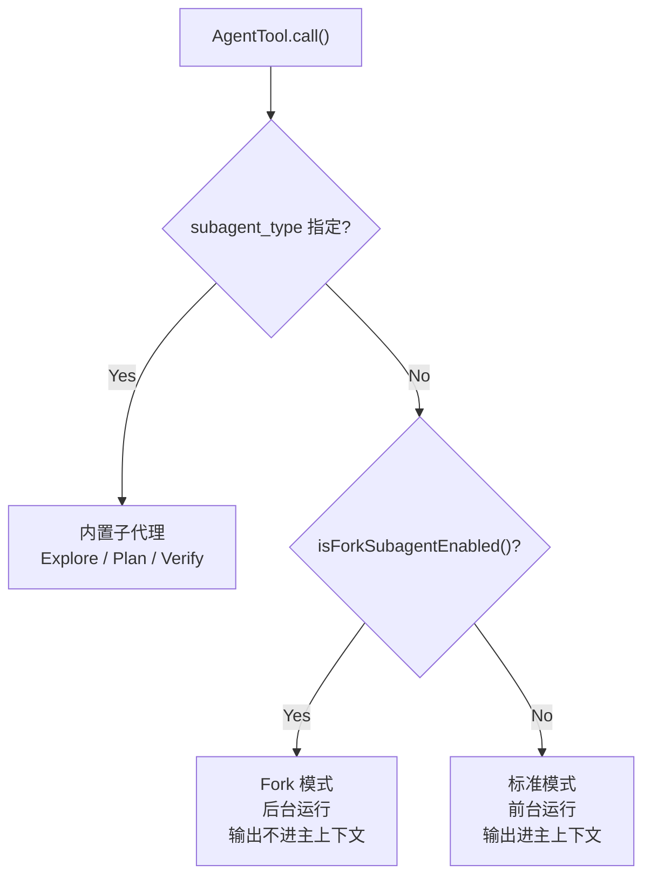
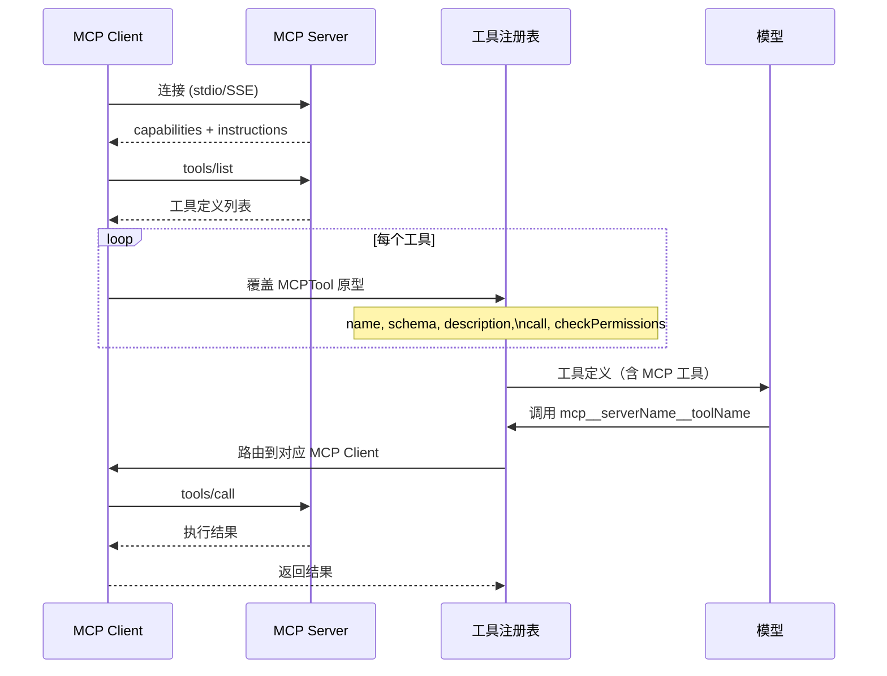

# 5.4 重点工具分析

> 前置：[5.3 Hook 系统](/ch05-actions/hook-system)
>
> 源码位置：`src/tools/BashTool/`（10894 行）+ `src/tools/AgentTool/`（4514 行）+ `src/tools/MCPTool/` + `src/services/mcp/`（12238 行）

50+ 工具中，三个工具代表了 Claude Code 工具系统最核心的工程挑战：BashTool 最复杂（安全边界），AgentTool 最递归（自引用循环），MCPTool 最动态（运行时发现）。

## BashTool：最复杂的工具

BashTool 目录包含 10+ 个模块，总计近 11000 行代码。它不仅是执行 Shell 命令的通道，更是一个完整的命令安全分析系统。

### 模块架构



### AST 级别的命令解析

`commandSemantics.ts` 不使用正则表达式，而是通过 AST 解析来理解 Shell 命令的结构：

| 解析维度 | 说明 |
|---------|------|
| 命令名称 | 提取实际要执行的程序 |
| 参数分析 | 识别文件路径、标志、子命令 |
| 管道/重定向 | 识别 `|`、`>`、`>>`、`<` |
| 子 Shell | 识别 `$(...)`、反引号 |
| 环境变量 | 识别 `VAR=val` 前缀 |
| 后台执行 | 识别 `&` |

### 权限分类系统

`bashPermissions.ts` 使用 `startSpeculativeClassifierCheck()` 异步分类命令危险级别：

| 类别 | 示例 | 权限需求 |
|------|------|---------|
| **读取** | `cat`、`ls`、`head` | 低 |
| **搜索** | `grep`、`find`、`rg` | 低 |
| **构建** | `npm test`、`make` | 中 |
| **写入** | `cp`、`mv`、`touch` | 中 |
| **破坏** | `rm`、`git push --force` | 高 |
| **网络** | `curl`、`wget` | 高 |

`destructiveCommandWarning.ts` 对已知的破坏性命令提供额外警告，覆盖 `rm -rf`、`git reset --hard`、`DROP TABLE` 等模式。

### 沙箱系统

`shouldUseSandbox.ts` 决定命令是否在沙箱中执行：



沙箱提供两层隔离：
- **网络层**：通过域名白名单限制出站连接
- **文件层**：限制可写路径，防止意外修改敏感文件

### Shell 任务管理

BashTool 管理长期运行的 Shell 进程：

- `TaskOutput`：实时捕获 stdout/stderr
- `AbortController`：支持取消正在运行的命令
- 后台任务：`run_in_background` 参数允许启动不阻塞的命令
- 进度报告：超过 `PROGRESS_THRESHOLD_MS`（2s）时显示进度指示器

### sedEditParser

`sedEditParser.ts` 解析 `sed` 命令，将 `sed -i` 操作映射为等效的 FileEdit 操作。这使得 BashTool 可以对 `sed` 命令应用与 Edit 工具相同的安全检查和差异显示。

## AgentTool：最递归的工具

AgentTool 是 Claude Code 中唯一的自引用工具——它启动一个新的查询循环（query loop），而新的查询循环可以再次调用 AgentTool。

### 两种运行模式



| 模式 | 上下文隔离 | 输出处理 | 适用场景 |
|------|----------|---------|---------|
| **Fork** | 完全隔离 | 不进入主上下文 | 研究、多步实现 |
| **标准** | 共享主上下文 | 进入主上下文 | 需要主代理可见的操作 |
| **内置子代理** | 专用提示词 | 摘要后进入 | Explore/Plan/Verify |

### 内置子代理

`builtInAgents.ts` 定义了内置的子代理类型：

| 子代理 | 类型常量 | 用途 |
|--------|---------|------|
| **Explore** | `explore` | 广泛的代码库探索和深度研究 |
| **Plan** | — | 制定实施计划 |
| **Verify** | `verification` | 独立对抗性验证 |

Explore 代理的触发条件：简单的定向搜索使用 Glob/Grep 直接执行；需要超过 `EXPLORE_AGENT_MIN_QUERIES` 次查询的深度研究才启动 Explore 子代理。

### Fork 模式详解

Fork 模式是 AgentTool 最强大的特性：

```typescript
// Fork 的关键特性
isForkSubagentEnabled() ? 
  "creates a fork, which runs in the background and keeps its tool output out of your context" :
  "Use the Agent tool with specialized agents"
```

Fork 的设计意图：
1. **上下文保护**：研究的原始输出不污染主上下文窗口
2. **并行工作**：主代理可以继续与用户对话，Fork 在后台工作
3. **Prompt Cache 共享**：Fork 是主对话的完美分叉，共享缓存前缀

**关键规则**：如果 Fork 是由主代理启动的，它不应该再次委托（"If you ARE the fork — execute directly; do not re-delegate"）。

### 递归深度控制

AgentTool 的递归不是无限的：

- Fork 模式下，Fork 内的 Agent 调用不产生新的 Fork
- `queryDepth` 跟踪递归深度
- 每层递归有独立的 `AbortController` 链
- `ALL_AGENT_DISALLOWED_TOOLS` 列表限制子代理可用的工具

### Agent 记忆

`agentMemory.ts` 和 `agentMemorySnapshot.ts` 管理子代理的内存状态：

- Fork 模式：独立的记忆上下文
- 标准模式：共享主代理记忆
- 记忆快照：在子代理启动时捕获当前记忆状态

## MCPTool：最动态的工具

MCPTool 与前两个工具的根本区别在于：它不是编译时确定的工具，而是运行时通过 MCP（Model Context Protocol）协议动态发现的。

### 适配器模式

`src/tools/MCPTool/MCPTool.ts` 只有 77 行——它是一个原型/占位符：

```typescript
export const MCPTool = buildTool({
  isMcp: true,
  name: 'mcp',           // 运行时被覆盖
  async call() {
    return { data: '' }   // 运行时被覆盖
  },
  async description() {
    return DESCRIPTION     // 运行时被覆盖
  },
  // ...
})
```

所有方法在 `mcpClient.ts` 中被运行时覆盖——真正的实现在 MCP 服务端。

### 运行时发现流程



### MCP 工具名称规范

MCP 工具使用 `mcp__<serverName>__<toolName>` 命名约定：

```typescript
// mcpStringUtils.ts
export function mcpInfoFromString(toolName: string): {
  serverName: string
  toolName: string
}
```

这种命名方式支持：
- **前缀 Deny 规则**：`mcp__server` 禁止该服务的所有工具
- **权限隔离**：不同 MCP 服务的工具有独立的权限策略
- **去重**：`assembleToolPool()` 的 `uniqBy('name')` 确保名称唯一

### Schema 适配

MCP 工具自带 JSON Schema，需要适配为 Zod Schema：

```typescript
// MCPTool 使用 passthrough schema
export const inputSchema = lazySchema(() => z.object({}).passthrough())
```

`lazySchema` 延迟 Schema 求值，因为 MCP 工具的 Schema 在连接时才可用。`passthrough()` 允许任意额外字段，因为每个 MCP 工具定义自己的输入格式。

### MCP 连接管理

`src/services/mcp/` 包含 12238 行代码，核心模块包括：

| 模块 | 行为 |
|------|------|
| `client.ts` | MCP 客户端连接、工具发现、调用路由 |
| `types.ts` | MCP 连接状态类型定义 |
| `normalization.ts` | 工具名称规范化 |
| `utils.ts` | MCP 工具识别与作用域判断 |
| `channelPermissions.ts` | 通道级权限控制 |
| `officialRegistry.ts` | 官方 MCP 服务注册表 |
| `envExpansion.ts` | 环境变量展开 |

### 连接类型

```typescript
type MCPServerConnection =
  | { type: 'connected'; ... }    // 已连接，可用
  | { type: 'disconnected'; ... } // 已断开
  | { type: 'error'; ... }        // 连接错误
```

MCP 连接状态变化是 `mcp_instructions` 动态段使用 `DANGEROUS_uncachedSystemPromptSection` 的原因——服务端随时连接/断开，缓存的指令可能已过时。

## 三大工具对比

| 维度 | BashTool | AgentTool | MCPTool |
|------|----------|-----------|---------|
| **复杂度** | ~11000 行 | ~4500 行 | 77 行（原型）+ 12000 行（MCP 服务） |
| **核心挑战** | 安全边界 | 递归控制 | 动态发现 |
| **权限模型** | AST 分析 + 沙箱 | 子代理限制 + 深度控制 | 通道权限 + 前缀 Deny |
| **缓存影响** | 无 | Fork 共享 Prompt Cache | 连接变化破坏缓存 |
| **并发安全** | 不安全 | 不安全 | 取决于具体工具 |
| **可扩展性** | 有限 | 通过内置子代理 | 无限（任意 MCP 服务） |

---

## 关键源文件

| 文件 | 行为 |
|------|------|
| `src/tools/BashTool/BashTool.ts` | BashTool 主入口 |
| `src/tools/BashTool/commandSemantics.ts` | 命令语义 AST 解析 |
| `src/tools/BashTool/bashPermissions.ts` | 命令权限分类 |
| `src/tools/BashTool/bashSecurity.ts` | 安全检查 |
| `src/tools/BashTool/shouldUseSandbox.ts` | 沙箱判断 |
| `src/tools/BashTool/sedEditParser.ts` | sed 命令映射 |
| `src/tools/AgentTool/AgentTool.ts` | AgentTool 主入口 |
| `src/tools/AgentTool/runAgent.ts` | 查询循环执行 |
| `src/tools/AgentTool/forkSubagent.ts` | Fork 模式实现 |
| `src/tools/AgentTool/builtInAgents.ts` | 内置子代理定义 |
| `src/tools/AgentTool/agentMemory.ts` | 代理记忆管理 |
| `src/tools/MCPTool/MCPTool.ts` | MCPTool 原型（77 行） |
| `src/services/mcp/client.ts` | MCP 客户端与运行时覆盖 |
| `src/services/mcp/types.ts` | MCP 连接类型定义 |
| `src/services/mcp/normalization.ts` | 工具名称规范化 |

---

<div class="chapter-nav-hint">

**下一节：[6.1 query() 异步生成器 →](/ch06-heartbeat/query-loop)**

从工具执行回到上下文管理——当对话超过上下文窗口时，压缩（compact）和摘要（summarization）如何保持对话连续性。

</div>
