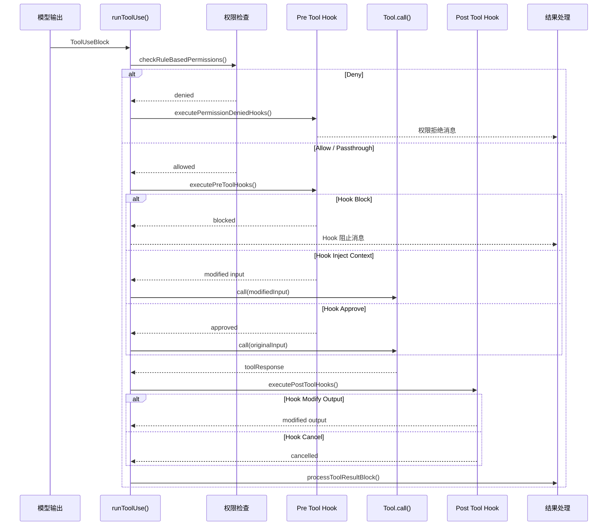
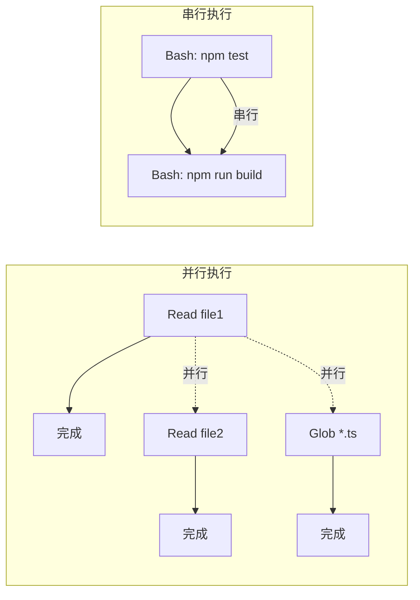

# 5.2 工具执行引擎

> 前置：[5.1 工具注册表](/ch05-actions/tool-registry)
>
> 源码位置：`src/services/tools/toolExecution.ts`（1745 行）+ `StreamingToolExecutor.ts`（530 行）+ `toolOrchestration.ts`（188 行）+ `toolHooks.ts`（650 行）

工具注册表决定"模型能看到哪些工具"，工具执行引擎决定"工具调用如何实际运行"。从权限校验到 Hook 拦截，从串行安全执行到并行流式调度，整个引擎的核心设计目标是：**安全可控 + 最大并发**。

## 单工具执行生命周期

`toolExecution.ts` 的 `runToolUse()` 实现了单个工具调用的完整生命周期：



### 阶段 1：权限检查

```typescript
// 三级权限判断
const ruleResult = checkRuleBasedPermissions(
  permissionContext, tool, input, permissionMode
)
```

| 结果 | 行为 |
|------|------|
| `allow` | 直接放行，无用户交互 |
| `deny` | 直接拒绝，触发 PermissionDenied Hook |
| `passthrough` | 需要用户交互确认 |

### 阶段 2：Pre Tool Hook

Pre Hook 可以做出四种响应：

| 响应类型 | 效果 |
|---------|------|
| `approve` | 跳过用户确认，直接执行 |
| `block` | 阻止工具调用，返回阻止原因 |
| `inject context` | 注入额外上下文到工具输入 |
| 无响应 | 继续正常流程（可能仍需用户确认） |

### 阶段 3：工具执行

调用 `tool.call(input, context)`，支持进度回调（`ToolProgress`）和取消信号（`AbortController`）。

### 阶段 4：Post Tool Hook

Post Hook 可以修改工具输出、取消结果、或附加 Attachment 消息。对 MCP 工具的输出特别有用——可以转换格式或注入额外信息。

### 阶段 5：结果处理

`processToolResultBlock()` 和 `processPreMappedToolResultBlock()` 将工具输出转换为 API 格式的 `tool_result` 块，同时处理结果截断和存储。

## StreamingToolExecutor：并发调度

`StreamingToolExecutor.ts` 实现了流式并发执行——模型输出工具调用时立即开始执行，而非等待所有工具调用输出完毕。

### 并发安全分类

```typescript
type ToolStatus = 'queued' | 'executing' | 'completed' | 'yielded'

type TrackedTool = {
  id: string
  block: ToolUseBlock
  isConcurrencySafe: boolean  // 关键属性
  status: ToolStatus
  promise?: Promise<void>
  results?: Message[]
}
```

| 类型 | 并发策略 | 示例 |
|------|---------|------|
| **并发安全** | 可与其他安全工具并行 | Read、Glob、Grep、WebFetch |
| **非并发安全** | 必须独占执行 | Bash、Edit、Write、Agent |



### 错误传播

Bash 工具出错时，通过 `siblingAbortController` 取消所有兄弟子进程，而非等待它们运行完毕。该控制器是 `toolUseContext.abortController` 的子控制器——中止它不会中止父级（`query.ts` 不会结束当前轮次）。

### 结果顺序保证

虽然工具可以并行执行，但结果按模型输出的顺序（`tools` 数组索引）发射，确保上下文一致性。

## toolOrchestration：遗留分区批处理

`toolOrchestration.ts`（188 行）是遗留的分区批处理方案，将工具分为"安全"和"不安全"两个分区依次执行。已被 `StreamingToolExecutor` 取代，保留用于兼容性。

## toolHooks：Hook 执行逻辑

`toolHooks.ts`（650 行）封装了工具相关的 Hook 执行逻辑：

### runPreToolUseHooks

```typescript
async function* runPreToolUseHooks(context, tool, input): AsyncGenerator
```

对每个匹配的 Pre Tool Hook 执行，yield 消息更新。支持 Hook 注入上下文和修改输入。

### runPostToolUseHooks

```typescript
async function* runPostToolUseHooks(context, tool, input, output): AsyncGenerator
```

Post Hook 可以修改工具输出（`updatedMCPToolOutput`）或生成 Attachment 消息。

### runPostToolUseFailureHooks

```typescript
async function* runPostToolUseFailureHooks(context, tool, input, error): AsyncGenerator
```

仅在工具执行失败时触发，允许 Hook 在失败后注入恢复建议。

### resolveHookPermissionDecision

Hook 的权限决策可以覆盖默认的权限判断：

```typescript
function resolveHookPermissionDecision(hookResponses): PermissionDecision | null
```

## 性能监控

所有阶段都有耗时阈值：

```typescript
export const HOOK_TIMING_DISPLAY_THRESHOLD_MS = 500
const SLOW_PHASE_LOG_THRESHOLD_MS = 2000
```

超过 500ms 的 Hook 耗时会在输出中显示；超过 2000ms 的阶段会记录调试警告，与 BashTool 的 `PROGRESS_THRESHOLD_MS` 对齐——超过此阈值用户会觉得界面卡住。

## 错误分类

`classifyToolError()` 将工具执行错误分类为遥测安全字符串，避免在压缩构建中泄露混淆后的类名：

| 错误类型 | 遥测标签 |
|---------|---------|
| TelemetrySafeError | `error.telemetryMessage` |
| Node.js fs 错误 | `Error:ENOENT`、`Error:EACCES` |
| 已知错误类型 | `ShellError`、`ImageSizeError` |
| 未知 | `Error` |

---

## 关键源文件

| 文件 | 行为 |
|------|------|
| `src/services/tools/toolExecution.ts` | 单工具执行生命周期 |
| `src/services/tools/StreamingToolExecutor.ts` | 并发流式执行器 |
| `src/services/tools/toolOrchestration.ts` | 遗留分区批处理 |
| `src/services/tools/toolHooks.ts` | Pre/Post Tool Hook 执行 |
| `src/utils/hooks.ts` | Hook 基础设施 |
| `src/types/hooks.ts` | Hook 类型定义 |

---

<div class="chapter-nav-hint">

**下一节：[5.3 Hook 系统 →](/ch05-actions/hook-system)**

26 种事件、4 种 Hook 类型、AsyncHookRegistry、SSRF 防护——完整的 Hook 生命周期。

</div>
