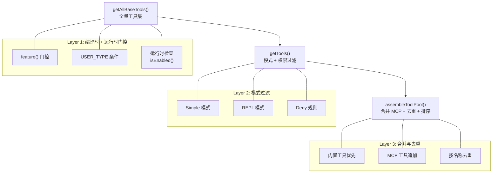

# 5.1 工具注册表

> 源码位置：`src/tools.ts`（389 行）

Claude Code 拥有 50+ 内置工具，加上运行时发现的 MCP 工具，总计可达数百个。工具注册表负责在正确的条件下暴露正确的工具子集给模型——这涉及编译时门控、运行时特性检查、权限过滤和缓存稳定性排序。

## 三层过滤架构



## getAllBaseTools()：全量工具集

全量工具集是所有可能工具的来源。每个工具通过条件导入（Dead Code Elimination）控制是否进入列表：

```typescript
export function getAllBaseTools(): Tools {
  return [
    AgentTool,              // 始终可用
    TaskOutputTool,         // 始终可用
    BashTool,               // 始终可用
    ...(hasEmbeddedSearchTools() ? [] : [GlobTool, GrepTool]),
    ExitPlanModeV2Tool,
    FileReadTool,
    FileEditTool,
    FileWriteTool,
    NotebookEditTool,
    WebFetchTool,
    TodoWriteTool,
    WebSearchTool,
    TaskStopTool,
    AskUserQuestionTool,
    SkillTool,
    EnterPlanModeTool,
    ...(process.env.USER_TYPE === 'ant' ? [ConfigTool] : []),
    ...(process.env.USER_TYPE === 'ant' ? [TungstenTool] : []),
    ...(SuggestBackgroundPRTool ? [SuggestBackgroundPRTool] : []),
    ...(isTodoV2Enabled() ? [TaskCreateTool, TaskGetTool, TaskUpdateTool, TaskListTool] : []),
    ...(isWorktreeModeEnabled() ? [EnterWorktreeTool, ExitWorktreeTool] : []),
    ...(SleepTool ? [SleepTool] : []),
    ...cronTools,             // CronCreate / CronDelete / CronList
    ...(WorkflowTool ? [WorkflowTool] : []),
    BriefTool,
    ...(getPowerShellTool() ? [getPowerShellTool()] : []),
    ListMcpResourcesTool,
    ReadMcpResourceTool,
    ...(isToolSearchEnabledOptimistic() ? [ToolSearchTool] : []),
  ]
}
```

## 工具分类总览

| 类别 | 工具名称 | 门控条件 |
|------|---------|---------|
| **核心文件操作** | `Read`, `Edit`, `Write`, `NotebookEdit` | 始终可用 |
| **搜索** | `Glob`, `Grep` | 无嵌入式搜索工具时可用 |
| **Shell** | `Bash`, `PowerShell` | PowerShell 需运行时检测 |
| **代理/任务** | `Agent`, `TaskOutput`, `TaskStop` | 始终可用 |
| **任务管理 V2** | `TaskCreate`, `TaskGet`, `TaskUpdate`, `TaskList` | `isTodoV2Enabled()` |
| **Web** | `WebFetch`, `WebSearch` | 始终可用 |
| **MCP 资源** | `ListMcpResources`, `ReadMcpResource` | 始终可用 |
| **规划** | `EnterPlanMode`, `ExitPlanModeV2` | 始终可用 |
| **Worktree** | `EnterWorktree`, `ExitWorktree` | `isWorktreeModeEnabled()` |
| **Skill** | `Skill`, `ToolSearch` | ToolSearch 需乐观检查 |
| **交互** | `AskUserQuestion` | 始终可用 |
| **Ant 专属** | `Config`, `Tungsten`, `SuggestBackgroundPR` | `USER_TYPE === 'ant'` |
| **测试专用** | `TestingPermission`, `OverflowTest` | `NODE_ENV === 'test'` / feature flag |
| **调度** | `CronCreate`, `CronDelete`, `CronList` | `feature('AGENT_TRIGGERS')` |
| **远程触发** | `RemoteTrigger` | `feature('AGENT_TRIGGERS_REMOTE')` |
| **监控** | `Monitor` | `feature('MONITOR_TOOL')` |
| **Kairos** | `Sleep`, `Brief`, `SendUserFile`, `PushNotification` | 各 feature 门控 |
| **GitHub Webhook** | `SubscribePR` | `feature('KAIROS_GITHUB_WEBHOOKS')` |
| **Swarms** | `TeamCreate`, `TeamDelete`, `SendMessage`, `ListPeers` | 各 feature 门控 |
| **LSP** | `LSP` | `ENABLE_LSP_TOOL` 环境变量 |
| **REPL** | `REPL` | `USER_TYPE === 'ant'` |
| **Workflow** | `Workflow` | `feature('WORKFLOW_SCRIPTS')` |
| **Web Browser** | `WebBrowser` | `feature('WEB_BROWSER_TOOL')` |
| **Context** | `CtxInspect`, `Snip` | 各 feature 门控 |

## getTools()：模式与权限过滤

`getTools()` 在全量工具集基础上应用两层过滤：

### 1. 精简模式

`CLAUDE_CODE_SIMPLE=1` 时仅暴露最基础的工具集：

```typescript
if (isEnvTruthy(process.env.CLAUDE_CODE_SIMPLE)) {
  // REPL 模式: 仅 REPL 工具
  // 普通精简: Bash + Read + Edit
  // Coordinator: 加 Agent + TaskStop + SendMessage
}
```

### 2. Deny 规则过滤

```typescript
export function filterToolsByDenyRules<T>(tools, permissionContext): T[] {
  return tools.filter(tool => !getDenyRuleForTool(permissionContext, tool))
}
```

Deny 规则支持 blanket deny（按工具名）和前缀匹配（`mcp__server` 禁止该 MCP 服务的所有工具），在模型看到工具列表前就移除——而非仅在调用时拦截。

### 3. REPL 隐藏

REPL 模式启用时，原始工具（Bash/Read/Edit/Glob/Grep）从工具列表隐藏，通过 VM 上下文在脚本中使用。

### 4. isEnabled() 运行时检查

每个工具的 `isEnabled()` 方法做最终检查（如 `WebSearchTool` 检查 API key 是否配置）。

## assembleToolPool()：合并与去重

```typescript
export function assembleToolPool(
  permissionContext: ToolPermissionContext,
  mcpTools: Tools,
): Tools {
  const builtInTools = getTools(permissionContext)
  const allowedMcpTools = filterToolsByDenyRules(mcpTools, permissionContext)

  // 按名称排序，内置工具作为连续前缀
  const byName = (a, b) => a.name.localeCompare(b.name)
  return uniqBy(
    [...builtInTools].sort(byName).concat(allowedMcpTools.sort(byName)),
    'name',  // 内置工具同名时优先（insertion order）
  )
}
```

排序策略的关键考量：服务端的 `claude_code_system_cache_policy` 在最后一个前缀匹配的内置工具后放置全局缓存断点。如果 MCP 工具与内置工具交错排列，每次 MCP 工具变化都会使下游所有缓存键失效。

`uniqBy('name')` 保证内置工具在名称冲突时优先，因为 `uniqBy` 保留首次出现的元素。

## 条件导入与 Dead Code Elimination

Ant 内部工具通过 `require()` 动态导入，Bun 的 `feature()` 在构建时折叠条件分支，确保外部构建不包含内部工具代码：

```typescript
const SleepTool = feature('PROACTIVE') || feature('KAIROS')
  ? require('./tools/SleepTool/SleepTool.js').SleepTool
  : null
```

`USER_TYPE === 'ant'` 是构建时 `--define` 常量，在每个调用点内联（不能提升为常量），以便 Bundler 常量折叠为 `false` 并消除分支。

---

## 关键源文件

| 文件 | 行为 |
|------|------|
| `src/tools.ts` | getAllBaseTools + getTools + assembleToolPool |
| `src/constants/tools.ts` | 工具禁止列表常量 |
| `src/types/tools.ts` | 工具类型定义 |
| `src/Tool.ts` | Tool 基类 + findToolByName |
| `src/utils/toolSearch.ts` | ToolSearch 启用判断 |

---

<div class="chapter-nav-hint">

**下一节：[5.2 工具执行引擎 →](/ch05-actions/tool-execution)**

单个工具调用如何通过权限检查、Pre Hook、执行、Post Hook 的完整生命周期，以及并发执行的调度策略。

</div>
