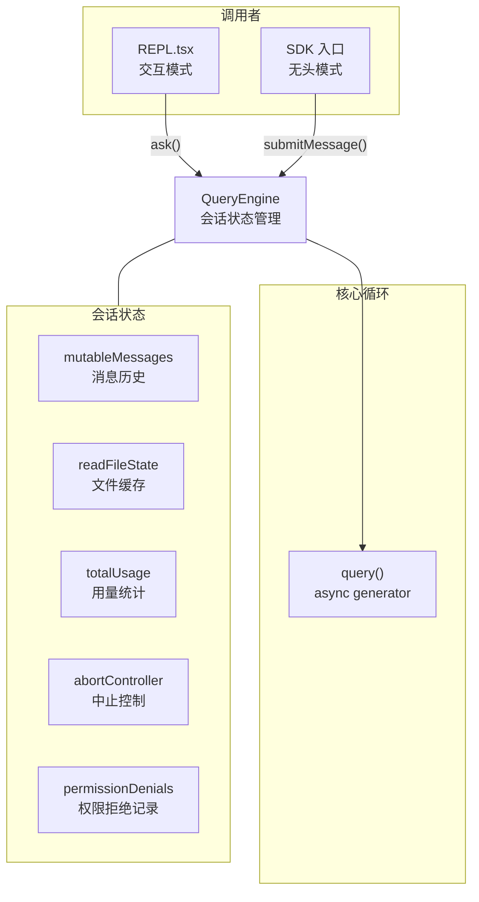
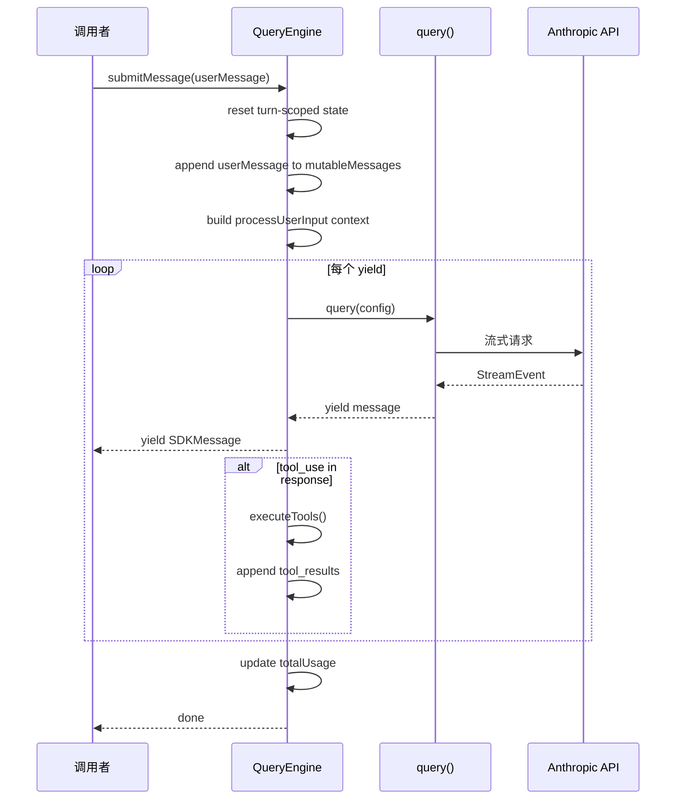

# 6.2 QueryEngine

> 前置：[6.1 query() 核心循环](/ch06-heartbeat/query-loop)
>
> 源码位置：`src/QueryEngine.ts` (1295 行)

QueryEngine 是 query() 的类封装——将核心循环从函数式 async generator 提升为有状态的对象，使其同时服务于 REPL 交互模式和 SDK 无头模式。

## 架构定位



## QueryEngineConfig

构造配置定义了引擎运行所需的全部依赖：

```typescript
export type QueryEngineConfig = {
  cwd: string                    // 工作目录
  tools: Tools                   // 可用工具集
  commands: Command[]            // 斜杠命令集
  mcpClients: MCPServerConnection[]  // MCP 连接
  agents: AgentDefinition[]      // 可用 Agent 定义
  canUseTool: CanUseToolFn       // 权限检查回调
  getAppState: () => AppState    // 读取 UI 状态
  setAppState: (f) => void       // 更新 UI 状态
  initialMessages?: Message[]    // 初始消息（恢复会话）
  readFileCache: FileStateCache  // 文件状态缓存
  customSystemPrompt?: string    // 自定义系统 prompt
  appendSystemPrompt?: string    // 追加系统 prompt
  userSpecifiedModel?: string    // 用户指定模型
  thinkingConfig?: ThinkingConfig // Thinking 配置
  maxTurns?: number              // 最大 turn 数
  maxBudgetUsd?: number          // 预算上限
  taskBudget?: { total: number } // API task budget
  abortController?: AbortController  // 中止控制器
  // ... 更多可选配置
}
```

## 会话状态管理

QueryEngine 持有以下跨 turn 持久状态：

| 状态 | 类型 | 生命周期 | 用途 |
|------|------|----------|------|
| `mutableMessages` | `Message[]` | 整个会话 | 消息历史，跨 turn 增长 |
| `readFileState` | `FileStateCache` | 整个会话 | 文件内容缓存，避免重复读取 |
| `totalUsage` | `NonNullableUsage` | 整个会话 | 累积 token 用量和成本 |
| `abortController` | `AbortController` | 每次 submitMessage | 中止当前 turn |
| `permissionDenials` | `SDKPermissionDenial[]` | 整个会话 | 记录权限拒绝（SDK 模式） |
| `discoveredSkillNames` | `Set<string>` | 每次 submitMessage | turn 内 skill 发现追踪 |
| `loadedNestedMemoryPaths` | `Set<string>` | 整个会话 | 已加载的嵌套 memory 路径 |

## submitMessage() async generator

核心方法，每次调用启动一轮新的 turn：



## 两种入口：ask() vs submitMessage()

| 特性 | ask() (REPL) | submitMessage() (SDK) |
|------|-------------|----------------------|
| 调用者 | REPL.tsx | SDK / CLI 无头模式 |
| 消息管理 | 外部管理 | QueryEngine 内部管理 |
| 中止控制 | 全局 AbortController | 每 turn 独立 AbortController |
| 状态持久 | 通过 AppState | 通过 mutableMessages |
| Snip 处理 | REPL 保持完整历史 | QueryEngine 截断以节省内存 |
| 权限拒绝 | 交互式弹窗 | 收集为 SDKPermissionDenial |
| SDK 状态 | 不适用 | setSDKStatus() 回调 |

## 关键源文件

| 文件 | 行数 | 职责 |
|------|------|------|
| `src/QueryEngine.ts` | 1295 | QueryEngine 类定义 |
| `src/utils/queryHelpers.ts` | - | handleOrphanedPermission/isResultSuccessful |
| `src/utils/queryContext.ts` | - | fetchSystemPromptParts() |
| `src/utils/processUserInput/` | - | processUserInput() 用户输入处理 |
| `src/utils/sessionStorage.ts` | - | recordTranscript/flushSessionStorage |
| `src/utils/messages/mappers.ts` | - | 消息格式映射（内部→SDK） |
| `src/utils/messages/systemInit.ts` | - | buildSystemInitMessage() |

---

<div class="chapter-nav-hint">

**下一节：[7.1 状态管理 →](/ch07-extensions/state-management)**

</div>
