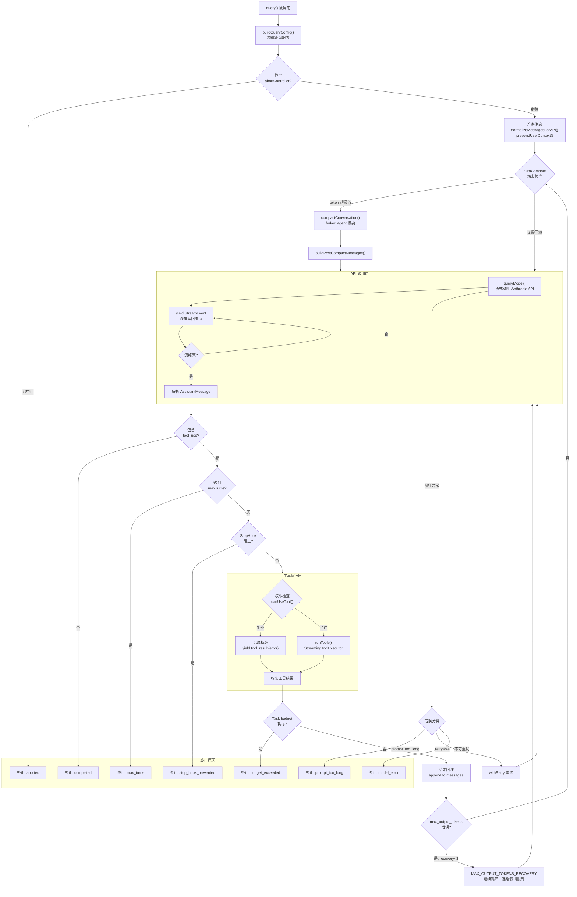

# 6.1 query() 核心循环

> 前置：[2.3 API 客户端](/ch02-identity/api-client)
>
> 源码位置：`src/query.ts` (1729 行)

`query()` 是 Claude Code 的心脏——一个 async generator，驱动从构建 prompt 到流式响应、工具执行、结果回注的完整生命周期。理解这个循环，就理解了 Claude Code 的运行时本质。

## 完整循环流程图



## 五阶段核心循环

`query()` 的每一轮 turn 都严格遵循五个阶段：

| 阶段 | 函数 | 职责 |
|------|------|------|
| **1. buildPrompt** | `buildQueryConfig()`, `prependUserContext()` | 组装 system prompt + 上下文 + 消息历史 |
| **2. callAPI** | `queryModel()` | 流式调用 Anthropic API，yield StreamEvent |
| **3. streamResponse** | `accumulateResponse()` | 累积流式块为完整 AssistantMessage |
| **4. executeTools** | `runTools()` → `StreamingToolExecutor` | 逐个执行 tool_use，权限检查 → 执行 → 生成 tool_result |
| **5. feedBack** | `createUserMessage(tool_results)` + append | 将工具结果作为 user message 回注消息历史 |

## 消息状态管理

消息列表 `mutableMessages` 是 query 循环的核心可变状态：

```typescript
// 每轮 turn 的消息增长模式：
// [...history, userMessage, assistantMessage(tool_uses), userMessage(tool_results)]
//                                                           ↑ feedBack 阶段回注
```

关键不变量：

- 消息必须交替出现 user/assistant（API 要求）
- `tool_result` 必须嵌入在 user message 的 `content` 数组中
- 每轮 turn 的 `tool_result.tool_use_id` 必须与上轮 `tool_use.id` 一一对应
- `yieldMissingToolResultBlocks()` 确保中断时为所有未响应的 tool_use 生成错误 result

## 自动压缩触发条件

auto-compact 在每轮 turn 开始时检查（`calculateTokenWarningState`）：

```typescript
// src/services/compact/autoCompact.ts
const effectiveWindow = getEffectiveContextWindowSize(model)
// = contextWindow - maxOutputTokens(用于摘要输出)
// 可通过 CLAUDE_CODE_AUTO_COMPACT_WINDOW 环境变量覆盖

const tokenEstimate = tokenCountWithEstimation(messages)
if (tokenEstimate > effectiveWindow * threshold) {
  // 触发自动压缩
}
```

| 配置 | 默认值 | 作用 |
|------|--------|------|
| `CLAUDE_CODE_AUTO_COMPACT_WINDOW` | 模型上下文窗口 | 覆盖压缩触发窗口大小 |
| `AutoCompactTrackingState.consecutiveFailures` | - | 连续压缩失败次数，达到阈值时断路 |
| `reservedTokensForSummary` | 20,000 | 为摘要输出预留的 token 数 |

## 终止原因一览

| 终止原因 | 触发条件 | yield 值 |
|----------|----------|----------|
| `completed` | assistant 响应无 tool_use（正常结束） | 最终 AssistantMessage |
| `max_turns` | turn 计数 >= config.maxTurns | 带有 max_turns 标记的 AssistantMessage |
| `aborted` | abortController.signal 触发 | 中断消息 + 未完成 tool_results |
| `prompt_too_long` | API 返回 prompt 超长错误 | 错误消息 |
| `model_error` | 不可重试的 API 错误 | 错误消息 |
| `stop_hook_prevented` | StopHook 返回阻止继续 | hook 拒绝消息 |
| `budget_exceeded` | taskBudget.remaining <= 0 | 预算耗尽消息 |

## Max Output Token 恢复机制

当 API 返回 `max_output_tokens` 错误时，query 循环不会立即终止，而是进入恢复模式：

```typescript
const MAX_OUTPUT_TOKENS_RECOVERY_LIMIT = 3

// 恢复逻辑：
// 1. 检测 isWithheldMaxOutputTokens(msg)
// 2. 不向 SDK 调用者 yield 此错误（避免会话终止）
// 3. 递增 maxOutputTokensOverride，继续循环
// 4. 最多恢复 3 次
```

这一设计是为了处理模型输出被截断但仍有 tool_use 意图的情况——通过增加输出限制让模型完成当前思考。

## Thinking 块规则

query.ts 中以注释形式记录了三条 "Thinking 规则"：

1. 包含 thinking/redacted_thinking 的消息必须属于 max_thinking_length > 0 的 query
2. thinking 块不能是消息中的最后一个块
3. thinking 块必须在整个 assistant trajectory 中保留（直到工具结果回注完成）

违反任何规则将导致 API 拒绝请求。

## 关键源文件

| 文件 | 行数 | 职责 |
|------|------|------|
| `src/query.ts` | 1729 | query() async generator 主循环 |
| `src/query/config.ts` | - | buildQueryConfig() 查询配置构建 |
| `src/query/deps.ts` | - | productionDeps 依赖注入 |
| `src/query/transitions.ts` | - | Terminal/Continue 转换类型 |
| `src/query/stopHooks.ts` | - | handleStopHooks() 停止钩子 |
| `src/query/tokenBudget.ts` | - | createBudgetTracker/checkTokenBudget |
| `src/services/tools/toolOrchestration.ts` | - | runTools() 工具编排 |
| `src/services/tools/StreamingToolExecutor.ts` | - | 流式工具执行器 |

---

<div class="chapter-nav-hint">

**下一节：[6.2 QueryEngine →](/ch06-heartbeat/query-engine)**

</div>
