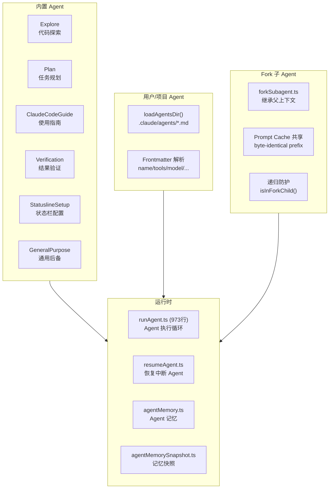
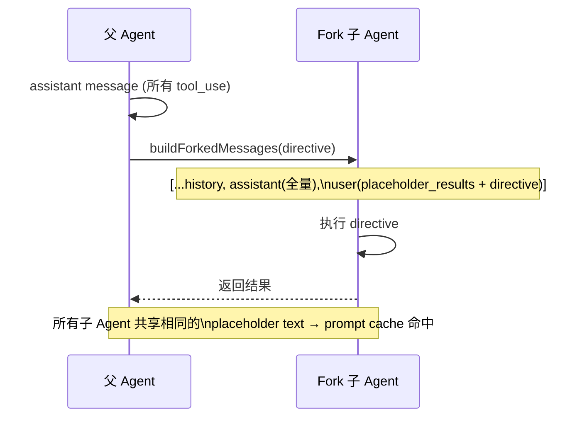

# 7.2 Agent/Subagent 系统

> 前置：[7.1 状态管理](/ch07-extensions/state-management)
>
> 源码位置：`src/tools/AgentTool/` (6072 行, 15 文件)

Agent 是 Claude Code 的"子进程"抽象——一个在主会话中派生的独立对话上下文，拥有自己的 system prompt、工具集和 turn 限制。它让 Claude 能并行、分工地完成复杂任务。

## Agent 系统架构



## 内置 Agent 定义

| Agent | 文件 | 用途 | 启用条件 |
|-------|------|------|----------|
| GeneralPurpose | generalPurposeAgent.ts | 通用后备，无专用 system prompt | 始终启用 |
| StatuslineSetup | statuslineSetup.ts | 配置 IDE 状态栏 | 始终启用 |
| Explore | exploreAgent.ts | 只读代码探索，不修改文件 | `BUILTIN_EXPLORE_PLAN_AGENTS` feature gate |
| Plan | planAgent.ts | 制定任务执行计划 | `BUILTIN_EXPLORE_PLAN_AGENTS` feature gate |
| ClaudeCodeGuide | claudeCodeGuideAgent.ts | Claude Code 使用指南 | 非 SDK 入口 |
| Verification | verificationAgent.ts | 验证任务完成质量 | `VERIFICATION_AGENT` + growthbook flag |

可通过 `CLAUDE_AGENT_SDK_DISABLE_BUILTIN_AGENTS=1`（非交互模式）禁用全部内置 Agent。

## 用户/项目 Agent 加载

`.claude/agents/` 目录下的 Markdown 文件被解析为 Agent 定义：

```markdown
---
name: code-reviewer
tools:
  - Read
  - Grep
  - Glob
model: claude-sonnet-4-6
maxTurns: 50
permissionMode: bubble
---

You are a code reviewer. Analyze the code for...
```

Frontmatter 字段：

| 字段 | 类型 | 说明 |
|------|------|------|
| `name` | string | Agent 标识名 |
| `tools` | string[] | 可用工具白名单 |
| `model` | string | 指定模型 |
| `maxTurns` | number | 最大 turn 数 |
| `permissionMode` | 'bubble' \| 'isolated' | 权限模式 |
| `whenToUse` | string | 自动选择时的描述 |
| 正文 | Markdown | Agent 的 system prompt |

## Fork 子 Agent

Fork 是一种特殊的 Agent 派生方式——子 Agent 继承父会话的完整对话上下文：



关键设计点：

- **Prompt Cache 共享**：所有 fork 子 Agent 使用相同的 `FORK_PLACEHOLDER_RESULT`（"Fork started -- processing in background"），只有最后的 directive 文本不同，最大化 API 缓存命中
- **递归防护**：`isInForkChild()` 检测对话历史中是否存在 `<fork-boilerplate>` 标签，阻止 fork 子 Agent 再次 fork
- **权限冒泡**：`permissionMode: 'bubble'` 将权限请求上浮到父终端
- **模型继承**：`model: 'inherit'` 保持与父 Agent 相同的模型，确保上下文长度一致

## Agent 记忆快照

`agentMemorySnapshot.ts` (197 行) 在 Agent 执行前后拍摄记忆快照，用于：

- 检测 Agent 执行期间写入的 memory 文件
- 将新 memory 合并回父会话
- 避免重复加载已有的 memory 条目

## 关键源文件

| 文件 | 行数 | 职责 |
|------|------|------|
| `src/tools/AgentTool/AgentTool.tsx` | 1397 | Agent 工具主组件 |
| `src/tools/AgentTool/runAgent.ts` | 973 | Agent 执行循环 |
| `src/tools/AgentTool/loadAgentsDir.ts` | 755 | 从 .claude/agents/ 加载 Agent |
| `src/tools/AgentTool/agentToolUtils.ts` | 686 | 工具函数集 |
| `src/tools/AgentTool/UI.tsx` | 871 | Agent UI 渲染 |
| `src/tools/AgentTool/prompt.ts` | 287 | Agent prompt 模板 |
| `src/tools/AgentTool/forkSubagent.ts` | 210 | Fork 子 Agent 逻辑 |
| `src/tools/AgentTool/resumeAgent.ts` | 265 | Agent 恢复 |
| `src/tools/AgentTool/agentMemory.ts` | 177 | Agent 记忆管理 |
| `src/tools/AgentTool/agentMemorySnapshot.ts` | 197 | 记忆快照 |
| `src/tools/AgentTool/builtInAgents.ts` | 72 | 内置 Agent 注册 |
| `src/tools/AgentTool/agentColorManager.ts` | 66 | Agent 颜色分配 |
| `src/tools/AgentTool/agentDisplay.ts` | 104 | Agent 显示格式化 |

---

<div class="chapter-nav-hint">

**下一节：[7.3 Swarm 多智能体 →](/ch07-extensions/swarm)**

</div>
