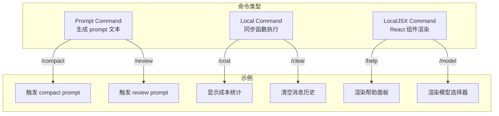
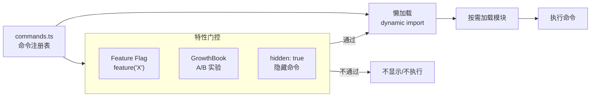
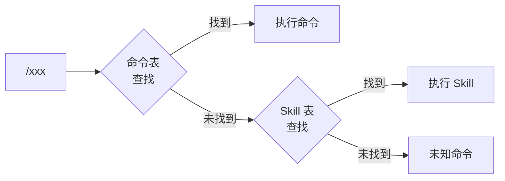

# 7.8 命令系统

> 前置：[7.7 Skill 系统](/ch07-extensions/skills)
>
> 源码位置：`src/commands.ts` + `src/commands/` (87+ 命令)

斜杠命令是用户与 Claude Code 交互的快捷入口。从 `/help` 到 `/compact`，从 `/review` 到 `/vim`，每个命令都是一个自包含的功能单元，支持懒加载和特性门控。

## 三种命令类型



| 类型 | 定义方式 | 执行方式 | UI 支持 |
|------|----------|----------|---------|
| **Prompt** | 返回字符串/prompt 模板 | 注入为 user message | 无 |
| **Local** | 同步/异步函数 | 直接执行，返回结果 | 文本输出 |
| **LocalJSX** | React 组件 | 渲染到终端 | 富交互 UI |

## 命令注册与懒加载



### 懒加载机制

命令定义使用动态导入避免启动时加载全部模块：

```typescript
// 命令定义示例（概念性）
{
  name: 'compact',
  description: 'Compact conversation',
  // 不直接 import，而是懒加载
  handler: async () => (await import('./commands/compact')).default
}
```

这对启动性能至关重要——87+ 个命令如果全部预加载会显著拖慢启动时间。

## 特性门控与可见性

命令可见性由多层控制：

| 控制层 | 机制 | 示例 |
|--------|------|------|
| **Feature Gate** | `feature('X')` 编译时 | `COORDINATOR_MODE` 相关命令 |
| **GrowthBook** | A/B 实验运行时 | 某些实验性命令 |
| **Hidden** | `hidden: true` | 调试命令不在帮助中显示 |
| **Entry Point** | 入口类型检查 | SDK 模式隐藏部分命令 |
| **Permission** | 权限模式检查 | bypass 模式独占命令 |

## 命令目录概览

`src/commands/` 下按功能组织：

| 类别 | 命令 | 说明 |
|------|------|------|
| **会话** | `/compact`, `/clear`, `/resume`, `/rewind` | 对话管理 |
| **模型** | `/model`, `/fast`, `/effort`, `/thinkback` | 模型配置 |
| **权限** | `/permissions`, `/sandbox-toggle` | 权限管理 |
| **开发** | `/commit`, `/review`, `/plan`, `/diff` | 开发工作流 |
| **工具** | `/mcp`, `/skills`, `/hooks`, `/plugins` | 扩展管理 |
| **信息** | `/cost`, `/status`, `/stats`, `/usage` | 状态查询 |
| **系统** | `/config`, `/doctor`, `/update`, `/login` | 系统配置 |
| **远程** | `/teleport`, `/remote-env`, `/remote-setup` | 远程操作 |
| **UI** | `/theme`, `/vim`, `/color`, `/output-style` | 界面定制 |
| **隐藏** | `/debug-tool-call`, `/heapdump`, `/mock-limits` | 调试专用 |

## 隐藏命令目录

部分命令标记为 `hidden`，不在 `/help` 中显示，但可直接输入：

| 命令 | 用途 |
|------|------|
| `/debug-tool-call` | 调试工具调用链 |
| `/heapdump` | 生成堆转储 |
| `/mock-limits` | 模拟 API 限制 |
| `/break-cache` | 强制打破 prompt cache |
| `/btw` | 内部 "by the way" 提示 |
| `/bughunter` | Bug 追踪 |

## 命令与 Skill 的关系

命令和 Skill 共享斜杠入口，但本质不同：



命令优先级高于 Skill——同名时命令胜出。

## 关键源文件

| 文件 | 职责 |
|------|------|
| `src/commands.ts` | 命令注册表 + getSlashCommandToolSkills() |
| `src/commands/compact/` | Compact 命令实现 |
| `src/commands/config/` | 配置命令实现 |
| `src/commands/review.ts` | Review 命令 |
| `src/commands/commit.ts` | Commit 命令 |
| `src/commands/model/` | Model 命令 |
| `src/commands/help/` | Help 命令 |
| `src/commands/init.ts` | Init 命令 |
| `src/commands/agents/` | Agents 命令 |
| `src/commands/skills/` | Skills 命令 |
| `src/commands/createMovedToPluginCommand.ts` | 迁移到插件的命令桥接 |

---

<div class="chapter-nav-hint">

**下一节：[8.1 UI 系统 →](/ch08-interfaces/ui-system)**

</div>
