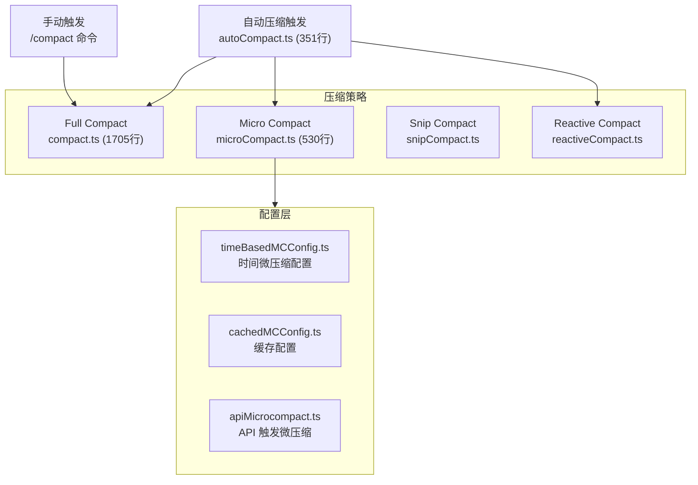
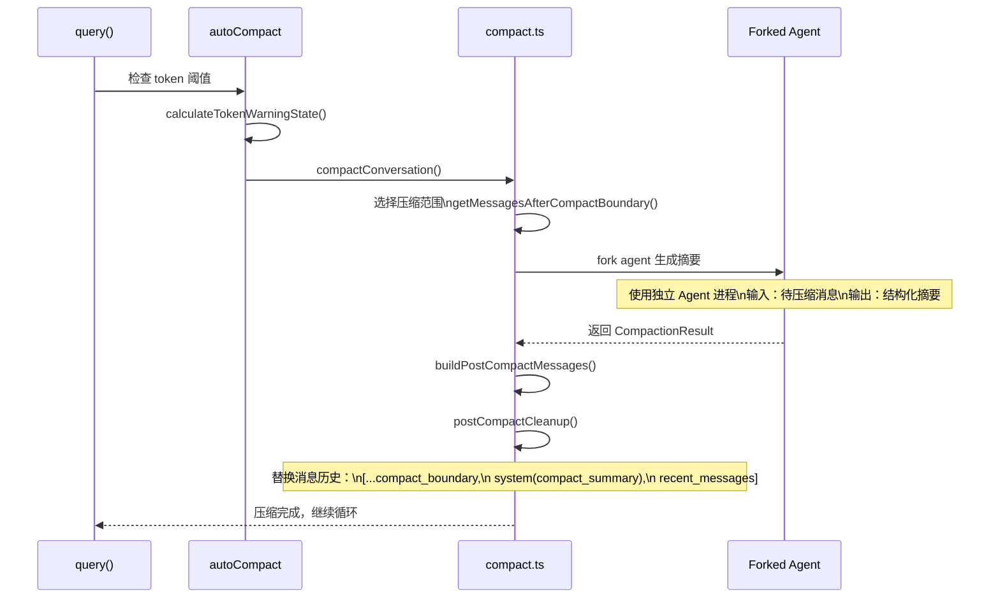

# 7.4 Compact 上下文管理

> 前置：[6.1 query() 核心循环](/ch06-heartbeat/query-loop)
>
> 源码位置：`src/services/compact/` (3983 行, 15 文件)

上下文窗口是 LLM 的硬约束。Compact 系统负责在上下文即将溢出时压缩对话历史，让长时间对话得以持续。Claude Code 实现了四种压缩策略，各有适用场景。

## 压缩策略总览



| 策略 | 触发方式 | 压缩程度 | 上下文损失 | 耗时 |
|------|----------|----------|------------|------|
| **Full Compact** | 自动/手动 | 重度：整段历史 → 摘要 | 大（细节丢失） | 高（forked agent） |
| **Micro Compact** | 自动 | 轻度：截断旧消息 | 中（保留近期） | 低（原地操作） |
| **Snip Compact** | 自动 | 中度：剪除中间段 | 中 | 低 |
| **Reactive Compact** | 自动（prompt_too_long 时） | 重度 | 大 | 中 |

## Full Compact — 完整压缩

1705 行的 `compact.ts` 是最核心的压缩实现：



关键设计：

- **Forked Agent 摘要**：压缩使用独立的 forked agent 来生成摘要，不消耗主会话的上下文
- **摘要保留 20,000 tokens**：为摘要输出预留 `MAX_OUTPUT_TOKENS_FOR_SUMMARY` (20k) tokens
- **Compact Boundary**：只在最近的 compact boundary 之后的消息被压缩，之前的已经压缩过
- **断路器**：`consecutiveFailures` 计数器在连续压缩失败时停止重试

## Micro Compact — 微压缩

530 行的 `microCompact.ts` 实现轻量级原地压缩：

- **不使用 forked agent**：直接在当前进程内截断
- **保留近期消息**：只截断最早的消息，保留最近的交互
- **快速执行**：无需 API 调用，纯字符串操作
- **触发条件更宽松**：在 full compact 之前先尝试 micro compact

微压缩配置来源：

| 来源 | 文件 | 说明 |
|------|------|------|
| 时间配置 | `timeBasedMCConfig.ts` | 基于时间的微压缩间隔 |
| 缓存配置 | `cachedMCConfig.ts` | GrowthBook 缓存的配置 |
| API 触发 | `apiMicrocompact.ts` | API 响应触发的微压缩 |

## Auto Compact 触发机制

`autoCompact.ts` (351 行) 定义了自动压缩的触发逻辑：

```typescript
// 有效上下文窗口计算
const effectiveWindow = getEffectiveContextWindowSize(model)
// = contextWindow - reservedTokensForSummary(20k)

// 可通过环境变量覆盖窗口大小
const autoCompactWindow = process.env.CLAUDE_CODE_AUTO_COMPACT_WINDOW

// 触发阈值判断
const tokenEstimate = tokenCountWithEstimation(messages)
if (tokenEstimate > effectiveWindow * threshold) {
  // 触发压缩
}
```

触发后的压缩策略选择顺序：

1. 尝试 Micro Compact（轻量级）
2. 如果仍然超限，执行 Full Compact
3. 如果 Full Compact 失败且 `prompt_too_long`，尝试 Reactive Compact

## Snip Compact

`snipCompact.ts` + `snipProjection.ts` 实现 `HISTORY_SNIP` feature gate 下的历史剪裁：

- 将中间段的消息折叠为摘要
- 通过 `snipReplay` 回调在 QueryEngine 中截断
- REPL 模式保留完整历史供 UI 回滚，SDK 模式直接截断以节省内存

## 关键源文件

| 文件 | 行数 | 职责 |
|------|------|------|
| `src/services/compact/compact.ts` | 1705 | Full Compact 主逻辑 |
| `src/services/compact/microCompact.ts` | 530 | Micro Compact 轻量压缩 |
| `src/services/compact/autoCompact.ts` | 351 | 自动压缩触发和策略选择 |
| `src/services/compact/sessionMemoryCompact.ts` | 630 | 会话记忆压缩 |
| `src/services/compact/prompt.ts` | 374 | 压缩 prompt 模板 |
| `src/services/compact/apiMicrocompact.ts` | 153 | API 触发微压缩 |
| `src/services/compact/grouping.ts` | 63 | 消息分组 |
| `src/services/compact/timeBasedMCConfig.ts` | 43 | 时间微压缩配置 |
| `src/services/compact/postCompactCleanup.ts` | 77 | 压缩后清理 |
| `src/services/compact/snipCompact.ts` | 10 | Snip 压缩入口 |
| `src/services/compact/compactWarningHook.ts` | 16 | 压缩警告钩子 |

---

<div class="chapter-nav-hint">

**下一节：[7.5 MCP 集成 →](/ch07-extensions/mcp)**

</div>
