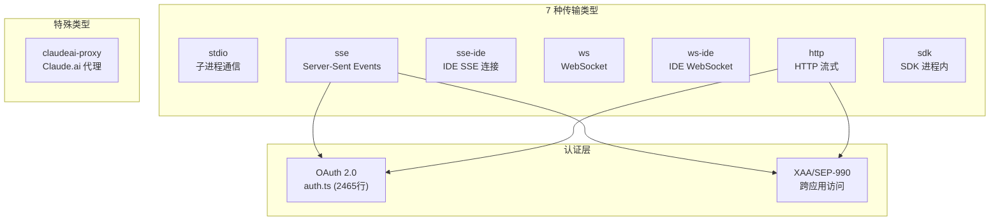
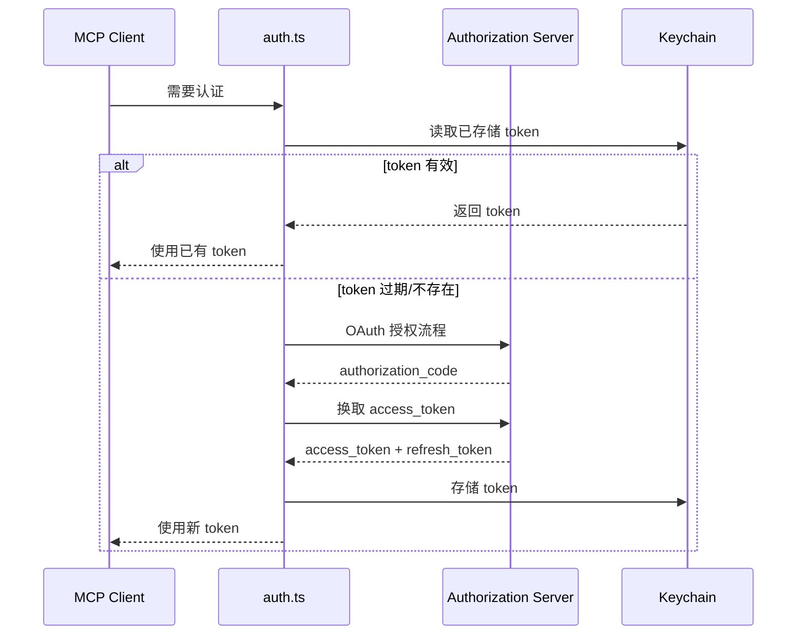
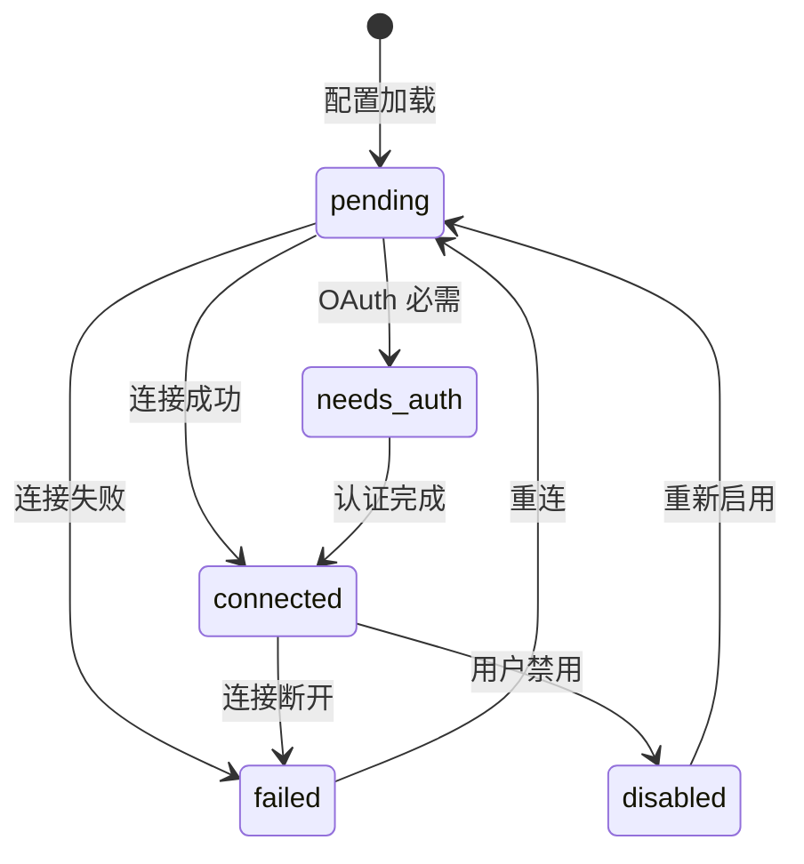

# 7.5 MCP 集成

> 前置：[7.1 状态管理](/ch07-extensions/state-management)
>
> 源码位置：`src/services/mcp/` (12,238 行, 22 文件)

MCP (Model Context Protocol) 是 Claude Code 扩展工具能力的标准协议。通过 MCP，Claude 可以连接外部服务器获取工具、资源和 prompt，实现无限的能力扩展。

## 传输类型



| 传输类型 | 配置 type | 适用场景 | 认证 |
|----------|-----------|----------|------|
| **stdio** | `"stdio"` | 本地命令行工具 | 无（子进程） |
| **sse** | `"sse"` | 远程 SSE 服务 | OAuth/XAA |
| **sse-ide** | `"sse-ide"` | IDE 扩展 SSE | IDE 内置 |
| **ws** | `"ws"` | WebSocket 服务 | 可选 headers |
| **ws-ide** | `"ws-ide"` | IDE WebSocket | IDE 内置 |
| **http** | `"http"` | HTTP 流式服务 | OAuth/XAA |
| **sdk** | `"sdk"` | SDK 进程内调用 | 无 |

## 7 种配置作用域

`ConfigScope` 定义了 MCP 服务器配置的来源层级：

```typescript
type ConfigScope =
  | 'local'       // 项目本地 .mcp.json
  | 'user'        // 用户全局 ~/.claude/settings.json
  | 'project'     // 项目共享 .claude/settings.json
  | 'dynamic'     // 运行时动态添加
  | 'enterprise'  // 企业管理配置
  | 'claudeai'    // Claude.ai 同步配置
  | 'managed'     // 远程托管配置
```

优先级从高到低：managed > enterprise > claudeai > dynamic > project > user > local

## OAuth/XAA 认证

2465 行的 `auth.ts` 是 MCP 认证的核心：



XAA (Cross-App Access) 允许 MCP 服务器代表用户访问其他应用的数据：

- 配置 `oauth.xaa: true` 启用
- IdP 连接详情通过 `settings.xaaIdp` 统一配置
- `xaaIdpLogin.ts` (487 行) 处理 IdP 登录流程

## 连接生命周期

`MCPConnectionManager.tsx` 和 `useManageMCPConnections.ts` (1141 行) 管理 MCP 服务器的完整生命周期：

| 状态 | 类型 | 说明 |
|------|------|------|
| `pending` | PendingMCPServer | 正在连接 |
| `connected` | ConnectedMCPServer | 连接成功，可调用工具 |
| `needs-auth` | NeedsAuthMCPServer | 需要用户认证 |
| `failed` | FailedMCPServer | 连接失败 |
| `disabled` | DisabledMCPServer | 已禁用 |



## Channel 权限

`channelPermissions.ts` (240 行) 实现了工具级权限控制：

- 每个 MCP 服务器可以声明工具的权限级别
- `channelAllowlist.ts` (76 行) 管理允许的工具白名单
- `channelNotification.ts` (316 行) 处理权限变更通知

## Elicitation 处理

`elicitationHandler.ts` (313 行) 处理 MCP 工具的 elicitation 请求：

- MCP 工具可请求用户提供额外信息（error code -32042）
- Handler 在终端/SDK 中展示 elicitation 请求
- 收集用户输入后返回给 MCP 服务器

## 关键源文件

| 文件 | 行数 | 职责 |
|------|------|------|
| `src/services/mcp/client.ts` | 3348 | MCP 客户端核心 |
| `src/services/mcp/auth.ts` | 2465 | OAuth/XAA 认证 |
| `src/services/mcp/config.ts` | 1578 | 配置加载和作用域 |
| `src/services/mcp/useManageMCPConnections.ts` | 1141 | React 连接管理 hook |
| `src/services/mcp/xaa.ts` | 511 | 跨应用访问 |
| `src/services/mcp/xaaIdpLogin.ts` | 487 | XAA IdP 登录 |
| `src/services/mcp/channelPermissions.ts` | 240 | 通道权限 |
| `src/services/mcp/channelNotification.ts` | 316 | 通道通知 |
| `src/services/mcp/elicitationHandler.ts` | 313 | Elicitation 处理 |
| `src/services/mcp/headersHelper.ts` | 138 | 请求头构建 |
| `src/services/mcp/types.ts` | 258 | 类型定义 |
| `src/services/mcp/MCPConnectionManager.tsx` | - | 连接管理器组件 |
| `src/services/mcp/vscodeSdkMcp.ts` | 112 | VSCode SDK MCP |

---

<div class="chapter-nav-hint">

**下一节：[7.6 插件系统 →](/ch07-extensions/plugins)**

</div>
