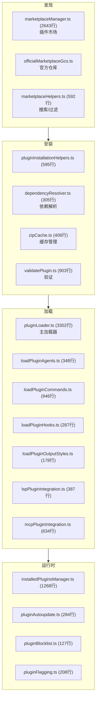
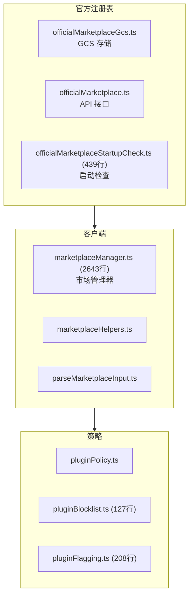
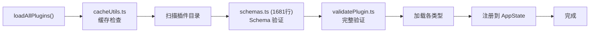

# 7.6 插件系统

> 前置：[7.5 MCP 集成](/ch07-extensions/mcp)
>
> 源码位置：`src/utils/plugins/` (20,521 行, 44 文件)

插件系统是 Claude Code 的扩展机制核心——一个完整的生命周期管理框架，覆盖发现、安装、加载、验证、更新和卸载。

## 插件生命周期

## 插件类型

插件可以提供以下能力：

| 能力 | 加载器 | 说明 |
|------|--------|------|
| **Agent** | `loadPluginAgents.ts` | 自定义 Agent 定义 |
| **Command** | `loadPluginCommands.ts` | 自定义斜杠命令 |
| **Hook** | `loadPluginHooks.ts` | 生命周期钩子 |
| **Output Style** | `loadPluginOutputStyles.ts` | 输出渲染样式 |
| **LSP** | `lspPluginIntegration.ts` | 语言服务器集成 |
| **MCP** | `mcpPluginIntegration.ts` | MCP 服务器配置 |

## Marketplace 架构

市场管理器（2643 行）处理：

- **搜索**：按名称/标签/功能搜索插件
- **安装**：下载、解压、验证、注册
- **依赖解析**：`dependencyResolver.ts` 递归解析插件依赖图
- **黑名单**：`pluginBlocklist.ts` 维护禁止安装的插件列表
- **标记**：`pluginFlagging.ts` 对可疑插件进行安全标记

## pluginLoader.ts — 主加载器

3302 行的主加载器是整个插件系统的协调中心：

## 插件验证

`validatePlugin.ts` (903 行) + `schemas.ts` (1681 行) 实现严格验证：

| 验证层 | 检查内容 |
|--------|----------|
| Schema | manifest 格式、字段类型、必填项 |
| 安全 | 文件路径遍历、代码注入、敏感 API 访问 |
| 依赖 | 循环依赖、版本兼容性 |
| 完整性 | 资源文件存在性、引用一致性 |
| 黑名单 | 是否在禁止列表中 |

## 插件更新与依赖管理

- **自动更新**：`pluginAutoupdate.ts` (284 行) 定期检查并应用更新
- **依赖解析**：`dependencyResolver.ts` (305 行) 使用拓扑排序解析依赖图
- **版本管理**：`pluginVersioning.ts` (157 行) 处理语义版本比较
- **安装计数**：`installCounts.ts` (292 行) 追踪安装统计

## 关键源文件

| 文件 | 行数 | 职责 |
|------|------|------|
| `src/utils/plugins/pluginLoader.ts` | 3302 | 插件主加载器 |
| `src/utils/plugins/marketplaceManager.ts` | 2643 | 市场管理器 |
| `src/utils/plugins/schemas.ts` | 1681 | Schema 验证 |
| `src/utils/plugins/installedPluginsManager.ts` | 1268 | 已安装插件管理 |
| `src/utils/plugins/validatePlugin.ts` | 903 | 插件验证 |
| `src/utils/plugins/loadPluginCommands.ts` | 946 | 命令加载 |
| `src/utils/plugins/mcpbHandler.ts` | 968 | MCP Bundle 处理 |
| `src/utils/plugins/mcpPluginIntegration.ts` | 634 | MCP 集成 |
| `src/utils/plugins/pluginInstallationHelpers.ts` | 595 | 安装辅助 |
| `src/utils/plugins/marketplaceHelpers.ts` | 592 | 市场辅助 |
| `src/utils/plugins/lspPluginIntegration.ts` | 387 | LSP 集成 |
| `src/utils/plugins/loadPluginAgents.ts` | 348 | Agent 加载 |
| `src/utils/plugins/dependencyResolver.ts` | 305 | 依赖解析 |
| `src/utils/plugins/pluginAutoupdate.ts` | 284 | 自动更新 |
| `src/utils/plugins/loadPluginHooks.ts` | 287 | Hook 加载 |

---

**下一节：[7.7 Skill 系统 →](/ch07-extensions/skills)**

