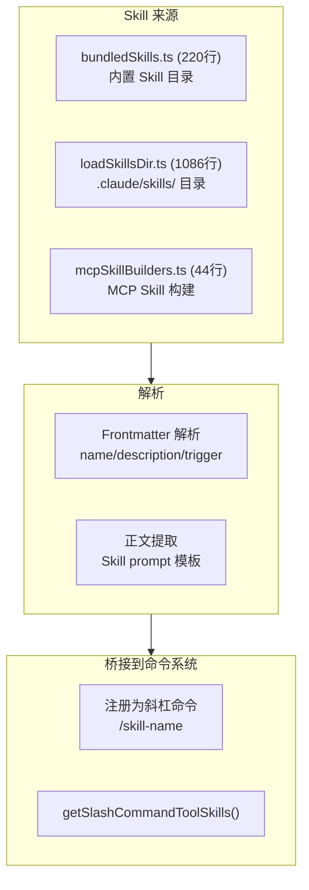
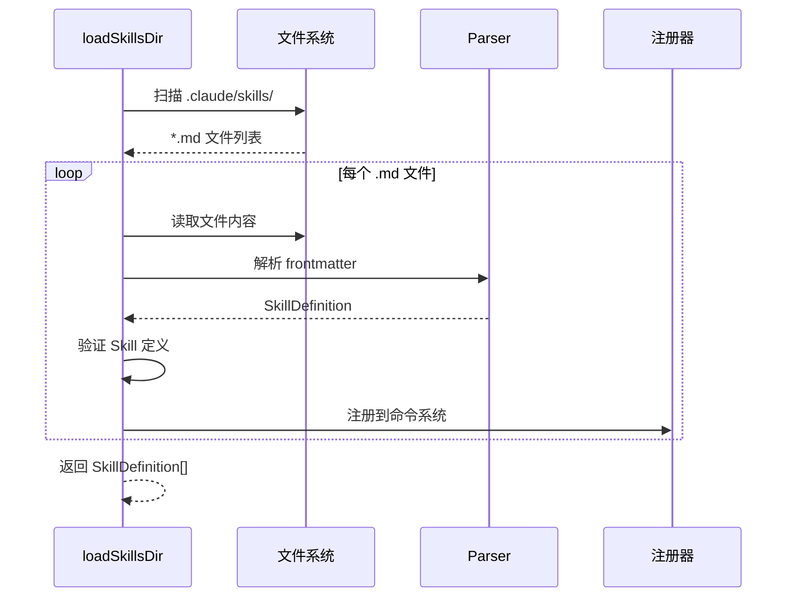

# 7.7 Skill 系统

> 前置：[7.6 插件系统](/ch07-extensions/plugins)
>
> 源码位置：`src/skills/` (1353 行, 5 文件)

Skill 是 Claude Code 的"可调用能力单元"——将复杂的多步骤操作封装为用户可通过 `/skill-name` 触发的预定义 prompt。与通用命令不同，Skill 侧重于特定领域的工作流自动化。

## Skill 发现与加载



## 内置 Skill 目录

`bundledSkills.ts` 注册了 Claude Code 自带的 Skill 集合：

| Skill | 触发 | 用途 |
|-------|------|------|
| `simplify` | `/simplify` | 代码简化审查 |
| `verify` | `/verify` | 验证任务完成度 |
| `debug` | `/debug` | 调试问题分析 |
| `loop` | `/loop` | 定时循环执行 |
| `claude-api` | `/claude-api` | Claude API 开发辅助 |
| `review` | `/review` | 代码审查 |
| `security-review` | `/security-review` | 安全审查 |
| `init` | `/init` | 初始化 CLAUDE.md |
| `fewer-permission-prompts` | `/fewer-permission-prompts` | 权限优化 |
| `update-config` | `/update-config` | 配置更新 |
| `keybindings-help` | `/keybindings-help` | 快捷键帮助 |

## loadSkillsDir.ts — 目录加载器

1086 行的目录加载器处理从 `.claude/skills/` 加载用户自定义 Skill：

### Frontmatter 格式

```markdown
---
name: my-skill
description: My custom skill for X
trigger: /my-skill
allowed-tools:
  - Read
  - Grep
  - Bash
---

You are helping with X. Follow these steps:
1. First, ...
2. Then, ...
```

### 加载流程



### Skill 与 Agent 的区别

| 特性 | Skill | Agent |
|------|-------|-------|
| 本质 | 预定义 prompt 模板 | 独立对话上下文 |
| 执行 | 在主会话中执行 | 派生子会话 |
| 工具 | 可限制工具列表 | 拥有独立工具池 |
| 上下文 | 共享主对话历史 | 可继承或独立 |
| 开销 | 低（无额外 API 调用） | 高（独立 Agent 进程） |
| 复杂度 | 单步 prompt | 多轮对话循环 |

## MCP Skill 构建

`mcpSkillBuilders.ts` (44 行) 将 MCP 服务器暴露的 prompt 模板转化为 Skill：

- MCP 服务器可声明 `prompts` 能力
- 每个 prompt 映射为一个 Skill
- 调用时通过 MCP 协议获取 prompt 内容

## Skill 与命令系统的桥接

Skill 通过 `getSlashCommandToolSkills()` 注册到命令系统：

1. Skill 被解析后创建对应的 Command 对象
2. Command 注册到斜杠命令表
3. 用户输入 `/skill-name` 时触发 Skill prompt
4. Skill prompt 作为 user message 注入主对话

## 关键源文件

| 文件 | 行数 | 职责 |
|------|------|------|
| `src/skills/loadSkillsDir.ts` | 1086 | 目录加载 + frontmatter 解析 |
| `src/skills/bundledSkills.ts` | 220 | 内置 Skill 目录注册 |
| `src/skills/mcpSkillBuilders.ts` | 44 | MCP Skill 构建器 |
| `src/skills/mcpSkills.ts` | 3 | MCP Skill 入口 |

---

<div class="chapter-nav-hint">

**下一节：[7.8 命令系统 →](/ch07-extensions/commands)**

</div>
